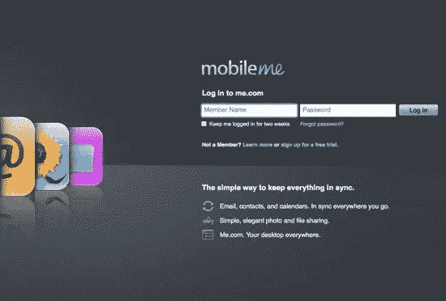
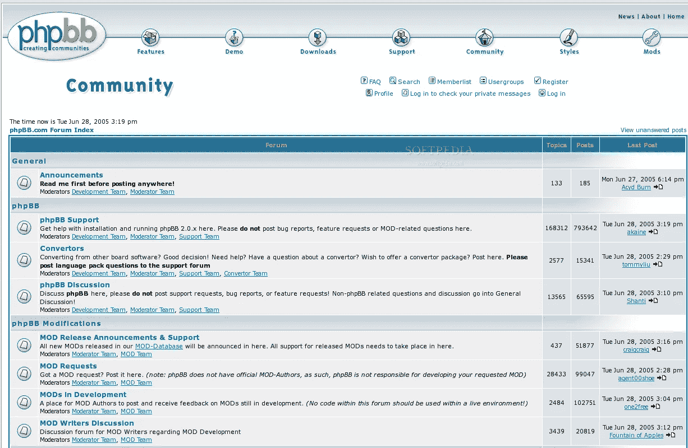
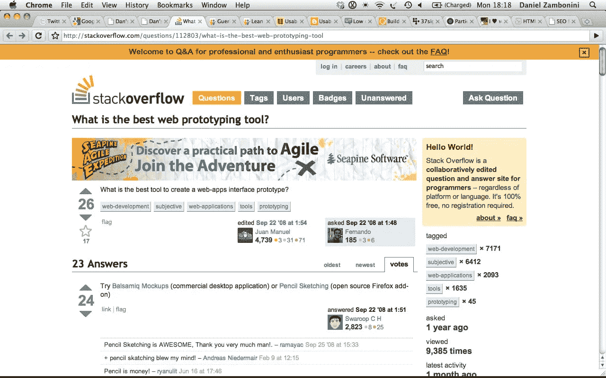

# 谢谢你，斯达克弗洛

> 原文：<https://medium.com/hackernoon/thank-you-stackoverflow-36885abe98a4>

Maho Bay, St. Thomas, USVI

## 我是如何学会编码的

高一寒假的第一周左右，我和家人去了圣约翰岛的三泽真帆湾，那里很棒，与世隔绝，没有互联网。受这种无关联的启发，或者可能是对此的一种反应，在整个旅途中，我对社交网络、移动应用、网站设计以及其他一切互联网都充满了想法。当我回到家，与我的 MacBook 重新结合时，我立即坐下来，启动 Vim，并开始尝试构建一些东西。

Mobile Me’s login page, circa 2010\. Instead of “Member Name” and “Password” appearing outside of the respective input boxes, the labels are positioned on top of them.

我不记得确切的产品想法是什么，让我如此兴奋——但我记得，在编码的前两天，我遇到了一个问题:

我是占位符文本的忠实粉丝，后来被 HTML5 标准化，这是苹果公司在他们的 MobileMe 登录页面中开创的，我希望在我的应用程序的*登录页面中有类似的功能。但是我不知道如何解决这个问题。我甚至不知道我试图创造的东西的术语，所以我试图寻找答案是徒劳的。*

对于从事专业项目的专业程序员来说，这样的问题没什么大不了的。在内部问题跟踪器中，该特性将被标记为高实现成本，程序员可能会转移到更紧迫的问题上，并可能最终在团队中有创建定制`<input />`元素经验的人的帮助下返回。

对于一个学习正式 web 编程课程的学生来说，这个问题也不会太糟糕。这很难，所以这个作业可能会包含一个引导式的方法。如果需要专业人士的帮助，总会有办公时间，他们已经知道大部分答案。

但我不是一个专业的程序员或正式的计算机科学学生:我是一个 14 岁的自学成才的没有经验的程序员，从事一个独立的激情项目。当我在开发其他性价比更高的功能时，我还不具备区分功能优先级的技能来搁置占位符。没有人和我一起解决这个问题。我不知道有谁用`<input />`元素做了很多*的东西*，更不用说定制它们了。因此，这是一种令人沮丧的问题，它有可能使我的项目因大量不必要的车轮转动而脱轨，并最终使我不太可能继续编程。

诸如此类的问题——你必须在完全陌生的数字领域开发一种解决问题的方法，同时还要学习解决环境中的错误、边缘情况和怪异，还缺乏词汇来表达你正在做的事情——是编码困难的原因。这也是为什么大多数人在存在大量结构支持的高度制度化的环境中学习编码和用代码构建东西。如果没有有经验的人作为指导，解决这类问题几乎是不可能的。

A typical phpBB forum (top) and 2010-era StackOverflow (bottom).

因为当我开始学习编程的时候，我太年轻了，不适合上正式的课程，也太年轻了，不适合就业，所以我采取了退而求其次的办法:反复地在谷歌上搜索我的问题，直到可能找到解决方案。一开始，大多数编程查询的结果都是由几个旧的、phpBB 驱动的编程社区和更商业化的专家交流所主导的。他们或多或少地起了作用:在仔细阅读了许多页的问题和结果(每一页都必须阅读和尝试，看看是否有效)之后，通常会出现一个解决方案。当然，有时候并没有。在这种情况下，我通常会放弃。“n00bs”提出的“显而易见”的问题会和提问者一起被嘲笑——上帝禁止你答错问题。这些奚落很有趣，但它们也让我过于自我意识和害羞，以至于我自己都不敢尝试参与，以免成为 T2 的嘲笑对象。

2009 年，我开始处理越来越多的雄心勃勃的项目，而就在这个时候，Google results 开始把我越来越多地带到一个新的论坛:StackOverflow。回想起来，正是 Jeff 和 Joel 对创建一个答案驱动的、专注的、开发人员友好的用户体验所付出的难以置信的关注使这个网站变得伟大——但我从那时起所记得的就是告诉人们 StackOverflow 几乎总能为我的问题提供即时的、有效的解决方案，这是多么酷。

与之前的论坛相比，StackOverflow 除了可以立即得到答案之外，它与之前的其他论坛之间的另一个巨大差异是这个社区与以前的论坛相比有多友好*。部分是因为严格的适度，这使得一切都专注于礼貌和专业地回答问题，部分是因为标准的 UI/UX 习惯用法，用于处理重复的问题和对读者和贡献者都有帮助的答案进行排名，StackOverflow 上没有任何吝啬。即使作为一个 14 岁的孩子，我也乐于参与其中。*

*这又把我们带回了我寒假项目中非常渴望的`input`占位符。我被难住了，决定做最后的努力，鼓起一些勇气，颤抖地打开了 StackOverflow，问了我的第一个问题:*

> *谁能告诉我如何在苹果的 MobileMe 登录页面(www.me.com)上创建类似提示/标签的东西，当你点击盒子时，标签/提示文本就会消失，直到用户开始输入才消失？*
> 
> *(如果可以用 JQuery 来做，那就更好了。)*
> 
> *非常感谢！*
> 
> *(我所说的标签/提示文本是指灰色的“用户名”和“密码”文本。)*
> 
> *[*—http://stackoverflow.com/q/2068369/251162*](http://stackoverflow.com/q/2068369/251162)*

*从我在问题中的措辞可以看出，我对自己很不自信。毕竟，我以前从未在互联网上公开问过问题。但是，在发帖 9 分钟后，我得到了一个答案，里面有当时正确的术语和一个 jQuery 插件的链接，这个插件正是我想要的。StackOverflow 几乎立刻就将一个令人沮丧的编码障碍转化成了一个容易克服的挑战。太神奇了。*

*一个月后，当我试图通过阅读 Rails 源代码来学习 Ruby 时，我问了[另一个问题](http://stackoverflow.com/q/2233575/251162)。尽管我没有完全理解代码的上下文，但还是在几分钟内，我得到了几个易于理解的答案。就像以前一样，一个主要的编码障碍已经变成了一个有趣的、刺激的挑战。*

*这种模式不断重复。当我试图理解 Ruby 生态系统在没有 Rails 的情况下是如何工作的时候，StackOverflow [又来帮忙了。当我问及 Rails 热更新的魔力时，](http://stackoverflow.com/q/2710729/251162)[给我指出了正确的方向。我让专业程序员](http://stackoverflow.com/q/2717904/251162)[给我确认我提出的感觉不太对的 SQL 架构是正确的事情](http://stackoverflow.com/q/2909558/251162)。关于 Ruby 的二十个问题后来，当我开始学习 C 的时候，StackOverflow [又帮了我一次](http://stackoverflow.com/q/3087815/251162)。它帮助我[理解了 JavaScript 的异步回调和同步状态管理之间众所周知的令人困惑的交互](http://stackoverflow.com/q/3019976/251162)和[PHP 程序生命周期是如何工作的](http://stackoverflow.com/q/3456339/251162)。它帮助我理解 Python 导入是如何工作的。在 [236 个问题中，](http://stackoverflow.com/users/251162/aaron-yodaiken?tab=questions) StackOverflow 和它的用户继续帮助我做一切事情，从[Scala 类型系统](http://stackoverflow.com/q/5341120/251162)到[使用<画布/ >](http://stackoverflow.com/q/17092299/251162) 模仿 iOS 7 的模糊背景。*

*StackOverflow 一次又一次地回答我的问题——在这个过程中，帮助我在学习编程和用代码构建东西的旅程中不断前进。当我遇到问题并提出问题时，我既获得了继续改进编码的知识，也获得了完成应用程序所需的实用解决方案。回过头来看，在我的编码之旅中同样重要的是，我意识到*可以*发布到 StackOverflow 并获得解决几乎任何编程挑战的帮助:它使学习编码的所有艰难、令人沮丧的部分变得更加容易管理。谁知道如果没有它，我会不会继续尝试编码？*

*我猜想，像 StackOverflow 这样的社区，特别是当它与传统教科书结合使用时，可以帮助解决当前的问题，即当我们作为一个社会试图适应[更具活力的劳动力市场](http://www.economist.com/news/special-report/21714171-companies-are-embracing-learning-core-skill-what-employers-can-do-encourage-their)需要[课外持续不断的继续教育](http://www.economist.com/news/special-report/21714173-alternative-providers-education-must-solve-problems-cost-and)时，尝试将大学课程直接翻译到更容易访问的互联网。当然，这是更广泛的 StackExchange 网络的一部分。*

*但这是另一个话题了。现在，我只想再次感谢 StackOverflow 和所有为它做出贡献的人。很难夸大能够编码对我的重要性。通过实现自动化、分析和数据收集，编程一直让在哥伦比亚大学学习经济学变得更容易，也更有回报。编码让我有可能自己制作出[快速而有效的](https://github.com/yodaiken/slowlane/tree/gh-pages)项目。作为一名大学二年级学生，编程帮助我在一家以 MBA 为主的风险投资公司获得了一份暑期实习，它甚至更有助于我在那里取得成功。编码让我有可能参与到一些非常酷的项目中，与一些真正鼓舞人心的人和令人惊叹的技术一起解决挑战性的问题。我迫不及待地想看看 code 接下来会把我带到哪里。*

*所以再次感谢你，StackOverflow。谢谢你帮助我学习如何编码，谢谢你让我的生活变得更好。*

******

> *[黑客中午](http://bit.ly/Hackernoon)是黑客如何开始他们的下午。我们是阿妹家庭的一员。我们现在[接受投稿](http://bit.ly/hackernoonsubmission)并乐意[讨论广告&赞助](mailto:partners@amipublications.com)机会。*
> 
> *如果你喜欢这个故事，我们推荐你阅读我们的[最新科技故事](http://bit.ly/hackernoonlatestt)和[趋势科技故事](https://hackernoon.com/trending)。直到下一次，不要把世界的现实想当然！*

**