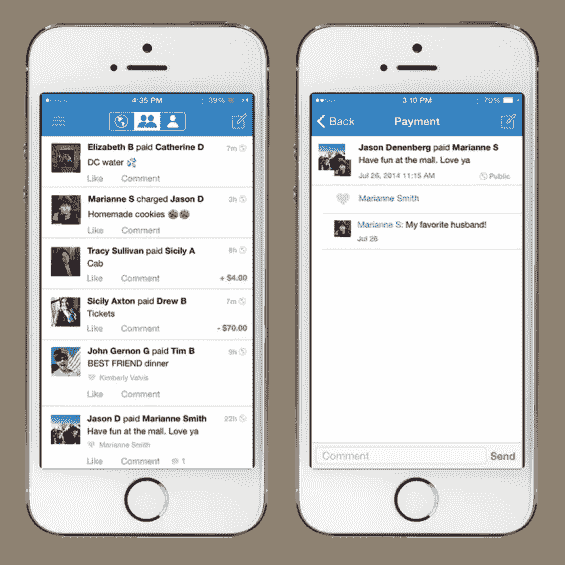

# 文莫如何摧毁一个文化禁忌

> 原文：<https://medium.com/hackernoon/thank-you-venmo-265d37e9b042>

*‘Bei Geld HRT jede Freundschaft auf’*或*‘金钱是一切友谊的终点’——这是德国人在生活中会经常听到或说的一句名言……*

*从小到大，我被教导在任何情况下都要避免欠钱。我爸爸出门时钱包里总会有几张信用卡和几百欧元。他从来不想被抓出来，处于尴尬的境地，上帝保佑，没有能力支付，甚至更糟的是，问别人借钱给他。*

*去德国的餐馆或酒吧吃饭很可能会导致人们在晚上各付各的(这真的应该叫做去德国！)，在那里人们会支付他们的账单份额。对我来说，住在伦敦并有一些西班牙、法国和希腊朋友证明是一种社交挑战。他们的文化是付了账单，然后期待下一次由另一个人来付，这种文化不太受德国人的欢迎。谁知道这是否公平，谁也不会为他们消费的东西买单？或者，如果他们忘了上次是谁付的钱呢？当你有两个以上的人时，我们不要谈论它造成的混乱——它完全无法控制！*

*直到最近，欠我钱的朋友还经常让我感到沮丧。提醒他们他们欠我钱，只是尴尬和不愉快。但我也经常对那些只是忘记我为他们付钱的人感到一丝怨恨。我的大脑有一个内置的长期记忆，那就是我为别人付出，而别人没有回报我的时候。遗忘在基因上是不可能的！人们会忘记很多事情……在最近的一次金融科技会议上， [Mihai Ivascu](https://www.linkedin.com/in/mihai-ivascu-179b7027) 提到，10 美元以下的欠款有 90%从未归还。*喘息*。*

*幸运的是，这个问题最近似乎已经消失了。为此我们要感谢文莫。*

*Venmo 不仅让支付朋友变得非常方便快捷，它还引入了一些非常聪明的功能，从根本上改变了人们对债务的态度。*

**

***1。** **表情符号预测***

*表情符号预测将无聊的主题转化为有趣的信息。这让整件事不那么严肃了。它不仅仅是一条短信那么正式和冷漠。谁不爱表情符号！😎💸💰*

***2。** **请求金钱***

*让索取金钱变得超级容易的能力意味着这样做是完全正常和可以的。提醒你的朋友还钱不再尴尬。事实上，大多数人会直接这么做。*

***3。** **新闻提要***

*最重要的 [Venmo](https://hackernoon.com/tagged/venmo) 功能是[新闻提要](https://hackernoon.com/tagged/newsfeed)。它揭示了为朋友付费(他们也回报你)是一种新的常态。甚至鼓励用户喜欢付费！我发现自己经常浏览 Venmo newsfeed，看谁为谁的什么付钱。甚至我的清洁工也接受 Venmo，我只是在一个朋友付钱给她用同一种清洁剂时才发现的。你可以发现人们进行什么样的旅行，他们去哪家餐馆，他们外出的频率等等。它把跟踪提高到了一个新的水平！*

*所以谢谢你，文莫，谢谢你让还债变得有趣和平常。谢谢你改变了人们的态度。谢谢你让人们谈论金钱。我现在晚上可以睡觉了！*

******

> *[黑客中午](http://bit.ly/Hackernoon)是黑客如何开始他们的下午。我们是 [@AMI](http://bit.ly/atAMIatAMI) 家庭的一员。我们现在[接受投稿](http://bit.ly/hackernoonsubmission)并乐意[讨论广告&赞助](mailto:partners@amipublications.com)机会。*
> 
> *如果你喜欢这个故事，我们推荐你阅读我们的[最新科技故事](http://bit.ly/hackernoonlatestt)和[趋势科技故事](https://hackernoon.com/trending)。直到下一次，不要把世界的现实想当然！*

**