# 2018 年十大领先电子邮件营销工具

> 原文：<https://medium.com/hackernoon/thanks-to-the-newsletters-and-whoever-is-sending-them-2e42f54021bd>

## 喜欢时事通讯

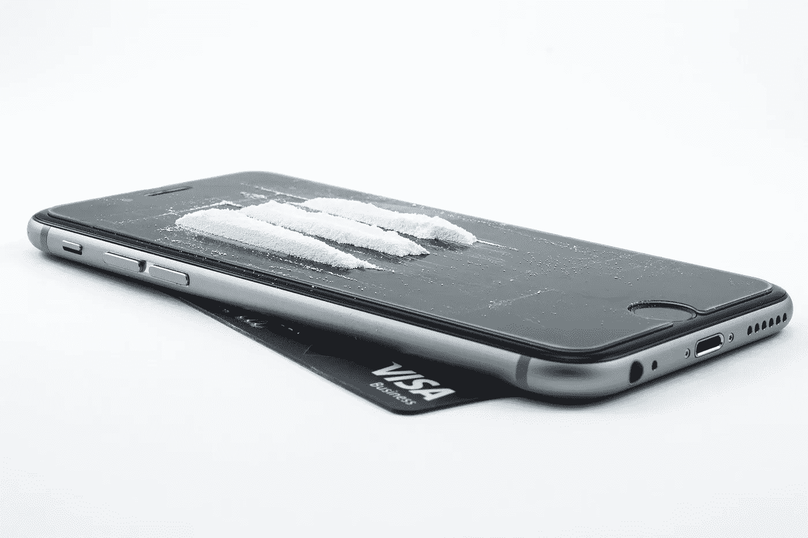

> “一个来自**还不错的营销人员的**自白**——**我现在没那么傻了”****

感谢**简讯**和**，无论是谁发送** **给他们**到**他们已经注册的任何工具。**

> 我个人从来没有想到电子邮件会如此惊人地卷土重来。

尤其是当我们的世界被一些难以置信的强大技术统治的时候。不知何故，很少有杰出的品牌对此有过早期预测——电子邮件在营销领域的复兴。

需要强调的是，像**石蕊**、 **MailChimp** 、 **Reach Mail** 、 **Target Hero** 这样的品牌和其他少数玩家已经板上钉钉了。这些品牌保持了他们的价值观，没有陷入持续不断的激烈竞争中。

## 让我们把它说成是一场愚蠢的时尚竞赛。

在这一切进行的同时，许多企业偏离了轨道，失去了他们的愿景，因为他们都想适应每一个正在出现的技术痴迷。

> 但是我们知道，每一个**假设**和没有充分理由的行动，总有一天会出现在**消失行动**中。

它最终做到了。

是的，我们肯定还在和一些引领潮流的人生活在一起，并且还在使用他们，他们把网络世界变成了令人着迷的东西。从 **facebook 广告模式**到当前趋势**超个性化全渠道营销**。

这些都不会很快融化。电子邮件也不会。

在此之前，如今社交媒体上有一大群人，电子邮件的复兴可能会让你感到震惊。但在对用户群进行了几次分析后，似乎电子邮件一直在通过在黑暗中保持宁静来发展自己的优势。

为了支持这一点，这里有一些来自 **MailMunch** 的统计数据，解释了**电子邮件**、[脸书](https://medium.com/u/25aae929dbb1?source=post_page-----2e42f54021bd--------------------------------)和[推特](https://medium.com/u/6f50810b16a8?source=post_page-----2e42f54021bd--------------------------------)的有效性。

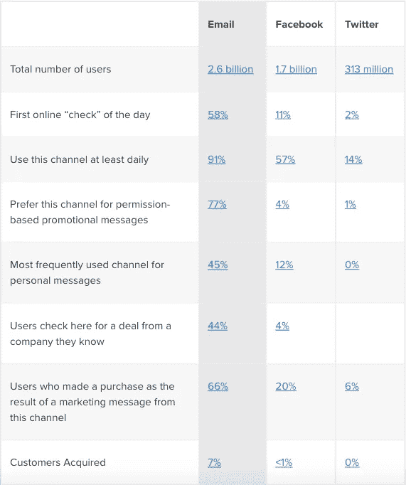

Image Source: MailMunch

然而，ExactTarget 表示，大多数消费者首先会查看电子邮件。

这就是证据，

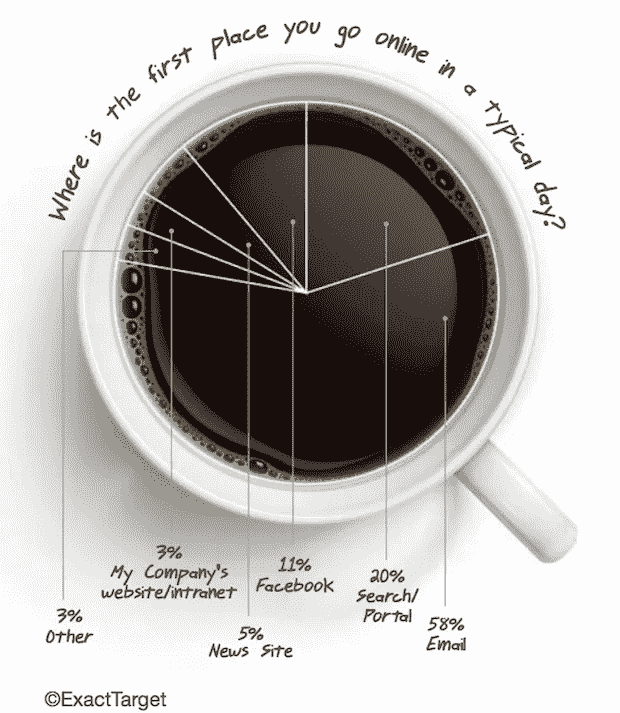

现在，正是电子邮件自动化套装巩固其市场地位的时候。毫无疑问，这些品牌在帮助企业发展的同时，也在帮助企业即时、几乎实时地帮助消费者。

几天前，当我在整理我的时事通讯时。中途，我在**移动优化** it 时遇到了一个问题。我做了什么？

我上了[的推特](https://medium.com/u/6f50810b16a8?source=post_page-----2e42f54021bd--------------------------------)，把这个问题标记给了 [MailChimp](https://medium.com/u/772bf2413f17?source=post_page-----2e42f54021bd--------------------------------) 团队，仅仅几分钟就解决了！

你自己看吧，

你们中的一些人可能是光滑屏幕后面的明星，但老实说，我不是你们中的一员。我从来没有拿过 PS 或插画，我真的不知道电子邮件简讯是否可以建立在这些上面。

如果这些相当高贵但负担得起的电子邮件营销品牌抬高了成本，我可能不得不考虑其他选择。

> “可能会上门投递我的简讯”

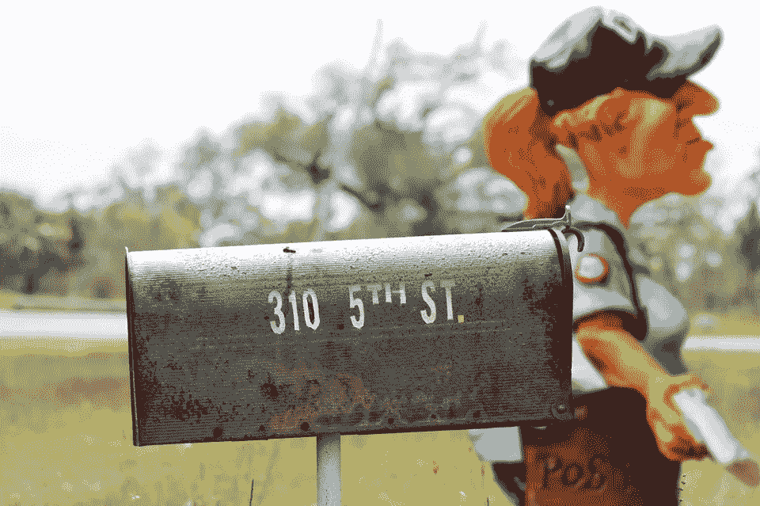

那会很有趣——如果真的有趣的话。

> 只有一张纸条:
> 
> 嘿**亲爱的电子邮件自动化品牌**，
> 
> 永远不要试图抬高你产品的价格。
> 
> 你可能会在我们的一些口袋里打洞！听我说完，如果你这样做，我可能不得不停止生活，因为我刚刚开始为这个世界和我的追随者做好事。
> 
> 人们开始**订阅**，**欣赏**我的作品，很少有**出版物**来找我做他们的**客座作者**(我很高兴，虽然我现在失业了，反正很难做到这一点)。

## 重要的事情先来

充分地说，我每天早上、中午和晚上都会收到一套很好的时事通讯，永远如此。他们中的一些人会在奇怪的时间溜进来，但是当他们要传达发人深省的信息时，谁会在意呢。

作为一名营销人员，我想说，我一直想精心设计邮件标题(好吧，好吧，**主题行**)，吸引 **100%的打开率**和 **500%的参与度**以及一盒巧克力。

不久前，我看到了一些关于电子邮件营销如何开始再次打开局面的真实数据。以及通过分发优秀的**模板、调度、**和**数据分析服务来支持品牌的工具。**

事实上，看到**人工智能**和**机器学习**(记住这一点，ML 是 al 的子集)如何出色地实施到营销领域，我并不感到惊讶。

就像其中一个活着的**艾神(** [**亚当加百列**](https://twitter.com/THEAdamGabriel) **)** 提到他们在同心圆里。

> “电子邮件营销需要关注一些细节”

它必须**足够引人入胜**并且必须说出一些**值**。

你的用户为订阅你的邮件列表所付出的努力是无价的。要留住他们，你必须在质量方面不断进步，并为他们提供与愉快的服务并列的智慧和 T21。

> “不要向他们的收件箱发送垃圾邮件”

以下是我欣赏的 10 种电子邮件营销工具，尽管目前为止我只是随意使用了 MailChimp。

> 如果我从 **10 个不同的品牌**得到 **10 份远程营销工作**，我可能会使用所有这些。

看一看，分享一下你的想法。另外，你为什么不把这篇文章放在你的下一期时事通讯里呢！:P

1.  [石蕊](https://medium.com/u/27fdbc0312?source=post_page-----2e42f54021bd--------------------------------)

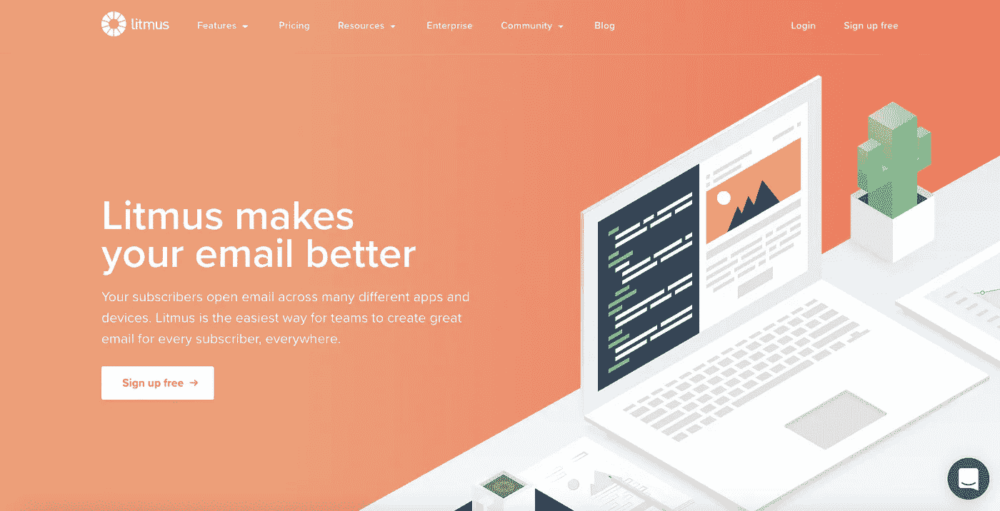

**2。**

**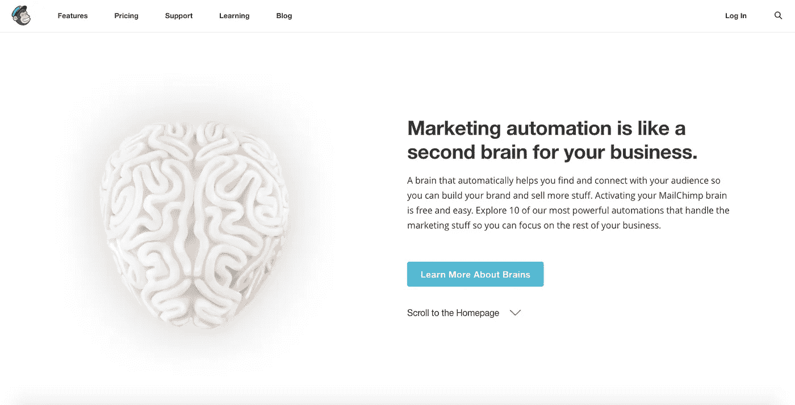**

****3。ReachMail****

**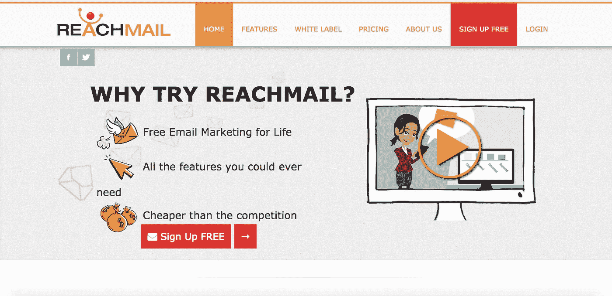**

****4。目标英雄****

**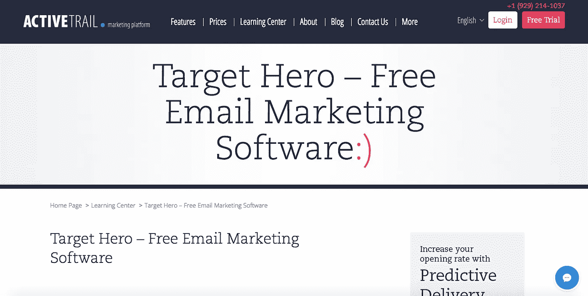**

****5。疯狂迷你****

**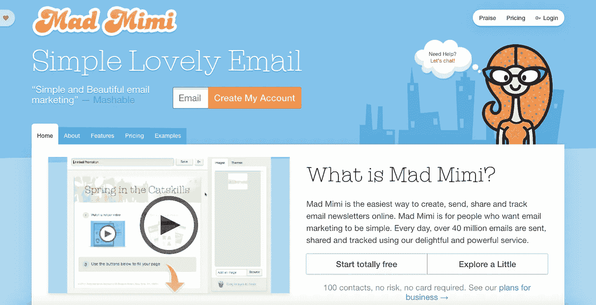**

****6。**[**CakeMail**](https://medium.com/u/3dfd847436c9?source=post_page-----2e42f54021bd--------------------------------)**

**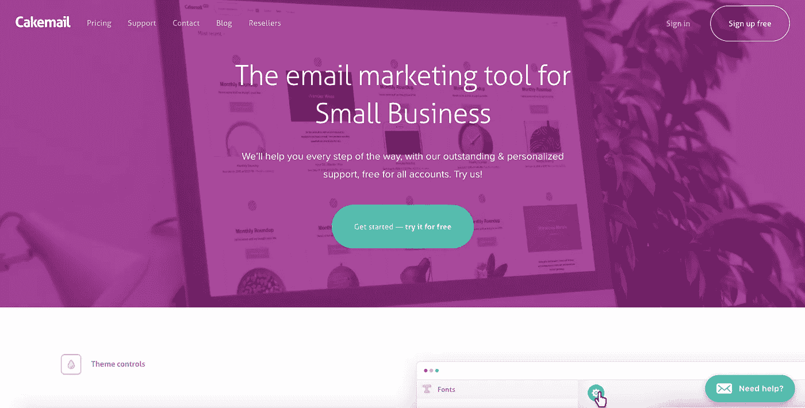**

****7。** [**Mailjet**](https://medium.com/u/e43755051b80?source=post_page-----2e42f54021bd--------------------------------)**

**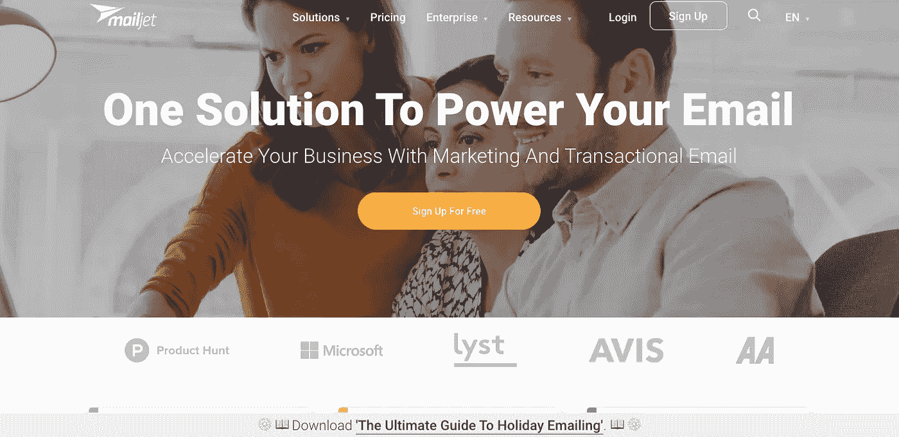**

****8。**[**flash issue**](https://medium.com/u/cdf86d9a308d?source=post_page-----2e42f54021bd--------------------------------)**

**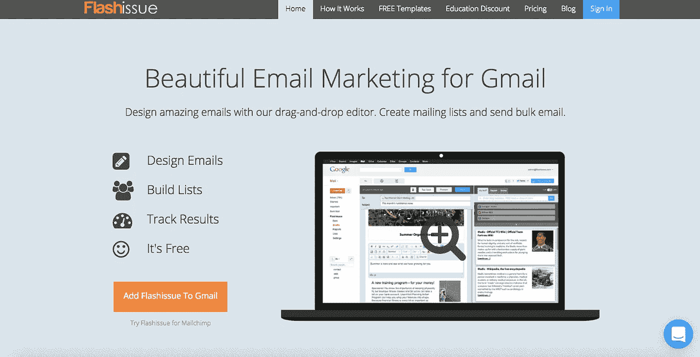**

****9。** [**恒触点**](https://medium.com/u/48457f46c5a4?source=post_page-----2e42f54021bd--------------------------------)**

**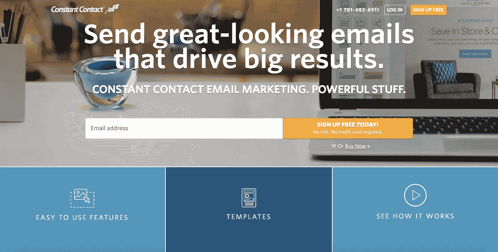**

**10。 [**iContact**](https://medium.com/u/25dff84f482f?source=post_page-----2e42f54021bd--------------------------------)**

**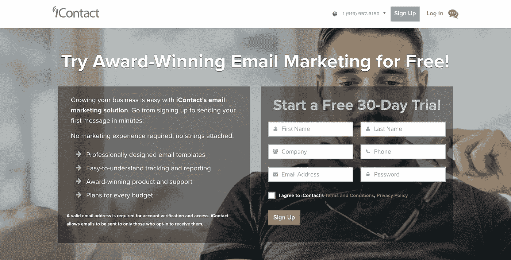**

**仅此而已。**

# **发这些→👏 👏 👏无论你能做多少…😃**