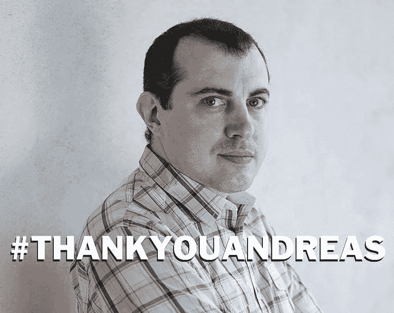

# #THANKYOUANDREAS

> 原文：<https://medium.com/hackernoon/thankyouandreas-da02727ab5ac>

大约两年前，我报名参加了塞浦路斯尼科西亚大学的大型数字货币在线公开课。安德烈亚斯·安东诺普洛斯是两位老师之一。我可以很轻松地说，他是迄今为止我遇到的最好的导师。不仅因为他教了有史以来最有趣的课程，还因为他对我们每个人都有非凡的耐心。每次几个小时，他都会回答我们每个人的每个问题。我认为他的演讲课。不仅是比特币，还有历史、哲学、经济，或许最重要的是修辞学。我可以很高兴地承认，自从我第一次发现他的演讲，我就一直着迷地关注着。我第一次真正“得到”比特币的时候，就像是一场完美风暴，是由我的个性特征的奇思妙想形成的。我一直对数学和事物如何在引擎盖下工作很感兴趣，我一直认为个人自由很重要。我也一直有一点叛逆，这些因素加在一起让我很快跌入比特币兔子洞。像大多数其他人一样，我害怕买，事后想来，我应该早点买。安德烈亚斯让这个过程快了一点。谢谢你安德烈亚斯。

在一次采访中，我听安德烈亚斯描述了他过去五年左右的个人生活。一个惊人的故事。当安德烈亚斯第一次“得到”比特币时，他变得痴迷，除了研究比特币两个月之外，他什么也没做。然后他放下了*的一切*，开始环游世界，每天给各种各样的人做关于比特币的讲座。他*还在*做这个。想象一下，为了传播一个美好的想法，要冒一切风险需要多大的勇气。安德烈亚斯进行了一场个人圣战，他正以惊人的速度改变着世界。他没有家，到目前为止，他已经去过大约 50 个不同的国家。他尽可能保持他的谈话不涉及政治，当你谈论一项有可能颠覆所有权力的技术时，这真的很难做到。他也是一个无冕之王，他把比特币挖矿比作解决巨型数独，把现在的银行业比作汽车发明时的马业。更重要的是，他将比特币与 TCP/IP 进行了比较，并创造了短语*货币互联网*，这也是他一本书的名字。谢谢你安德烈亚斯。

大约一周前，安德烈亚斯回复道“我不是比特币百万富翁。前两年我是免费工作，而不是投资。最近才还清债务。我在 Patreon 上的支持者，许多人每月 5 美元，让我有可能独立工作。”一条暗示他是百万富翁的微博。安德烈亚斯很少谈论自己的财富，这是对一条质疑他是否需要 Patreon 账户的推特的回应。此后不久，罗杰·维尔回复道:“安德烈亚斯是比特币话题上最雄辩的演讲者之一，但如果他在 2012 年投资 300 美元比特币，他今天就会成为百万富翁。”安德烈亚斯的微博。这让社区变得疯狂。罗杰斯略带得意的评论启动了#THANKYOUANDREAS 运动。比特币社区似乎并不关心安德烈亚斯是否富有。我们认为他应该得到一点赞赏。在几个小时内，该社区已经筹集了超过 70 万美元的比特币来支持 Andreas。到今天为止，已经筹集了 100 BTC，这让安德里亚斯成为了百万富翁。他值得每一个最后的聪，我相信他会把钱用好。不客气，安德烈亚斯。

安德烈亚斯展现了我们所有人最好的一面，他应该得到所有他能得到的赞扬。他将作为一个英雄被人们铭记，他的贡献无论怎样强调都不为过。毕竟，他在让我们许多人成为百万富翁的过程中发挥了巨大作用。安德烈亚斯从来没有说过罗杰或其他同龄人的任何坏话，他仍然像以往一样礼貌和谦逊。这场运动恢复了人们对比特币社区的信心，也让人们相信我们可以一起完成伟大的事情。安德烈亚斯说，他现在会离线一段时间，让一切都沉入进去。让我们热烈欢迎他重返互联网，这是他应得的！

谢谢你安德烈亚斯。

[https://antonopoulos.com/donate/](https://t.co/vjvlidsQ8Y)