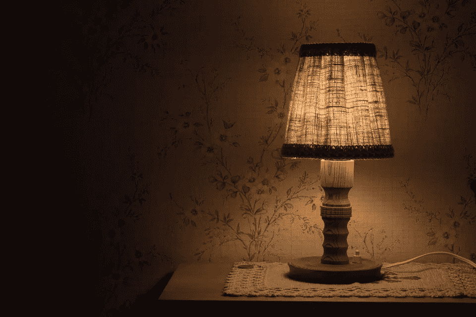

# 你桌子上那盏时髦的宜家台灯可能刚刚被召回

> 原文：<https://medium.com/hackernoon/that-funky-ikea-lamp-on-your-desk-may-have-just-been-recalled-ced9eb5e7535>

根据一系列新闻报道，宜家在美国消费者产品安全委员会的帮助下发起了召回活动，声明其几款落地灯和台灯正在被召回。该运动是在事件被报道后发起的。

官方召回报告显示，Gothem 落地灯和台灯可能带有在制造过程中受损的电缆。如果是这种情况，并且电缆与灯的金属体接触，消费者就有可能面临触电的风险。

数以千计的召回产品带有“Gothem”和宜家标志，都印在每个灯座底部的标签上。

由于这些灯具与至少三起轻微电击事故有关，召回活动被认为是必要的。虽然震动很小，没有重大伤亡的报道，但消费者被敦促避免犯忽视风险的错误。

如果您手中有召回的产品，请停止使用灯具，并联系宜家，以了解如何解决问题。

召回的灯具于 2015 年 10 月至 2016 年 2 月期间在全国宜家商场和网上销售。我们强烈建议拥有被召回灯具的消费者将其退回购买地点或另一家宜家商场，获得全额退款。

您可以点击[此链接](http://www.cpsc.gov/en/Recalls/2016/IKEA-Recalls-Floor-and-Table-Lamps/?utm_source=feedly&utm_medium=rss&utm_campaign=Recalls+RSS)阅读完整的召回报告。

> [黑客中午](http://bit.ly/Hackernoon)是黑客如何开始他们的下午。我们是 [@AMI](http://bit.ly/atAMIatAMI) 家庭的一员。我们现在[接受投稿](http://bit.ly/hackernoonsubmission)并乐意[讨论广告&赞助](mailto:partners@amipublications.com)机会。
> 
> 如果你喜欢这个故事，我们推荐你阅读我们的[最新科技故事](http://bit.ly/hackernoonlatestt)和[趋势科技故事](https://hackernoon.com/trending)。直到下一次，不要把世界的现实想当然！

