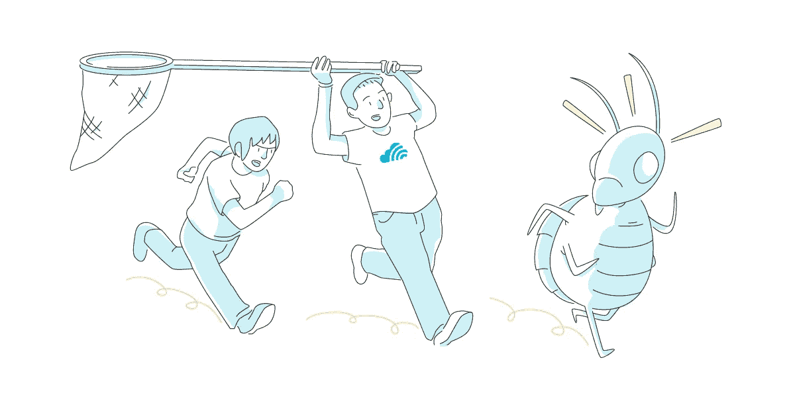
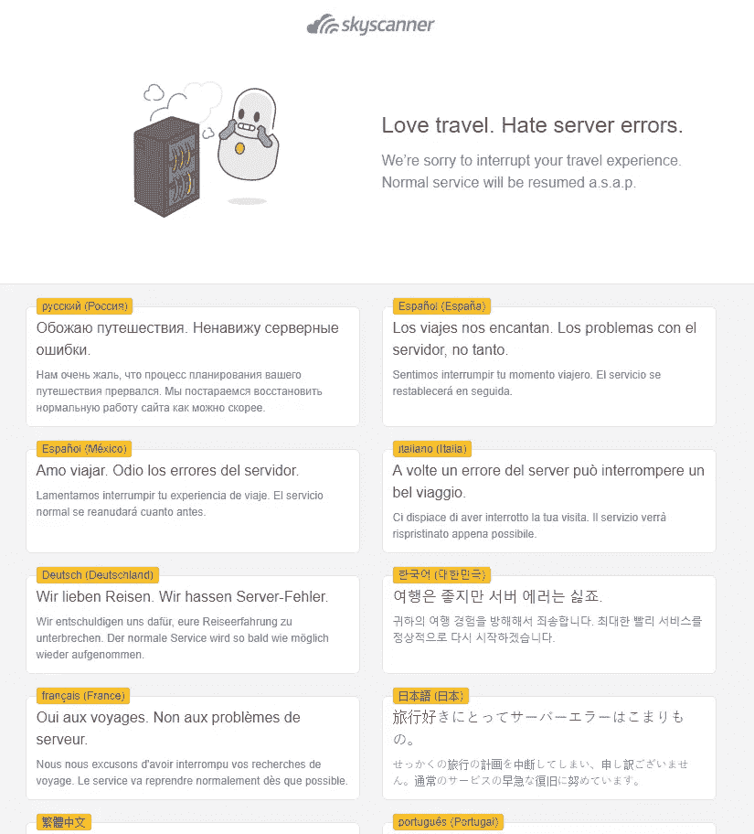

# 那一次，一个休眠的 bug 复活了，所有的事情都同时出错了

> 原文：<https://medium.com/hackernoon/that-time-a-dormant-bug-came-alive-and-everything-went-wrong-at-the-same-time-9669b289dece>

## **Skyscanner 工程验后，分享了**

That time a dormant bug came alive and everything went wrong at the same time. Illustration by Skyscanner’s Gavin Spence.

*戴夫·阿彻和马特·海利*

在 [Skyscanner](http://skyscanner.net?utm_medium=blog&utm_source=engmediumblogpost&utm_campaign=dormant_bug_came_alive) 我们知道我们的技术或流程会在某个时候让我们失望，但这没关系。[介绍了我们的事后分析系列](/@SkyscannerEng/post-mortems-are-for-learning-and-sharing-1b6a38526923)，这是我们希望在未来继续的系列的第二篇文章。

# **背景**

我们经常使用可以远程设置的配置标志来推出新功能。web 节点(内部称为**支架**节点)轮询这些标志及其各自的约束(特定市场中的用户、服务的流量百分比等)，并在每个请求的基础上对它们进行评估。

# **问题摘要**

当我们试图推出一个更改来替换我们用于网络爬虫检测的提供者时，我们的 scaffold 代码库中一个长期休眠的 bug 浮出了水面。远程配置标志已启用，对它的评估触发了请求执行中的无限循环。这使我们所有的节点超载，导致整个舰队倒下。

在生产事故期间，我们的流程通常从恢复最近的更改(包括远程配置标志)开始，但这被证明是有问题的，原因如下:

*   在第一个实例中，我们没有正确地回滚有问题的配置，这意味着我们花了几个小时才结束
*   我们的脚手架服务器运行在 IIS 下。对于这种灾难性故障，IIS 在看到太多连续错误后关闭应用程序池，这意味着节点不会自动获取我们试图对远程配置标志所做的更改

最终，违规的配置被正确还原，节点重新启动，秩序恢复。

# **事发期间**

这个问题的根本原因在下面的章节中有概述。这个问题更有意思的地方在于，事故期间的一系列事件导致这成为我们持续时间最长的中断之一。为简洁起见，这里以点的形式列出了顺序。

*   为 1%*****个请求启用了“Crawler 检测提供程序”标志
*   Web 节点在获取新配置并评估标志时崩溃
*   “爬网程序检测提供程序”被错误回滚。标志值从 TRUE 设置为 FALSE，但约束保留在原位**。在这一点之后，我们基于错误的假设进行调查
*   不正确的假设是节点正在努力启动并获取更新的远程配置(参见下面的部分' ***为什么花了这么长时间…'*** *)*
*   已尝试保护服务器免受流量影响，以允许它们使用更新的远程配置启动
*   手动将更新的配置复制到部分节点。问题仍然存在，表明问题出在配置本身
*   已完全回滚远程配置设置
*   节点开始成功恢复和服务流量

******* *对所有节点上的所有请求评估 1%标志，但该功能仅针对 1%的请求激活*

***问题不在于新代码路径，而在于约束的评估*

影响完全诊断和解决问题的时间的其他因素包括:

*   在断电期间，配置 UI 不可用。它还没有从 monolithic scaffold 代码库中移除(尽管底层服务已经移除)。
*   由于我们的数据平台出现了一个不相关但不幸的时间问题，所有仪表盘都不可用。
*   试图在 Akamai(我们的 CDN)级别清空单个数据中心并没有达到预期效果；耗尽的数据中心继续接收流量。其根本原因不在本报告的讨论范围之内，尽管已经启动了一项单独的调查。

# **根本原因**

如上所述，我们正在改变爬虫检测的提供者。为了安全地做到这一点，我们选择将交换机放在一个配置标志之后，并使用一个“实验”(这里很少使用这个术语)约束来缓慢地增加到新提供商的流量。

*   为了将请求识别为网络爬虫，脚手架必须评估配置标志以在两个爬虫检测提供者之间选择一个
*   评估需要检查配置服务中定义的所有约束；在这种情况下，实验约束是特别有趣的
*   为了避免网络调用，实验变量的分配由我们的 Jekyll 博士(我们的实验平台)的胖客户端根据所选的请求属性来执行
*   一个属性指示请求是否来自爬虫
*   但是，由于与此展开相关的一个类似标志，确定请求是否来自爬虫程序再次依赖于实验分配数据，这导致了一个循环依赖:爬虫程序信息需要实验数据，而实验数据是基于爬虫程序信息评估的
*   在由互斥的、请求范围的锁定义的临界区内，每个网站请求计算一次分配参数。由爬网程序信息请求触发的参数的重复计算导致 IIS 应用程序池被停止。

# **检测时间**

目标是 **15 分钟**，实际是**4 分钟**，而解决时间——目标是 **60 分钟**，实际是 **215 分钟**。我们的检测中心通过自动报告提出了问题，这是我们内部员工报告问题的备用渠道，同时我们还通过我们的用户满意度团队和 Twitter 渠道收到了用户报告。

# **影响？**

在我们的网络产品上，访问网站的旅行者会看到休斯顿错误页面。对于我们的移动应用，重定向到合作伙伴的用户通过浏览器发送，这意味着使用我们应用的旅行者无法完成任何预订。

我们也看到了在 bug 浮出水面的一个小时内对 SEO 的影响。

Our Houston error page

# **问题**

***为什么这个问题在影响生产之前没有被发现？***

新功能在生产前通过配置标志完全启用。然而，它不是以实验作为约束来启用的；仅通过配置将其从 0%切换到 100%。直到这次事件，这是我们相对标准的做法。

自动化测试覆盖还缺少配置和实验约束都启用的生产案例。

****

配置更新在早期就被确定为触发器。为了尝试修复它，条目从 TRUE 更改为 FALSE。

然而，(我们现在知道)根本问题是由仍然存在的约束引起的。

当团队试图让 Scaffold 服务器重新上线(通过重启 IIS 应用程序池)时，它们立即再次崩溃。当时(不正确的)假设是脚手架服务器在倒下之前没有获得最新的配置。

然后，团队在重启之前将最新的配置文件复制到 Scaffold boxes 中(以绕过 Scaffold 中的轮询机制)。然而，脚手架服务器在重启时仍然会倒下。

有了这个新的知识，配置条目被完全删除了(当没有可用的配置时，Scaffold 有安全的缺省值可以使用)。

应用程序池被重启，这一次 Scaffold 服务器获得了新的配置并保持在线。

# **主要经验**

*   在生产前安全地测试配置+实验的组合(配置已经过测试，但没有后备实验)
*   如果确定错误的配置/实验值是问题的原因，而不是向前修复，则恢复错误的配置/实验值
*   尽可能将系统分开，以限制停机的影响(在这种情况下，是脚手架+配置 UI)
*   充分理解并考虑爆炸半径的变化——尽可能限制
*   网站稳定性可能会对用户性能指标(由于快速反弹而导致的搜索间隔时间)产生影响，并影响 SEO

# **来自团队的反馈**

不管这一事件的具体情况如何，我们需要确保我们限制了未来任何释放的爆炸半径和故障域。我们将流量限制在上面提到的 1%的机制是基于软件的决定，它应该被物理地限制在运行在节点子集上的代码。

*   我们需要在停机期间冻结其他实验，以防止雪球效应和根本原因的混乱。
*   我们需要了解爆炸半径并限制它，以及如何在未来进行没有如此大风险的实验。

以上所有问题现在都已解决。

你怎么想呢?请在下面评论或发微博告诉我们你的理论、评论和想法。

## **喜欢你听到的吗？与我们合作**

我们在 Skyscanner 以不同的方式做事，我们正在全球办事处寻找更多的工程团队成员。看看我们的 [Skyscanner 职位](https://www.skyscanner.net/jobs/)寻找更多空缺。

[Skyscanner Jobs](https://www.skyscanner.net/jobs/)

# 关于作者

大家好，我是 Matt，是 Skyscanner 的工程经理，与 Dave 和我们核心 web 团队的其他成员一起工作。在第一线工作，没有一天是无聊的。随着我们继续在全球范围内扩大规模，我们在维护网站和开发对我们的成功至关重要的新系统之间周旋。在一家旅游公司工作，我喜欢旅游并不奇怪——中国是下一个目标！

Matt Hailey, Skyscanner