# “那不是比特币，这是比特币”

> 原文：<https://medium.com/hackernoon/thats-not-bitcoin-this-is-bitcoin-95f05a6fd6c2>

## …以及一些关于完整节点的内容

## 介绍

这比我最初的计划要长得多。这些都是松散地串在一起的，但是这里有很多信息绝对值得一读，尤其是如果你是这个社区的新成员。不管你是否同意我的观点，我推荐你阅读这篇文章，这样你就可以把它传递给社区未来的成员。他们是最重要的人，需要看到我下面提到的一切。不是我们。因为这不会结束。#NO2X

“我不在 Reddit 上发帖”是我在浏览 Reddit 时的非官方座右铭，直到有一天我被迫去教训一些人，为什么我们的祖母不能保护自己的私人钥匙。

“我不在媒体上发帖”甚至不是我的座右铭。*开发商*在媒体上发帖……对吗？人'*'参与'*'在这个空间上的帖子，而我是无名小卒……对吗？我不编码，我没有名字，我没有追随者，我不断地犯错误试图理解或解释协议给其他人。**我只是一个*用户* …**

> “等等，打住，他在说什么？“在媒体上发布”到底是什么意思？”**-所有人**

你说得对。我在*媒体*上发帖的事实毫无意义。这只是一个网站的名字，它的特点是允许我在这一刻以我希望的方式表现自己。这就是眼下的潜在主题。我*说的是**但我*所指的*是媒介此时恰好为我提供的途径*。**

> *“为什么这很重要？**——大概所有人***

*请允许我重申:**我*说的是*比特币，但我*指的是*是我们许多人*称之为*的协议的当前状态为我*用户提供的途径。****

*我们稍后将回到这一点。无论如何…*

*比特币狂热主义者会说*“比特币只有在大多数人运行全节点的情况下才有效。”这是一个伟大的努力，我祝他们好运，但我个人不认为我们的祖母会全力以赴。祖母占总人口的百分比是多少？当他们都运行全节点时，我们都将被同化到奇点中，通过无线分散的全球互联网运行我们的脊椎抽头全节点。听起来很有趣。**

**

*你个人能想象一个大多数人运行全节点的世界吗？当你母亲运行一个完整的节点时，详细说明她日常生活的复杂性。告诉我*她在一天之内做的所有事情*，在这些情况下的完整节点在哪里？她带着它去购物了吗？什么是*《大多数人》*？70 亿的 51%？90%?总百分比中包括儿童吗？这个，或者这个*不*算不算所有的自动机器人，这些机器人将在它们的[bio]中内置它们自己的完整节点。]机械体？在不久的将来，大约在“大众采用临界点”左右，最有可能的情况是每个人的手机上都有一个。这真的安全吗？谁在开发这些客户？苹果会有自己的内置围墙花园硬件版本吗？他们会将所有内置客户端指向他们的服务器上的种子节点吗？这会有什么影响？这真的有可能吗？*

*所有这些问题都是*合理的*问题，但尽管它们是合理的，*却是令人分心的*，因为**拥有尽可能多的全节点*对于比特币来说是必不可少的，***专注于*数字*完全忽略了这一点。*

*嗯，实际上…不，不是的。**对*我来说是势在必行，*** 对大多数社区来说是势在必行，对现在就为这项技术铺路的大多数开发者来说也是势在必行。*比特币不在乎。**

**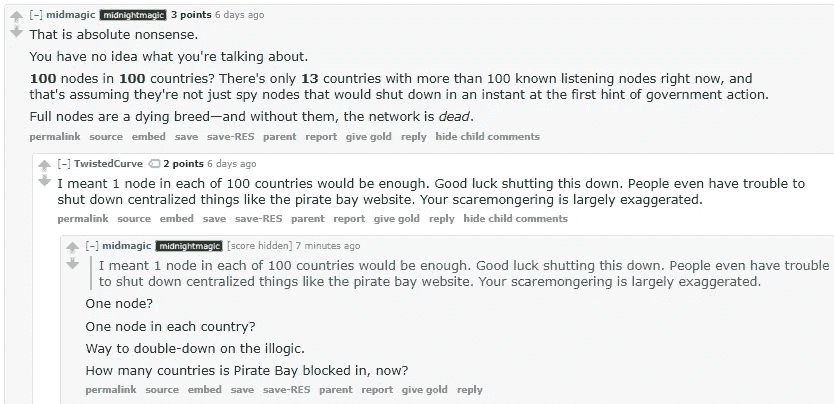**

**显然，对某些人来说，这是*而不是*必须的。不是对少数几个开发商，或者对一些早期投资并已经致富的人，或者那些碰巧成功地推销自己是重要人物的人。这对于以太坊社区来说也不是必须的，但是让我们推迟到以后吧…**

**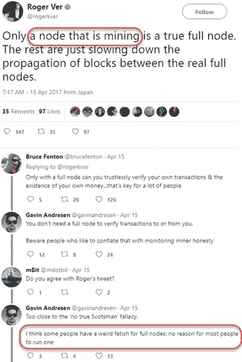**

**看到他们如何试图区分完整节点，我和那些不？通过错误的信息，以及使用我在上一段中使用的策略(问合理的，但重定向的问题)，他们已经成功地获得了一批追随者，而完整的节点对那些追随他们的群体来说也不是必要的。我们都听腻了 Satoshi 数据中心的引用。你听过了吗？**

**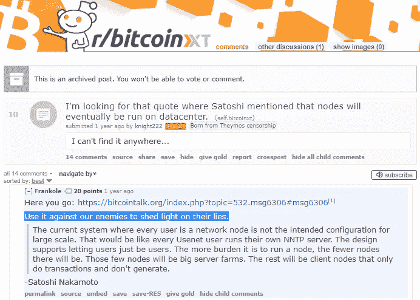**

**对不起，但是聪不是神，没有人是完美的。当你知道一个人无法在[更新的语境](https://github.com/lightningnetwork/)中阐明自己的观点时，很容易为你的事业引用他的话。Satoshi 没有预测将所有的节点变成一个支付渠道网络([尽管他在与 Mike Hearn](https://lists.linuxfoundation.org/pipermail/bitcoin-dev/2013-April/002417.html) 的通信中提到了这个主题)。**每一种主要的加密货币都在采用支付通道技术**，但你仍然可以看到这些宣传推手试图以*比特币*的名义打倒这项技术:**

**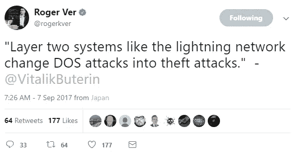**

**有人能提供这个吗？我试过了，我做不到。也许它被改写成适合 140 个字符，也许维塔利克说了些别的话，并把它塑造成他从来没有想过的东西。可能是维塔利克删了。即使他做了，*也许他改变了主意:***

**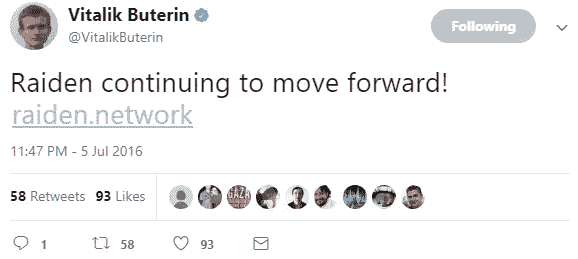**

**注意到那些帖子上的日期了吗？ [Roger Ver](https://www.justice.gov/archive/criminal/cybercrime/press-releases/2002/verPlea.htm) 对雷电网络(以太坊的闪电网络)和 Vitalik 对它的支持了如指掌，但他仍然使用(据推测)1.5 年前的引文，向不断增加的新加入这个社区的无知人群灌输这种废话。这种宣传不会消失。你有没有注意到我在旧比特币- *XT* subreddit 中为用户设置的“Pro Bitcoin Unlimited”标签？同样的战役，不同的旗帜:**掌控网络。掌控比特币这个名字。****

**这是一个持续的宣传活动，需要不断地被击落。新加入社区的人不知道历史，不知道意识形态，也不知道这些团体使用的反复出现的策略。**

**这是著名的“我是聪”骗局中的一个很棒的例子:**

**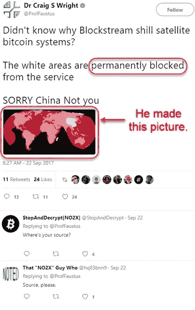**

**如标题所示，他拍了那张照片。那天他在推特上疯狂转发随机图表截图，[你可以自己去找。](https://i.imgur.com/z15RtEp.png)这是他的[推特](https://twitter.com/proffaustus)，这是*当前*卫星覆盖 Blockstream 的卫星网络有 ***他们刚刚推出的*****

**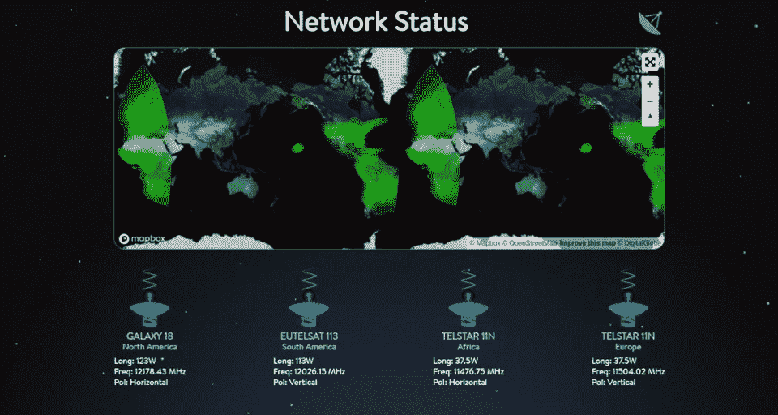**

**非常不同，具体来说:**这不是一个骗子手绘的**让它看起来像是中国被完全“封锁”了，而且是永久封锁…**

**如果他们不想要数据块大小，他们可以去以太坊；如果他们不在乎普通用户运行节点的能力会随着时间的推移而减弱，他们可以去以太坊。**或者他们可以去比特币现金…** 但不知何故，他们在已经拿到叉子后仍然推 SegWit2X。**

**ProTip:是因为他们并不是真的希望比特币成功。他们正在分裂，并试图征服。**

**如果出于某种原因，您仍然希望对块大小没有限制，这里有一个没有限制的链的真实例子。以太坊[数据目录的大小对他们来说是指数增长](http://bc.daniel.net.nz/)因为没有上限，但是他们根本不在乎，**这完全没问题，因为他们没有试图劫持*我们的*系统:****

**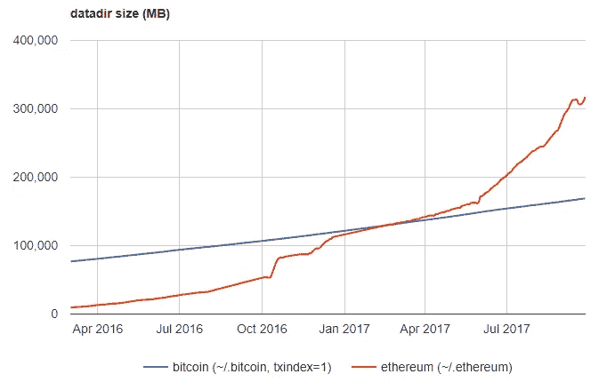****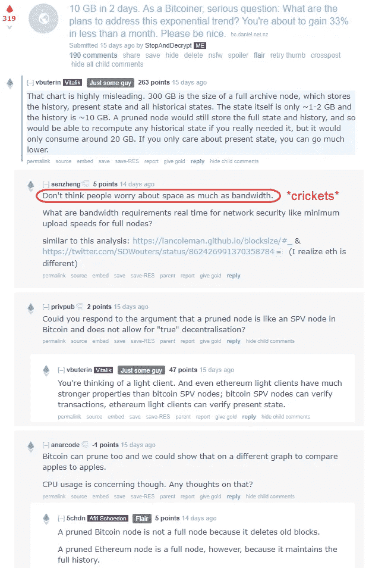**

**作为参考，下面是/u/senzheng 提供的两个链接: [1](https://iancoleman.github.io/blocksize/#_) 、 [2](https://twitter.com/SDWouters/status/862426991370358784) 。**

**问题是，像这样的心态渗透到比特币社区，并导致分裂，从而导致明显的后果:链分裂，以及对*和*比特币头衔的争夺。**

**那么当社区中出现意识形态分裂时会发生什么呢？用来搅浑水和左右舆论的其他协议实现也是众所周知的:块大小上限、总供应上限、矿工版本位信令。当一群人决定让*比特币*取消*(不仅仅是增加)*对区块大小的限制时，会发生什么？有人支持取消 2100 万硬币的上限吗？没有吗？当这也成为目标时，不要感到惊讶。以太坊已经把这两样都拿走了…****

***你的意识形态对 70 亿甚至不知道我们现在在谈论什么的人来说到底有多大分量？70 亿人很容易受到错误信息的影响。你准备公开宣称 70 亿人不知道他们在说什么，他们应该听你的吗？***

# ***那么“比特币”这个名字到底是什么意思呢？***

> ***[**身为美国人意味着什么？**](http://www.scholastic.com/browse/article.jsp?id=5235) **—经院*****
> 
> ***“做一个美国人很棒。我们可以做运动，吃很多食物。我们得到许多玩具，都是因为我们是自由的——这是最好的事情。”
> **——奥斯汀·b .**，11 岁，威斯康星州人***

***你认为奥斯汀知道美国爱国者法案吗？在不到一年的时间里，国会签署了该法案，学者们要求孩子们提交他们的意见。***

***还要注意奥斯丁*是如何说*【美国】的，但是他*的意思是*他的国家的现状为他作为一个公民*提供了进行体育运动和吃大量食物的途径？不完全是，但是你得到要点了吗？****

**抛开 1984 年的类比，如果运动和过量食物不再是奥斯汀的选择，美国的定义会发生什么变化？他的意识形态现在怎么样了？500 年后什么将代表自由？成为一个罗马人意味着什么？**

**这是真正驱使我选择 Medium 的原因，因为 Reddit 的回应不足以解决这些反复出现的争论，即以*比特币的名义干预我的意识形态，从许多不同的角度来看，比特币以各种方式支撑着我。这里有一个:***

***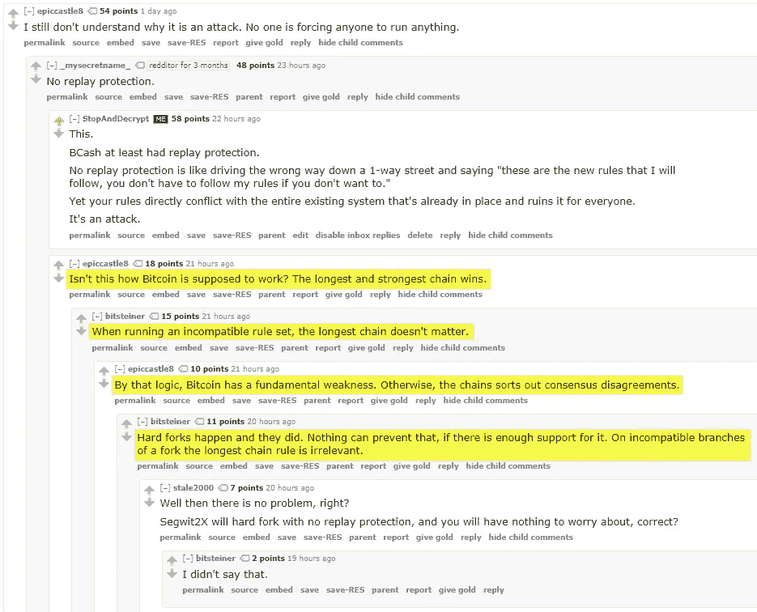***

***首先，让我们实际解决上述争论的技术问题: [**链重组不是协议变更**](https://en.wikipedia.org/wiki/Association_fallacy) **，短语“最长有效链”指的是前者，而不是后者。*****

***即使这样，一个链中所有方块的*【难度总和】*的大小决定了重组的有效性，**而不是方块高度**:***

**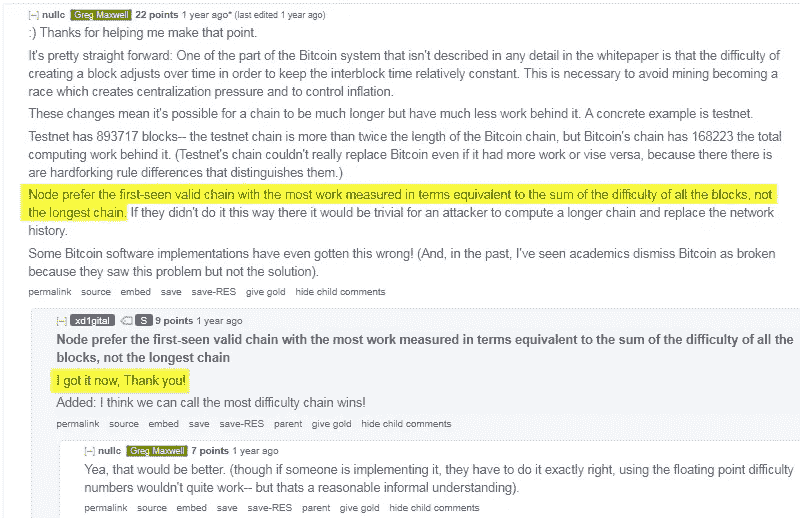**

**使用' *LVC'* 论点来试图证明为什么你支持的叉子应该/将要拥有*比特币的称号是一种谬误，类似于证明你今天为什么以“我找不到我的书包”为借口逃学，好像打破你正常的早晨协议不知何故使学校本身变得无用:***

> ****比特币=【起床→洗澡→* ***抢书包****→走路上学】****

**** *排队类比纳粹。*****

> **“我很高兴我们澄清了这一切，现在我终于明白了。就这样，对吗？所有区块难度之和衡量的最长链条是比特币，对吗？”***——BTC-101 学生/**[**GMTH-203**](https://en.wikipedia.org/wiki/Game_theory)**学生*****

***没有。***

***看到我做了什么吗？我反映了一些人的反应，他们要么没有抓住要点(别担心，我们会到达那里)，**要么忽略它，只是试图利用他们的论点**为他们选择的叉子提供任意的技术价值。是的，*任意技术功德***。我可以说出一些核心开发者对这种说法不太满意，尽管事实上我是站在他们一边的，但我不在乎，因为考虑到最重要的一点，这种说法是武断的。*****

***让我把这一点说清楚:**你对*任何*提议采取什么立场并不重要，如果你这样做，你要么不明白，要么就是*在骗人*。*****

***换句话说:**技术细节不能定义*比特币。社会共识需要，因为语言是天生的社会构造。此外，我的意识形态也没有定义*比特币*，因为社会共识可能不总是与我目前想要的一致，或者我的意识形态可能会在未来发生变化。******

**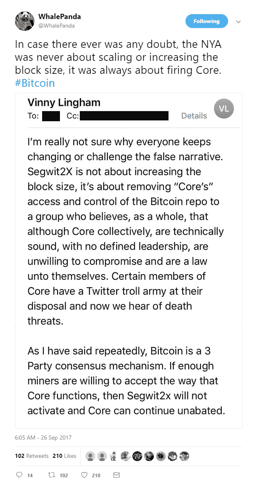**

**这公然承认了我关于欺骗策略的观点。当实际情况是他们想要从开发者手中夺走控制权时，使用块大小来刺激社区中的分裂。最重要的是，Vinny 是以太坊的支持者，也是一家拥有以太坊网络令牌的公司的首席执行官兼联合创始人。你能猜到他的动机是什么吗？你不觉得如果以太坊成功了，比特币社区分裂了，他会更好吗？**

**公平地说，Vinny 对那封泄露邮件的回应是分享更多邮件，以下是摘录:**

**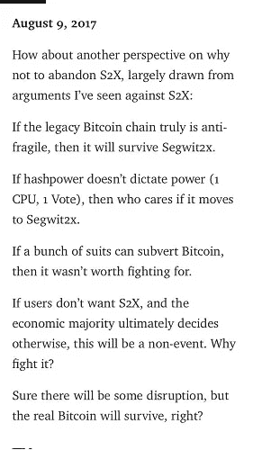**

**所以基本上，他仍然(或在 8 月份)支持 SegWit2X 继续进行它的 [**死在水中**](https://github.com/btc1/bitcoin) 链分裂，因为如果比特币按计划工作，那就无关紧要了……而[其他公司继续退出](https://twitter.com/Vaultoro/status/912603668813434880)他们*最初*签署协议的目的是让所有人都在一起，但现在因为比特币现金，*整个协议都没有实际意义。***

**顺便说一下，1 CPU / 1 Vote 是一个短语，当每个人在运行他们的节点时实际上挖掘 CPU 时使用。另一个无法辩护的著名的 Satoshi 名言，因为他实际上不在这个等式中。现在整个环境都不同了。当一个实体控制着(保守估计)~ 20%以上的哈希能力，继续挖掘空块*却抱怨空间不够，* **创造了比特币现金**并迫使网络分叉一次时，你怎么能证明使用那条线是合理的，这超出了我的理解…**

**…继续前进…**

**下面是一个人的例子，他*明白了*，但试图利用协议的技术细节，同时忽略了与 Charlie 争论的更广泛的范围。欺骗性地将客户端重组与协议更改/升级混为一谈，并声称 UASF 协议对*和*网络没有影响(看我在那里做了什么？)通过使用技术细节作为他们论点的杠杆:**

**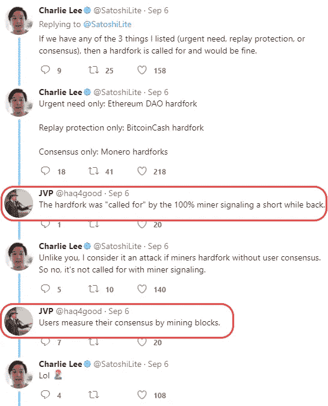****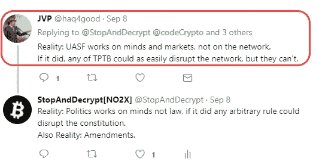**

**其他现实:内战，和平分离。**

**沿着这条线索深入下去，经过一番努力，这个人承认不关心大众最终称之为*的*比特币，声称这无关紧要。这是我们唯一达成一致的事情，这使得他们与查理的整个对话变得毫无意义，*但是如果读者不坚持完整的对话，他们就不会知道这一点。最初的顶级评论是最重要的，因为它最引人注目。***

**重申一下，链重组不是协议变更，为了争论的利益而将两者合并是欺骗性的，如果您仍然不明白，这里有几个例子:**

*   **比特币激活 SegWit 的时候，是协议变更，不是重组。**
*   **比特币现金是一种协议的改变，而不是重组。**
*   **如果 Jeff Garzik 的婴儿-儿童 SegWit2x 真的启动并离开，这将是一个协议的变化，而不是一个重组。**
*   **以太坊 是一个协议变更(碰巧涉及创建一个全新的交易数据库)……而不是重组。**

> **“Re-org-shme-org！语义！”**——克雷格·赖特**，天才少年/非聪**

**不，不是真的。在协议没有任何改变的情况下，重组一直在发生。这是一种内置的客户端机制，与升级无关，也不属于比特币。关键是要理解，一些协议升级试图 ***利用*** 重新组织(软分叉)，而其他协议升级试图 ***取代*** 重新组织(硬分叉)，并且它们本质上都不是对 *le* 比特币有害的，它们只是有自己的使用案例。**

**希望现在你已经开始理解这里了。协议升级在本质上是固有的社交活动。**这些变化的命名惯例本质上也是社会性的。**重组本质上是*而不是*社会性的，或者不管网络逻辑的愚蠢术语是什么。我*可以*查一下，但是不这样做有助于把这个观点带回家。**协议不会自己进化，**十亿次重组也不会改变一行代码，所以用它来证明你的分叉是错误的。**

# **那么我到底要去哪里呢？**

**好吧，首先，如果你分享我的意识形态，你需要分享这篇文章。社区会一直增长，直到*每个人*都是社区。教育永远不会结束。你不能灰心丧气，你需要学会如何恰当地来源、引用帖子&的引语，问同样基本的发人深省的问题 ***而不显得粗鲁*** 和说/想“又不是这个”。每个人在某种程度上都是这个社区的新成员，这不会结束。永远不会。句号。你会告诉你的孩子“不要再这样了，只要看看 github”吗？号码**

**我不指望每个人都这样做。我不指望每个人都有时间或精力。这也是我把这篇文章放在一起，并从社区的不同成员那里收集了大量引用的原因之一。当有人问你“你是什么意思”时，你最不应该做的就是引用错误信息和谎言。**

**同样重要的是，这篇文章最初的潜在主题是*应该*拥有的，那就是理解 **在某些时候，比特币可能不会以与你的意识形态一致的方式表现自己。如果这些误导策略被证明是成功的，他们将拥有比特币这个名字。如果发生这种情况，开发人员已经走了，他们也都对此直言不讳，要么转向不同的项目，要么继续支持不是被企业从我们这里偷走的链，不管它最终被称为什么(*我将*称之为比特币)。****

**截图由比特币开发者约翰·纽伯瑞提供:**

**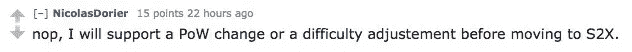****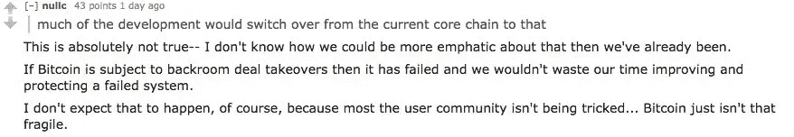****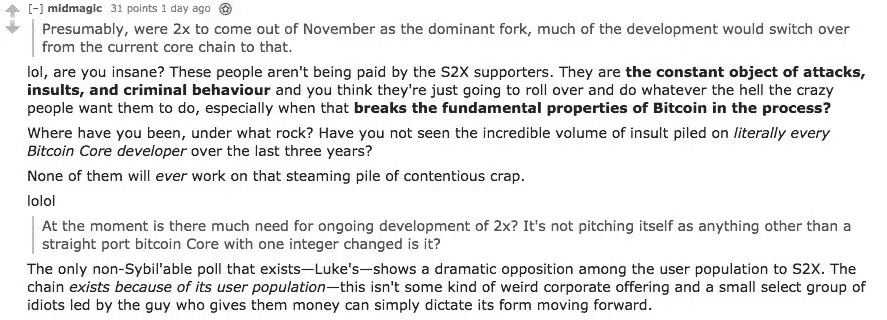****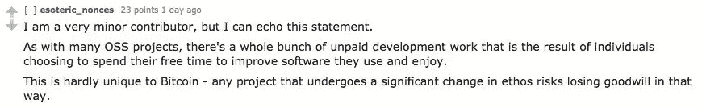****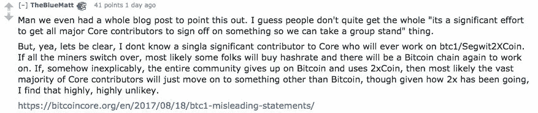****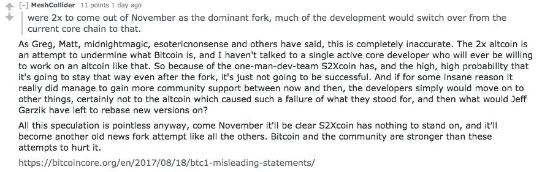****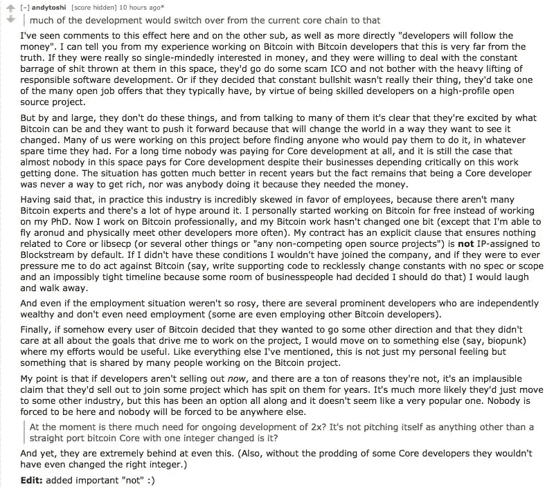****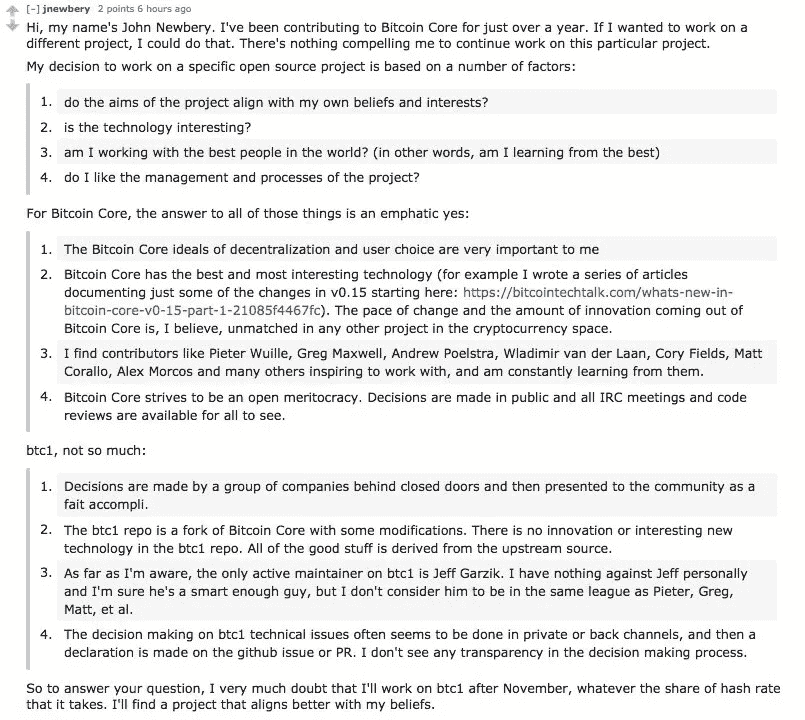**

**[Reddit 线程。](https://www.reddit.com/r/Bitcoin/comments/72esf4/supporting_segwit2x_btc1_equals_abandoning_btc/)**

**[推特链。](https://twitter.com/jfnewbery/status/912853897504608256)**

**[比特币核心博文。](https://bitcoincore.org/en/2017/08/18/btc1-misleading-statements/)**

**我不知道如果网络再次分裂会发生什么，但我知道**如果我们失去了比特币**这个名字(因为这就是整个宣传活动的目的)**那就不好了。**也许是我多虑了，也许不是。我唯一能建议的是，你可以看看比特币现金最著名的 ***矿工*** 对最近的 BCash 分裂链是怎么说的:**

**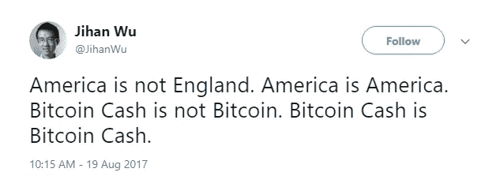**

```
**Bitcoin Cash is not Bitcoin
England = Bitcoin
America = Bitcoin Cash**
```

**现在来看看比特币现金呼声最高的 ***用户*** 对最近的链分裂是怎么说的:**

**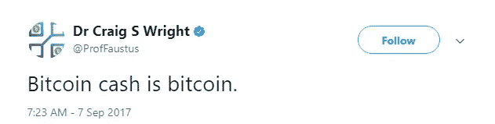****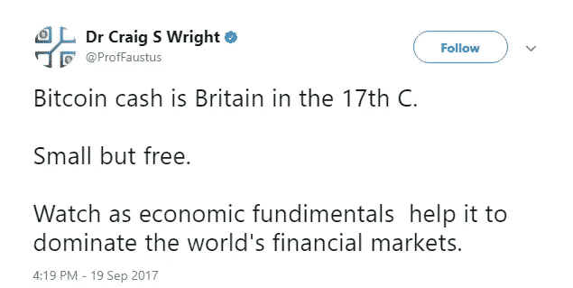**

```
**Bitcoin Cash is Bitcoin
England = Bitcoin Cash
America = ???**
```

**这对你澄清事情有帮助吗？他们自己之间甚至不能达成一致，因为他们所关心的只是盗用名字或者划分社区。**

# **#NO2X**

# **附录:**

***我可能会尝试在未来的格式这篇文章更好地流动。这是我第一次尝试写一些东西，我仓促行事。这已经成为我希望成为一长串与比特币政治和概念讨论相关的文章的开始。克雷格·赖特是个骗子。***

**推特塞:[https://twitter.com/StopAndDecrypt](https://twitter.com/StopAndDecrypt)**