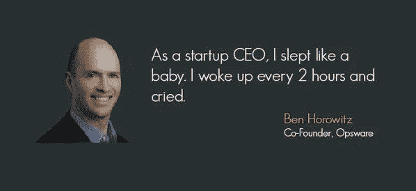

# 天使投资者应该问创始人的第一个问题

> 原文：<https://medium.com/hackernoon/the-1-question-angel-investors-should-ask-founders-5f8de87ec65>

[https://memeseeker.files.wordpress.com/2013/01/ocean_happy_january.jpg](https://memeseeker.files.wordpress.com/2013/01/ocean_happy_january.jpg)

不，不是他们的牵引力。

不，不是谭。

不，不是关于产品。

没有，甚至没有关于团队。

天使投资者，那些经常在第一次创业者的创业旅程的非常早期阶段投资他们的人，应该问一个完全不同的问题。

请敲鼓…

天使投资者应该问创始人的第一个问题是:

# 你知道这有多难吗

[http://www.maryswanson.net/wp-content/uploads/2012/08/ocean_lg.jpg](http://www.maryswanson.net/wp-content/uploads/2012/08/ocean_lg.jpg)

> 你知道这需要多少天 16 小时，有时一周 7 天吗？
> 
> 你知道你会错过多少生日派对、周日晚上和足球比赛吗？
> 
> 你知道你要处理多少垃圾吗？税收。坏账？员工偷窃(可能)。行为不光彩的竞争者。如此循环往复，绵延数英里。
> 
> 你知道你承诺给我至少 10 倍或 30 倍的回报或我们约定的任何回报吗(不，不是书面的，但当我投资者告诉你我的投资标准时，你说你会做到这一点)？
> 
> 你知道吗，我认为，如果你在第三年“轻松钱”用完，到了游戏时间，所以我们在这方面要做 5 年、7 年甚至 10 年，就放弃了，这真的不酷。

Techstars [的大卫·科恩谈到不要放弃](http://davidgcohen.com/2015/07/29/giving-up-the-ghost-early/)和兑现你对投资者的承诺。

现任职于 a16z(安德森·霍洛维茨)的本·霍洛维茨曾说过:

所以请记住，如果你在[投资](https://hackernoon.com/tagged/investing)未经考验的创始人，确保你知道他们明白这是在最紧张的条件下年复一年的极其艰苦的工作。这并不适合所有人。对于我们这些真正热爱工作并享受(大部分)与工作相关的事物的人来说，这是一种真正伟大的谋生方式。

但是每隔一天就会这样(如果你幸运的话):

[https://www.quora.com/Why-do-so-many-startups-fail](https://www.quora.com/Why-do-so-many-startups-fail)

*Jakub Kostecki 向早期投资者提供自动化尽职调查服务，使用机器学习、预测性人工智能和其他技术来筛选* [*初创企业*](https://hackernoon.com/tagged/startup) *投资机会，并识别、选择和审查最有可能成功的投资机会。详见*[*StartupFactCheck*](http://www.StartupFactCheck.com)*。*

如果你觉得这篇文章有用，请点击“推荐”并与你的社区分享。谢谢大家！

> [黑客中午](http://bit.ly/Hackernoon)是黑客如何开始他们的下午。我们是 [@AMI](http://bit.ly/atAMIatAMI) 家庭的一员。我们现在[接受投稿](http://bit.ly/hackernoonsubmission)，并乐意[讨论广告&赞助](mailto:partners@amipublications.com)机会。
> 
> 如果你喜欢这个故事，我们推荐你阅读我们的[最新科技故事](http://bit.ly/hackernoonlatestt)和[趋势科技故事](https://hackernoon.com/trending)。直到下一次，不要把世界的现实想当然！

