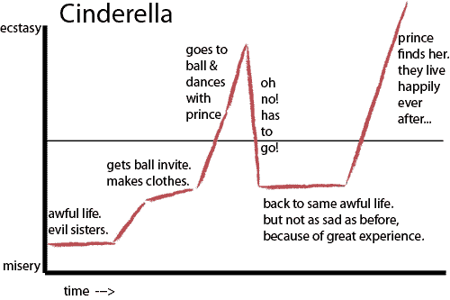

# 代币销售公关的 10 条戒律

> 原文：<https://medium.com/hackernoon/the-10-commandments-of-token-sale-pr-d29e3b92495b>

If you’re writing in early Hebrew then you’ve got worse problems than PR.

没有记者关心你的代币销售。在最坏的情况下，他们会认为你在经营一个诈骗团伙，在最坏的情况下，他们会对自己在 30 分钟内让你赚到数百万美元的角色感到不舒服。那么如何在一个对你的存在充满敌意的环境中生存呢？我有一些想法。

> 这篇文章是探索代币经济的每周电子邮件 [TokenReporter 简讯](http://tinyletter.com/tokenreporter)的一部分。[你可以在这里报名。](http://tinyletter.com/tokenreporter)

## 戒律一——你应该有一个产品。

接近任何人——媒体、用户、你的叔叔——象征性销售的第一步是拥有实际产品，或者，除此之外，拥有产品的潜力。我见过太多的象征性销售，涉及两个商业人士、一个 UpWork 设计师和你的叔叔，却连一个产品人员都没有。做一个象征性的销售**在**之后你有一个 MVP，而不是之前。在种子阶段投资时是正确的，现在也是正确的:市场奖励为成功做准备的建设者。

## 戒律二——你应该只谈论你的产品。

当你给记者发电子邮件时，你会这样说，不多不少:

> 嘿，我是乔。我是 Spankums.me 的首席执行官。我们正在创建一个应用程序，让你按需打屁股。我们能谈谈吗？

请注意，没有提到 ICO，没有提到你将如何打别人的屁股，没有任何东西会分散你明确的使命:打屁股即服务。不要浪费时间谈论你的 SpankToken 将如何革新区块链。留着在斯科普里的加密货币会议上说吧。你的第一封邮件应该绝对清晰地解释你的立场。其他都不管用。在任何情况下都不要这样做:

> 嗨！我是 Joe，我是 Spankums.me 的首席执行官。我喜欢你的故事，关于一家公司如何在拉斯维加斯销售博洛尼亚三明治赚了一百万美元。我也喜欢拉斯维加斯的腊肠三明治。太搞笑了！

我一直试图找出创始人用什么来创建这些看似个性化的电子邮件，这些邮件基本上是从一名记者的 RSS 订阅源中抓取过去的报道，但总的来说，这就像说“嘿，我看你对愚蠢的东西很感兴趣”一样透明而愚蠢。你能看看我的哑东西吗？”

## 戒律三——不要发垃圾邮件。

在你发送信息之前，先找到 10 个你想发给的人。选择大型出版物的低级记者，那些不会飞来飞去参加盛大经济论坛的人。给这些人发邮件，准确地传达上面的信息，并跟进两次。别在这个过程中搞砸了。保持细致的记录。我最喜欢的是一个创始人向 500 名非 BCCed 记者发出信息。让所有人都觉得很惊艳。

不要把你的故事扔进 500 个收件箱，找 10 个有价值的收件箱，然后再找 10 个。我知道这效率不高，也不符合你的销售漏斗，但谁在乎呢？

不要在脸书、LinkedIn、Splunk 或 Twitter 上攻击记者。你会惹恼他们的。

## 戒律四——没人关心莱昂纳多·迪卡普里奥。

如果你雇佣了一个有影响力的人来帮你营销，确保你知道自己在做什么。你不会说服一个记者写你，因为莱昂纳多·迪卡普里奥或威尔·I . am 或教皇是一个(付费的)“顾问”你实际上是在把钱扔给这些人，所以如果这是你建立社区策略的一部分，请仔细思考你为什么要这么做。你认为让一个卡戴珊姐妹在 Instagram 上发布你的代币拍卖会让记者相信你是个大人物吗？不对。想付钱给杰克·保罗，让他在你的 t 恤上小便，然后放在 YouTube 视频上吗？如果你认为 200 万青春期前的女孩是你的观众，那就去做吧，但这不是一个有卖点的故事。

## 戒律五——你应该清晰简明地解释自己。

这是戒律二的必然结果。我曾经收到一位创始人发来的脸书信息，他的整个想法读起来就像立体声指令。我希望我能找到它重印在这里，但它听起来像这样:

> 提出双赢的生存策略，以确保主动控制。归根结底，展望未来，从 X 代代币发展而来的新常态正朝着简化的加密货币云解决方案发展。用户实时生成的以太坊付费内容将有多个离岸接触点。

如果你不能向一个不迷恋科技的朋友解释清楚，那你就有更大的问题了。如果你在提高效率方面有困难，请那位朋友帮忙，或者放弃，专注于你的书呆子同伴群体。

## 戒律六——你应该建立自己的社区。

一篇在主要网站上的博客文章不会给你带来一个社区。你必须自己去建立。

一篇博文或一篇文章能给你的东西非常简单:这个世界现在有了一份由一个值得信赖的记者在一个伟大的出版物上写的关于你的存在的记录。不要低估它的价值。但是媒体是漫长的社区建设过程的最后一步。

## 戒律七——你应该用里程碑来接近媒体，而不是爆炸。

一个商业故事主要是一个人的故事。这是一个焦虑、悲伤和辉煌成功的故事。这是一个跌宕起伏的故事，每隔几个月就会重复一次的灰姑娘故事。事实上，灰姑娘是你在讲述故事时要记住的情节。这是:

当你处于上升趋势时，你需要伸出手。不要过早地告诉世界你糟糕的经历，而是要告诉你产品的发布。不要告诉全世界你的新员工谁会理解你的承包商编写的意大利面条代码，而是告诉他们你是如何通过销售 spankings 一天赚到数百万美元的。当你可以告诉全世界你的下一个伟大产品时，不要告诉全世界你的融资。

## 戒律八——你不应该雇佣一个狡猾的公关人员。

当创始人太忙、太重要、太有钱而不能自己做公关时，他们应该雇佣一个公关人员。公关人员的箭筒里有一支箭:记者名单。就是这样。在接触记者方面，他们也非常有耐心。在整个行业中，我信任的公关人员只有十个。其他人要么打电话报警，要么像兄弟会一样对待客户的隐私，掩盖被欺负的事实。不管怎样，你都在浪费钱。

大部分公关的人一个月的费用是 5000 到 8000 美元。他们为了那笔钱做什么？公司里的一个年长的合伙人给你打了 10 分钟电话，然后他们把你的信息传给一个年轻的公关人员，这个人按照我上面说的做——找到 10 个有趣的人(或者 1000 个)，给他们发了三封电子邮件。也许有人会更进一步，给《华尔街日报》发一封有针对性的电子邮件，但你会用那$10K 得到 10 次会面的机会。我不确定是否值得。

## 戒律九——也许你应该闭嘴？

也许，只是也许，还是保持沉默比较好？如果你不能解释自己，如果你不想停止发送垃圾邮件，并且你已经取得了一定的成功，拥有了一个产品，也许你最好的办法就是安静地工作，等你成功时媒体来找你？你会帮所有人一个忙。

## 戒律十——你应该记住，媒体渴望具体的东西，而不是短暂的东西。

记者似乎只刊登谎言和不实之词，但这是错误的。一名记者为自己为聪明的观众制作高质量的内容而自豪，这些内容推动了全球对话的发展。虽然大众观点目前偏离了新闻艺术，但我不想生活在一个没有新闻艺术的世界里。

因此，提供一些有价值的东西。讲述一个对世界有具体影响的故事。如果你的产品是按需定制的，那就接受它。告诉人们为什么他们需要打屁股。告诉他们你会怎么做，告诉他们按需打屁股是下一个优步。如果你没有把世界变得更好，你就是在把它变得更糟。弄清楚如何讲述积极、真实的故事，你就会成功。让你的交流充满困惑、沮丧和谎言，你会得到同样的结果。

## 收场白

我刚收到一封电子邮件，上面有第一段。为了保护不太无辜的人，名字被改了。

> 请查看以下有关 Porkcoin 与猪肉行业另一个重要合作伙伴成功合作的信息。
> 
> 如果能在你们的媒体上看到这些信息，那就太好了。

它打破了我提出的每一条规则:不清楚产品是做什么的，它用一个需求而不是一个问题来浪费我的时间，在这一段之后是一封 1000 字的电子邮件，其中有一些现存的最堕落的技术言论。他们让我打开邮件是命运的巧合，而不是任何明智策略的结果。此外，任何记者都只会把这种信息放在一个地方:

这篇文章是探索代币经济的每周电子邮件 [TokenReporter 简讯](http://tinyletter.com/tokenreporter)的一部分。[你可以在这里报名。](http://tinyletter.com/tokenreporter)