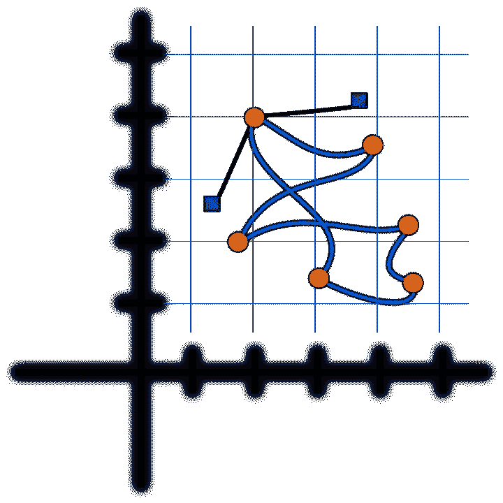

# 10x 程序员是一个神话

> 原文：<https://medium.com/hackernoon/the-10x-programmer-is-a-myth-7f9074afc038>

但是 1/10 程序员是真实存在的。

一天只有 24 小时，这对每个人都一样。这是我在穷乡僻壤学习时对自己的想法。这就是我获得竞争性就业机会的原因。这就是我今天谋生的方式。

一天只有 24 个小时，但如何利用时间取决于你自己。大多数开发人员工作努力，有时投入很长时间。作为一个以 10 倍为目标的开发人员，仅仅比别人工作更努力、更长时间是没有什么好处的。这就是 1/10 developing 的用武之地:超频没什么好处，但效率或多或少是无限的。

在我的职业生涯中，只有少数几个人和我一起工作过，我称之为 10 倍。他们的一个共同特点不是他们打字更快，而是他们不会被卡住而浪费时间。即使在处理更困难的问题时，能够有效地诊断和处理问题也是 1/10 思维的标志。

所以下次当你听到有人谈论 10 倍编程时，试着把这个短语重新想成一个分数。一旦你得到了正确的代数，它开始变得更有意义，成为 1/10 倍的开发者成为可能。

> [黑客中午](http://bit.ly/Hackernoon)是黑客如何开始他们的下午。我们是 [@AMI](http://bit.ly/atAMIatAMI) 家庭的一员。我们现在[接受投稿](http://bit.ly/hackernoonsubmission)，并乐意[讨论广告&赞助](mailto:partners@amipublications.com)机会。
> 
> 如果你喜欢这个故事，我们推荐你阅读我们的[最新科技故事](http://bit.ly/hackernoonlatestt)和[趋势科技故事](https://hackernoon.com/trending)。直到下一次，不要把世界的现实想当然！

