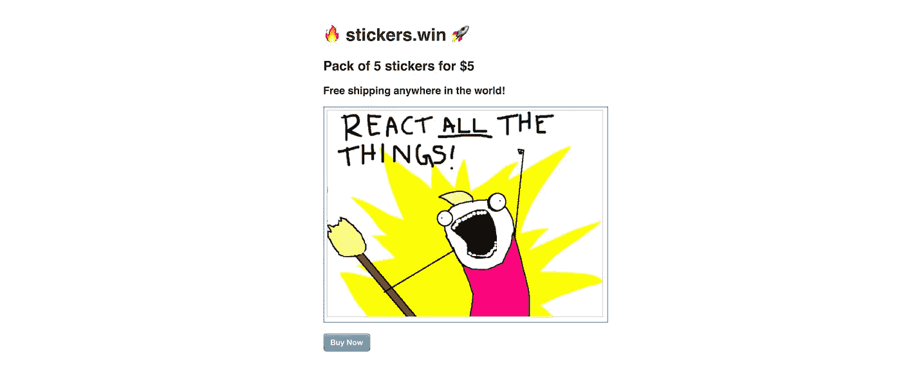

# 使用 Rails、Stripe Checkout 和 Heroku 创建和启动在线商店的 11 分钟指南

> 原文：<https://medium.com/hackernoon/the-11-minute-guide-to-building-and-launching-an-online-store-with-rails-stripe-checkout-and-206d6faec6d8>

Let me show you how I built [http://stickers.win](http://stickers.win)

在这个 11 分钟的视频教程中，学习建立和启动[一个真正的在线商店](http://stickers.win/)。我们将建立一个简单的商店，通过 Stripe [checkout.js](https://hackernoon.com/tagged/checkout-js) 接受付款，并将其部署到 [Heroku](https://hackernoon.com/tagged/heroku) 。

*原载于*[*learnetto.com*](https://learnetto.com/tutorials/the-11-minute-guide-to-building-and-launching-an-online-store-with-rails-stripe-checkout-and-heroku)*。*