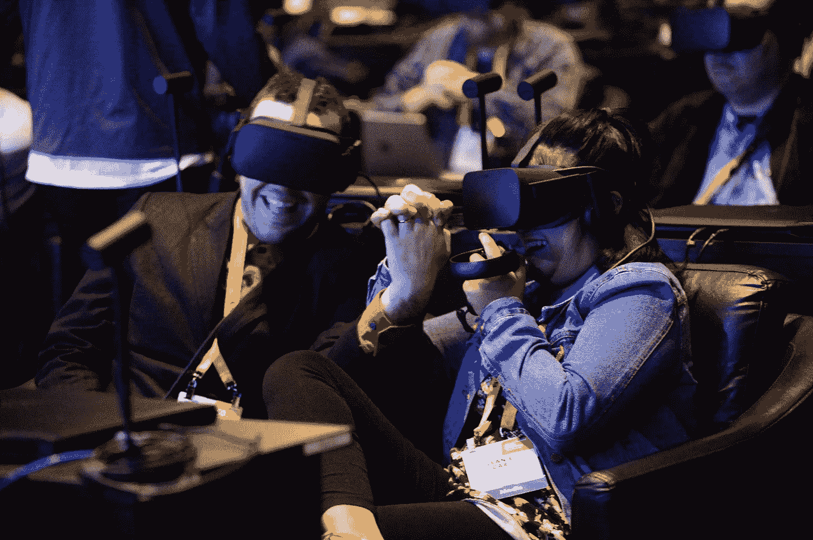

# 值得关注的 2017 CES 新闻

> 原文：<https://medium.com/hackernoon/the-2017-ces-news-worth-caring-about-9c513d07c652>

[CES](https://hackernoon.com/tagged/ces) 一句话就是，铺天盖地。很多展示的东西并不新鲜，也不有趣。以下是我发现值得注意的地方…

## **英特尔的虚拟现实展示**

[英特尔](https://medium.com/u/fb610dd2569b?source=post_page-----9c513d07c652--------------------------------)展示了一系列[新的虚拟现实体验](https://newsroom.intel.com/editorials/virtual-reality-new-worlds-opportunity-travel-work-play/)，这些体验来自他们去年对 Replay Technologies 的收购。值得注意的是，这不是关于改进的虚拟现实体验创新，而是关于现成的计算能力。这真的令人惊讶。在他们的一次演示中，视觉体验的每一帧是 3GB。我重复一遍，每帧 3gb，*。*因此，即使他们每秒只传送 24 帧(这不太可能，因为他们吹嘘“帧速率非常高”)，每 15 秒钟的内容也会消耗超过 1TB 的数据。从另一个角度分析，英特尔的 360 度记录方法总共使用了 38 个高清 5k 摄像机来捕捉周围的环境。这次演示展示了视频捕捉和处理能力，其强大程度令我这个“80 年代的孩子”难以置信。像英特尔这样的大规模处理器玩家将使虚拟未来成为可能。

CES Attendees at Intel’s VR Presentation / image source: Intel 2017

## 联想智能助手搭配亚马逊 Alexa

有趣的并不是真正的联想设备。Lenovo+Alexa 的推出只是语音交互领域的主要参与者将其代理借给外部设备品牌的几十个例子之一。微软、谷歌和亚马逊都宣布与第三方品牌合作，使用他们的 Cortana、谷歌助手和 Alexa 服务。LG 的联网冰箱现在支持 Alexa。日产和宝马宣布合作整合 Cortana，现代与谷歌助手达成协议。Nvidia 正在将 Google Assistant 集成到他们新的 Shield over-the-top 流媒体设备中。美泰甚至宣布了一款由 Cortana 驱动的儿童友好型设备。这只是一系列迹象表明，我们正在从打字、点击和滑动转向普遍的语音交互。这在我的家庭里已经根深蒂固了…

 [## 我刚刚购买了我的第三个亚马逊回声

### 我们家庭(和我的机构)的未来

hackernoon.com](https://hackernoon.com/i-just-purchased-my-third-amazon-echo-a79c256fc535) 

## **Fossil 现在将提供 300 多款智能手表**

正如承诺的那样，苹果为智能手表类别提供了成为耐用消费品类别所需的动力。反过来，Fossil Group 现在表示，他们将在其品牌组合中把联网手表产品增加一倍。这是第一次在 CES 上，智能手表没有被视为一种新事物，仍然试图找到它的主要用例。智能手表将会一直存在，你的杰里叔叔将不再问你你手腕上有什么愚蠢的玩具——他可能会问，但他只是出于习惯，而不是因为他以前没有见过背光手表。

## 任何一个自动驾驶汽车公告

我们所有的未来都有一辆无人驾驶汽车。2017 年国际消费电子展明确表示，这种[技术](https://hackernoon.com/tagged/technology)在未来几年不会只为最富裕的休闲阶层服务——所有制造商都在讨论让汽车自动驾驶的功能，因此拥有成本将大幅下降。当我写这篇文章时，我实际上正在市场上寻找一辆汽车，我计划签署一份不超过两年的租约，因为我相信在 24 个月内我将购买一辆新的价格合理的汽车，能够完全自动驾驶(在允许它的州)。而且很有可能不会是[特斯拉汽车](https://medium.com/u/24413768aadb?source=post_page-----9c513d07c652--------------------------------)车型(可以说特斯拉已经推出了自动驾驶汽车)。

## **HDMI 2.1**

由索尼、谷歌和网飞等电子公司组成的 HDMI 论坛已经宣布计划在今年夏天发布 HDMI 2.1。这些最新的 HDMI 规格将支持高达 10K 的分辨率。所以现在图像清晰度的限速步骤将不再是电线。事实上，通过 HDMI 2.1 发送的分辨率将远远超过人眼在任何适合您家庭的合理尺寸屏幕上的可感知分辨率。那么，这有什么关系呢？改进后的 HDMI 标准也可以以每秒 48 千兆位的速度传输数据(相比之下，今天的 HDMI 2.0 为 18Gbps，最广泛使用的 HDMI 1.4 为 10Gbps)。这一数据量将允许在快速动作场景和游戏中的帧速率和“流畅度”，将与现实世界的感觉相媲美。不要担心购买者会后悔，所有的新连接都是向后兼容的(即旧设备仍将工作)。

## **高通骁龙 835**

高通和高通风险投资公司的人明白这一点。在消费者的智能手机愿望清单上，电池续航时间一直排在首位。消费者对电池续航时间的渴望超过了硬件制造商每年通常吹嘘的功能(例如防水性、屏幕耐用性、百万像素等)。).高通的新骁龙芯片减少了 25%的处理相关的电池消耗。就像在政治选举中，我们需要被提醒，人们想要工作，而在智能手机选举中，他们想要电池寿命。句号。在未来的消费电子展上，有人会宣布一项革命性的电池技术，这将使发明者赚得盆满钵满，但在此之前，至少高通明白人们真正想要的增量收益。

## **不提 IOT 就不是 CES 榜单了**

但今年物联网(IOT)以不同的方式展示。IOT 本身并不是新闻——2017 年 IOT *只是*并将继续成为大多数实体产品在 CES 上亮相的一个可预测的部分。宣布您的[在此输入旧产品]以某种方式连接到您的智能手机或互联网已不再有趣，这只是意料之中的事情。如果你在 CES 上展示一个新的实体产品，你的设备很可能是万物互联的一个节点。本周，仅 LG 一家就推出了联网烤箱、冰箱、割草机、机场助理机器人、家庭虚拟助理和空调。CES 2017 还展示了联网的[轮椅](http://whill.us/)、[垃圾桶](http://www.genican.com/)和[粮仓](http://www.amber.ag/)。但是，这些都不是大新闻，它们只是新的，当然*和*它们是有联系的。

## 最后…

如果你们中的任何人正在担心你能为我在三月份的生日准备什么，CES 2017 展示了一架[水下无人机](http://www.tomsguide.com/us/power-vision-powerray-drone-specs,news-24212.html)和[洗衣折叠机器人](https://laundroid.sevendreamers.com/en/)。这些就可以了。提前感谢！

@grantowens 在[临界质量](https://medium.com/u/62c4f44bd88a?source=post_page-----9c513d07c652--------------------------------)的首席战略官

> [黑客中午](http://bit.ly/Hackernoon)是黑客如何开始他们的下午。我们是 [@AMI](http://bit.ly/atAMIatAMI) 家庭的一员。我们现在[接受投稿](http://bit.ly/hackernoonsubmission)，并乐意[讨论广告&赞助](mailto:partners@amipublications.com)机会。
> 
> 如果你喜欢这个故事，我们推荐你阅读我们的[最新科技故事](http://bit.ly/hackernoonlatestt)和[趋势科技故事](https://hackernoon.com/trending)。直到下一次，不要把世界的现实想当然！

