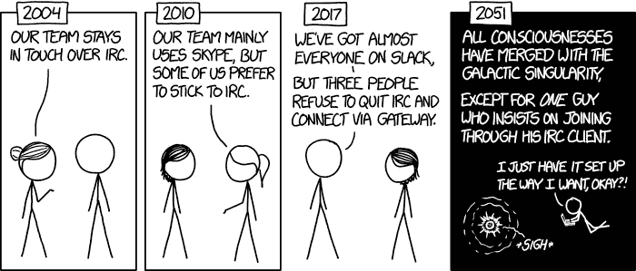
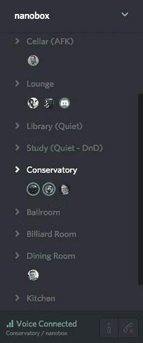

# 让“远程”真正发挥作用的 3 个最佳工具

> 原文：<https://medium.com/hackernoon/the-3-best-tools-for-making-remote-actually-work-2ee4388dd15b>

Image from [placestoseeinyourlifetime](http://www.placestoseeinyourlifetime.com/29-remote-buildings-in-the-fabulous-surroundings-13503/)

在 [Nanobox](https://nanobox.io/) ，我们已经完全远离了将近一年，这很棒。

如果你想远程工作，或者已经这样做了，但觉得效率不高，让我来强调一下我们使用的三种工具，它们帮助我们建立了一种真正伟大的远程文化。

虽然这些不是我们使用的唯一工具，但它们对我们远程工作的成功与否有着最大的影响。

# [懈怠](https://slack.com/)

Image by [xkcd](https://xkcd.com/1782/)

Slack 已经变得无处不在，我确信它不需要介绍。但是对于那些没有听说过它(或者拒绝使用它)的人，我将快速概述一下为什么它非常适合远程工作。

## 频道

Slack 允许你创建多个可以单独讨论话题的渠道，并且有一个很好的方法来创建个人或团体的直接信息。然而，我确实希望的一件事是，你可以邀请某人加入一个现有的对话，而不用创建一个全新的对话。

## 聊天记录

大概我最喜欢 Slack 的功能就是聊天记录了。您不必登录就可以加入对话，您可以随时加入。任何来自 IRC 的人都会立刻知道我在说什么。

## 客户端和集成

Slack 为各种设备设计了非常好的应用程序，帮助你在不在电脑前的时候保持联系。

它还集成了我们使用的许多其他服务，如 Groove、Pingdom，甚至允许您使用内置机器人(或[构建自己的](/@skdomino/a-simple-slack-bot-that-notifies-when-users-join-c5a5fda34590#.yxwo8y8mz))来获得额外的功能。

## 杂项

Slack 也有一堆非常好的小东西:

*   `back-tic highlighting`
*   代码/文本片段
*   非常支持嵌入式内容(图像、视频等)。
*   表情符号(:party_parrot:)

## 一句警告

> …所有的部分和人在一起，这样你就能真正把事情做好。

Slacks 自己网站上的声明有些值得商榷。所有的片段和人在一起…事情会变得有点吵。尤其是如果你的团队有很多渠道，或者你是多个团队的成员。

确保更新你的**通知设置**，以确保你不会被过多的对话分散注意力。

# [不和](https://discordapp.com/)

我想在某个时候，我们已经尝试了十几个不同的语音客户端，每个客户端都有自己的问题。配置和管理服务器，断开连接，糟糕的语音质量，这样的例子不胜枚举。

虽然 discord 标榜自己是为*游戏玩家*提供的一体化语音和文本聊天客户端，但在我看来，它是目前为*提供的最好的语音客户端。句号。*

**

*您只需通过客户端创建一个服务器并邀请人们加入，而不是配置和管理您自己的服务器。*

*与 Slack 类似，您可以为特定需求创建和配置“房间”。而且最重要的是音质*出众*。*

*如果你强迫我找出一件关于不和谐的不好的事情，那就是当你说话的时候没有托盘指示器。所以你可能不知道你有一个热麦克风，直到你打喷嚏，每个人都对你大喊大叫。*

# *[Google Hangouts](https://hangouts.google.com/)*

*我们最初尝试在任何事情上都使用 Google Hangouts。视频和语音质量就是不太好。不管出于什么原因，他们决定摆脱聊天…*

*然而，屏幕共享是伟大的！每当我们需要配对程序，或者进行代码审查时，我们就跳到那里，共享屏幕。有时，我们甚至可以同时让多达八个人共享一个屏幕，为各种不同的会议共享三个不同的屏幕。*

## *只要记住…*

*确保在使用 Google Hangouts 时静音麦克风并关闭摄像头(后者不像*那么重要)。如果你一直开着麦克风，使用不和谐的声音，你会得到一些非常糟糕的回音。**

# *去…实现你的梦想*

*如果你真的在考虑远程工作，希望我给了你一个好的开始。我已经做了快一年了，我很喜欢。*

*另一方面，如果你使用了其他一些对你或你的团队真正有帮助的工具，我很乐意听听他们的意见！*

******

> *[黑客中午](http://bit.ly/Hackernoon)是黑客如何开始他们的下午。我们是 AMI 家庭的一员。我们现在[接受投稿](http://bit.ly/hackernoonsubmission)并乐意[讨论广告&赞助](mailto:partners@amipublications.com)机会。*
> 
> *如果你喜欢这个故事，我们推荐你阅读我们的[最新科技故事](http://bit.ly/hackernoonlatestt)和[趋势科技故事](https://hackernoon.com/trending)。直到下一次，不要把世界的现实想当然！*

**