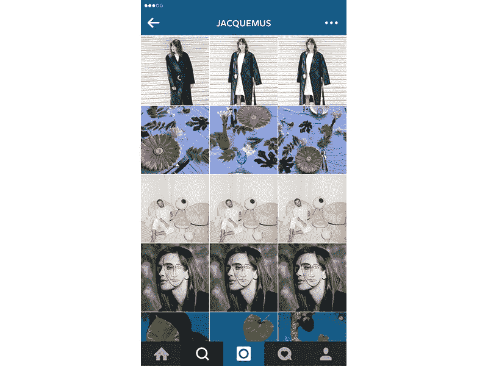

# 三图 Instagram 趋势

> 原文：<https://medium.com/hackernoon/the-3-picture-instagram-trend-9e6565b5a621>

对于那些证明“一图胜千言”还不够的人来说

在 [Instagram](https://hackernoon.com/tagged/instagram) 上，全是关于网格的。拥有超过 3 亿用户的 Instagram 现在是品牌最强大的[社交媒体](https://hackernoon.com/tagged/social-media)渠道之一，尤其是时尚品牌。毫无疑问，在每天发布的数百万张图片和视频中，品牌正在寻找独特的方式来吸引我们的注意力。当我们其他人都在绞尽脑汁使用 VSCOCAM 来获得完美的反馈时，时尚品牌已经加快了游戏的步伐。以法国未来设计师 Jacquemus、当前最受欢迎的包包 Mansur Gavriel 和耐克实验室为例，他们一直在使用 Instagram，只是比其他人更有创意一点。

25 岁的法国设计师 jacque mus[以设计 Comme Des Garç ons 的美学而闻名，他的全部工作就是讲述故事。作为一个经常玩统一和重复想法的设计师，难怪他的 Instagram 账户反映了同样的情况。](http://jacquemus.com/)

有时候，Jacquemus 甚至把同一张图片贴三次，甚至没有一点差别。在我们的 feed 中看到我们朋友的#自拍三次可能肯定会导致取消关注，但 [**Jacquemus 的 Instagram**](https://instagram.com/jacquemus/) 作为一个整体是有效的。我们可以一窥他的灵感来源，他的生活方式，当然还有服装本身。该账户不仅展示了该品牌的古怪服装，还从自拍到高级时装，甚至表情符号和信使对话。总体感觉更像一个画廊，Jacquemus 希望讲述的故事，通过为每个主题使用三张图片，结果是品牌和耳目一新。

然后是曼苏尔·加夫列尔 ，这是当下的 it 包。2013 年秋季，当所有时尚编辑和名人都被发现带着该品牌标志性的水桶包时，该品牌获得了巨大成功。 [**曼苏尔·加夫列尔的 Instagram**](https://instagram.com/mansurgavriel) feed 更多的是发展为一种讲故事的模式。通过展示不同的角度和视角，我们可以看到包袋更多地扮演了一个角色，而不是一个产品。这种对包袋的描绘风格赋予了每一款包袋特定的身份和背景，让顾客产生共鸣。Mansur Gavriel 的伟大之处在于，它不仅使用 Instagram 让我们所有人都充满了包、包、更多的包。在所有的饲料中不断使用植物和水果。柔和的颜色和纹理构成了一个美丽悦目的饲料。

然后还有 [**耐克实验室**](http://www.nike.com/us/en_us/c/nikelab) 。创新 x 创新者国家在其生物。运动鞋显示在 3 个角度，顶部，侧面和，为每只鞋增加了 3 张图片。使用醒目的背景色赋予每一行很大的重要性。通过不穿这种创新的运动鞋，它让我们感觉每只鞋都是一种特殊的创造。 [**账号**](https://instagram.com/nikelab) 还包括模特照片，看起来更像是一种时尚传播，而不是广告。耐克实验室吸引了一位顾客，他认为鞋子的所有细节都很重要。甚至鞋底也算。这不只是任何其他鞋，我们不需要看到任何勒布朗运动他们想要他们。这是给耐克的死忠粉丝的。

那么你需要开始在你的账户上发布 3 个图片故事吗？不一定。有很多有创意的方法来提升你的 Instagram，无论是使用过滤器，还是坚持一种风格或主题。3 张图片适用于该品牌，哪些图片适用于您的品牌？请在下面的评论中分享你的想法。

作者 [@marcelaben](https://twitter.com/marcelaben)

*原载于【polsieinc.tumblr.com】**。***

******

> *[黑客中午](http://bit.ly/Hackernoon)是黑客如何开始他们的下午。我们是 [@AMI](http://bit.ly/atAMIatAMI) 家庭的一员。我们现在[接受投稿](http://bit.ly/hackernoonsubmission)，并乐意[讨论广告&赞助](mailto:partners@amipublications.com)机会。*
> 
> *如果你喜欢这个故事，我们推荐你阅读我们的[最新科技故事](http://bit.ly/hackernoonlatestt)和[趋势科技故事](https://hackernoon.com/trending)。直到下一次，不要把世界的现实想当然！*

**