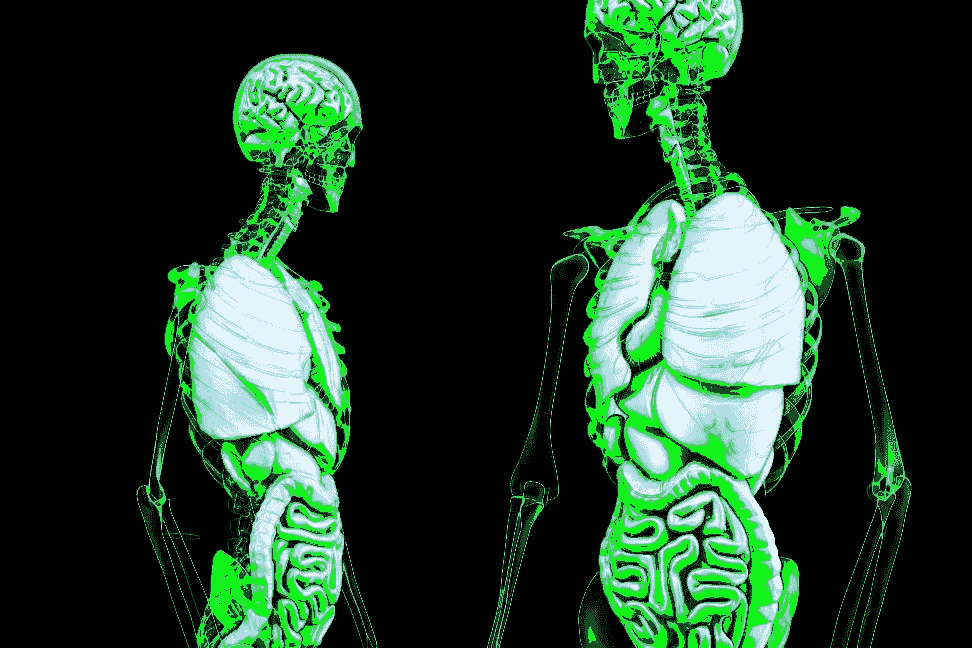

# 医学信息学的 4 个核心研究领域

> 原文：<https://medium.com/hackernoon/the-4-core-research-areas-of-medical-informatics-7961088a607d>

> 自 1997 年以来，德州大学生物医学信息学院一直在培养健康信息领域的领导者。[原载](https://www.quora.com/What-are-the-research-areas-in-medical-informatics/answer/University-of-Texas-School-of-Biomedical-Informatics)于 [Quora](http://quora.com?ref=hackernoon) 。

随着技术的发展和患者数据的增加，医学信息学已经成为一个广阔的研究领域。随着医学信息学的发展，研究人员已经确定了将会改善和影响医疗保健提供现状的核心领域。这些核心研究领域列举如下:

## **自然语言处理**

自然语言处理(NLP)技术旨在从自由书写的文本中获取有意义且可操作的数据。NLP 技术不断完善，并提供了无数的好处。通过有效的 NLP，医疗保健专业人员所做的不仅仅是节省时间。他们正在更有效地沟通，识别关键数据，并推进医疗保健的边界。

## **岁差医学**

医疗保健 IT 领域和整个世界充满了热门趋势和流行词汇。一个重要且流行的趋势是“精确医疗”的实践，它正不断获得更多的关注。医疗保健研究和整个行业的进步已经导致更多的供应商和医院利用精确药物治疗。

## **可穿戴技术**

2016 年，在智能手表方面，我们不再局限于少数几个选项。大多数第一代设计已经被有许多改进的第二代和第三代版本所取代。随着可穿戴设备市场的增长，我们很可能会发现更多的可穿戴智能设备贴在我们的身上。

## **增强现实**

虚拟和增强现实(分别是 VR 和 AR)已经成为一个有趣的领域有一段时间了。最初，它只是一个新奇的东西，但是，这项技术正在突飞猛进地发展。自然，它的实际应用也包括从改善医生培训到疼痛管理的一切。

随着这项技术的进一步完善和更广泛的采用，真正革命性的护理有着巨大的潜力。

除了这些领域，我们还在健康移动应用、人工智能、医疗保健大数据分析和大型 EHR 技术领域开展研究工作。

> 自 1997 年以来，德州大学生物医学信息学院一直在培养健康信息领域的领导者。[原载](https://www.quora.com/What-are-the-research-areas-in-medical-informatics/answer/University-of-Texas-School-of-Biomedical-Informatics)于 [Quora](http://quora.com?ref=hackernoon) 。
> 
> 更多来自 Quora 的趋势科技答案，请访问[HackerNoon.com/Quora](https://hackernoon.com/quora/home)。