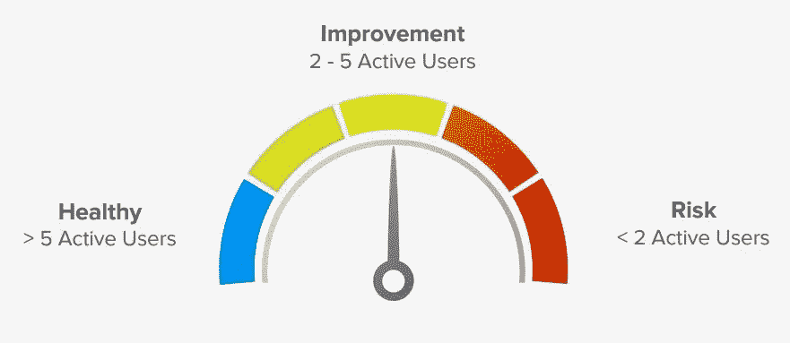
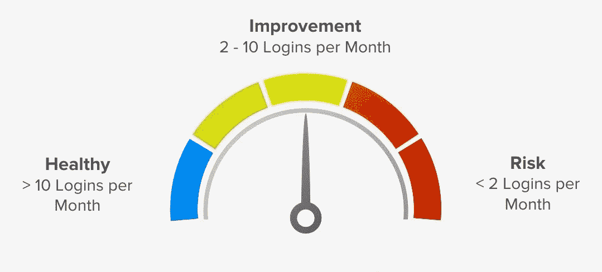
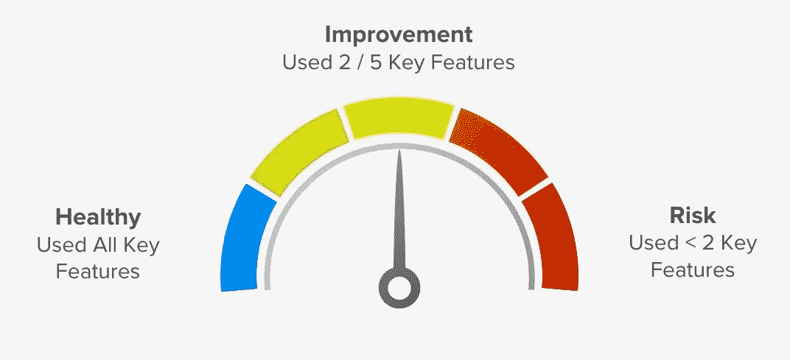
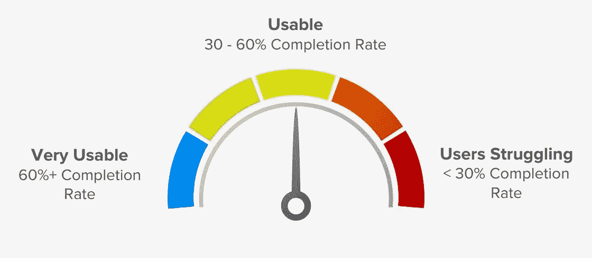

# 产品成功的 5 个关键衡量标准

> 原文：<https://medium.com/hackernoon/the-5-key-measurements-of-product-success-e53594aabb47>

企业家应该问自己的一个最重要的问题是，客户是否喜欢他们的产品。然而，随着创始人开始扩大业务规模，他们往往会陷入专注于单一数字的陷阱:收入。

> “收入作为产品成功指标的问题是，当你失去它的时候，可能已经太晚了，”—托德·奥尔森，高级分析公司 [Pendo](https://www.pendo.io/) 的首席执行官。

即使是那些不看收入的人也可能成为衡量陷阱的受害者。还有一个问题是数据太少，比如公司只测量客户的 NPS。但是太多的数据也可能是一个问题:有大量的度量和基准可供选择，很难区分什么是重要的。

幸运的是托德来帮忙了。他创立了 Pendo 来解决衡量产品体验的挑战。托德最近在由 FirstMark 为大数据和人工智能爱好者组织的社区 [Data Driven NYC](http://firstmarkcap.com/driven/data-driven/) 上概述了产品成功的五个简单衡量标准。

## **使用范围**

最直观的衡量产品成功的方法，这只是衡量有多少人在使用你的产品。你可以通过追踪访客和账户活动轻松获得这些数字。

你应该为你的业务选择最有意义的广度指标——无论是总用户数、总活跃用户数还是总活跃账户数。考虑您的度量目标，并为您的团队设定可实现的目标。

对于 Pendo 而言，成功意味着在过去 30 天内某个客户拥有 5 个以上的活跃用户:

*How Pendo measures Breadth of Use.*

## **使用频率**

如果用户不登录你的产品，就很难留住他们。“一天结束时，如果一个月没有一个顾客来看我的产品，那就糟了，”托德警告说。

要了解频率，请测量登录频率或会话长度。

你希望用户回访的频率取决于你产品的目的，但通常越频繁越好。Pendo 的目标是每个用户在 30 天内登录 10 次以上:

*Frequency measurements per user, via Pendo.*

如果你的登录频率很低，没有一个通用的解决方案。托德说，关键是理解用户群。

检查你的不同类型的用户，以及谁应该使用你的产品，使用的频率和原因。例如，新客户可能会有与现有客户截然不同的行为。将所有用户细分有助于您更明智地了解您是否满足了他们的各种需求。

## **使用深度**

了解你的产品有多少功能被使用是衡量成功的关键。确定使用深度的一个最简单的方法是测量您经常使用的产品特性的百分比。

首先确定你的核心受众使用的五大功能。这些是“价值驱动因素”,让人们回到你的产品。托德说，理想情况下，你希望客户使用所有这些关键功能。

*Pendo strives to have each customer use all five of the key features they’ve identified as core retention factors.*

了解你产品的关键特征也能帮助你*保持*你的产品成功。例如，如果你的产品使用免费增值模式，但你放弃了最受欢迎的功能，这可能会导致用户降级到免费版本。

## **效率**

可用性是留住用户的关键，任何产品的最终目标都是能够简单、正确、快速地使用它。

> 效率可能是衡量成功的最重要的标准。

要衡量效率，只需在您的产品中寻找一个或多个关键工作流——从注册、入职到新功能激活——并衡量用户在离开之前在该工作流中走了多远。为每个工作流程建立有意义的完成目标。

*Pendo set a goal of >60% completion for a workflow used by clients in the ad tech industry.*

用户因卡住或无法理解产品而产生的挫折感是一种失败。如果你的产品完成率很低，问问自己:传递关键价值的最快方式是什么，我们如何才能做得更好？

## **满意度**

你的客户对你产品的评价和他们的用户行为一样重要。

> 在一天结束时，如果客户不愿意推荐你，那就不是产品世界的成功。

通过利用客户调查，您可以将满意度等定性反应转化为可操作的定量衡量。

净推介值(NPS)被广泛用作衡量客户满意度的有效工具。托德建议将你的 NPS 与像 Temkin 这样的公司提供的行业基准进行比较。

以上哪个指标最重要取决于你的产品。托德建议说:“这并不是说这五个因素加在一起就能为你的产品服务，但是这五个因素中的一个或多个可能是你的产品成功与否的主要指标。”

要听托德对每家检查产品指标的公司的最后总结，请观看他的演讲: