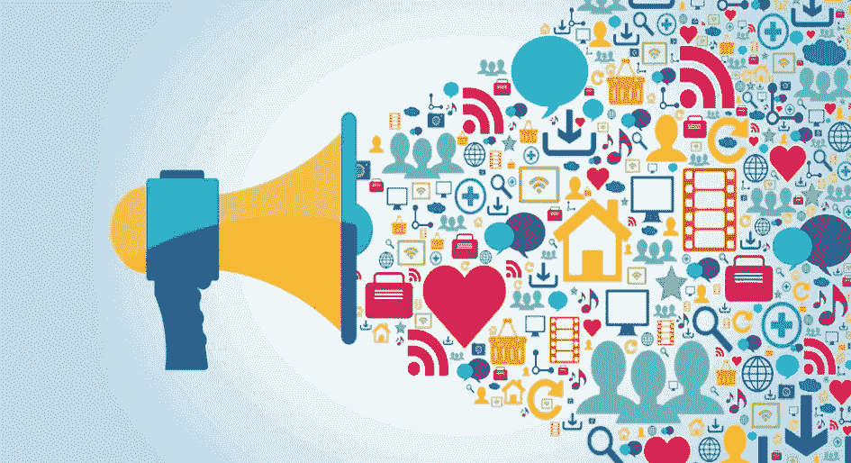

# 社交媒体上最受关注的 5 家公司

> 原文：<https://medium.com/hackernoon/the-5-most-followed-companies-on-social-media-2be2ca4185d4>

## 是什么让这些公司在数字平台上如此成功？

一个品牌在社交媒体上的成功往往与其产品的吸引力、创建和发展品牌的人员以及客户如何参与品牌有关。

是这样吗？或许……让我们看看社交媒体上最受关注的公司是什么——这不一定意味着“成功”。

这份名单不包括新闻机构、纯媒体公司和名人。

## 推特

*   Youtube 有 70 249 950 名关注者
*   推特 62057981
*   Instagram 39,482,334
*   谷歌 19159848
*   脸书

## INSTAGRAM

*   Instagram 有 227，294，061 名粉丝
*   耐克 74941080
*   维多利亚的秘密 57385917
*   香奈儿 26 645 010
*   H&M 23 362 560

## 脸谱网

*   脸书 203993172 个赞
*   可口可乐
*   Youtube 83,280,230
*   麦当劳 74225638
*   迪士尼 51042416

## 商务化人际关系网

*   谷歌 5，358，817 名粉丝
*   微软 4154836
*   苹果 3769735
*   亚马逊 2728737
*   2，526，345 马力

## 油管（国外视频网站）

*   8，898，922 名用户
*   红牛 6482290
*   游戏机 5931435
*   谷歌 5528161
*   苹果 5371720

有人有想法吗？