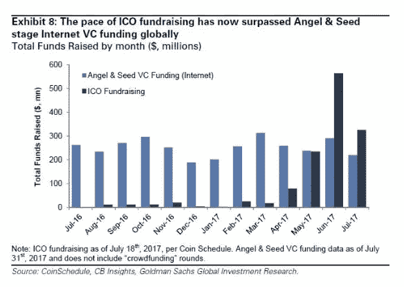
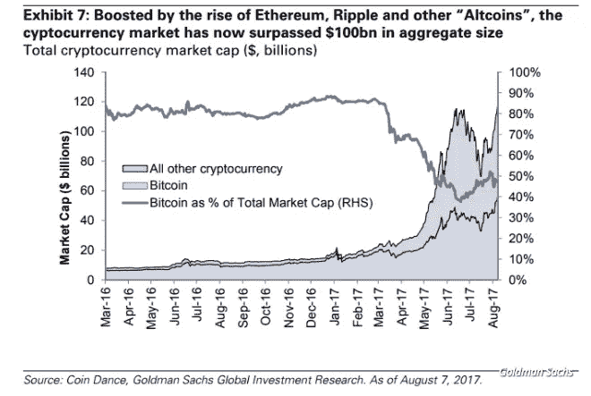

# 上周最具史诗性的 6 大加密货币事件，以及即将到来的 4 大事件

> 原文：<https://medium.com/hackernoon/the-6-most-epic-cryptocurrency-events-last-week-and-the-4-to-come-cd12dec9cece>

在本文发表时，比特币的交易价格为 4300 美元，在过去一周上涨了 30%([在一定程度上受到了日本的强劲需求的提振](https://goo.gl/ZBJTQH)受朝鲜事件的影响)。以太坊涨了 15%。根据 [CoinMarketCap](https://goo.gl/xubY1t) 的追踪，所有加密货币的总市值达到了 1400 亿美元的历史新高。所有伟大的东西，但噪音从长远来看。

对于加密货币的长期成功来说，显然重要的是正在构建的支持扩展的基础设施。重要的是持续创新。重要的是明确的监管框架。重要的是机构收养。以下是我列出的上周发生的 6 件最伟大的事情。

1.  **高盛报告称，与传统风投相比，ico 在 6 月和 7 月为早期公司筹集了更多资金。**高盛在 8 月 8 日的“投资组合跟踪工具包”报告中用了两页篇幅专门讨论加密货币。最值得注意的是这张图表:

这就是颠覆。高盛正在撰写加密研究的事实本身就具有开创性。事实证明，他们做得很好(见下图)

但是，重要的是要注意，即使是高盛[也没有相对于比特币价格的水晶球](https://goo.gl/2v73NK)。

2.**比特币基地成为 crypto 的第一家独角兽公司，以 16 亿美元的估值从蓝筹股风投那里融资 1 亿美元**。根据首席执行官 [Brian Armstrong 的博客文章](https://goo.gl/K4ny71)，这笔钱将用于发展团队，为 GDAX(前 10 大机构加密货币交易所)开设纽约办事处，并投资 Toshi，这是在 [Brian 在 5 月 Consensus 的闭幕主题演讲](https://goo.gl/GqygqF)中介绍的“…以太坊网络浏览器”。这轮融资由硅谷的标志性风投 IVP 牵头，他此前没有进行过任何加密投资。

3.**富达使比特币基地客户能够在 Fidelity.com 查看他们持有的加密货币** —富达是美国第四大资产管理公司，管理着超过 2 万亿美元的资产。富达的创新部门——富达实验室表示,“..该实验旨在了解这些加密资产是什么样的，以及我们的客户可能希望如何与它们进行交互。”

4.CoinList 在其平台上发布了首款 ICO Filecoin。 Naval Ravikant 很有远见(这个词我不常用。)我相信 AngelList 是风险投资史上最具颠覆性的公司。AngelList 的平台 [CoinList](https://goo.gl/6Xxbo6) (与[协议实验室](https://protocol.ai/)合作)发布 ico，最终可能会像 AngelList 一样具有破坏性。CoinList 的使命是成为一个平台，使投资者能够投资符合证券法的 ico。Filecoin ICO 通过采用 SAFT(未来代币的简单协议)，类似于早期融资中常用的保险箱，并通过只允许[合格投资者](https://goo.gl/ejMX64)在美国投资(类似于 AngelList)，为合规 ICO 开辟了道路。

5.**投资者/评论员为美国消费者新闻与商业频道设定 25000 美元的目标价。**主流商业媒体对加密货币产生了前所未有的兴趣。[比特币](https://hackernoon.com/tagged/bitcoin)是《华尔街日报》今早头版的第三大新闻。周五，美国消费者新闻与商业频道有五个关于比特币/ [区块链](https://hackernoon.com/tagged/blockchain)的故事。上周一，迅速成为华尔街比特币主要媒体代言人的布莱恩·凯利在美国消费者新闻与商业频道快钱板块(Fast Money segment)对比特币给出了 25，000 美元的目标价格(基于获得黄金市值的 5%)。

 [## 比特币是泡沫吗？这个交易者说不，现在是买入的时候了

### 随着加密货币创下新高，布莱恩·凯利谈论如何投资比特币。“快钱”交易者权衡…

www.cnbc.com](https://www.cnbc.com/video/2017/08/07/is-bitcoin-a-bubble-this-trader-says-no-and-that-now-is-the-time-to-buy.html) 

毫无疑问，在不可避免的低迷时期，媒体的大肆宣传将会变成轻蔑。当然，媒体的大肆宣传是“泡沫”的迹象。但是我相信媒体对所有加密事物的兴趣迅速上升是另一个即将被主流采用的迹象。

6. **Vitalik Buterin 宣布推出等离子产品，以推动链间可操作性。还有其他项目也致力于链间互操作性(例如 Cosmos 和 Polkadot)，但 Buterin 所做的任何事情在加密领域都非常重要。链间互操作性是减少区块链之间移动资产的摩擦所必需的基础设施的主要部分。**

# 下面是我正在关注的四个悬而未决的事件，一个迫在眉睫，另一个是更长期的

1.  待定的 Kin ICO 将极大地增加以太币/加密货币的用户基础。Kin token 将用于购买 Kik messenger 平台上的服务，该平台每月有 1500 万活跃用户。Kik 将使用一些代币回购[投资者迄今投入 Kik 的 1.2 亿美元股权](https://goo.gl/TpNjPH)。Kik 还将向每个用户赠送一定数量的硬币，使其成为迄今为止最大的加密货币用户安装群。出售日期尚未确定。
2.  **公认的加密货币估值方法。这是一个显而易见的观点，但是关于这个话题的文章却少得惊人。我见过的最好的作品是方舟投资管理公司的。布莱恩·凯利根据黄金市值的 5%为比特币设定了 25，000 美元的价格目标，这至少是思考如何为比特币定价的一个框架，但从严谨性来看，这一框架相当薄弱。像“完全稀释的硬币”这样简单的东西甚至没有被很好地理解、欣赏或报道。Cap 报告称，Gnosis 的“市值”为 2.08 亿美元。但这只是计算了 5%的浮动代币。其他 95%都在那里，只是被公司持有。虽然 CoinMarketCap 允许用户通过总供应量对市值进行排序，而不仅仅是流通中的市值，但流通是默认模式，我的猜测是，总供应量功能并不为每个人所知/使用。因此，在很大程度上，如果不包括完全稀释的数据，CoinMarketCap 和其他公司在市值方面进行比较。**
3.  **各国央行开始使用比特币或其他加密货币作为外汇储备。中央银行开始发行数字货币只是时间问题，很可能与自己的货币挂钩。我们还可能会看到央行开始持有比特币或其他加密货币作为外汇储备，就像他们持有美元或黄金一样。中国持有约 3 万亿美元的外汇储备。日本持有约 1.2 万亿美元。第一个持有比特币的可能是像越南这样的较小国家，但它即将到来。**
4.  **全面的美国监管框架**。虽然[最近的 SEC 评论](https://goo.gl/hPe67h)和 [SEC 对 DAO 令牌的调查报告](https://goo.gl/4Hr3m5)提供了少量的监管澄清，但美国针对 ico 的监管仍然非常不确定。就像优步和 AirBnB 刚推出时一样，大多数 ico 都忽略了这种不确定性。一些 ico 正在通过[阻止美国投资者的参与](https://goo.gl/7ycmQk)来解决不确定性。正如我在上面提到的，Filecoin ICO 在很多方面都是值得注意的，包括试图解决安全法律问题的解决方案。但是考虑到不确定性，一些人认为这些解决方案不足以通过监管审查。底线是这是复杂的，美国证券交易委员会和其他政府监督机构将继续谨慎行事(如冰川)，这将继续推动美国以外的许多活动..

**如果你喜欢这个帖子，请**👏。**在下面，这样其他人就可以在媒体上看到它。**