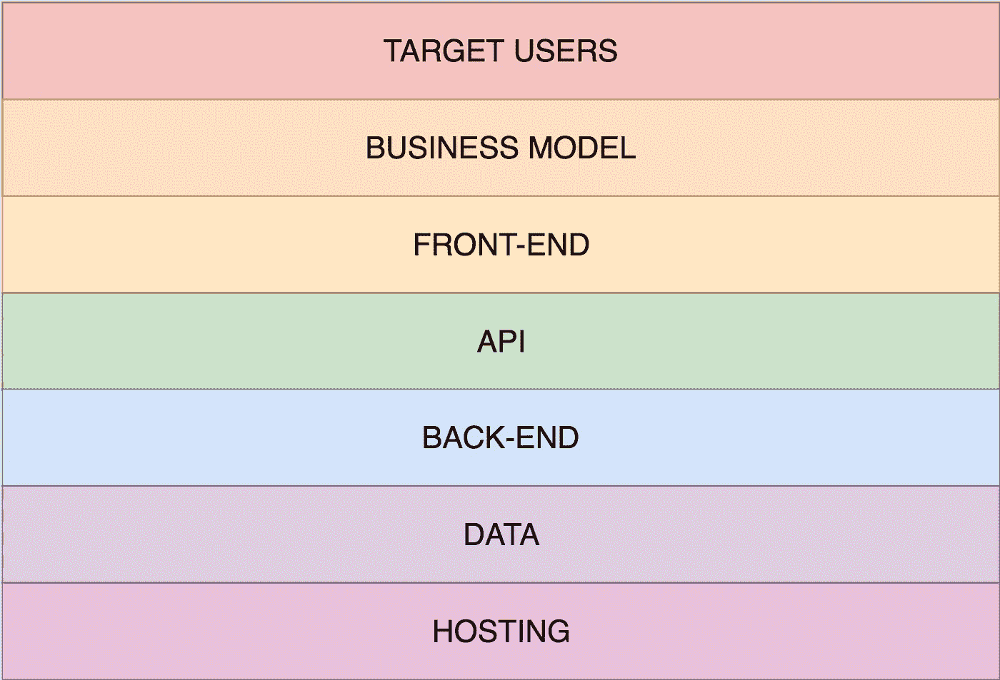

# 成功的七种颜色

> 原文：<https://medium.com/hackernoon/the-7-colors-of-success-cd42bb3aec9>

With a large pot of $$$ at the end

最近，我参与了一场旷日持久的深度冥想。在整整一个周末的时间里，我终于能够阐明一个我非常关心的话题:成功和激情迸发的金钱。

还有一种完全可能的情况是，几个小时前我在洗澡，然后就像往常一样吃了一顿“迷你尤里卡”！时刻。

问题是:我认可了一家成功的[软件](https://hackernoon.com/tagged/software) [初创公司](https://hackernoon.com/tagged/startup)的坦率而明显的 7 个层面。

1.  目标用户
2.  商业模式
3.  前端应用
4.  API 层
5.  后端应用
6.  数据层
7.  托管(又称“服务器”)

就是这样。每个人都知道他们。没有魔法，没有启示。

我认为，对我们中的一些人来说，真正新鲜的是，他们清楚地认识到，这份清单上的每一点都是为了服务于前一点而存在的。

我为那些没有得到这些的公司工作，为那些得到了 [5 / 7](http://knowyourmeme.com/memes/5-7) 的公司工作。我在一家公司工作，那里的几个项目都达到了 3 比 1，勉强达到了 4 比 5，但其中 5 比 7 的项目都被商业协议压制住了。

我现在为一家公司工作——Wayonara，来看看吧，我们马上就要改变你对旅行的思考和计划方式了——虽然在撰写本文时，我们并不能完全抓住要点，但我们总是在每天的基础上不断学习和提高(这就是为什么我很高兴与你们共事——嘿，各位！).

让我详述一下这几点之间的关系。

## 目标用户和业务模式

目标用户是你期望从中赚钱的对象，而你的商业模式只有一个目的，那就是服务你的目标用户，从而赚钱。

## 前端应用

前端应用程序的作用只有一个，那就是让初创公司能够完美地执行业务模式，为目标用户提供服务，从而赚取利润。

## API 层

API 层(为了简单起见，请考虑 REST)的存在是为了服务于前端应用程序。不要只是将数据模型扔进一个愚蠢的 HTTP 管道，然后期待最好的结果。相反，您应该仔细地制定每一个响应，以确保 API 层完美地服务于前端应用程序的需求。API 层使前端应用程序能够执行业务模型、服务于目标用户并赚取资金。

## 后端应用

后端应用程序是准备 API 层的地方。

你最喜欢的框架没有提供足够的定制选项来创建一个可以完美地用于前端应用程序的 API 层？
你可以选择另一个框架。

你找不到更适合你最喜欢的编程语言的框架吗？
你选择了另一种编程语言。

后端应用程序是您使用数据层为您的前端应用程序制作完美的 API 层的地方，前端应用程序执行业务模型，为目标用户提供最佳服务，并为您赚钱。

## 数据层

数据层:数据模型、数据库、缓存、消息队列等等。
你设计数据层的指导原则只能有一个，只有一个问题:

*这是否允许我为后端应用程序提供最好的服务，使它能够为前端应用程序设计完美的 API 层，前端应用程序的唯一目的是执行业务模型，为目标用户服务并为我赚钱？*

## 主办；主持

最后，基础:托管。如果你一直读到现在，我打赌你知道这一段的走向。
选择您的主机(硬件、操作系统、SaaS、平台即服务……)不是因为更便宜，不是因为更新，也不是因为您了解它。
选择你的主机是因为——跟我一起唱——它是你的数据层的完美环境，这样它可以被完美的后端堆栈用来创建完美的 API 层，前端应用程序使用起来绝对没有问题，以便很好地执行业务模型，这样你的目标用户会非常高兴并且…

赚。

你。

钱。

$$$.

*本网站上的帖子是我自己的，不一定代表我的雇主的帖子、策略或观点。*

> [黑客中午](http://bit.ly/Hackernoon)是黑客如何开始他们的下午。我们是 [@AMI](http://bit.ly/atAMIatAMI) 家庭的一员。我们现在[接受投稿](http://bit.ly/hackernoonsubmission)并乐意[讨论广告&赞助](mailto:partners@amipublications.com)机会。
> 
> 如果你喜欢这个故事，我们推荐你阅读我们的[最新科技故事](http://bit.ly/hackernoonlatestt)和[趋势科技故事](https://hackernoon.com/trending)。直到下一次，不要把世界的现实想当然！

