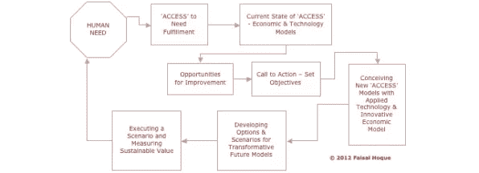

# 创建持续转型的 7 步模式

> 原文：<https://medium.com/hackernoon/the-7-step-model-for-creating-sustained-transformation-3bc9ecc1906c>

[Photo by [dan carlson](https://unsplash.com/photos/G86MS2ZsiJA?utm_source=unsplash&utm_medium=referral&utm_content=creditCopyText) on [Unsplash](https://unsplash.com/?utm_source=unsplash&utm_medium=referral&utm_content=creditCopyText)]

## 可持续增长是由公认的转型需求推动的，随之而来的是对旧方式和方法的不同思考。它是随着时代的变化而变化和创新的能力。

心理学家[亚伯拉罕·马斯洛](http://www.maslow.com/)认为，人类必须满足对食物、水和住所的基本需求，才能进化到最大的潜能。对此，今天，我们必须包括获得某种使能技术，这反过来又在可持续的环境中释放创造力和创新。

全球化和获得赋能技术的变革力量已经让传统经济理论中普遍存在的因果狭隘过时了，必须用更开明的观点来解决我们今天在全球面临的复杂问题。

发展中国家在 20 世纪的增长和发展曾经是以十年来衡量的。现在，随着技术的部署，他们能够在短短几个月或几年内将自己转变为国际商业社会中有生产力的成员。

考虑下面的例子:

**光伏**电池是美国发明的，但中国现在是世界上最大的生产国。中国正在为世界树立一个绿色、可持续能源的榜样，计划到 2020 年将太阳能的使用增加五倍，达到 200 亿瓦。太阳能应用正在增加。丰田在普锐斯车顶创新性地应用了集成太阳能电池，为空调提供动力，当汽车在热天停在外面时，可以保持车内凉爽。中国支持绿色能源的变革政策越来越强。成为清洁能源生产超级大国的意义还有待充分分析。

在墨西哥， [**墨西哥最大的跨国公司 Cemex Corporation** ，](http://www.cemex.com/)已经从数百万世界上最贫困的家庭中获得了有利可图的客户，组织他们购买水泥和其他产品来建造或改造简单的房屋。Cemex 根据其七个可持续发展目标制定了 *Patrimonio Hoy* 战略(“今日遗产”，即创造有价值的东西供今天使用)，然后首先在墨西哥开始通过提供小额信贷和指导如何改善或建造新的家园来改变第三世界的贫困人口。Patrimonio Hoy 为 120，000 个墨西哥最贫困的家庭提供了更好的住房，同时为女性提供了家庭顾问的新职业，并为无数的泥瓦匠和建筑工人提供了工作。Cemex 正在努力减少排放和能源消耗:例如，在墨西哥，其 25%的电能来自风力发电场。Patrimonio Hoy 项目现在已经走向全球。

在坦桑尼亚和其他非洲国家，一个名为 [**的非营利组织 KickStart**](http://www.kickstart.org/) 向农民出售技术，例如其超级赚钱的灌溉泵。这项技术将水提升到山上的田地里，使农民能够在每个季节生产更多的作物，种植更高价值的作物。使用水泵的农民收入增加了十倍，从每年 110 美元增加到 1100 美元，使他们摆脱了贫困，并改善了家庭的教育和医疗保健。KickStart 坚持出售水泵，而不是免费赠送，并建立了从制造商到农民的盈利供应链。该项目取得了巨大成功:贫困农民使用了大约 45，000 台水泵；创造了 29，000 个新的带薪工作岗位；这些水泵每年创造约 3700 万美元的新利润和工资。

从柬埔寨到多米尼加共和国到马达加斯加，从第三世界到第一世界，大大小小的国家都在以前所未有的速度发生着这样的转变。展示像这样的新的、强有力的转变的机会从来没有这么大。

## **实现可持续转型的步骤**

术语*转化*起源于生物学和遗传学。简而言之，生物转化是指引入一些有机的和系统的东西，可以改变细胞的本质。它的目的是引发变革。变革的过程对于今天的每个组织几乎是相同的:引入一个新的目标，增加变量，并将其转化为创造力和创新。

> 变革是由公认的发展和变革需求推动的，随之而来的是对旧方式和方法的不同思考。

它可以作为一个改变游戏规则的整体过程来建模、记录和实现。概括地说，这 7 个步骤可以定义为:

**1。**人性受**驱使*想要*和/或*需要***
**2。**我们发展 ***战略*进化*战术*** 把那些想要的和需要变成目标
**3。**有了合适的战术，我们就可以制定一个 ***的计划，或者号召行动*** 来实现
**4 的目标。计划，或行动号召，包括设定个人或商业目标，并确定实现这些目标的最合适的技术。**当业务目标与适当的技术成功结合时，结果是 ***融合，*** 两者的无缝融合以达到目标
**6。**融合使得创造一种可行的经济模式成为可能，这种模式应用了在满足需求的过程中必不可少的技术。当个人或企业成功地走上实现其目标的新道路时，变革就发生了

那些完成这一过程的人现在不仅仅是为了生存，而是为了进步和繁荣。该过程是可重复的——事实上，它是循环的——通过使用强大的使能技术不断地将行动转化为创造性、创新性和可持续的目标和结果。

## **变革、创新和进步**

变革始于组织内部*，因为人们意识到需要成长和变革:*

*   可能会有制度上的停滞。
*   员工可能不再感到有动力。
*   社区中可能有一种深刻的、通常未说出口的感觉，即该机构必须以新的、创新的方式成长。
*   可能存在竞争、不可持续的开支或恶意收购等形式的外部威胁。

简而言之，转型的需求可能来自许多可识别的因素，也可能来自许多隐藏的因素。该机构要实现自我转变并取得成功，变革的影响力必须首先渗透到内部，发展成为一种新的创造和创新精神，然后扩散到内部和外部的社会经济文化及其他领域，因为我们生活在一个全球经济中，最轻微的反响往往会产生强大的连锁反应。

可持续转型不是一项业务职能；这是个人或机构及其世界观的根本性系统性转变。它是一个过程中的核心概念，这个过程被逐步理解和管理到最终目标:随着时代的变化而变化和创新的能力。

***版权所有 2017 费萨尔·霍克。保留所有权利。***

我是一名[企业家兼作家](http://faisalhoque.com/speaking/)。[沙多卡](http://shadoka.com/)等公司创始人。Shadoka 让抱负成为领导、创新和变革的动力。Shadoka 的加速器和解决方案汇集了管理框架、数字平台和思想领导力，以实现创新、转型、创业、增长和社会影响。

著有《 [*万物互联——如何在创意、创新和可持续发展的时代转型和领导》*](http://www.amazon.com/Everything-Connects-Creativity-Innovation-Sustainability/dp/0071830758/ref=sr_1_1?ie=UTF8&qid=1376488798&sr=8-1&keywords=everything+connects%2Bfaisal+hoque) 》(麦格劳·希尔)和《 [*生存并茁壮成长:弹性企业家、创新者和领导者的 27 种实践*](http://survivetothrive.pub/) 》(励志出版社)。在推特上关注我。*免费使用* [*万物互联*](http://app.everythingconnectsthebook.com/login.php) *领导力 app 和* [*生存茁壮*](http://app.survivetothrive.pub/login.php) *弹性 app。*