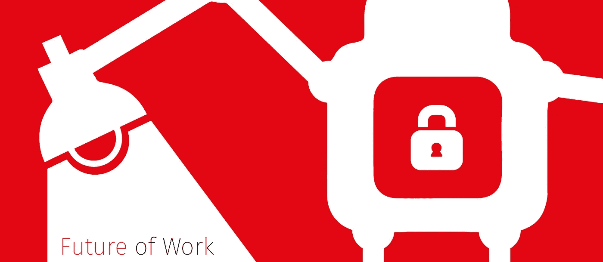
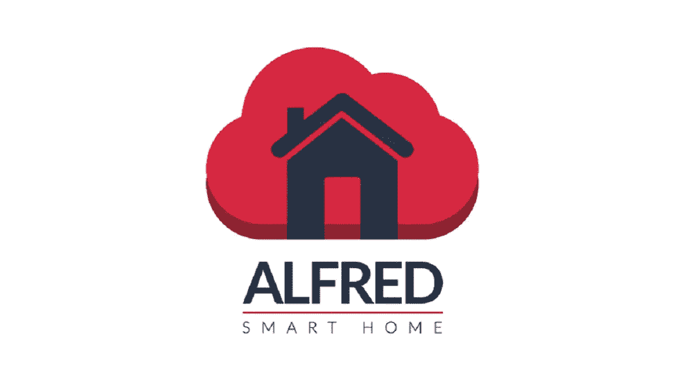
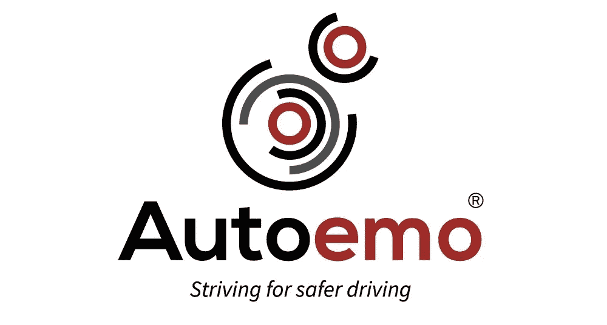
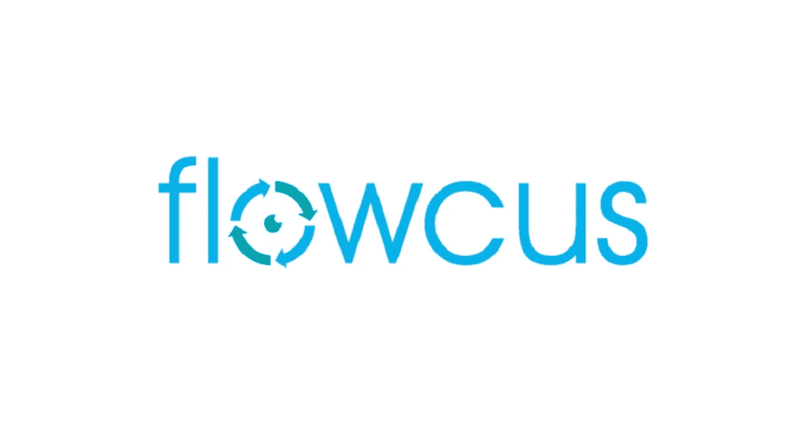
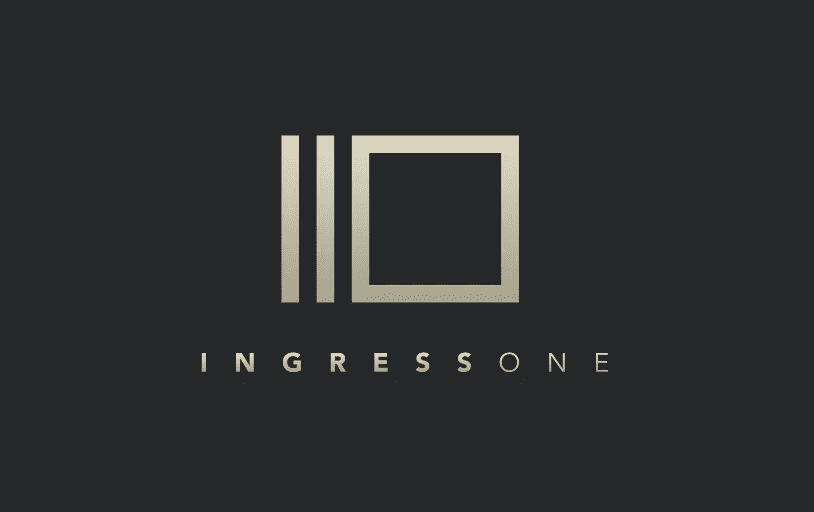
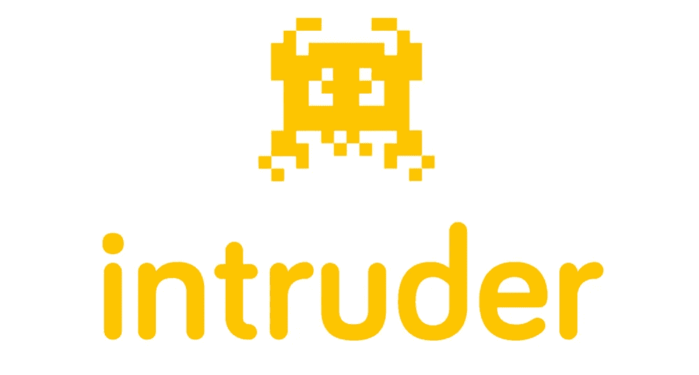
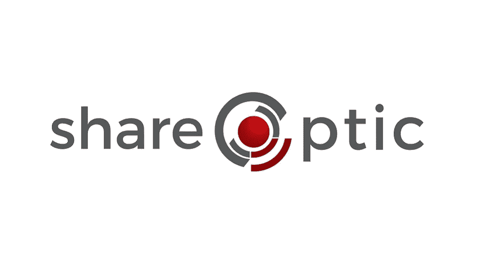
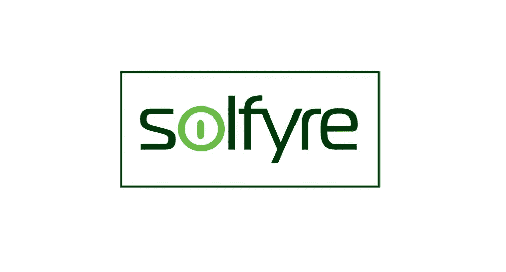

# 宣布 7 个团队加入 IncuBus 未来工作@PwC

> 原文：<https://medium.com/hackernoon/the-7-teams-disrupting-the-future-of-work-c4ca8c21b2ae>

## 希望改变普华永道工作未来的创业公司

在过去的几个月里，我们一直在全国寻找最好的初创公司，希望接受挑战，在三个垂直领域开创未来的工作:

*   网络安全
*   人工智能
*   物联网(智能办公室)

这些团队将加入我们的团队，为期 12 周，我们将带领他们完成一项密集的计划，重点是开发适合市场的产品，获得牵引力，并确保他们为 4 月中旬的演示周筹集更多资金做好准备。

该项目在位于伦敦桥联合街的普华永道伦敦办公室的一个全新专用空间进行。这些团队将受益于东道主普华永道(尤其是在网络安全方面)及其员工的专业知识和资源，以及我们广泛的导师和投资者网络。

话不多说，以下是加入 IncuBus Future of Work @PwC 的 7 家初创公司:

[**阿尔弗雷德智能家居**](http://www.alfredsmarthome.com/) 是一款手机应用，让你完全控制你所有的智能家居设备。今天的物联网市场是分散的，没有一个统一的平台。Alfred 是您的数字管家，通过集成所有领先设备来简化连接。

一个 app，一次安装，就这样。无论是在家里还是在办公室，Alfred 都允许
您设置控制并轻松监控您的环境，以帮助您节省时间和金钱。

[**Autoemo**](http://autoemo.com/) 是两款下一代遥测设备，用于收集和洞察驾车者的习惯。

现有的远程信息处理解决方案是有限的，它们记录的是车辆数据，而不是导致大多数保险索赔的驾驶员行为。Autoemo 通过面部情绪和语调分析，充当司机和保险公司之间的信息交换所，检测司机的注意力和情绪状态，提供有关他们的行动和事故原因的更好数据。

[**Flowcus**](https://www.f6s.com/flowcus)**是一款个人生产力 app，帮助员工规划、专注、反思自己的一天。**

**在我们这个互联互通的世界里，获取信息会分散注意力，助长拖延症，现在比以往任何时候都更难不间断地有效完成任务。Flowcus 使用基于浏览器的过滤器，结合生产力和注意力的最佳实践，通过允许用户关闭噪音，进入心流并完成工作来优化效率。**

****

**[**Ingress One**](http://www.ingressone.com/) 是管理您所有员工和访客进入需求的解决方案。**

**Ingress One 是一个 SaaS 平台，通过移动和平板电脑应用程序管理建筑物的进入和访问控制。你可以把它想象成一个登机牌应用程序，适用于任何办公室。它降低了与管理建筑物入口相关的成本，加快了访问速度，并提供了新的数据和通信机会。**

****

**[**入侵者**](http://intruder.io/) 是面向互联网系统的主动安全监控平台。**

**网络威胁千变万化，需要专门监管。现有的服务是不充分的，配置和操作过于复杂，产生的行话往往令人困惑，需要专家解释。Intruder 提供了一个简单的基于云的安全解决方案，它可以持续扫描您的数字资产，突出漏洞，并以最简单的方式概述补救建议。**

****

**[**ShareOptic**](https://shareoptic.com/) 是一款网络智能产品，pro 主动保护云中存储和共享的数据。**

**履行法规遵从性和安全性义务是开展在线业务的一个基本组成部分，如果未能验证信任，公司将面临声誉损害和/或罚款。通过利用先进的动态分析技术，ShareOptic 统一安全解决方案确保与您共享数据的实体、个人或应用程序可信，从而主动降低相关风险和成本。**

****

**[**Solfyre**](https://solfyre.com/)**是一个在线身份认证平台。****

****企业用户和客户越来越多地在线，并且需要跨多种服务注册和维护多个帐户。管理这些身份是一个内在破碎的系统，效率低下，不堪重负。****

****Solfyre 拥有一套移动、服务器和浏览器技术，通过其 IA 引擎自动化和简化身份认证流程，结合生物识别和行为建模来确认用户身份并确保数据安全。****

****我们下一个孵化器项目[**IncuBus Retail**](http://www.f6s.com/incubusretailclass2?ref=mediumpostfow1cohort)现在开始接受申请。了解更多[和**现在申请**和](http://www.f6s.com/incubusretailclass2?ref=mediumpostfow1cohort)！****

****如果你有兴趣了解潜在的指导机会，你可以在这里申请。****

****如果你有兴趣加入我们的未来工作演示日，请订阅我们的时事通讯，以便在门票发售时第一个听到:[http://eepurl.com/6fH29](http://eepurl.com/6fH29)****

****************************************

> ****[黑客中午](http://bit.ly/Hackernoon)是黑客如何开始他们的下午。我们是 [@AMI](http://bit.ly/atAMIatAMI) 家庭的一员。我们现在[接受投稿](http://bit.ly/hackernoonsubmission)并乐意[讨论广告&赞助](mailto:partners@amipublications.com)机会。****
> 
> ****如果你喜欢这个故事，我们推荐你阅读我们的[最新科技故事](http://bit.ly/hackernoonlatestt)和[趋势科技故事](https://hackernoon.com/trending)。直到下一次，不要把世界的现实想当然！****

********