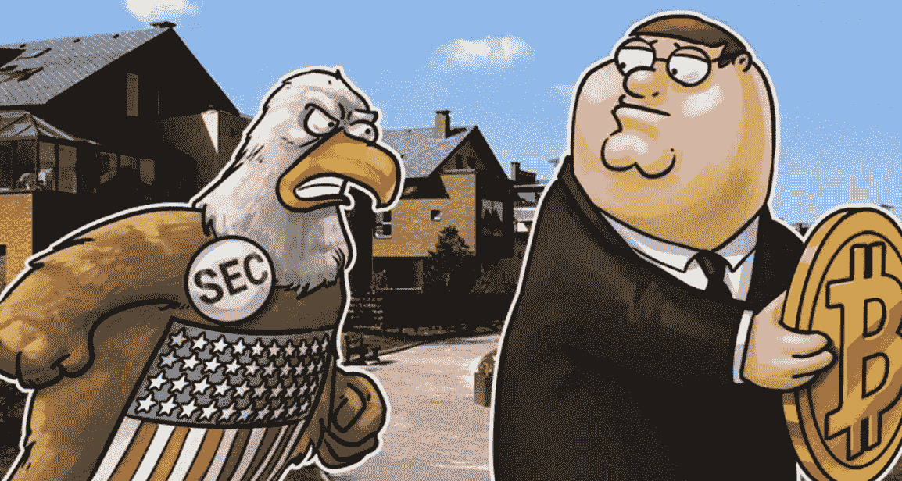
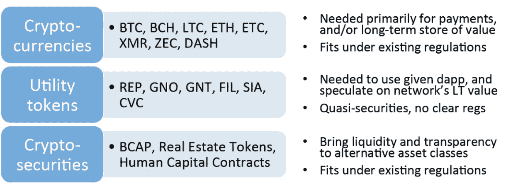

# SEC 合规性 ICO 电话会议中您需要知道的 7 件事

> 原文：<https://medium.com/hackernoon/the-7-things-you-need-to-know-from-the-sec-compliant-ico-conference-call-347822f5419f>

9 月 27 日，我们与 [Geektime](https://www.geektime.com/) 合作，就 SEC 投诉 ico 与四位思想领袖举行了一个小时的电话会议。发言人是[科技](https://goo.gl/yVg15B)的首席执行官迈克·琼斯、[亚贡集团](https://argongroup.com/) **的总法律顾问艾玛·钱宁、**Debevoise&Plimpton 的法律顾问李·施耐德、 [Protos 加密货币资产管理](https://protos.tokenhub.com/)的联合创始人汤姆·金内山科

每位发言人都分享了他们对 SEC 投诉 ico 的执行和投资过程及其风险的看法。在发言人分享了他们准备好的发言后，观众开始提问。下面是电话会议的视频回放(只有最后一位发言者有幻灯片)。

对我来说，这通电话带给我的最大收获是，在尝试执行 SEC 合规 ICO 的过程中，还有多少不确定性和风险。也就是说，在电话中分享了许多深思熟虑的见解。下面的图表确定了三种令牌类型及其属性，可以作为电话讨论的有用参考。

出于本文的目的，我们将使用术语安全令牌而不是加密证券，因为这是呼叫中使用的术语。

以下是我认为在通话中分享的七个最重要的想法:

1.  **[**SEC DAO 报告**](https://goo.gl/LHsVPT) **是给 ICO 行业的一份大礼**。艾玛强调了证交会在报告中给出的令人难以置信的大量细节和指导，而不是强制行动。Emma 表示，SEC 有一个非常成熟的团队在调查 ICO，ICO 社区应该利用 SEC 乐于接受与 ICO 相关问题的电子邮件或电话的事实。**
2.  **对于 SEC 兼容实用工具令牌的白皮书应该有多长，或者应该包含什么内容，还没有任何指导。 Emma 说她期待 [S-1s](https://goo.gl/FmBcqf) 提供关于安全令牌白皮书的指导，但没有类似的实用令牌参考。20-30 页足够了吗，还是应该像提供备忘录一样有 70-80 页长？实用工具令牌白皮书应该包括风险因素、使用情形或收益用途吗？它应该有经审计的财务或管理财务吗？艾玛认为我们没有这些问题的答案。因此，五年后监管机构可能会说白皮书中没有的某条信息是重要的，并以合同欺诈错报为由起诉发行人，这是有风险的。**
3.  ****李开复认为，收益使用部分是白皮书最重要的部分。李开复说有一系列可接受的方式来规范收益的使用。收益的使用可以更详细或更详细地说明。收益的使用可以与里程碑联系起来，一旦达到这些里程碑，就有目标地花费金额。虽然没有“正确”的方法来解释收益的用途，但深思熟虑是至关重要的。此外，发行人应该有应急计划，以防筹集的资金超过预期。****
4.  ****解决 SEC/美国监管机构的问题并不能解决世界其他地方的问题。** Lee 指出，所有发达国家都有应该考虑的证券法规。然后，ICO 发行人必须决定他们将在哪些国家合规，因为由于成本和时间的限制，他们不可能在所有地方都合规。一般来说，发行者关心他们能卖出最多代币的国家，并在其他国家承担风险。艾玛说，她经常被问到为什么这个行业不能摆脱监管。她解释说，过马路时有法律适用，更不用说发放 ico 了。所以虽然有人说她在吓唬人，但她相信她在教育人。**
5.  **与传统的融资相比，符合 SEC 标准的 ico 更加复杂，成本也更高。 Mike 表示， **i** 发行 ico 比他过去的融资更复杂，因为他的有限合伙人是美国投资者。为美国以外的人开设众筹，并在不同国家的法律约束下工作，不仅更复杂，而且价格是传统融资的两倍左右。此外，在传统的融资中，股票的走势是受到控制的。但是在代币销售中，代币可以在世界各地移动，有一些新的东西需要考虑，如信息控制和信息如何分发。设计代币经济增加了另一层复杂性。对于迈克来说，科学[区块链](https://hackernoon.com/tagged/blockchain) ICO 是一个为期四个月的过程。。**
6.  **现在，迈克·琼斯透过权力下放的镜头看待一切，处处看到机遇。在科学**，**迈克在新闻集团工作，他的任务是看看他们能否利用 MySpace 更好地对抗脸书。那段时间，迈克花了很多时间和来自 MySpace 和脸书的人在一起。有一段时间，扎克伯格清楚地阐述了社交与软件相关的价值。一旦 Mike 明白了这一点，他看到的每一个软件都是通过社交镜头来看的，并且看到了该软件如何变得更加强大。Mike 说，当他有了去中心化软件的概念时，他现在看到的一切都是通过去中心化的镜头，他看到了无处不在的机会。**
7.  ****令牌化对冲基金的一个主要优势是，由于消除了赎回，资本池更加稳定。** Tom 指出，由于赎回风险，传统对冲基金可能会对其投资采取比最佳投资更短期的观点。传统基金有时会有 15 或 30 天的赎回期(当投资者要求退款时)。赎回可能会迫使基金出售资产以满足赎回。有时赎回可能会级联，因为强制资产出售可能发生在次优价格，这可能导致进一步的赎回，或级联赎回，导致基金的消亡(见 2008)。在代币化基金中，想要退出的投资者只需将代币出售给其他投资者，从而保持资金池的稳定，并让代币基金经理能够进行长期投资。**

**电话中还提到了许多其他非常有意义的事情。Emma 建议每个 ICO 都应该记录地址并检查 id，以便用于 [KYC](https://goo.gl/C3BNmz) 目的。艾玛还提到了 Argon 与 Overstock 和 RenGen 在[新成立的 ATS(替代交易系统)合资企业](https://goo.gl/RFkuXo)。李开复谈到了后 ICO 时代沟通的重要性。迈克谈到了他的科学区块链孵化器的结构，以及一些出口将如何导致令牌被烧毁。这一个小时花得很值。**

***如果你从这篇帖子* ***中获得了至少* 0.00000001 [比特币](https://hackernoon.com/tagged/bitcoin) *的价值，请在*** *下方“鼓掌”，这样其他人就会看到这篇帖子。***