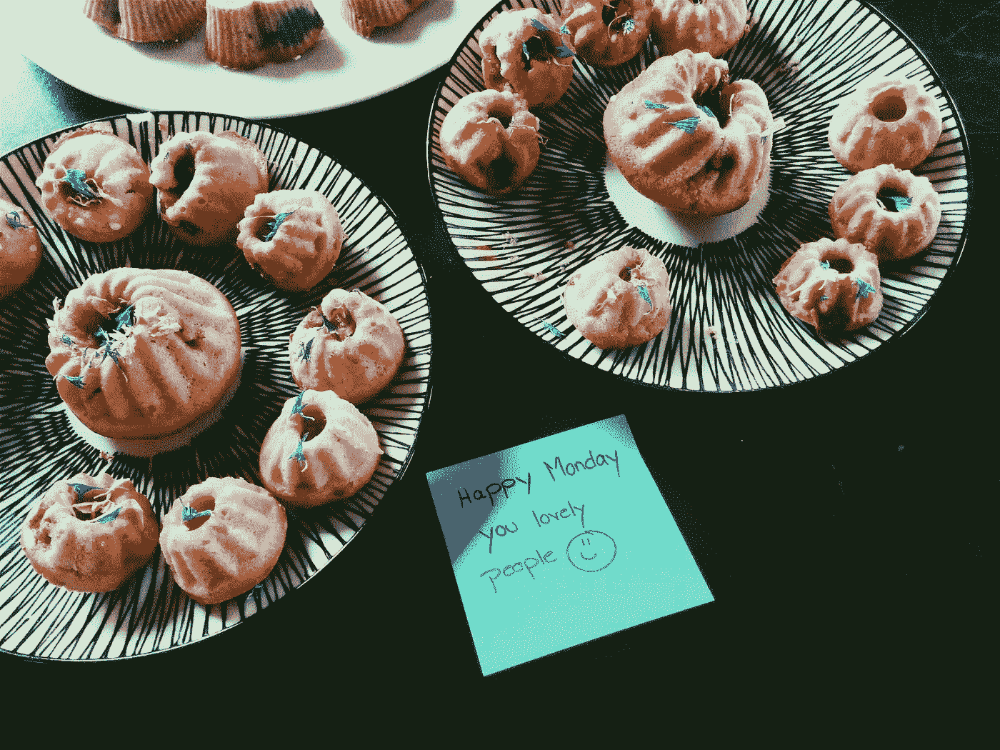
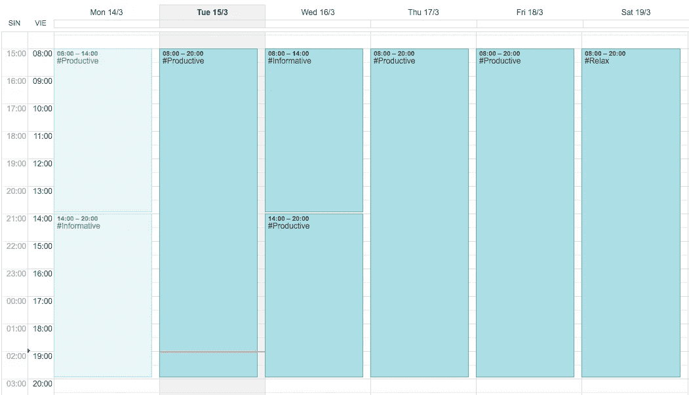
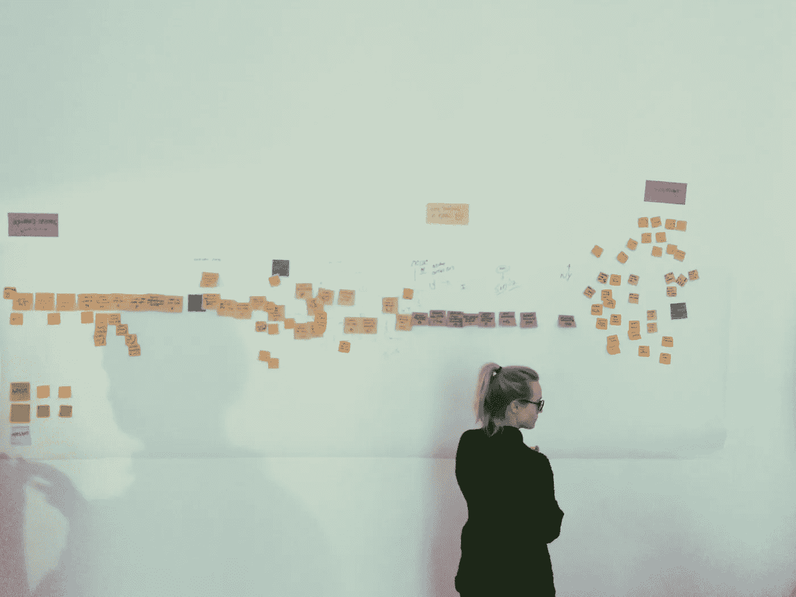

# 75/25 法则

> 原文：<https://medium.com/hackernoon/the-75-25-rule-for-a-result-orientated-work-environment-be7f5bf47b94>

## 让你的会议更注重结果，让你在每个工作日之后都感到更快乐。

I love it when people in our [strategic design company EN GARDE](http://www.engarde.net) share their talents to the whole team. — Especially on Mondays. Thx Annalena and Gerhild.

工作周包括 5 个工作日，通常每天工作 8 至 10 小时。但有时感觉这还不够，永远没有足够的时间来完成所有的任务和会议。

## 我们在这里。会议。

有些人喜欢它们，因为当他们围坐在桌子旁，发送或接收来自其他人的信息时，他们感到[富有成效。其他人被他们烦了。](https://hackernoon.com/tagged/productive)

我对零产出的会议感到厌烦。我所说的“产出”指的是做出决策、构建一个纸上原型或一个有趣且富有成效的共同创作会议。

> 我们应该尊重你和他人的时间，因为时间对每个人来说都是有限的。

与你的同事一起度过富有成效的时间比仅仅在[会议](https://hackernoon.com/tagged/meeting)上聊天感觉更好，并且**一起工作产生真正的成果会让团队更加强大。**

当我看着我的日历并思考这个话题时，我对我每周花在马拉松会议上的时间感到惊讶。这让我感到不快，因为在大多数会议中，什么也没有真正发生，什么也没有产生。

> 晚上离开办公室的时候，我很沮丧，因为我觉得自己什么都没完成。

我开始问自己，在信息丰富的会议上，我想坐多少时间，听多少时间，说多少时间，我想和我的团队一起为我们的客户做出贡献？

> 对我来说，理想的划分是 75%的生产时间和 25%的信息时间。

Looks much better to focus on productivity and results, than just handling information. — Indeed this is just a visualization. ;-)

要做到这一点，有必要在整个团队或公司内部实施，并制定一些易于遵循、听起来对每个人都有趣得多的规则。

# 这里有一个在你的团队中实施 75/25 规则的简单指南。

你需要告诉你的同伴。如果不让他们知道你的计划，这是行不通的。—记住，安排一次会面需要两个人。；-)

从第 X 天(也许，明天！)我们必须区分两种会议。一个叫做**信息会议**另一个叫做**成果会议**。信息会议的最大数量应该占你会议的 25%,其余的 75%应该是有成效的工作会议。

## 规则很简单:

1.  **75%用于富有成效的会议**
2.  **25%用于信息会议**

在您的共享日历中，会议应标记为**INF**formation 或**PRO**productivity，例如“**# INF 2016 年 4 月销售预测**”或“ **#PRO 共创伟大的新保险产品**”。

Productive meeting session with my [EN GARDE](http://www.engarde.net) colleagues Christina and Emanuel. — Yes it’s a costumer journey.

# 当你邀请同事参加会议时，这意味着你在利用他们的时间。

因此，你是会议的领导者，你为会议设定目标或预期交付——这样，人们就可以为会议做好准备。

## **扪心自问**

1.  我这次会议的**目标**是什么？
2.  我对本次会议的**交付**有什么期望？

大多数情况下，您会将**目标用于提供信息的**会议，将**交付用于富有成效的**会议。

# 你应该注意什么？

## 富有成效的会议

1.  告诉参与者**预期交付**和你想要投资的时间。这也需要成为#PRO 邀请的一部分。
2.  你需要**准备好**(议程、纸、笔、打印件、一个已经勾画出想法的白板，等等。)
3.  每个人都必须清楚预期的交付(当然，当会议成员同意变更交付时，这可能会改变)。)
4.  不要保持沉默或无所作为。(如果你不是会议的积极参与者，你应该立即离开。)
5.  如果需要，决定召开一次后续会议。
6.  **守时。**

> 如果你开始晚了或跑晚了，你就在偷别人的时间，让他们紧张。

## 信息丰富的会议

1.  告诉参与者预期的目标和你想为此花费的时间。
2.  准备好议程。
3.  重新制定并写下会议的预期目标，并在最后询问人们是否认为会议达到了目标。
4.  听一听，问相关问题。
5.  请人们重新表述你说过的话。
6.  重新表述以帮助会议成员理解。
7.  准备文件或委托某人写一份关于会议决定或相关要点的文件。
8.  **守时。(我是认真的！)**

享受整个团队为你工作的产品和客户提供更多产出的乐趣。

# 从信息丰富的工作环境转变为以结果为导向的工作环境。

我期待着你的问题，补充和反馈。感谢您花费宝贵的时间阅读本文。:-)

善意地，
菲利普

PS: **请与您的团队**分享这一点——他们将在您即将召开的会议上欣赏更高的工作效率。
PPS:你可以在这里的推特上关注[我，但你绝对应该在脸书](http://twitter.com/philippkanape) **上关注 [**。**](http://www.fb.com/thrutheheart)**

> [黑客中午](http://bit.ly/Hackernoon)是黑客如何开始他们的下午。我们是阿妹家庭的一员。我们现在[接受投稿](http://bit.ly/hackernoonsubmission)并乐意[讨论广告&赞助](mailto:partners@amipublications.com)机会。
> 
> 如果你喜欢这个故事，我们推荐你阅读我们的[最新科技故事](http://bit.ly/hackernoonlatestt)和[趋势科技故事](https://hackernoon.com/trending)。直到下一次，不要把世界的现实想当然！

