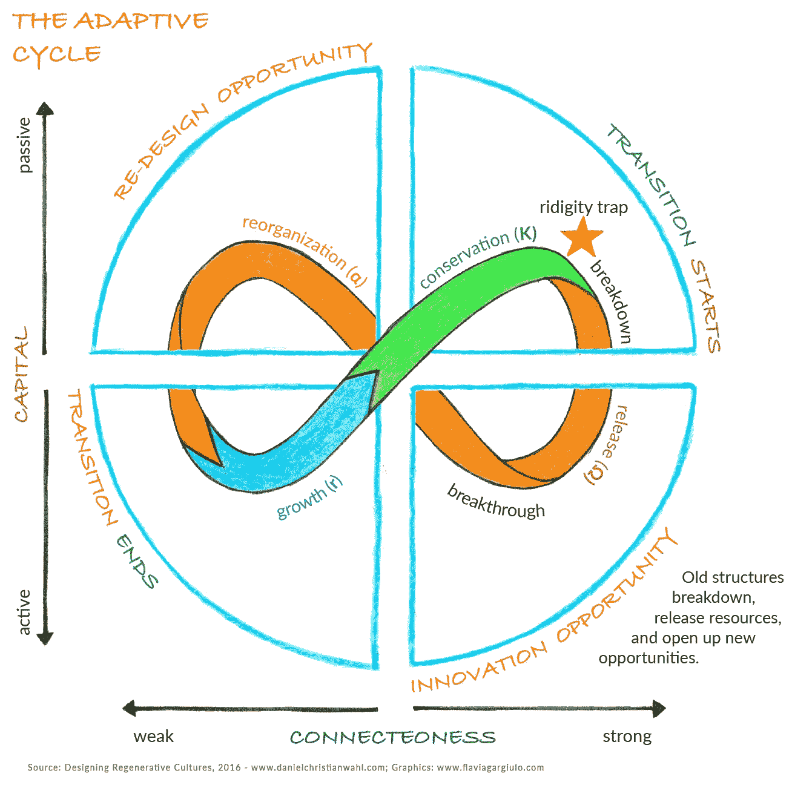

# 适应循环作为弹性思维的动态地图

> 原文：<https://medium.com/hackernoon/the-adaptive-cycle-panarchy-as-dynamic-maps-for-resilience-thinking-793fad49de5e>

复原力的三个方面(持久性、适应能力和可转化性)描述了生命系统的重要能力:抵抗崩溃和维持重要功能，适应变化的条件(学习和自我组织),在社会生态系统的情况下，将远见和预期应用于“积极涌现的设计”——将系统转化为增加健康和提高能力，以明智和创造性地应对中断和变化。

复杂动态系统理论描述了有序和混沌之间、稳定和转变之间的周期性、有节奏的舞蹈，作为复杂(生命)系统中自组织的基本模式。随着任何系统开始成熟，伴随而来的是互动和资源流动的固定和有序模式的增加。系统变得过度连接，或者更好地说，现有连接的质量和数量抑制了系统整体适应外部变化及其持续进化所需的新路径的形成。最终，这导致系统内部僵化，变得脆弱，弹性降低，更容易受到外部干扰。

在这一点上，系统内部有害的失控反馈回路的影响会进一步挑战生存能力。旧秩序和结构的逐渐或突然瓦解，往往会使系统更接近“混沌的边缘”——当前稳定(动态平衡)域的边缘。此时，资源流动的重组和系统内相互联系的质量和数量的变化造成了一场危机，这场危机可以转化为变革和创新的机会。

在混沌的边缘，复杂的动态系统最具创造力(考夫曼，1995)。欧文·拉斯洛在《世界的混沌点》一书中认为，人类目前正处于崩溃和突破的十字路口。如果我们采取适当的行动，混乱点可能是一个“向新文明飞跃”的机会(拉斯洛，2006: 109)。

理解我们所处的变革的整体动力是很重要的。我们需要学会*与*合作，而不是*对抗*这些创造性创新、整合、僵化和最终解散的循环模式，为变革性创新和更新的创造力腾出空间。

适应性循环是生态系统和生态社会系统中自然变化模式的一种模式。它包括四个不同的阶段:“增长或剥削”(r)；既定模式和资源分配的保护'(K)；塌缩或释放'(ω)；和重组(α)。自适应循环(见图 8)通常被绘制成连接这四个阶段的无穷符号或莫比乌斯环。

The adaptive cycle (adapted & expanded from Gunderson & Holling 2001)

从开发(上图中的增长)到保护的旅程被称为“前环”(环的蓝色和绿色部分)。它描述了系统中资源增长和积累的缓慢且通常较长的阶段。最终，系统中过多的僵化结构、固定连接和资源积累使其变得脆弱，随时可能被释放或崩溃。

从发布到重组的过渡被称为适应循环的“后循环”(循环的红色和橙色部分)。这一阶段通常进展迅速且相对较短。在这一阶段，重新设计、重组和更新的机会很大，因为僵化结构、既定模式和资源在整个系统中的重新分配已经解除。在适应性循环中，创造性的“混沌边缘”在“释放”阶段开始时达到，在“重组”阶段结束时离开。

在α阶段，创造性变化的机会和可能性是最高的。在 r 阶段，这些变化的机会被相互检验，一个或几个创新开始定义被转换系统的特征。这种结构是保守的，然后在 K 阶段开始硬化，直到ω阶段通常快速且有时是灾难性的释放(崩溃)将我们带回创造性的“混沌边缘”状态。这为在新的α阶段和新的适应周期中的重组提供了新的机会。

在α阶段，将系统转变为一种新的运行方式(这可能提供更高的弹性和健康)的体制转变或转型变化的可能性是最高的。在此阶段引入的变革性创新有可能将系统提升到一个新的稳定领域。旨在提高系统复原能力的设计干预措施应运用远见并探索未来情景，以评估其提议的干预或重新设计的潜在影响。

在试图同时驾驭这些不同尺度的自然变化动态时，我们必须记住弹性的所有三个方面都很重要。在持久性、适应能力和变革复原力之间找到平衡，将在一定程度上决定这种转变将会多么动荡、迅速和深刻。

由于不同空间尺度的系统之间存在着尺度连接关系，较大系统的适应周期往往移动得较慢，而较小系统的适应周期往往移动得较快，我们还必须注意我们在何种尺度下培养了哪方面的复原力，以及不同尺度如何相互影响。

【这是节选自 Triarchy 出版社 2016 年出版的[设计再生文化](https://www.triarchypress.net/drc.html?source=post_page---------------------------)中的一个分章节。]

—

如果你喜欢这个帖子，**请鼓掌**记住，如果你非常喜欢，你可以鼓掌**多达 50 次**；-)!

丹尼尔·克里斯蒂安·瓦尔(Daniel Christian Wahl)——在面临多重危机时催化变革性创新，为可再生整体系统设计、可再生领导力以及可再生发展和生物区域再生教育提供建议。

国际知名书籍[设计再生文化](https://www.triarchypress.net/drc.html?source=post_page---------------------------)的作者

 [## 丹尼尔·克里斯蒂安·沃尔正在创造支持再生文化和区域再生的内容…

### 亲爱的潜在支持者，自从《设计再生文化》在 2016 年初出版以来，我一直在分享它…

www.patreon.com](https://www.patreon.com/DanielChristianWahl?fan_landing=true)