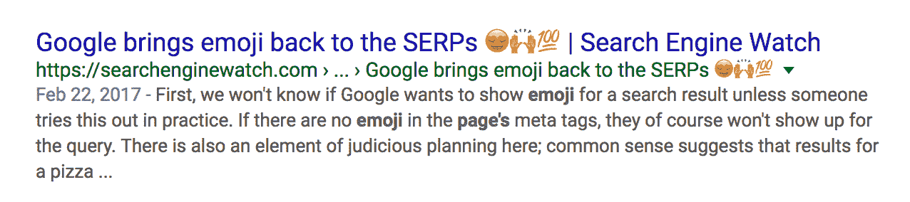
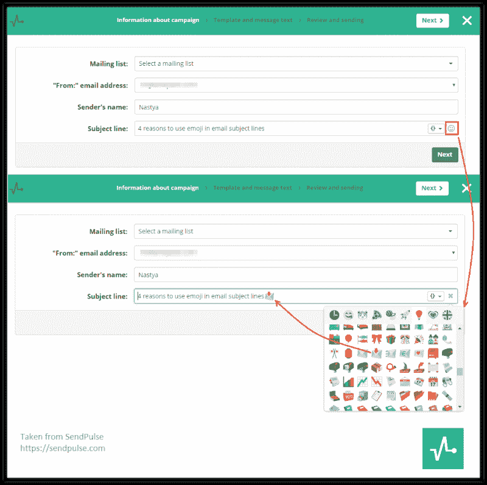

# 电子邮件简讯中表情符号的优势:统计和提示

> 原文：<https://medium.com/hackernoon/the-advantages-of-emojis-in-email-newsletters-stats-and-tips-8a9d879aa1b2>

企业最近发现了几种别出心裁的方式来使用表情符号进行推广和收购。最有创意的是将这些图标直接添加到网站 URL 中。

例如，2015 年，可口可乐[在波多黎各使用了](http://www.adweek.com/creativity/coca-cola-spreads-happiness-online-first-emoji-web-addresses-163044/#/)以下包含表情符号的域名进行推广:

此外，表情符号可以发布在页面标题中。2015 年，谷歌拒绝使用此类符号，但在 2017 年[他们重新考虑了此事](https://searchenginewatch.com/2017/02/22/google-brings-emoji-back-to-the-serps-%F0%9F%98%8D%F0%9F%99%8C%F0%9F%92%AF/)，现在，结果中的一些阴影看起来像这样:

尽管带有表情符号的域名和页面具有独创性，但这更像是一种风格。此外，还有一个领域给表情符号的使用带来了实实在在的好处——电子邮件营销。

[根据](https://www.salesforce.com/blog/2015/02/4-key-email-subject-lines-trends-for-2015.html) SalesForce 的数据，大约 2%发送给私人客户的公司电子邮件在主题行包含表情符号。有电子邮件营销[工具](https://sendpulse.com/)可以用表情符号创建时事通讯。这就是为什么它是重要的功能。

# **电子邮件营销中的表情符号:一些数据**

Experian [的分析师研究了在邮件主题行使用表情符号时邮件列表的结果。根据调查，主题中带有表情符号的信件的打开率比普通主题高出 56%。](https://www.experian.com/assets/cheetahmail/white-papers/symbols-in-subject-lines-cheetahmail.pdf)

ReturnPath 进行了一项[研究](https://digital.returnpath.com/wp-content/uploads/main/2017/05/22113557/Emoji-Report.pdf)，分析了一年中不同时期有图标和无图标的时事通讯指标。结果显示，在一定时期内，特定表情符号的使用可以显著提高邮件的有效性。例如，如果主题信有嘴唇图像，则索引为 24%，而主题信中只有文本的邮件的索引不超过 20%。

为小企业开发应用程序的 Swiftpage 对主题字母中带有表情符号的电子邮件的有效性进行了自己的实验。一半的邮件订阅者收到了表情符号信息，其余的只有文字信息。

表情符号信息的结果:

*   独特的开幕式增加了 29%，
*   独特点击率增加了 28%，
*   CTR 提升了 93%。

# **为什么会这样**

在从数字转移到电子邮件营销中表情符号的技巧之前，有必要考虑一下为什么有时带有有趣表情符号的信息如此有效。以下是几个原因:

## **他们给了精华简要**

表情符号的主要优势是节省空间。在某些情况下，一个简单的笑脸几乎可以代替整个句子。

在他们的报告中，Joss & Mann 公司用一个心形图标代替了“享受”一词。

考虑到用户在手机上打开越来越多的邮件，节省主题行的空间成为一个至关重要的因素。邮件的主题只有 30-40 个字符。在允许的字数限制内，表情符号可以方便地给出相关信息。

## **表情符号=情绪**

考虑到邮件系统垃圾邮件过滤器的算法变得越来越严格，营销人员没有太多的方法将情感添加到他们的文本中。例如，在主题行中使用 CapsLock 会大大增加将信件移动到垃圾邮件的机会。

表情符号对电子邮件程序来说并没有多烦人，所以它们可以让信息“动起来”,而不会有进入垃圾邮件文件夹的风险。

## **易于使用**

使用表情符号的最大好处是不会使消息布局过程变得复杂。它们可以只是复制和粘贴。此外，一些电子邮件简讯服务允许在信件编辑器中选择表情符号。

总之，这里有一些使用表情符号来提高邮件效率的技巧。

# **表情符号应与内容相关**

有超过两千个 Unicode 表情符号。考虑到这样的数量，在电子邮件中使用最多的笑脸是一个很大的诱惑。不过还是挑和内容相关的表情符号比较好。

例如，ModCloth 在线商店推出了一个专门针对美国国家猫日的邮件列表，该节日旨在引起人们对无家可归动物问题的关注，并鼓励人们从收容所收养动物。商店安排了销售，并通过以下主题行通知用户:

点击打开这封邮件:

表情符号有助于吸引人们对信息内容的注意。这就是它们应该被使用的方式。

# **一切都需要测试**

不经测试就相信你的信息会按预期显示是没有用的。有些字符可能不会按计划出现，有些会完全消失，因此在电子邮件中使用表情符号时必须进行测试。

如果你使用 Gmail 或 Yahoo 等主流电子邮件服务..电子邮件一切似乎都很好，但 Outlook.com 和 iPhone/iPad 电子邮件服务有时会将表情符号转换成文本表情符号。Outlook 2003 根本不会识别它们——收件人看到的是▢，而不是表情符号。当然，这是一种过时的服务，但在某些情况下，统计数据显示，很大一部分用户可能会使用它。例如，在 b2b 领域，一些公司的软件没有定期更新。

# **小心使用表情符号**

尽管表情符号有上述优点，但并不是每个人都喜欢它们。据统计， [30%的邮件用户不喜欢在邮件中看到这样的字符](http://marketingland.com/surveyed-people-learn-email-effectiveness-126062)，甚至认为是不可接受的。因此，突然引入表情符号可能会引发负面结果。

为了避免这种情况，逐步引入创新，使用 A/B 测试。例如，你可以将用户分成几个部分，向 20%的用户发送一封带有表情符号的电子邮件，另外 20%的用户将收到一封带有相同主题但没有表情符号的信件。结果对比将有助于更好地理解表情符号对整个邮件群的影响。