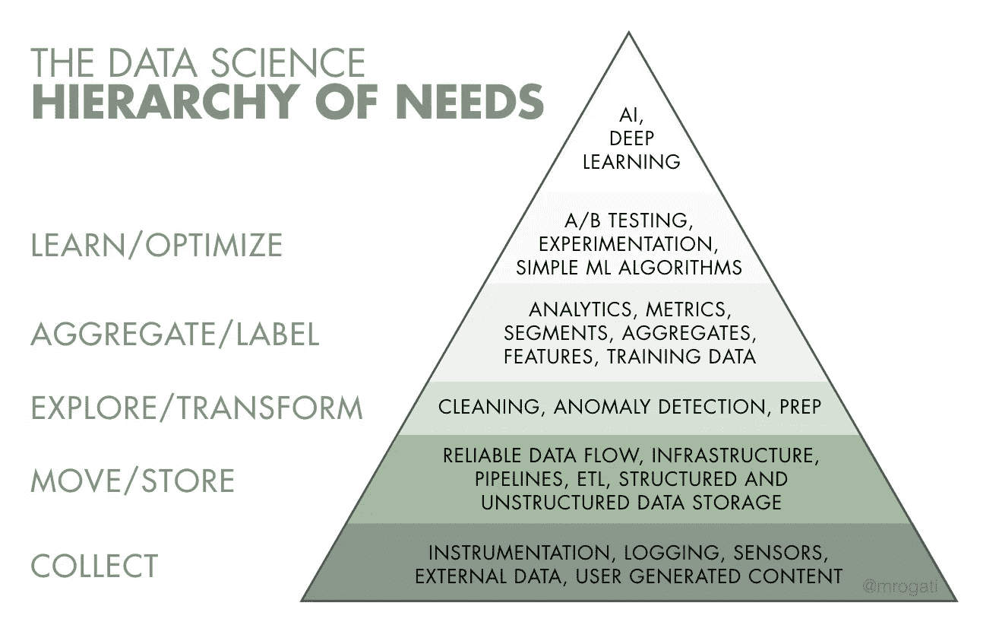

# 人工智能的需求层次

> 原文：<https://medium.com/hackernoon/the-ai-hierarchy-of-needs-18f111fcc007>

正如快速发展的技术通常会出现的情况一样，人工智能引发了大规模的 [FOMO](https://en.wikipedia.org/wiki/Fear_of_missing_out) 、 [FUD](https://en.wikipedia.org/wiki/Fear,_uncertainty_and_doubt) 和[争斗](https://techcrunch.com/2017/07/25/elon-musk-mark-zuckerberg-artificial-intelligence/)。有些是应得的，有些不是，但是这个行业正在关注。从隐形硬件初创公司到金融科技巨头再到公共机构，团队都在狂热地研究他们的人工智能战略。这一切都归结为一个关键的、高风险的问题: ***“我们如何使用人工智能和机器学习来更好地做我们所做的事情？”***

通常情况下，公司还没有为人工智能做好准备。也许他们雇佣了他们的第一个数据科学家，但结果并不理想，或者也许数据素养并不是他们文化的核心。但最常见的情况是，他们还没有建立基础设施来实现(并受益于)最基本的[数据科学](https://hackernoon.com/tagged/data-science)算法和操作，更不用说[机器学习](https://hackernoon.com/tagged/machine-learning)了。

作为一名数据科学/人工智能顾问，我不得不无数次传递这一信息，尤其是在过去的两年里。其他人[同意](https://hbr.org/2017/06/if-your-company-isnt-good-at-analytics-its-not-ready-for-ai)。在你自己领域的所有兴奋中，很难成为一个扫兴的人，尤其是当你分享这种兴奋的时候。你如何告诉公司，他们还没有为人工智能做好准备，而不显得(或成为)精英主义者——自封的看门人？

这里有一个最能引起共鸣的解释:

**把 AI 想象成需求金字塔******的顶端。是的，自我实现(AI)很棒，但你首先需要食物、水和住所(数据素养、收集和基础设施)。****

****

**You need a solid foundation for your data before being effective with AI and machine learning.**

## **基本需求:会数数吗？**

**在金字塔的底部，我们有**数据收集**。你需要什么数据，有什么可用的？如果是面向用户的产品，你记录了所有相关的用户交互吗？如果是传感器，有哪些数据通过，如何通过？记录一个尚未被检测的交互有多容易？毕竟，正确的[数据集](https://qz.com/1034972/the-data-that-changed-the-direction-of-ai-research-and-possibly-the-world/)使得机器学习的最新进展成为可能。**

**接下来，**数据如何在系统中流动？你有可靠的流/ ETL 吗？您将其存储在哪里，访问和分析起来有多容易？Jay Kreps 已经说了(大约十年)可靠的数据流是用数据做任何事情的关键。*【旁白:我一直在寻找一个确切的报价，并在他的'* [*我爱日志*](https://engineering.linkedin.com/distributed-systems/log-what-every-software-engineer-should-know-about-real-time-datas-unifying) *'杰作中找到了。然后我注意到，在一段之后，他做了一个与马斯洛需求层次理论完全相同的比较，为了更好地衡量，他还加上了一句“显而易见的东西值得注意”(谢谢杰伊！).说到相关的工作，我后来还看了希拉里·梅森和克里斯·维金斯关于数据科学家工作的精彩* [*帖子*](http://www.dataists.com/2010/09/a-taxonomy-of-data-science/) *。几天前，肖恩·泰勒* [*公布了他自己的数据科学需求金字塔(讽刺地称为数据科学的未连接三角形)，当然，这是完全不同的。也许我们应该创建一个 tumblr。】*](https://twitter.com/mrogati/status/888120281276891136)****

**只有当数据是可访问的，你才能**探索和转换**它。这包括臭名昭著的“数据清理”，这是数据科学被低估的一面，将是另一篇文章的主题。这是当你发现你丢失了一堆数据，你的传感器不可靠，版本变化意味着你的事件被丢弃，你误解了一个标志——你回去确保金字塔的基础是坚实的。**

**当您能够可靠地探索和清理数据时，您可以开始构建传统上被认为是 BI 或**分析**的东西:定义指标来跟踪它们的季节性和对各种因素的敏感性。也许做一些粗略的用户细分，看看是否有什么发现。然而，由于你的目标是人工智能，你现在正在构建你稍后会想到的**功能**以整合到你的机器学习模型中。在这个阶段，你也知道你想预测或学习什么，你可以通过生成标签开始准备你的**训练数据**，要么自动生成(哪些客户搅了局？)或者有人类在循环。**

**这也是你发现自己最激动人心和最引人注目的数据故事的时候——但这也是另一篇媒体文章的主题。**

## **好的，我会数数。现在怎么办？**

**我们有训练数据——当然，现在我们可以进行机器学习了？也许，如果你试图在内部预测客户流失；不，如果结果是面向客户的。我们需要有一个(无论多么原始的)A/B 测试或**实验**框架，这样我们就可以逐步部署以避免灾难，并在变化影响到每个人之前对变化的影响进行粗略的估计。这也是设置一个非常简单的基线**的恰当时机(对于推荐系统，这将是例如“最受欢迎的”，然后是“对你的用户群最受欢迎的”——非常烦人但有效的“个性化之前的刻板印象”)。****

**简单的试探法令人惊讶地难以击败，它们将允许您端到端地调试系统，而无需中间带有超调超参数的神秘 ML 黑盒。这也是为什么我最喜欢的数据科学算法是除法。**

**此时，您可以部署一个非常简单的 ML 算法(如逻辑回归或，是的，除法)，然后考虑可能影响您的结果的新信号和功能。天气和人口普查数据是我的最爱。不，尽管它很强大，深度学习不会自动为你做到这一点。引入新的信号(特性创建，而不是特性工程)可以使你的性能突飞猛进。在这里花点时间是值得的，即使作为数据科学家，我们对进入金字塔的下一层感到兴奋。**

## **带上人工智能！**

**你做到了。你被安装了仪器。你的 ETL 嗡嗡作响。您的数据得到了整理和清理。你有仪表板，标签和良好的功能。你在测量正确的东西。你可以每天做实验。您有一个经过端到端调试并在生产中运行的基线算法，并且您已经对它进行了十几次更改。你准备好了。勇往直前，尝试所有最新、最棒的产品——从开发自己的产品到使用专门从事机器学习的公司。你可能会在生产中得到一些大的改进，也可能不会。最糟糕的情况是，你学习新方法，形成观点和实践经验，并向投资者和客户讲述你的人工智能成果，而不会感觉自己是个骗子。最好的情况是，你对你的用户、客户和你的公司产生了巨大的影响——一个真正的机器学习成功故事。**

## **等等，MVP、敏捷、精益等等呢？**

****数据科学的需求层次不是一年内构建互不相连、过度设计的基础设施的借口。**就像构建传统 MVP(最小可行产品)一样，您从产品的一个小的垂直部分开始，并使它端到端地工作良好。你可以建造它的金字塔，然后水平生长。例如，在 Jawbone，我们从睡眠数据开始，构建了它的金字塔:工具、ETL、清理&组织、标签捕获和定义、指标(人们每晚平均睡多少小时？午睡呢？什么是午睡？)，跨段分析一直到[数据故事](https://jawbone.com/blog/jawbone-up-data-by-city/)和机器学习驱动的数据产品(自动睡眠检测)。我们后来[把这个扩展到步骤，然后是食物、天气、锻炼、社交网络&交流——一次一个。我们没有构建一个无所不包的基础设施，也没有端到端地投入使用。](https://jawbone.com/blog/best-health-fitness-data-stories-2015/)**

## **提出正确的问题，打造正确的产品**

**这只是关于你如何**可以**，而不是你**是否应该**(出于实用主义或道德原因)。**

## **机器学习工具的前景**

***等等，那亚马逊 API 或者 TensorFlow 或者其他开源库呢？那些销售 ML 工具或者自动提取洞察力和特征的公司呢？*'**

**所有这些都很棒，非常有用。(有些公司最终会煞费苦心地定制你的整个金字塔，以便展示他们的作品。他们是英雄。)然而，在当前人工智能宣传的强大影响下，人们试图插入肮脏的数据&充满空白，跨越多年，格式和意义不断变化，尚未被理解，以毫无意义的方式构建，并期望这些工具能够神奇地处理它。也许不久的某一天会是这样；我看到了&并为这方面的努力喝彩。在那之前，为你的人工智能需求金字塔建立一个坚实的基础是值得的。**