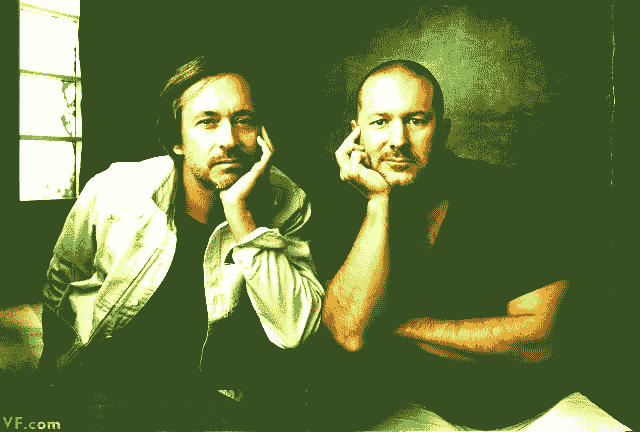
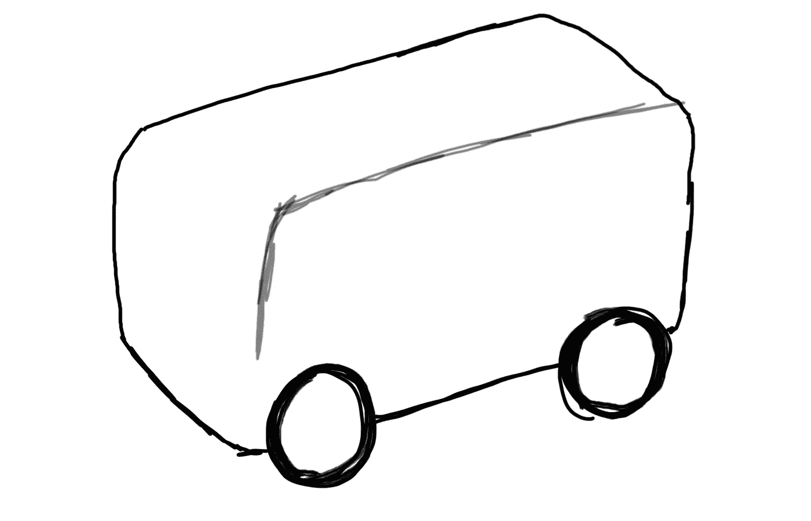
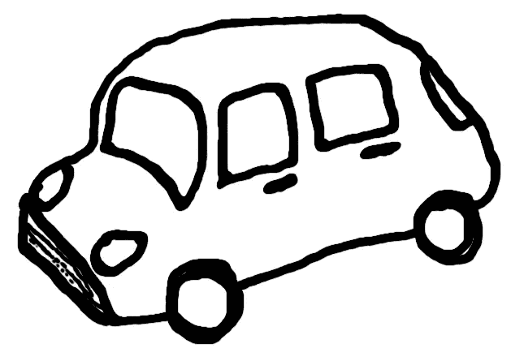

# 苹果车不会像你想象的那样

> 原文：<https://medium.com/hackernoon/the-apple-car-wont-look-like-you-think-e68bcd9ce7e9>

Marc Newson and Jony Ive, [VanityFair](http://www.vanityfair.com/news/business/2013/11/jony-ive-marc-newson-design-auction)

## 苹果的历史告诉我们，如果他们曾经制造过一辆汽车，它将被从头开始重新考虑。

当你问人们如何想象假设的苹果制造的汽车看起来会是什么样子时，他们肯定会指出他们在电影中看到的奥迪或法拉利的一些未来概念，这些概念有着疯狂的车轮，甚至飞行或悬浮。但是**我很确定苹果车会是这个样子:**

If you’re not into my artistic abilities, you should.

让我解释一下。苹果的设计理念在他们的历史中一直非常一致，它可以归结为 [**成千上万个“不”对应每一个“是”**](https://www.youtube.com/watch?v=XAEPqUtra6E&utm_source=mixx_io&utm_medium=mixx_io)**，基本上是**去掉一切可以去掉的东西**，然后更多。圣埃克苏佩里[说得好一次:](https://fr.wikiquote.org/wiki/Terre_des_hommes?utm_source=mixx.io&utm_medium=mixx_io)**

> **似乎完美不是在没有更多的东西可以添加的时候，而是在没有更多的东西可以移除的时候。**

# **“标准汽车”:1890-2020**

****

**The “Standard Automobile” we all know and love.**

**想想日常的、普通的、最普通的汽车:四扇门，窗户在侧面，引擎产生一个前凸，接着是汽车本身的主*住所*，人们坐在一排、两排——很可能是三排座位上。毕竟它去了主干。在后面，它以不同的灯泡、排气管和另一扇窗户的形式为人类提供了一些指示。**

**在车内，我们所有的座位都指向前方，方向盘，踏板，仪表板充满了视觉元素作为人机界面，还有许多小地毯。**

**在前面有两盏灯，一个散热器和一个前玻璃。这三个元素是每辆汽车工业设计的要点，汽车工业设计师专注于为汽车获得最独特和最有吸引力的外观。**

# **苹果汽车:2020-？？？？**

**苹果不会制造适合所有人的产品。这让许多人感到沮丧，他们不明白，40 年后，也许他们不是宇宙的中心，也不是每一种消费技术产品都以他们为目标。**

**如果苹果公司像他们保证的那样，想要彻底改变运输市场，他们应该首先瞄准世界上大多数旅行是如何进行的:在城市环境中，以缓慢的速度，由少数人进行，大多数是独自进行。假设自动驾驶和电动发动机，让我们来看看**我们能从“标准汽车”中去掉什么**:**

1.  ****四个门:**你不需要四个洞才能进一辆车，一个就够了。**
2.  ****成排的座位:**座位空间不一定要指向前方。你不能像那样充分利用内部空间。**
3.  ****两个前灯:**在法规允许的情况下，中间一个大的灯就足够了(可能是一个苹果标志的形状)。**
4.  ****两个红色背光:**一样，减到最少。**
5.  ****眼罩:**一样。**
6.  ****前散热器:**电动车不需要。**
7.  ****前保险杠:**发动机直接放在车轮上，告别曲轴和传动轴。**

**但我说苹果总是超越和**删除进一步的元素，将是“可接受的”。让我们继续扔掉更多的东西:****

1.  ****后备箱:**如果你的大部分出行都是在城市环境中，为什么还需要后备箱。你带着的东西会跟着你走。**
2.  ****向前看的座位:**现在它们指向唯一的门，或者放在里面。就像豪华轿车的后座。**
3.  **前玻璃:如果你不开车，为什么你需要前玻璃？有些窗户不见了。**
4.  **空气动力学:大部分行程都很慢，空气动力学改进的好处可以忽略不计。立方体是最大化内部空间的最有效方式。**
5.  **仪表盘:如果你不开车，你就不需要知道或看到。例如，汽车会通过 iPhone 告诉你所有你需要的东西。**

**说到这里，我再次向你们展示苹果汽车:**

****

**Maybe it even has the Apple logo prominently in the front**

**如果苹果真的发布了一辆汽车，我已经可以听到互联网上的喧嚣，顺便说一下，这一点还不清楚。也许苹果通过一些软件、平台或者服务进入交通行业。一切都摆在桌面上。甚至有可能苹果车可能更高，没有座位，所以通勤者/乘客站在里面。**

# **结果**

**这将是一辆可坐 1-2 人的**车，当然不会超过 3-4 人。让我们记住，这些汽车将针对短距离的城市旅行。需要更多座位的家庭和团体将不得不乘坐几辆车。现在你不需要一个有能力的有执照的成年人，这就变得容易了。例如，成年人可以坐一辆车，孩子可以坐另一辆车。带奶奶去看医生或带孩子去学校的活动已经结束，他们现在可以自己走了。****

**制造汽车的实际材料的变化也很重要，**没有多少由更重、更坚固的金属制成的抗变形结构**增加了汽车的重量。由于这些车不太可能被撞，甚至不太可能碰上另一辆车，所以玻璃、碳纤维和铝做墙壁已经足够了。**有点像公共汽车的墙壁。****

**周边产业也会随之改变。我说的不是加油站和经销商，这两个领域将经历深刻的转变。电动发动机需要更少的维护和更少的维修车间。此外，将事故发生的几率几乎降至零将大大降低汽车保险的地位。**

**有什么问题吗？**在** [**发推文 me @somospostpc**](http://twitter.com/somospostpc)**

************

> **[黑客中午](http://bit.ly/Hackernoon)是黑客如何开始他们的下午。我们是阿妹家庭的一员。我们现在[接受投稿](http://bit.ly/hackernoonsubmission)并乐意[讨论广告&赞助](mailto:partners@amipublications.com)机会。**
> 
> **如果你喜欢这个故事，我们推荐你阅读我们的[最新科技故事](http://bit.ly/hackernoonlatestt)和[趋势科技故事](https://hackernoon.com/trending)。直到下一次，不要把世界的现实想当然！**

****