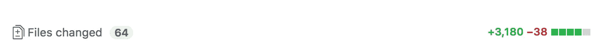
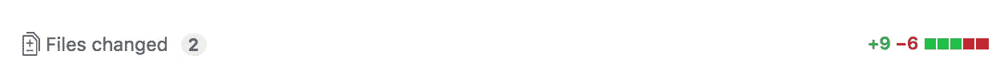
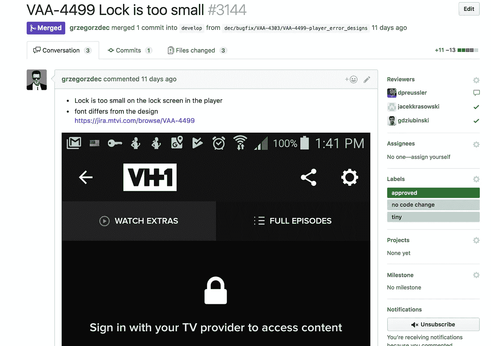
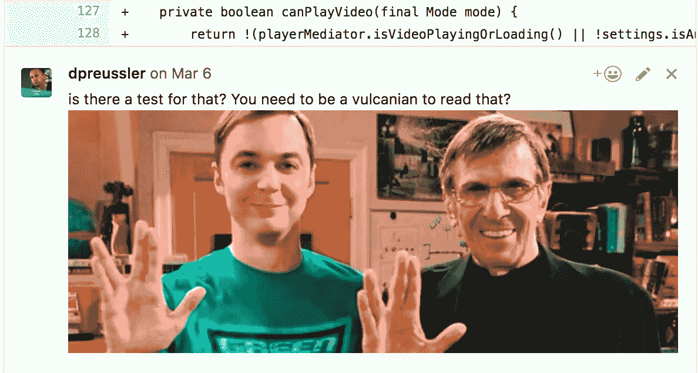
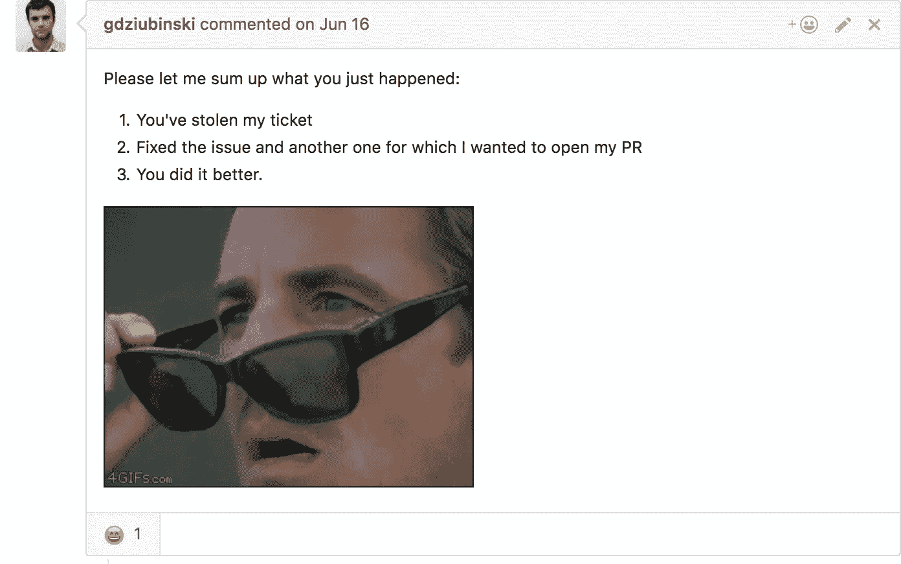

# 拉取请求的艺术

> 原文：<https://medium.com/hackernoon/the-art-of-pull-requests-6f0f099850f9>

正如我之前写的那样，我们的团队成员分散在世界各地。这意味着代码审查和[拉请求](https://hackernoon.com/tagged/pull-requests)必须远程完成。

最近，我们[团队的一名成员](https://twitter.com/_west_on)提出了这个宣言:

> *作为公关写手，我会:*
> 
> -保持 PRs 较小
> 
> -使用标签表明公关是许多部分中的一部分
> 
> -打开时，将钻杆排放系统置于松弛状态
> 
> *作为公关评审，我将:*
> 
> -我一有空就努力复习。
> 
> -批准，只要比以前好
> 
> -更喜欢开一张新罚单或要求跟进 PR，这样比拒绝 PR 更好
> 
> -倾向于建议而不是拒绝，尤其是当标签显示有多个部分时

让我们看看这个。本质是:**拉请求需要小而快！**

这也符合[程序员的誓言](http://blog.cleancoder.com/uncle-bob/2015/11/18/TheProgrammersOath.html):

> 我会频繁地发布小消息，以免妨碍他人的进步。

但是众所周知，拉式请求的问题通常是它们会被搁置一段时间。

## 请求越大，审查时间越长

我们希望尽可能接近一种头部开发方法，在这种方法中，代码可以很容易地进入主/开发。我们的目标应该是一个连续的好代码流。
我们需要对抗长寿特征分支，因为它们是万恶之源！

因此，拉请求需要能够被快速审查，以便快速合并代码。
但是这只适用于小的拉取请求！你不会在大型公关上获得好评，而且需要很长时间才能合并。正因为如此，一些公司对每个 PR 的行数有限制。一般来说，它们的长度应该少于 300 行，否则它们将不再可审查。

## PR 越长，审阅者就越累

如果复习很累，开发者就不会想复习了。但是我们需要团队尽可能经常地审查代码，所以不要让他们为难！

## 给出上下文

让审阅者容易理解您的更改。他们可能不会像你一样熟悉你正在做的事情。补充一个[好的描述和一些截图](https://hackernoon.com/no-description-provided-8d9e0f3a3abb):

## 防止上下文切换

越早收到评审意见，开发人员就越不可能已经开始下一项工作，并且不得不将上下文切换回上一项工作。花费的时间越长，就越难将上下文切换回来并做出改变。因此，让你的拉取请求越少越好，并尽可能频繁地创建它们:至少一天一个！或者更频繁！
**如果你这样做的话，重定基数问题将变得非常罕见。**

# 评论者也需要帮助

如果您每天只审查一次拉请求，那么每天打开多个请求的想法对您的团队来说是不可行的。所以要经常复习！在每次休息之后，在你开始一张新票之前，在每个[番茄周期](https://en.wikipedia.org/wiki/Pomodoro_Technique)之后，或者每次你自己打开一个拉动请求。
我们的团队引入了类似于看板中 [WIP 限制的未完成拉动式请求上限。任何人都不允许打开一个拉请求，如果达到限制，首先审查其他人清理队列！](http://kanbantool.com/kanban-wip-limits)

## 专注于重要的事情

所有的代码风格都应该首先通过一些自动化的任务来检查——这不是人类的任务。CI 应该有助于处理大量的代码检查(静态分析:反模式、复杂性、潜在的内存泄漏),评审可以很容易地集中在逻辑和架构上。

## 别太认真了

拉动式请求是与团队成员的讨论。不要把它变成一堂教学课。提出建议，而不是要求他们。友好点。使用表情符号和 gif 让读者对你的建议会心一笑:

评价是对同事的反馈，也有积极的反馈，如果事情做得好，会很感激。

## 拉式请求不适合长时间的架构讨论

不要过度讨论拉动式请求。反正已经晚了，代码都写好了！使用其他渠道，比如每天/每周的开发者会议。拉请求是为了确保质量水平的提高，并发现潜在的错误和副作用。
如果你的团队中有低年级学生，尝试使用结对[编程](https://hackernoon.com/tagged/programming)，不要通过拉请求来教学，因为这会令人沮丧。

## 如果代码比以前更好，就批准它

如果有可以做得更好的地方，打开一个问题或标签。当然，这需要一种持续解决技术债务的工作文化，这样这张票才不会被埋没在积压的工作中。
如果拉取请求只是一个部分请求单，则更容易确定优先级。另一个请求肯定很快就会到来，可以立即解决这个问题。

# 不要害怕

在像我们这样的远程设置中，当请求可能在一夜之间被合并时，这可能是很可怕的——您甚至没有机会看到或评论这些请求。当一个团队成长时，这是正常的。你不能控制、检查或知道任何一行代码。接受这一点需要勇气和信任！

PS:本文首发[此处](http://blog.viacom.tech/2017/08/23/the-art-of-pull-requests/)。