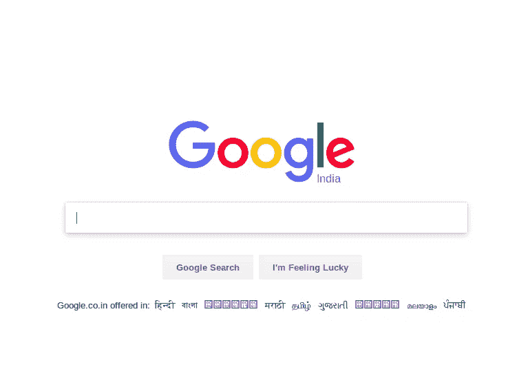
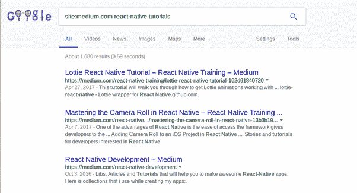
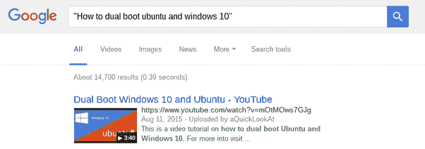
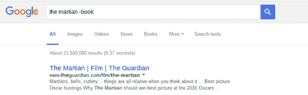
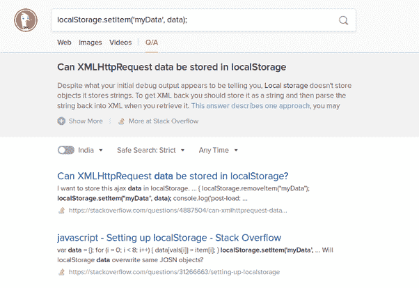
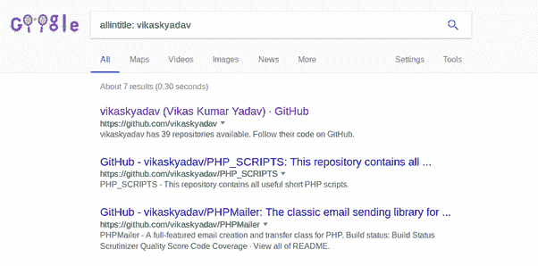
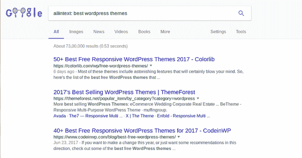
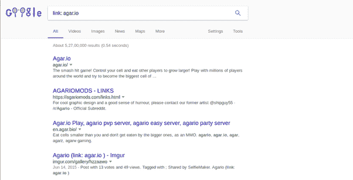
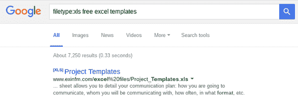

# 在网上搜索的艺术。

> 原文：<https://medium.com/hackernoon/the-art-of-searching-something-on-the-internet-20225127955c>

通常被称为“谷歌的艺术”。很多时候，我们希望在互联网上搜索一些话题，但最终得到的结果并不令人满意。这里有一份像昆西·拉森这样的专家推荐的技巧清单，你可以在搜索任何话题的时候考虑一下。

*   您可以通过在关键字之前或之后添加运算符`site:example.com` 来在特定的 URL 中进行搜索。在没有搜索功能的编程网站上搜索非常有用。

*   如果您要在**中寻找一个精确的短语**，请在关键字周围使用引号来查看包含该精确短语的结果。

*   如果您的搜索词包含具有多种含义的关键字，您可以通过在关键字前添加连字符(-)来**排除其中一种含义**。

*   谷歌在其查询中省略了大多数非字母数字字符。程序员一直用的符号喜欢！@#$%^&和*没有被搜索。都不是(){}[]。幸运的是， [DuckDuckGo](https://duckduckgo.com/) 最近开始支持搜索中的所有字符。所以考虑使用 [DuckDuckGo](https://duckduckgo.com/) 进行更复杂的搜索。它们真的是对程序员最友好的搜索引擎。

*   要生成与您已经知道的 URL 相似的内容**，在添加 URL 之前使用`related:`操作符。**

*   通过使用`allintitle:`操作符，您可以检索标题包含您正在搜索的关键词的**页面。**

*   要检索所有**关键字都出现在页面主体**中的页面，请在搜索词前使用`allintext:`运算符。

*   你可以一次在谷歌中输入一个以上的查询来查看带有指定关键词的页面。只需使用一个大写的“或”来分隔术语。

*   要查找来自某个特定地点的新闻，使用`location:`操作符，然后添加城市名。

*   星号充当通配符，帮助您找到短语中缺少的单词。

*   使用`link:`操作符，你可以**找到链接到另一个 url** 的页面。这对于搜索特定页面反向链接的 SEO 来说可能更有用。

*   如果你在网上寻找某个特定的文件，你可以使用`filetype:`操作符来指定你正在搜索的特定文件类型，然后[谷歌](http://www.ebay.com/sch/i.html?_nkw=google)会将结果限制在包含这些文件类型的页面上。

*   **使用网站会使用的词语**

当人们使用谷歌搜索在网上搜索时，他们通常会使用与说话时相同的语言来搜索东西。不幸的是，网站不会像人们那样说话；相反，他们试图使用听起来专业的语言。让我们看一些例子。

*   “我的轮胎漏气了”可以换成“修理漏气的轮胎”
*   “我头疼”可以换成“头痛缓解”

这个清单还在继续。搜索时，尽量使用专业网站上的术语。这将有助于您获得更可靠的结果。

*   **只使用重要的单词**

谷歌搜索的工作方式是将你搜索的内容与在线内容中的关键词进行匹配。当你搜索太多单词时，可能会限制你的搜索结果。这意味着你可能需要更长的时间才能找到你想要的东西。因此，在搜索时只使用重要的词是恰当的。让我们看一个例子。

*   不要用:哪里有送外卖的中餐馆。
*   相反，试试附近的中国餐馆。
*   或者:我附近的中餐馆。

这样做可以帮助谷歌找到你需要的东西，而不是所有的混乱。所以请记住，保持简单，只使用重要的词。

*   **Google Advance Book Search 或谷歌学术**
    当你寻找技术出版物时，使用[Google Advance Book Search](https://books.google.co.in/advanced_book_search)或[谷歌学术](https://scholar.google.co.in/)。它也给你一个能力，很容易引用来源。

寻找快乐！