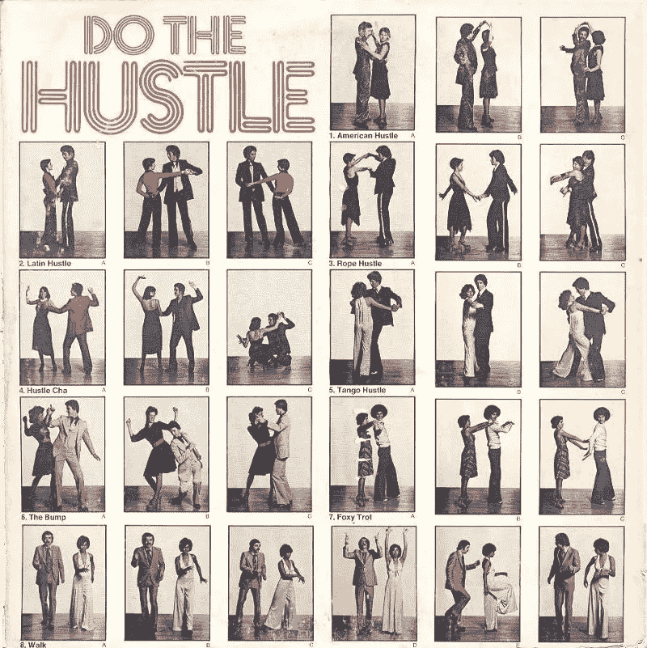
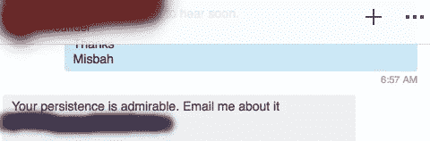
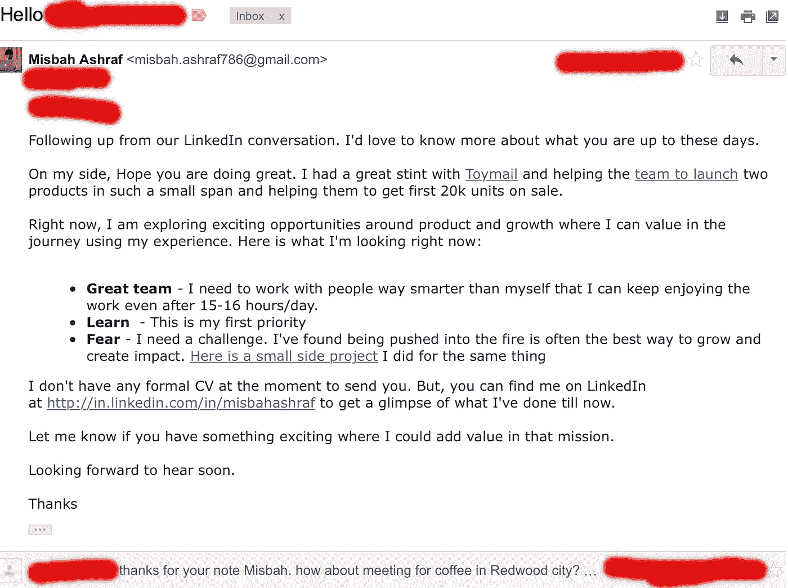
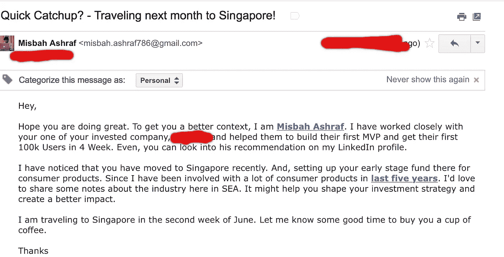
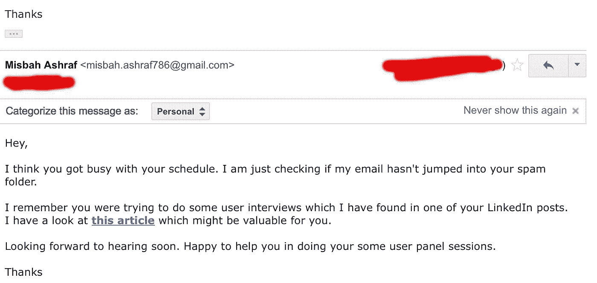
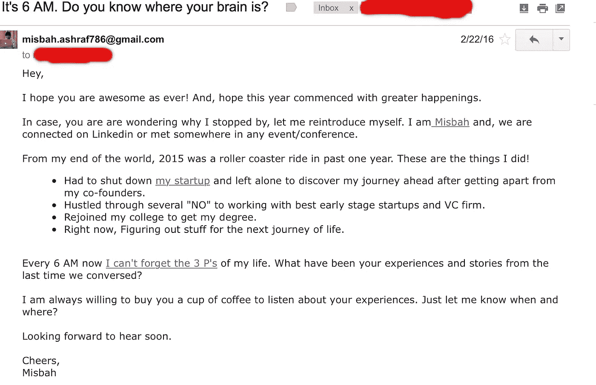

# 发送电子邮件的艺术——为什么你应该学习它

> 原文：<https://medium.com/hackernoon/the-art-of-sending-an-email-why-you-should-care-to-learn-it-3ba513df303e>

## 我是如何在大学期间赚到我的第一个 10 万美元的？

From journey of survival to making my first 100k USD while still in college

## 我的创业之旅是从生存的需要开始的。

我口袋里只剩下几百块钱，一些严肃的“如何做”盯着我的脸。

第二天我将如何支付我的食物账单？下学期我将如何支付我的大学费用？这促使我离开自己的舒适区，尝试做每一件事。

我经常想——整个世界都是通过互联网联系在一起的，不是吗？为什么我不能以此为契机，一起学习，一起生存？这种动力迫使我去尝试一些东西。在与 [**Cibola**](https://byrslf.co/first-100-days-of-my-startup-980e9f463e3e) 结束了我的第一轮创业后，我下定决心与世界上一些最优秀的人一起工作。

**但最大的问题是怎么做？我毫无头绪？我所知道的是，我将尽我所能去接触人们，用每一种可能的方式。**

但是如果他们说不呢？

当你第一次开始时，没有什么是完美的——这让大多数人害怕。但是，我从未放弃冒险。我知道最糟糕的情况可能是我得不到回应。

所以，我开始接触越来越多的人。一开始很吓人。我试图联系一些我认识的他们领域的大人物。我想知道他们是否有时间回复我，或者所有这些努力是否会白费。尽管我有所保留，但我坚持自己的信念，倾听我内心的声音:“试试”

Doing “The Hustle”

倾听自己内心的声音终于有了回报。

短短一年收到的效果很惊人。通过接触这些人并与他们一起工作，我赚到了第一笔 10 万美元，这笔钱帮助我为住在比哈尔邦的父母买了一块地。

通过与世界各地最优秀的人一起工作，我学会了如何快速构建和扩展社交产品，这些人在过去已经构建了一些优秀的产品。对于世界各地的许多人来说，这仍然是最具挑战性的任务。

> *“这不是小说，这是科学。”*

正如拉米特·塞西所说，

> “你应该多失败，因为这意味着你在尝试新事物。害怕失败就像自杀。你不会成长、进步或成为更好的人。你搞砸了，不断学习，然后搞砸得越来越少，最后你会抓住它。”

在大学期间，我觉得这是每个人都应该学习的技能——如何写一封吸引读者注意力的冷冰冰的电子邮件。

全世界都在接受远程工作文化。因此，清晰沟通的艺术和科学将帮助任何千禧一代跳出大学生活，进入职业世界。

作为一个领导，如果有一项技能是你应该非常擅长的，那就是**沟通**。并且，写一封好的电子邮件是其中非常重要的一部分。

Sounds serious or confused?

所有的文章都不停地宣称电子邮件已死，其实绝对不是。如果方法正确，这仍然是建立有意义联系的最佳方式之一。

> **让你的想法、真诚的欣赏和个性在邮件中闪耀。你可能会对它的结果感到惊讶。**

以下是我在大学期间，在一年内从 0-10 万美元起步的过程中所学到的几点:

# 1.你没什么可失去的

马克·库班说

> **“每一个“不”都让你更接近“是”**

我们最害怕做的事情通常是我们需要做的事情。一个人在生活中的成功通常可以通过他/她愿意进行的令人不舒服的谈话的次数来衡量。决心每天做一件你害怕的事情。我养成这个习惯是因为我试图联系我崇拜的人。

如果对方不回复，也不是世界末日。你还在发那封邮件之前的位置。通常不是一个坏地方。

如果对方回复了，生活会变得更有趣。

这是我使用的冷信息的一个例子。我不认识这个人，但是我知道他是这个行业中回答我的问题和帮助我的最好的人之一。多次跟进后他回复了我。但是如果我放弃给他发冷冰冰的信息，我就永远不会得到他的回复，这是我一生中得到的最好的反馈。

# 2.学习 30 秒瞥见的艺术

你邮件的主题非常重要。没有人有太多的时间去检查他们邮箱里的所有东西。发送电子邮件时，你必须聪明。

*   让你的主题足够聪明，让读者可以打开。因为这是第一阶段，你得过，不然怎么会有人看你邮件的内容。然而，主题并不总是打开率低的罪魁祸首。
*   你的前三行应该能快速概述你是谁？你为什么写作？
*   最后两行应该集中在**上，你想让读者做的最后一件事是什么？**
*   你的邮件应该有一个故事，可以吸引读者阅读整封邮件，并让他们执行你想从他们那里得到的行动。如果你的邮件很吸引人，人们会去读它，不管它有多长。

这是我最近用来和一个最好的消费者网络投资者交流的电子邮件。尽管我们最终没有一起做生意，但他让我认识了很多优秀的创始人，他们正在开发很棒的产品。

# **3。在给任何人发邮件之前都要好好研究一下。**

**知道你在给谁写邮件**非常重要。这似乎是显而易见的，但在过去 6 年里，我收到的 90%的电子邮件都没有很好地执行。**一封没有人情味、含糊不清、平淡无奇的电子邮件不会让你走得很远。你需要好好做功课。这有助于你在邮件中创造良好的语境，让邮件内容更吸引人。它在接收者的头脑中给出了一个非常好的信息。这让他们明白，你是真心实意地向他/她伸出援手，提供了一个可以为你增值的良好环境。**

# 4.给予，不要索取

我真的相信，如果你谦虚、乐于助人、认真，你可以利用一封冷漠的电子邮件。

我非常赞同先给予后索取的哲学。我总是这样。即使当我试图要求别人的 30 分钟。如果我觉得自己在他/她的任务中增加了一些实实在在的东西，我会在前 20 分钟内努力增加很多实实在在的价值，然后提出任何要求。

这给人们带来了非常好的影响，他们变得愿意以任何方式帮助你。我多次发现这很有帮助，它帮助我和像 Ask.com 前创始人这样的人一起工作。

好运总是帮助✌️

我由一些客户赞助去新加坡旅行。我想利用这个机会，促成一些好的会议。我做了很多功课，比如我想在那里见谁，谁能给我带来长远的价值。

我喜欢加入少量的谦逊或幽默，以展示一丝个性。因此，我提供了一些帮助，并对相关行业进行了深入研究，然后问他是否有兴趣边喝咖啡边见面。我已经查看了他的 Linkedin，并在脸书/推特上跟踪他。我知道他在美国度过了 20 年的职业生涯后，刚刚搬回新加坡。他即将建立自己的基金，任何深刻的见解对他来说都是非常有价值的。这不仅帮助我与他建立了良好的关系，他还向我介绍了他投资组合中全球 50 多家公司。

# 5.永远不要忘记跟进

每个人在他们的生活中都很忙。有时他们可能会错过你的邮件或者忘记回复。人们写了很多冷冰冰的电子邮件，但从来没有跟进过。跟进是成功将你的电子邮件转化为机会的关键之一。

1.  持续跟踪人们会给企业家带来最好的结果。
2.  沉默并不意味着拒绝——它可能只是意味着那个人很忙或者不知何故错过了你的邮件。
3.  学会提醒人们你真的对对话感兴趣，并尝试在你的后续邮件中提供一些价值。

这是我在试图寻找印度早期基金的机会时使用的后续电子邮件之一。它帮助我与印度最好的基金合伙人进行了非常有趣的对话。

在过去的两年里，我开始了一种新的方式来跟进我的网络。因为我意识到我们在生活中会遇到很多人，所以很难了解每个人的最新情况。所以，我决定每半年更新一次我的网络。

这是我用来重新连接我的网络的电子邮件副本之一。我总是对我得到的结果感到惊讶。我有我的商业伙伴、许多好朋友和许多疯狂的机会。

冷冰冰的邮件不容易破解。这是一门需要刻苦练习才能达到完美的科学。我在这上面花了 6 年时间。

不要犹豫发送冰冷的电子邮件，竭尽全力抓住你想要的机会。

## 我今天非常兴奋地宣布，我已经决定在今年培训 100 名员工来破解冰冷邮件的科学。更多信息请点击 [**这里**](https://misbahspeaks.typeform.com/to/tIvqeE)

> [黑客中午](http://bit.ly/Hackernoon)是黑客如何开始他们的下午。我们是 [@AMI](http://bit.ly/atAMIatAMI) 家庭的一员。我们现在[接受投稿](http://bit.ly/hackernoonsubmission)并乐意[讨论广告&赞助](mailto:partners@amipublications.com)机会。
> 
> 如果你喜欢这个故事，我们推荐你阅读我们的[最新科技故事](http://bit.ly/hackernoonlatestt)和[趋势科技故事](https://hackernoon.com/trending)。直到下一次，不要把世界的现实想当然！

