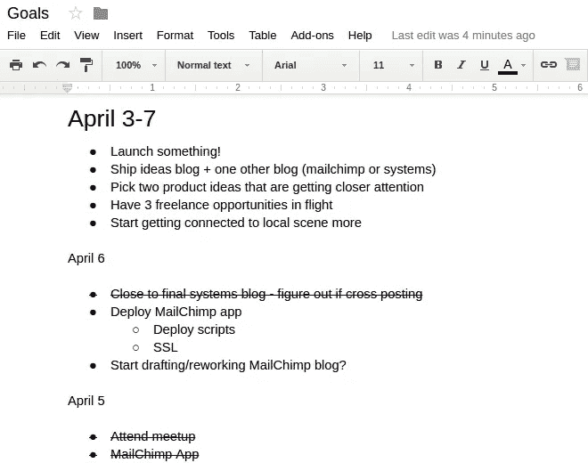
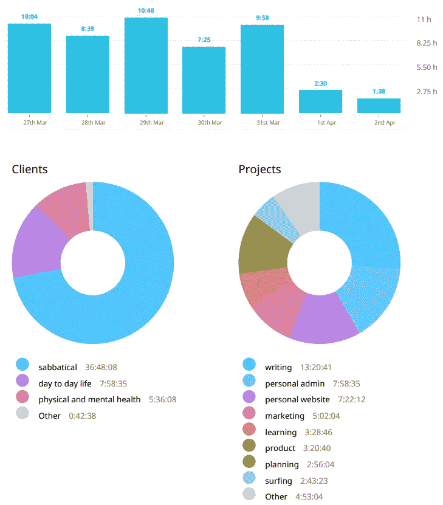

# 独自工作的艺术

> 原文：<https://medium.com/hackernoon/the-art-of-working-alone-d68f0ec77419>

几个月前，我遇到了一个她称之为“激进休假”的人，我们因为自我导向的兴奋而结合在一起。直到我意识到——据我所知——她的休假包括环游世界和参加派对，同时靠自己的积蓄生活。这听起来像一个爆炸，但我忍不住在我的大脑中蔓延的判断。

“哦，她称她的事情是休假，但实际上她只是在 T2 度假。我的休假将会大不相同。在休假期间，我会真正地学习和完成一些事情。”

呵。

完成什么，确切地说？无事可做的问题是…嗯，你无事可做。或者更准确地说，你有*什么*要做。任何事情都摆在桌面上。你如何从未来可能性的广阔空间中挑选出一项任务？在你面前看似无限广阔的时间中，你如何分配一个小时？可能会有点麻痹。

幸运的是，在我的职业生涯中，我积累了很多做事的经验。所以我知道——或者至少我相信——关键在于*结构*。创建一个系统，通过这个系统，你可以提出想法，进行一些思考和优先排序，并在另一边弹出有用的输出。拥有正确的系统就像乘坐火车一样——你只需要保持在轨道上，你就会朝着你的目的地不断前进。

> *“创业成功可以通过遵循正确的流程来实现，这意味着它可以学习，也意味着它可以教授。”——埃里克·里斯，* [*精益创业*](https://www.amazon.com/gp/product/0307887898)

# 我的系统

这是我在六个月的实验中将要尝试的一些系统。它们代表了我在过去十年中学到的应用于我当前情况和目标的生产力课程的精华。

1.  不断设定和实现目标
2.  无情地记录时间
3.  每周运送一些东西
4.  定期回顾
5.  公开定期写作
6.  腾出时间学习(但不要太多)

我将在下面逐一介绍。

# 不断设定目标

我决定我的主要工作单位是一周，所以我用每周一设定的周目标来试着让自己保持在正轨上。我也在用每日目标——在我做任何事情之前设定早晨的第一件事——来尝试和指导每一天。

我把我的目标保存在一个简单的谷歌文档中。我的周目标位于文档的顶部，而我的日目标位于它们的正下方。它看起来是这样的:

*是的，我正在玩与 MailChimp 相关的东西*

有了这种格式，我可以很快地看到我的每日目标是如何朝着每周目标前进的，并确保我没有偏离方向。我也可以很容易地知道我在一天的目标中做得如何。

如果我在某一天没有完成目标，我必须手动将它带到第二天，或者决定放弃它——我发现这是每天早上都要做的一项有用的练习。我已经将每周目标回顾建立到我每周都在做的回顾过程中，稍后我会对此进行更多的讨论。

到目前为止，我发现定期设定和思考目标对指导我的时间和防止我掉进兔子洞很有用。

# 无情的时间记录

我一直非常相信跟踪我的时间，并且已经专业地做了很多很多年了(首先是政策，现在是选择)。我相信勤奋的时间记录将是确保我合理利用时间的关键——在我的时间表中建立可见性和责任性。像目标一样，我在我的每周回顾过程中建立时间花费回顾，当我的时间与我预期的不同时，让我纠正或反思。

*我如何度过我的第二周*

# 航运周刊

由于我的休假是无限期的，我知道有很高的“[分析瘫痪](https://en.wikipedia.org/wiki/Analysis_paralysis)”的风险——过度分析一种情况，以至于永远不会做出决定或采取行动的状态。

为了帮助克服这一点，我有一个更广泛的目标，每周运送一些东西。它不必是任何花哨的东西——我目前正在计算抛光的博客帖子，尽管这有望改变——这个想法只是定期向世界发布*的东西*,作为一种强制功能，以防止在事情变得完美之前搅动它们。这非常符合每周的目标，大概应该总是包括运送一些东西。

# 定期回顾

从专业角度来说，我一直认为回顾非常有用，但也经常观察到，除非将其纳入一个过程，否则很少进行回顾。当我们可以做眼前的事情时，为什么要回顾过去呢？

我已经提到了这一点，但我决定每周进行回顾，以反思这一周，看看我的目标是如何实现的，看看我的时间支出，并评估我的整体情绪状态(不能忘记这一点！).这是我第一周的一个例子。

# 公开写作

我正在尝试的另一个策略是定期写作，我的目标是发表我写的所有东西。我这样做有几个原因。

写作有助于理清我自己的思路

实际上，我在休假的第一天就开始写这篇文章，因为我想规划出我每天和每周的结构。通过写下来，我能够巩固这个过程，更好地理解我为什么要做这些事情。

**公开写作帮助我获得意见和反馈**

到目前为止，仅仅是通过公开写东西，我就已经有人联系我，1)给我很好的建议，2)对我的想法给我坦率的反馈(剧透:它们大多很糟糕)，3)给我推荐东西。

拥有这个社区已经帮助我克服了我担心的一个陷阱:独自工作的孤立感。

> *只是写得不好。继续写得很差，在公共场合，直到你能写得更好。我相信每个人都应该在公共场合写作。”—塞思·戈丁，* [*话匣子*](http://sethgodin.typepad.com/seths_blog/2011/09/talkers-block.html)

写作是一种有趣的实验方式

我还不知道我会做什么，我有机会根据人们的兴趣(或缺乏兴趣)来测试我可以以一种引人入胜的方式写什么主题。这可能有助于告知我今后应该瞄准什么类型的市场或受众。

**写作产生一些责任**

最后，我希望通过写关于休假的文章，我将被迫坚持到底。对我正在做的事情保持沉默会容易得多，如果我从来没有完成任何有价值的事情，我可以说我只是休息了六个月。虽然这很好——坦率地说，容易得多，也不容易引起焦虑——但这与我人生中这一阶段的目标并不一致。

# 腾出时间学习

这段时间我最大的目标之一就是学到很多东西，我想我学到的大部分东西都是在工作的过程中。到目前为止，我构建的所有东西都使用了至少一两种对我来说是新的技术。我在努力做好前端设计。当然，我也在努力提高我的写作能力。

然而，尽管我一直是边做边学风格的支持者，我也知道每次我花时间真正研究某样东西时，我几乎总是会发现它非常有价值(并且通常会觉得我早就应该研究那件东西了)。

所以除了在工作中学习，我每周明确地划出时间进行纯粹的学习——比如阅读书籍和博客、参加在线课程或观看教学视频。为此，我希望设定一个最短时间(这样我就不会忘记)和一个最长时间(这样我就不会沉迷于阅读而忘记创作)。我目前的目标是每周 2-5 小时。

# 回到更大的画面

因此，在一些关于我将如何工作的外围问题上取得了一些进展之后，我仍然没有一个清晰的感觉，我将如何选择在 T2 工作什么。当“思考和谈论如何工作”变成了实际的工作——我怎么知道我在做正确的事情？我如何才能确信我每周的进步实际上是朝着更大的目标前进？

简而言之，我还不知道。我最希望的是在这些系统中工作，就像这些系统在我的第一个目标“定义我日常工作结构的大致形状”中一样。

我现在在铁轨上，所以让我们看看火车要去哪里！

*如果你能坚持到现在，非常感谢你的阅读！如果你也按下心形按钮来帮助其他人找到它，我会非常感激！*

*原载于*[*www.coryzue.com*](http://www.coryzue.com/writing/working-alone/)*。*

> [黑客中午](http://bit.ly/Hackernoon)是黑客如何开始他们的下午。我们是阿妹家庭的一员。我们现在[接受投稿](http://bit.ly/hackernoonsubmission)并乐意[讨论广告&赞助](mailto:partners@amipublications.com)的机会。
> 
> 如果你喜欢这个故事，我们推荐你阅读我们的[最新科技故事](http://bit.ly/hackernoonlatestt)和[趋势科技故事](https://hackernoon.com/trending)。直到下一次，不要把世界的现实想当然！

