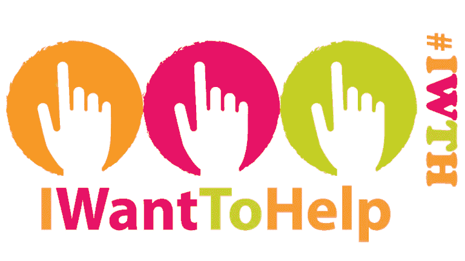

# Je Vais Aider 协会推出其移动应用程序“收集捐款”

> 原文：<https://medium.com/hackernoon/the-association-i-want-to-help-launches-its-mobile-application-a471e4d19a1>

> 随着其移动应用程序的推出，“我想帮助”协会标志着小额捐款团结募捐发展的新一步。

# 关于我们

Je Vais Aider 是第一个为所有参与该计划的组织(协会或基金会)开发小额捐款收集移动应用程序的非营利组织，名为 [IWantToHelp](https://play.google.com/store/apps/details?id=es.yoquieroayudar.app&hl=en) 。我们还促进慈善机构的志愿服务。

众所周知，对于慈善机构来说，筹款可能会很昂贵。我们希望降低全球所有慈善机构的成本；让捐赠过程变得容易和确定，让慈善机构在执行任务时更有效率。我们的目标？和你一起建造一个团结的世界。

 [## Aider.pdf 演讲协会

drive.google.com](https://drive.google.com/file/d/0BxcwHFwpsu1ka2d1enJQcmhNSzQ/view) 

# 概念:慈善机构零佣金捐赠

只需安装在 [Google Play](https://play.google.com/store/apps/details?id=es.yoquieroayudar.app&hl=en) 上免费提供的应用程序。我们从我们的[移动应用](https://play.google.com/store/apps/details?id=es.yoquieroayudar.app&hl=en)的用户那里为所有参与该计划的慈善机构收集小额捐款(2 到 10 英镑)。根据慈善机构及其所在国家的现行法律，这可能会导致捐赠者的税收减免。

然后，捐款全部交给所选择的慈善机构，该机构的会员资格是完全免费的；这意味着你不必给我们任何佣金作为我们的合作伙伴。一旦你的捐款超过 10 英镑，我们会立即从你的联合账户转账到你的 IBAN 银行账户。

要成为我们的合作伙伴组织之一，您可以与我们交流您的项目，并返回完整的成员表。

# 联合机构

团结机构促进协会和我们的合作伙伴慈善机构，并帮助我们为他们收集捐款。捐赠者可以从应用程序的交互式地图中看到您。通过扫描特定于每个机构的团结二维码，他们可以交流捐款的地点。

[**点击此处**](https://drive.google.com/file/d/0BxcwHFwpsu1kNURBdE5wOXVnOWc/view) 了解更多关于联合机构的信息。

# # GitHub 上的筹款 API

前端和后端的开发依赖于开源开发者。因此，我们正在寻找自由职业的 Go 软件或 Angular/React JS/ Javascript 开发人员和实习生来开发我们的**G**[**itHub**](https://github.com/YoQuieroAyudar/)**开源筹款项目……只要说“我想帮忙”就可以了。**

**你感兴趣吗？ [**在这里找到**](https://slides.com/yoquieroayudar-es/backend-charity-api/embed) 您可以如何帮助我们。**

**在推出一个月后，IWantToHelp 获得了超过 1000 名用户。我们的项目在法国、西班牙、比利时、瑞士、摩洛哥、突尼斯、美国、英国和澳大利亚发展。**

> **联系我们:**
> 
> **电话:+33 184 191 787**
> 
> **WhatsApp: +34 644 610 680**
> 
> **电子邮件:info@jevaisaider.org**
> 
> **推特: [@IWantToHelpUK](https://twitter.com/IWantToHelpUK)**

**感谢您对我想帮忙感兴趣。**

************

> **[黑客中午](http://bit.ly/Hackernoon)是黑客如何开始他们的下午。我们是阿妹家庭的一员。我们现在[接受投稿](http://bit.ly/hackernoonsubmission)并乐意[讨论广告&赞助](mailto:partners@amipublications.com)的机会。**
> 
> **如果你喜欢这个故事，我们推荐你阅读我们的[最新科技故事](http://bit.ly/hackernoonlatestt)和[趋势科技故事](https://hackernoon.com/trending)。直到下一次，不要把世界的现实想当然！**

****