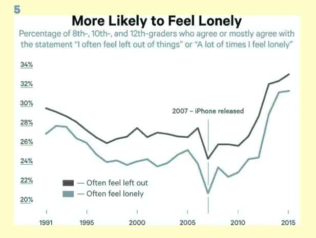
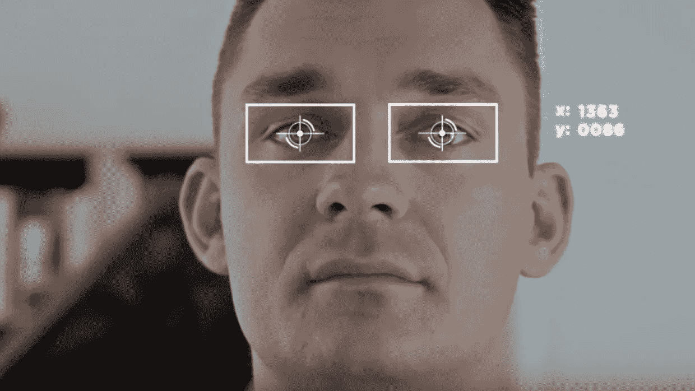

# 注意力经济是上瘾经济:呼唤新兴技术

> 原文：<https://medium.com/hackernoon/the-attention-economy-is-the-addiction-economy-a-call-for-ethical-emerging-tech-287ea58a3395>

Krang from Teenage Mutant Ninja Turtles

你好，我是克里斯·比斯利。我主持了一个关于新兴技术的 [*播客*](https://itunes.apple.com/us/podcast/embodied-reality/id1261112637?mt=2) *，创立了* [*人工智能初创公司*](https://www.theverge.com/2014/11/5/7163933/qcut-custom-jeans-400-sizes-using-algorithms-kickstarter) *，并在 Mozilla 负责产品管理，进行联合认证。我与数据科学家、密码学家、隐私和安全工程师一起工作了 15 年，以建立更人性化的技术。*

我们不是罐子里的大脑。哔哔声和振动不断提醒我们错过了什么，我们已经成为现代史上最焦虑和最需要药物治疗的群体。最近的科学突破使技术更加贴近皮肤，增加了使其更容易上瘾的可能性。现在是时候理解如何创造技术来增强我们的人性，而不是奴役我们。

谷歌前产品伦理学家和设计哲学家 Tristan Harris 解释了脸书、YouTube、Snapchat 和 Instagram 如何故意劫持我们的思想并操纵我们最大化我们在他们的应用上花费的时间。我们都感受到了推送通知、电子邮件和无限滚动订阅源的千刀万剐，但我们似乎忘记了今天和智能手机出现之前的世界之间的反差有多大。

毫不夸张地说，注意力经济正在杀死我们的孩子，或者更准确地说，我们的孩子正在杀死他们自己。自 2009 年以来，少女自杀率翻了一番。这种增长与花在看屏幕，尤其是社交媒体上的时间有因果关系。

Jean Twenge: iGen: Why Today’s Super-Connected Kids Are Growing Up Less Rebellious, More Tolerant, Less Happy — and Completely Unprepared for Adulthood — and What That Means for the Rest of Us

我写这个不是为了惹你生气。我来这里是为了对下一波技术的潜在滥用采取行动。消费硬件已经为 VR、AR 和生物传感器发货，这些传感器可以测量人类的压力、活动、健康和情绪状态的标志。

# 科学代码

这一次，我们必须在决定我们的技术带给世界什么时，带来更多的想法和观点。我们有基础研究要做，甚至要找出什么能增进幸福，什么有害。我们甚至还不知道这个。

为此，我正在探索一个暂定名为 *Hack Reality 的项目，以*将志愿软件开发人员与神经科学家、游戏设计师、心理学家联系起来，共同致力于开发不会上瘾的新兴技术。

当我们发现一个好的实践时，我们也会为它申请专利，并将其用于学术和非盈利用途。将专利授权给大公司可能是一个可持续的长期收入来源，以增加努力。当我们发现一种特别危险的做法时，我们会防御性地申请专利，不让它落入会造成伤害的手中。

> 如果你认为你的智能手机会上瘾，那你还什么都没看到。

这些新兴技术甚至比互联网更强大，具有巨大的行善潜力，但它们也是一把伤人的利剑。你可以用眼球追踪虚拟现实耳机在短短两分钟内诱导某人开始精神崩溃。幸运的是，这些耳机都没有以消费者价格售出。但是他们很快就会。

这是我需要你的地方。明年年初，我将召集一个沙龙，聚集在游戏设计、神经科学、用户研究、人类发展和心理学领域最有思想、最聪明的人。到今天结束时，我们将制定一个如何启动一个试点项目的计划，该项目将这些跨学科的专家联系起来，以建立一个 VR、AR 或生物传感器体验。

科技行业早就应该制造能提升人类的东西了——让我们觉得 T2 更有活力。我是说，没有这个我们就没抓住重点，对吧？

# 参与进来！！

如果这引起了你的共鸣，请[加入我们](https://crystalbeasley.typeform.com/to/SIFTNC)，告诉我们一些关于你自己的事情，以及你希望如何参与其中。我们将随时向您提供帮助！❤

这种思想的影响包括:
[斑马运动](http://zebrasunite.com)非成瘾科技公司的另类融资
[一种模式语言](https://www.amazon.com/Pattern-Language-Buildings-Construction-Environmental/dp/0195019199)作者[克里斯托弗·亚历山大](https://www.youtube.com/watch?v=nBlLhYtnVJo&list=PLvgG2TSEbaIgbgcXggjjrFJCNieUif4LN&index=81)
[时间用得其所](http://www.timewellspent.io/)
[我们正在构建一个监视的反乌托邦，只是为了让人们点击广告](https://www.ted.com/talks/zeynep_tufekci_we_re_building_a_dystopia_just_to_make_people_click_on_ads)作者:泽内普·图费基
[作者:詹姆斯·勒德](/@jamesbridle/something-is-wrong-on-the-internet-c39c471271d2)