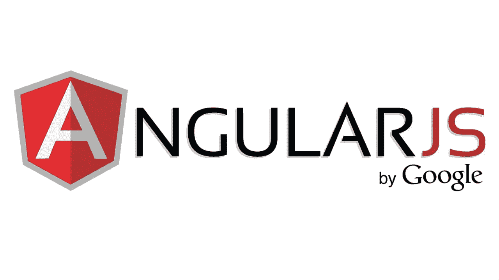
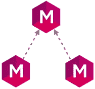

# 角度 JS 的基本概念

> 原文：<https://medium.com/hackernoon/the-basic-concepts-of-angular-js-32171c9e7a79>



credit: [https://www.amitavroy.com/justread/content/articles/working-xml-angular-js/](https://www.amitavroy.com/justread/content/articles/working-xml-angular-js/)

# 为什么要用 Angular JS？

*   帮助组织 [javascript](https://hackernoon.com/tagged/javascript) [代码](https://hackernoon.com/tagged/code)
*   帮助创建快速响应的网站
*   很好地使用 jQuery
*   很容易测试

> *为 HTML 增加交互性的客户端 javascript 框架。*

我们需要确定何时触发 Javascript。

# 指令

> *指令是 HTML 标签上的标记，告诉 Angular 运行或引用一些 Javascript 代码。*

例如，在下面的代码片段中，`ng-crontroller`是 body 标签上的一个**标记**

```
<body ng-crontroller='abcController'> </body>
```

引用的 javascript 代码是:

```
function abcController(){ 
    alert('hello Angular JS!'); 
}
```

第一步，从[官网](https://angularjs.org/)下载库

# 模块

*   模块是我们编写 Angular 应用程序的地方，用来封装我们的代码，使我们的代码更易于维护、测试和阅读。
*   模块是我们为应用程序定义依赖关系的地方。



让我们创建一个模块:

```
var app = angular.module('abcApp',[]);
```

并使用它:

```
<html ng-app='abcApp'> </html>
```

上面的代码什么也不做，目前它只是说整个`HTML`区域是 Angular 应用程序的一部分。我们可以从这一点开始使用表达式:

4

表达式也可用于字符串操作:

你好

# 控制器

> 控制器是我们通过定义函数和值来定义应用程序行为的地方。

让我们使用控制器在视图上打印一些数据。

```
(function(){var app = angular.module('abc', []);
app.controller('abcController', function(){ 
this.a = abc;
});var abc = {
propertyA : 'A',
propertyB: 'B'
};
})();
```

视图应该是这样的:

```
<div ng-controller='abcController as abc' > </div>
```

这对于单个对象很有效，但是如果我们有一个数组呢？

控制器内部:

```
(function(){var app = angular.module('abc', []);
app.controller('abcController', function(){ 
this.as = abc;
});var abc = [{
propertyA : 'A',
propertyB: 'B'
}, {
propertyA : 'C',
propertyB: 'D'
}, {
propertyA : 'E',
propertyB: 'F'
}];
})();
```

为了在视图中显示这一点，我们需要使用`ng-repeat`:

```
<div ng-controller='abcController as abc' > 
    <div ng-repeat='a in abc.as'> 
    </div> 
</div>
```

指令中有很多[内置，如`ng-app`、`ng-controller`、`ng-show`、`ng-hide`、`ng-repeat`等。](http://www.techstrikers.com/AngularJS/angularjs-built-in-directives.php)

# 过滤

过滤器的基本公式如下:

例如:

```
MM/dd/yyyy @ h:mm <!-- formats the date -->
lowercase string <!-- uppercases the string -->
a vvveeeerrrryy llooonnngggg strrrriiiinngggg <!-- limits the string to specified number 8 --> 
<li ng-repeat='a in abcs | limitTo: 3'> <!-- limits the array elements to specified number 3 -->
<li ng-repeat='a in abcs | orderBy: -A'> <!-- sorts the array elements in descending order because of - charachter -->
```

表达式中的管道字符要求表达式将第一个参数传递给表达式，并将其传递给表达式的第二部分。就像下面这样:

```
$2.695865
```

在这种情况下，货币是一个过滤器。

[来源](https://www.codeschool.com/courses/shaping-up-with-angularjs)

*原载于*[*xameeramir . github . io*](http://xameeramir.github.io/The-basic-concepts-of-Angular-JS/)*。*