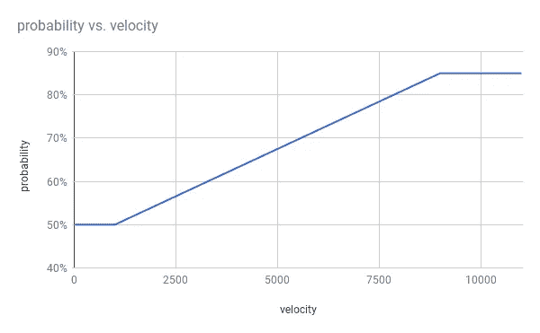
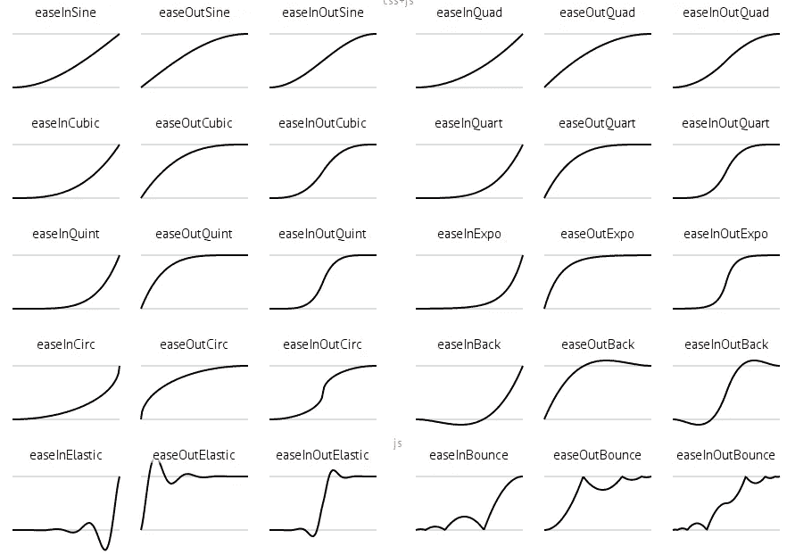

# 局部应用美、曲线美和功能组合美。

> 原文：<https://medium.com/hackernoon/the-beauty-in-partial-application-currying-and-function-composition-d885bdf0d574>


[photo by Bessi](https://pixabay.com/en/amazing-animal-beautiful-beautifull-736885/)

# 故事时间

今天，我有一个奇怪的函数需要写出来。它包含了太多的输入和数学运算(对于一个函数来说),比我希望的要多得多。即使数学本身实际上只是基本的三角学。写了几行代码后，很明显这个函数是不可维护的。

我想起了最近听到并爱上的一件事:

> 编程语言不是给计算机用的，而是给人用的。

另一个也是这样:

> [电脑不运行就坏了。人看不懂就坏了。很快。](https://stackoverflow.com/a/522831/504836)

❤

总之，回到函数。

我已经下定决心要重构这个东西。这是一个典型的重构，分解一些职责，加入一些局部的应用程序，添加一些修饰，然后用函数组合完成。

留给我的是一些非常优雅且易于维护的代码。我反思了以这种方式编写代码是多么罕见，这就是我今天分享的原因。

**免责声明:**单篇文章远不足以涵盖所有的函数式编程技术。我们不会深究其中任何一个。我希望这个*高层次的概述*能激起你对 FP 的好奇心，让你开始自己的旅程。

# 要求

那我到底在做什么？

我在试图计算一个事件发生的概率。我知道随着这个事件的`velocity`增加，事件发生的`probability`也增加。

如果`velocity`低于 1000，那么发生的`probability`总是 50%。如果`velocity`高于 9000，则`probability`跳到 85%的最大值。用图表更容易形象化，所以这里有一个图表。



我想把这些都封装到一个函数里。

这可以用一行三角学来解决，但它看起来像一个正则表达式或机器语言，今天，*我们正在为人们编写代码*。

# 开始

首先，我创建了一个校准对象来将`X`转换为`Y`。

```
const calibration = {
  x: { min: 1000, max: 9000 },
  y: { min: 50, max: 85 },
}
```

然后我*几乎*写了这段代码，如果值低于阈值就返回最小值`Y`，如果值高于阈值就返回最大值`Y`。

但是我真的不喜欢`if`的说法。如果你发现自己对为什么感到好奇，那么看看关于它的文章…

[](https://hackernoon.com/rethinking-javascript-the-if-statement-b158a61cd6cb) [## 重新思考 JavaScript:if 语句

### 功能性思维打开了我对编程的思维。它让我对代码有了更深的理解…

hackernoon.com](https://hackernoon.com/rethinking-javascript-the-if-statement-b158a61cd6cb) 

并且*使用`Math.min`和`Math.max`有一个更好的方法来做这件事*。因为我需要同时使用这两种方法，所以我打算只使用拉姆达的`clamp`方法，它确实做到了这一点。

# 特征缩放

特征缩放(Feature scaling)，也称为**规格化**，是一种机器学习技术，我认为在这里会应用得很好。

特征缩放的要点是将输入(`X`)缩放到`[0, 1]`之间的值。然后我将做相反的操作，将数字缩小到`Y`刻度。

**你应该忽略**下面的大部分代码，只需注意`normalize`，特别是它如何调用两个函数`scale`和`R.clamp`。`denormalize`做同样的事，只是反过来。

# 功能组成

函数合成是我最喜欢的 FP 工具之一。这是一种利用现有函数创建新函数的技术。

`normalize`和`denormalize`是函数组合的绝佳候选，我们可以使用 Ramda 的`pipe`方法将它们转换成:

没有很大的不同，但我们只走了一半。我们将在 Currying & Partial Application 部分进一步减少这个问题。

要继续学习更多关于函数合成的知识，请查阅我以前关于函数合成的文章。

[](https://hackernoon.com/javascript-functional-composition-for-every-day-use-22421ef65a10) [## 函数 JavaScript:日常使用的函数组合。

### 函数组合是函数式编程中我最喜欢的部分。我希望给你提供一个好的真实的…

hackernoon.com](https://hackernoon.com/javascript-functional-composition-for-every-day-use-22421ef65a10) 

# 固化和部分应用

Currying 是一种将带有多个参数的函数的求值转化为一系列函数的求值的技术，每个函数只有一个参数。— [维基百科](https://en.wikipedia.org/wiki/Currying)

Currying 允许我们轻松地将参数部分应用于`scale`和`R.clamp`。

**注意:虽然我在这里没有遵循 1 参数规则**，但是 min 和 max 也应该被分开。但是，它没有添加任何实用程序，因为 min 和 max 将同时提供，这会使示例变得复杂。有时，最好遵循法律的精神，而不是法律的字面意思:)

# 该功能

构建函数现在变得非常简单。这是因为我们已经写好了所有的逻辑。剩下的就是像这样组合`normalize`和`denormalize`:

就是这样！超级简单。

# 最后

总的来说，它看起来像这样:

**观察:**

每个函数都是一个**表达式**而不是一个*块*。函数*立即*返回它们的值。

每个函数都是**等幂的**，这意味着给定相同的输入，它将*总是*产生相同的输出。

每个函数都是一个纯函数。它只从*输入中计算输出*。

我们的大多数函数**不包含任何新代码**，它们只是由现有函数组成的**。**

# 额外学分

简单不仅仅是装饰。我正在处理的变换是线性的，但实际上它可能更接近下图中的 easeOutSine 或 easeOutCubic。



因为我们已经将代码分解成了小块，所以增强这个功能会非常简单。我们只需将我们的过渡添加到`R.pipe`管道中。这里有几种方法可以做到这一点:

# 放弃

我确实理解“更容易”是主观的，许多不熟悉函数式编程风格的人现在可能已经神魂颠倒了。

你必须先知道如何进行函数式编程，然后你也会有这种感觉。尽管一旦你这样做了，这种风格就成了显而易见的正确选择。这里的关键是*一旦你知道*。

这也不意味着是一个教程。这只是函数式 javascript 世界的一小部分。

# 摘要

嘿，你一路走到了最后！谢谢你听我的咆哮。我是真心的。

今天，我已经演示了如何将被分解成单一职责的功能轻松地组合成新的功能。

我知道我没有涵盖足够多的内容，但是我确实有很多其他的**函数式编程**文章，这些文章有更详细的内容。

[](https://medium.com/@joelthoms/latest) [## 乔尔·托马斯写的最新故事

### 阅读乔尔·托马斯在 Medium 上写的最新故事。计算机科学家和技术布道者，拥有 21 年的…

medium.com](https://medium.com/@joelthoms/latest) 

我知道这是一件小事，但当我在媒体和 Twitter 上收到这些后续通知时，我感到非常高兴。或者你觉得我满嘴屁话，在下面的评论里告诉我。

干杯！