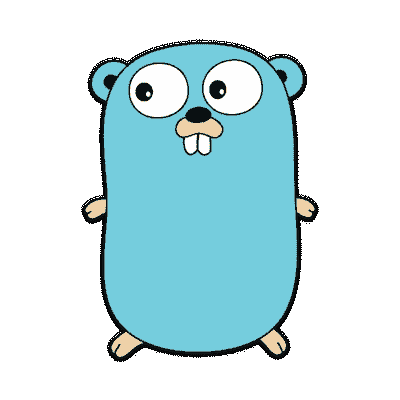
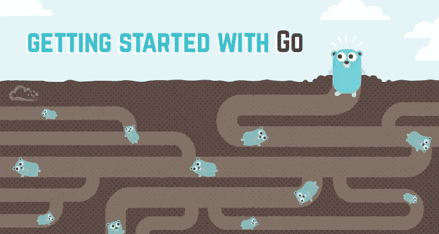

# 围棋的妙处

> 原文：<https://medium.com/hackernoon/the-beauty-of-go-98057e3f0a7d>

[Gopher](https://blog.golang.org/gopher) — Go’s Iconic Mascot

我最近开始为我的一些副业项目探索围棋，并真正被它的美丽所震撼。

我意识到它在易用性(通常与动态类型、解释型语言相关)和性能与安全性(类型安全、内存安全)(通常与静态类型、编译型语言相关)之间取得了多么完美的平衡。

除此之外，还有两个特性使它成为现代系统开发的完美语言。这两个特性在下面的优势部分有更详细的解释。

其中之一是对语言中并发性的一流支持(通过 goroutines 和 channels，解释如下)。根据其设计，并发性使您能够有效地利用 CPU 的能力。即使您的处理器只有一个内核，并发性的设计也能让您高效地使用该内核。这就是为什么您通常可以在一台机器上运行成千上万个并发的 goroutines(轻量级线程)。通道和 goroutines 是分布式系统的核心，因为它们抽象了生产者-消费者消息传递范式。

我真正喜欢 Go 的另一个特性是界面。**接口为您的系统启用松耦合或解耦的组件**。这意味着你的代码的一部分可以仅仅依赖于一个接口类型，并不真正关心谁实现了这个接口或者这个接口实际上是如何实现的。然后，您的控制器可以向该代码提供一个满足接口(实现接口中的所有功能)的依赖项。这也为单元测试提供了一个真正干净的架构(通过依赖注入)。现在，您的控制器可以注入代码所需的接口的模拟实现，以测试它是否正确地完成了工作。

记住所有这些特征，我认为 Go 真的是一门伟大的语言。尤其是像云系统开发(web 服务器、cdn、缓存等)、分布式系统、微服务等用例。因此，如果你是一名工程师或一家初创企业，正在决定你想探索或尝试哪种语言，请认真考虑一下。

在这篇文章中，我将讨论这种语言的以下几个方面:

a)简介
b)为什么需要 Go
c)目标受众
d) Go 的优势
e) Go 的劣势
f)对 Go 的看法 2
g) Go 的设计理念
h)如何入门
i)谁在使用 Go

# **简介**

Go 是一种开源语言，由 Robert Griesemer、Rob Pike 和 Ken Thompson 在 Google 开发。开源在这里意味着每个人都可以通过对新特性、修复错误等提出建议来为语言做出贡献。这种语言的代码可以在 [GitHub](https://github.com/golang/go) 上找到。关于如何对这门语言做出贡献的文档在[这里](https://golang.org/doc/contribute.html)提供。

# **为什么需要 Go**

作者提到设计一种新语言的主要动机是为了解决谷歌的软件工程问题。他们还提到，Go 实际上是作为 C++的替代开发的。

Rob Pike 提到了 Go 编程语言的目的:

“因此，Go 的目的不是研究编程语言设计；这是为了改善设计师和他们的同事的工作环境。Go 更多的是软件工程，而不是编程语言研究。或者换句话说，它是关于服务于软件工程的语言设计。”

**困扰谷歌软件工程领域的问题有**(摘自[https://talks.golang.org/2012/splash.article](https://talks.golang.org/2012/splash.article):)):

a)缓慢的构建——构建有时会花费长达一个小时的时间来完成
b)不受控制的依赖关系
c)每个程序员使用不同的语言子集
d)糟糕的程序理解(代码难以阅读、文档记录不良等等)
e)重复工作
f)更新的成本
g)版本偏差
h)编写自动工具的难度
i)跨语言构建

**围棋要想成功，围棋必须解决这些问题【https://talks.golang.org/2012/splash.article】(摘自):**

a) Go 必须在大规模下工作，为大型程序员团队工作，为有大量依赖项的程序工作。
b)围棋一定要熟悉，大致 C 类。谷歌需要让程序员在 Go 中快速高效地工作，这意味着语言不能太激进。c)围棋必须是现代的。它应该具有类似并发的特性，以便程序可以有效地利用多核机器。它应该有内置的网络和 web 服务器库，以便帮助现代开发。

# 目标受众

Go 是一种系统编程语言。Go 确实在云系统(web 服务器、缓存)、微服务、分布式系统(由于并发支持)等方面大放异彩。

# **优势**

**a)静态类型:** Go 是静态类型。这意味着您需要在编译时声明所有变量和函数参数(以及返回变量)的类型。虽然这听起来不方便，但这是一个很大的优势，因为在编译时会发现很多错误。当你的团队规模增加时，这个因素起着非常大的作用，因为声明的类型使函数和库更可读，更容易理解。

**b)编译速度:** Go 代码编译**真的很快**，所以你不需要一直等待你的代码编译。:)事实上,“go run”命令启动 go 程序的速度如此之快，以至于你甚至感觉不到你的代码已经先编译好了。感觉像是一种解释语言。

**c)执行速度:** Go 代码直接编译成机器代码，这取决于编译代码的机器的操作系统(Linux/Windows/Mac)和 CPU 指令集架构(x86、x86–64、arm 等)。所以，它跑得很快。

**d)可移植:**由于代码被直接编译成机器码，因此，二进制代码变得可移植。这里的可移植性意味着您可以从您的机器(比如说 Linux，x86–64)上获取二进制文件，并直接在您的服务器上运行它(如果您的服务器也在 x86–64 架构上运行 Linux)。

这之所以成为可能，是因为 Go 二进制文件是静态链接的，这意味着在编译时，程序需要的任何共享操作系统库都包含在二进制文件中。在运行程序时，它们不是动态链接的。

这对于在数据中心的多台机器上部署您的程序有很大的好处。如果您的数据中心有 100 台机器，您可以简单地将您的程序二进制文件“scp”给所有这些机器，只要该二进制文件是为您的机器运行的相同操作系统和指令集架构编译的。你不需要关心他们运行的是哪个版本的 Linux。不需要检查/管理依赖性。二进制文件简单地运行，所有的服务都启动了:)

e)并发性: Go 拥有一流的并发性支持。并发是 Go 的主要卖点之一。语言设计者围绕东尼·霍尔的论文“[通信顺序进程](http://www.cs.cmu.edu/~crary/819-f09/Hoare78.pdf)”设计了并发模型。

Go runtime 允许你在一台机器上运行成千上万个并发的 goroutines。Goroutine 是一个轻量级的执行线程。Go 运行时在操作系统线程上复用这些 goroutines。这意味着多个 goroutines 可以在一个 OS 线程上并发运行。Go 运行时有一个调度器，它的工作是调度这些 goroutines 的执行。

这种方法有两个好处:

I)一个 Goroutine 在初始化时有一个 4 KB 的堆栈。与通常为 1 MB 的操作系统线程堆栈相比，这实在是微不足道。当您需要同时运行几十万个不同的 goroutines 时，这个数字就很重要了。如果您要并行运行数千个以上的操作系统线程，RAM 显然会成为瓶颈。

ii) Go 可以遵循与 Java 等其他语言相同的模型，Java 支持与 OS 线程相同的线程概念。但是在这种情况下，OS 线程之间的上下文切换的成本比不同 goroutines 之间的上下文切换的成本大得多。

由于我在本文中多次提到“并发”，我建议您去看看 Rob Pike 关于“[并发不是并行](https://www.youtube.com/watch?v=cN_DpYBzKso)”的演讲。在编程中，并发是独立执行的进程的组合，而并行是(可能相关的)计算的同时执行。除非您拥有一个多核处理器或多个处理器，否则您不可能真正拥有并行性，因为一个 CPU 内核一次只能执行一件事情。在单核机器上，只有并发在幕后工作。操作系统调度程序调度不同的进程(实际上是线程。每个进程至少有一个主线程)。因此，在某个时刻，您只能有一个线程(进程)在处理器上运行。由于指令的高速执行，我们感觉有多个东西在运行。但实际上只是一次做一件事。

并发是指同时处理大量的事情。并行就是同时做很多事情。

接口:接口支持松散耦合的系统。Go 中的接口类型可以定义为一组函数。就是这样。任何实现这些函数的类型都隐式地实现了接口，也就是说，你不需要指定一个类型来实现接口。这是由编译器在编译时自动检查的。

这意味着你的代码的一部分可以仅仅依赖于一个接口类型，并不真正关心谁实现了这个接口或者这个接口实际上是如何实现的。然后，您的 main/controller 函数可以为该代码提供一个满足接口(实现接口中的所有函数)的依赖项。这也为单元测试提供了一个真正干净的架构(通过依赖注入)。现在，您的测试代码可以注入代码所需的接口的模拟实现，以便能够测试它是否正确地完成了它的工作。

虽然这对于解耦来说很好，但另一个好处是，您可以开始将您的架构视为不同的微服务。即使您的应用程序驻留在单个服务器上(如果您刚刚起步)，您也可以将应用程序中所需的不同功能设计为不同的微服务，每个微服务实现一个它承诺的接口。所以其他服务/控制器只是调用你的接口中的方法，并不关心它们是如何在幕后实现的。

**g)垃圾回收:**不像 C，在 Go 中不需要记得释放指针，也不需要担心悬空指针。垃圾收集器自动完成这项工作。

**h)没有异常，自己处理错误:**我喜欢 Go 没有其他语言拥有的标准异常逻辑。Go 迫使开发人员处理诸如“无法打开文件”等基本错误，而不是让他们将所有代码包装在一个 try catch 块中。这也给开发人员带来了压力，他们需要考虑如何处理这些故障场景。

**i)令人惊叹的工具:**围棋最棒的一点就是它的工具。它有如下工具:

i) [Gofmt:](https://blog.golang.org/go-fmt-your-code) 它自动格式化和缩进你的代码，让你的代码看起来和地球上每个 Go 开发者一样。这对代码的可读性有很大的影响。

ii) [Go run:](https://golang.org/cmd/go/#hdr-Compile_and_run_Go_program) 这将编译您的代码并运行它，两者都是:)。因此，即使 Go 需要编译，这个工具也会让你觉得它是一种解释型语言，因为它编译代码的速度如此之快，以至于你甚至感觉不到代码是何时编译的。

iii) [Go get:](https://golang.org/cmd/go/#hdr-Download_and_install_packages_and_dependencies) 这将从 GitHub 下载库，并将其复制到您的 GoPath 中，以便您可以将库导入到您的项目中

iv) [Godoc:](https://godoc.org/golang.org/x/tools/cmd/godoc) Godoc 解析您的 Go 源代码——包括注释——并生成 HTML 或纯文本格式的文档。通过 godoc 的 web 界面，您可以看到与它记录的代码紧密结合的文档。只需点击一下鼠标，你就可以从一个函数的文档导航到它的实现。

你可以在这里查看更多[工具](https://golang.org/cmd/go/)。

**j)伟大的内置库:** Go 有伟大的内置库来辅助现代开发。其中一些是:

a) [net/http](https://golang.org/pkg/net/http/) —提供 http 客户端和服务器实现

b) [数据库/sql](https://golang.org/pkg/database/sql/) —用于与 sql 数据库的交互

c) [编码/json](https://golang.org/pkg/encoding/json/) — JSON 被视为标准语言的一级成员:)

d)[HTML/模板](https://golang.org/pkg/html/template/) — HTML 模板库

e) [io/ioutil](https://golang.org/pkg/io/ioutil/) —实现 I/O 实用功能

在 Go horizon 中有许多开发正在进行。你可以在这里找到所有工具和用例的 Go 库和框架。

# **弱点**

**1。缺乏泛型**——泛型让我们围绕以后指定的类型设计算法。假设你需要写一个函数来排序一个整数列表。稍后，您需要编写另一个函数来对字符串列表进行排序。此时，您意识到代码看起来非常相似，但是您不能使用原始函数，因为该函数可以接受整型列表或字符串类型列表作为参数。这将需要代码复制。因此，泛型允许您围绕类型设计算法，这些类型可以在以后指定。你可以设计一个算法来对 t 类型的列表进行排序。然后，你可以用整数/字符串/任何其他类型调用同一个函数，只要该类型有一个排序函数。这意味着编译器可以检查该类型的一个值是否大于该类型的另一个值(因为这是排序所需要的)

通过使用语言的空接口(接口{})特性，可以在 Go 中实现某种通用机制。然而，这并不理想。

泛型是一个极具争议的话题。一些程序员对此深信不疑。而其他人不希望它们包含在语言中，因为泛型通常是编译时间和执行时间之间的折衷。

也就是说，Go 的作者已经表达了对在 Go 中实现某种泛型机制的开放态度。然而，这不仅仅是关于泛型的。只有当泛型与语言中的所有其他特性很好、很自然地一起工作时，它们才能被实现到语言中。让我们拭目以待，看看 Go 2 是否为他们提供了某种解决方案。

**2。缺乏依赖管理**——Go1 承诺意味着 Go 语言和它的库不能在 Go1 的生命周期内改变它的 API。这意味着您的源代码将继续针对 Go 1.5 和 Go 1.9 进行编译。因此，大多数第三方 Go 库也遵循同样的承诺。由于从 GitHub 获得第三方库的主要方式是通过“go get”工具，因此，当你“go get”github.com/vendor/library',时，你希望他们主分支中的最新代码不会改变库 API。虽然这对于临时的项目来说很酷，因为大多数库都没有违背承诺，但这对于生产部署来说并不理想。

理想情况下，应该有一些依赖版本控制的方法，这样您就可以简单地在依赖文件中包含第三方库的版本号。即使他们的 API 改变了，你也不需要担心，因为新的 API 会有新的版本。您可以稍后回去检查进行了哪些更改，然后决定是否升级您的依赖文件中的版本，并根据 API 接口中的更改来更改您的客户端代码。

Go 的官方实验 [dep](https://github.com/golang/dep) 应该很快成为这个问题的理想解决方案。大概在 Go 2 里:)

# **走向围棋 2**

我真的很喜欢作者对这种语言采取开源的方式。如果您希望在 Go 2 中实现一个特性，您需要编写一个文档，其中您需要:

a)描述您的用例或问题
b)说明您如何无法使用 Go
解决用例/问题 c)描述问题到底有多大(有些问题不够大或不够重要，无法在给定的时间优先解决)。
d)可选地，提出如何解决问题的解决方案

作者将回顾它并在这里链接它[。围绕问题的所有讨论都将发生在公共媒体上，如邮件列表和问题跟踪器。](https://github.com/golang/go/wiki/ExperienceReports)

在我看来，这种语言最紧迫的两个问题是泛型和依赖管理。依赖性管理更多的是一个发布工程或工具问题。希望我们能看到 [dep](https://github.com/golang/dep) (官方实验)成为解决问题的官方工具。鉴于作者在语言中表达了对泛型的开放性，我很好奇他们是如何实现泛型的，因为泛型是以编译时间或执行时间为代价的。

# **Go 的设计理念**

从罗布·派克的[演讲中，我真正领悟到了一些事情。](https://talks.golang.org/2015/simplicity-is-complicated.slide#18)

具体来说，我喜欢的是:

a) **传统上，每一种其他语言都希望不断增加新功能**。这样，所有的语言都只是增加了臃肿，增加了编译器和规范的复杂性。如果这种情况继续下去，每种语言在未来看起来都会一样，因为每种语言都会不断添加它所没有的功能。考虑一下，JavaScript 增加了面向对象的特性。Go 作者故意没有在语言中包含很多特性。只有那些作者达成共识的特性才被包括在内，因为那些特性确实给语言所能达到的目标带来了价值。

b) **特征就像解空间中的正交向量。**重要的是为您的用例选择和组合不同向量的能力。**这些向量应该只是自然地相互作用。意味着语言的每一个特性都应该可以与其他特性一起工作。**这样，那些特征集合覆盖了整个解决方案空间。实现所有这些功能，它们可以很自然地相互协作，给语言实现带来了很多复杂性。但是这种语言抽象了复杂性，为您提供了一个简单、易于理解的界面。所以，简单只是隐藏复杂的艺术:)

可读性的重要性经常被低估。可读性是至关重要的，可以说是设计编程语言中最重要的事情之一，因为维护软件的重要性和成本都很高。过多的特性会损害语言的可读性。

可读性也意味着可靠性。如果一门语言很复杂，你必须理解更多的东西来阅读和编写代码。同样，调试它并能够修复它。这也意味着你团队中的新开发人员将需要更长的时间来理解这种语言，从而为你的代码库做出贡献。

Taken from: [https://blog.digitalocean.com/get-your-development-team-started-with-go/](https://blog.digitalocean.com/get-your-development-team-started-with-go/)

# **如何入门**

你可以从[这里](https://golang.org/dl/)下载 Go 并遵循安装说明。

下面是[官方指南](https://tour.golang.org/welcome/1)入门围棋。[以身作则](https://gobyexample.com/)也是一个很好的例子。

如果你想看一本书，[Go 编程语言](https://www.amazon.com/Programming-Language-Addison-Wesley-Professional-Computing/dp/0134190440)是很优秀的一本。它的写作精神与传奇的 C 编程语言书相似，作者是艾伦 A. A .多诺万和布莱恩 w .柯尼根。

你可以加入 [Gophers Slack Channel](https://invite.slack.golangbridge.org/) 来参与社区并参与关于语言的讨论。

# **谁在用围棋**

许多公司已经开始对围棋进行大量投资。以下是一些较大的名字:

Google — [Kubernetes](http://kubernetes.io/) ， [MySQL 扩展基础设施](http://vitess.io/)，[dl.google.com](https://talks.golang.org/2013/oscon-dl.slide#1)(下载服务器)

大本营— [前往大本营](https://signalvnoise.com/posts/3897-go-at-basecamp)

CloudFlare — [博客](https://blog.cloudflare.com/go-at-cloudflare/)， [ArsTechnica 文章](https://arstechnica.com/information-technology/2013/02/cloudflare-blows-hole-in-laws-of-web-physics-with-go-and-railgun/)

cocroach db—[为什么 Go 是 cocroach db 的正确选择](https://www.cockroachlabs.com/blog/why-go-was-the-right-choice-for-cockroachdb/)

CoreOS — [GitHub](https://github.com/coreos/) ，[博客](https://blog.gopheracademy.com/birthday-bash-2014/go-at-coreos/)

数据狗— [去数据狗](https://blog.gopheracademy.com/birthday-bash-2014/go-at-datadog/)

数字海洋— [让您的开发团队开始使用 Go](https://blog.digitalocean.com/get-your-development-team-started-with-go/)

Docker — [为什么我们决定在 Go 中编写 Docker](https://www.slideshare.net/jpetazzo/docker-and-go-why-did-we-decide-to-write-docker-in-go/)

Dropbox — [开源我们的 Go 库](https://blogs.dropbox.com/tech/2014/07/open-sourcing-our-go-libraries/)

解析— [我们如何将我们的 API 从 Ruby 迁移到 Go 并保存我们的理智](http://blog.parse.com/learn/how-we-moved-our-api-from-ruby-to-go-and-saved-our-sanity/)

脸书——GitHub

英特尔— [GitHub](https://github.com/clearcontainers)

铁。IO — [生产两年后投入使用/](https://www.iron.io/go-after-2-years-in-production/)

MalwareBytes — [使用 golang/](http://marcio.io/2015/07/handling-1-million-requests-per-minute-with-golang/) 每分钟处理 100 万个请求

媒介— [媒介如何走向社会](https://medium.engineering/how-medium-goes-social-b7dbefa6d413)

MongoDB — [Go 代理](https://www.mongodb.com/blog/post/go-agent-go)

Mozilla — [GitHub](https://github.com/search?o=desc&q=org%3Amozilla+org%3Amozilla-services+org%3Amozilla-it+language%3AGo&ref=searchresults&s=stars&type=Repositories&utf8=%E2%9C%93)

网飞— [GitHub](https://github.com/Netflix/rend)

Pinterest — [GitHub](https://github.com/pinterest?language=go)

细分市场— [GitHub](https://github.com/segmentio?language=go)

SendGrid — [如何说服你的公司选择 Golang](https://sendgrid.com/blog/convince-company-go-golang/)

Shopify — [Twitter](https://twitter.com/burkelibbey/status/312328030670450688)

SoundCloud — [去看 SoundCloud](https://developers.soundcloud.com/blog/go-at-soundcloud)

SourceGraph — [YouTube](https://www.youtube.com/watch?v=-DpKaoPz8l8)

Twitter — [每天实时处理 50 亿次会话](https://blog.twitter.com/engineering/en_us/a/2015/handling-five-billion-sessions-a-day-in-real-time.html)

优步— [博客](https://eng.uber.com/go-geofence/)， [GitHub](https://github.com/uber?language=go)

## 在你走之前…

谢谢你的时间。如果你喜欢这篇文章，如果你能通过推特/脸书与你的朋友分享这篇文章，我会非常感激。你可以在 https://twitter.com/kanishkdudeja 的推特上找到我

交叉发布于:[https://kanishkdudeja.in/the-beauty-of-go/](https://kanishkdudeja.in/the-beauty-of-go/)