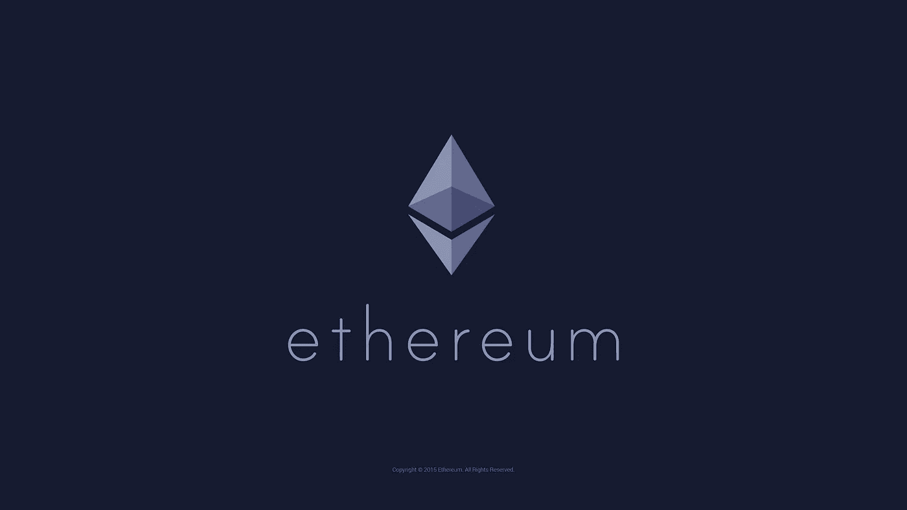
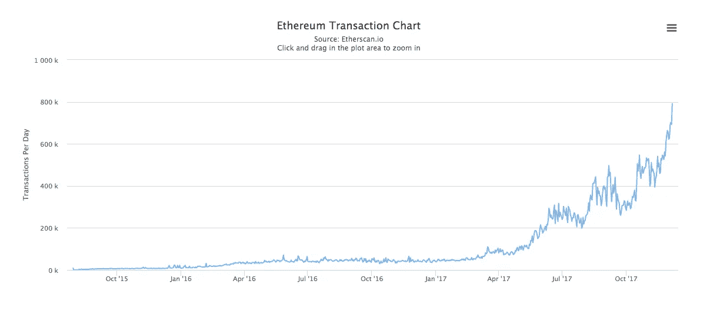
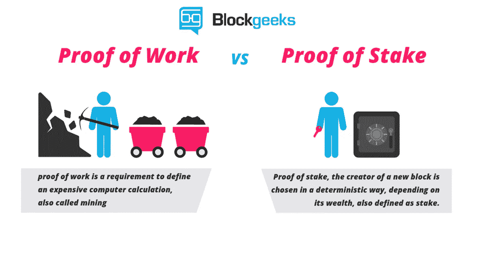
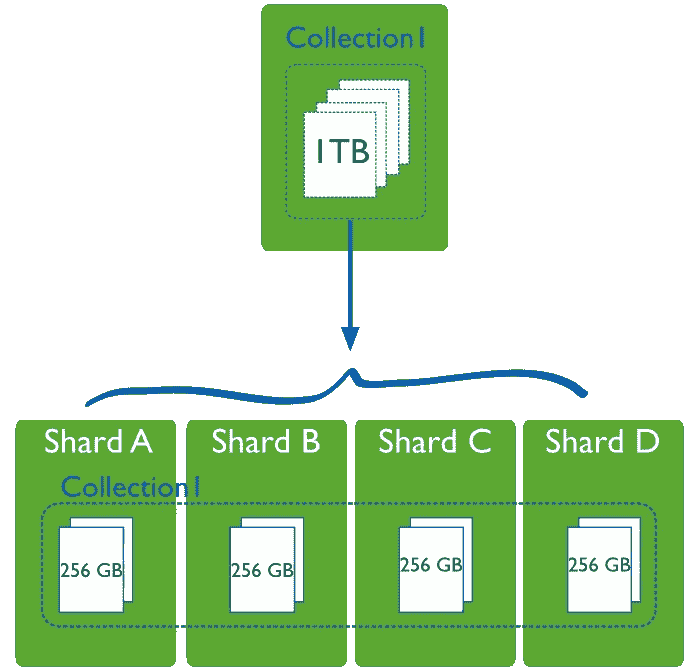

# 以太坊路线图初学者指南

> 原文：<https://medium.com/hackernoon/the-beginners-guide-to-ethereum-s-2020-roadmap-2ac5d2dd4881>

以太坊的使命是成为取代服务器农场的去中心化世界计算机。把它想象成一台全世界都能用的电脑。不能关机也不能关机。作为一个概述，这里有一个以太坊的[初学者指南和一个关于](https://blog.coinbase.com/a-beginners-guide-to-ethereum-46dd486ceecf)[如何在技术上工作的解释](/@preethikasireddy/how-does-ethereum-work-anyway-22d1df506369)。

如果以太坊是一台计算机，那么每一次更新都可以看作是一个操作系统(OS)。类似于[谷歌](https://hackernoon.com/tagged/google)推出安卓奥利奥或者苹果推出 iOS 10，以太坊分四个阶段推出。

每个阶段都增加了新的功能，提高了平台的用户友好性和安全性，同时允许以太坊扩展。

1.  **Frontier**(2015 年 7 月)——以太坊网络首次现场发布。它允许开发人员进行实验，挖掘以太，并开始构建 dApps 和工具。
2.  **Homestead**(2016 年 3 月)——以太坊的首次产品发布带来了许多协议改进，为[未来的](https://hackernoon.com/tagged/future)升级和加速交易奠定了基础。
3.  **Metropolis**(2017 年 10 月)——更轻、更快、更安全的以太坊分为两个版本:拜占庭(2017 年 10 月)和君士坦丁堡(待定)
4.  **Serenity**(TBA)**—将使用 Casper consensus 算法为我们带来期待已久的赌注证明。**

**所有这些更新都将有助于以太坊的规模，这意味着每个人的交易时间更快，费用更低。如您所见，以太坊团队在扩展交易方面做得非常好。**

****

**Source: [Etherscan](https://etherscan.io/chart/tx)**

# **当前阶段:大都会**

**Metropolis 承诺将成为更轻、更快、更安全的 Etherem 版本。它还将为智能合约开发人员提供更大的灵活性。**

**大都会将被拆分为两个核心版本:拜占庭和君士坦丁堡。第一次硬叉(拜占庭)发生在[十月](https://www.coindesk.com/ethereum-executes-blockchain-hard-fork-byzantium/)。第二个硬分叉(君士坦丁堡)还没有确定的日期，但预计在 2018 年。**

**这些阶段中的每一个都包括一套以太坊改进方案，简称 EIP。拜占庭共有九个 T21 来提高网络的私密性、可扩展性和安全性。所有这些更新将导致更快的封锁和更低的用户费用。**

**以下是大都会的主要更新:**

*   **隐私—匿名交易的能力(zk-SNARKs)**
*   **开发人员更容易编程**
*   **更可预测的[汽油费用](https://ethereum.stackexchange.com/questions/3/what-is-meant-by-the-term-gas)**
*   **提高钱包的安全性(账户抽象化)**
*   **采矿调整将使采矿更加困难(难度炸弹)**

## **隐私**

**在 Metropolis，开发者将获得一个新的隐私工具——在线有效验证 zk-SNARKs 的能力。zk-SNARKs 是“零知识简洁的非交互式知识论证”的缩写**

**简单地说，零知识证明就是证明一个陈述的真实性，而不透露任何超出它试图证明的额外信息。**

**这里有一个简单的例子。我需要向约翰证明我知道一个随机手机的密码。为了做到这一点，我需要在不泄露输入密码的情况下解锁手机。**

**零知识证明是当一个*证明者*(我)说服一个*验证者*(约翰)他们有一定的知识，而没有透露实际的知识。在这个例子中，我可以在手机中输入密码，并显示手机已解锁，而不会泄露我输入的内容。**

**那么，这对以太坊有什么影响呢？某些联系变量可以保密。这些秘密信息可以存储在用户处，而不是存储在区块链上。交易中可能隐藏的一些内容包括发送者、接收者、金额和数据。**

**除了 zkSnarks(在 zCash 中使用)，以太坊也将获得环签名(在 Monero 的隐私方案中使用)。这是一种奇特的设定方式，以太坊将获得两者的最佳效果！**

****账户抽象** 在软件工程中，抽象是一种工具，它允许程序员在一定的复杂程度上进行思考，隐藏对手头问题不重要的细节。当开发人员更关心更高层次的概念时，他们使用抽象来防止最终用户因细节而过载。**

**这将使用户对他们的私钥有更多的控制权，同时也增加了合同支付采矿费用的能力。抽象还会降低被[量子计算](https://hackernoon.com/how-i-cornered-the-bitcoin-mining-market-using-a-quantum-computer-9e5dceba9f92)黑的风险。**

****挖掘难度——炸弹** 定时炸弹是开始将以太坊从工作证明(PoW)转移到利益证明(PoS)的过程。随着我们从基于矿工的 PoW 转向基于验证机的 PoS 系统，这将使矿工更加困难，并降低他们未来的利润。此外，每个块发出的 ETH 数量将从 5 个减少到 3 个。**

# **最后阶段:宁静**

**这是以太坊路线图的最后一个阶段，将把以太坊网络从工作证明转变为利益证明。宁静的希望是让以太坊网络成为主流。**

****

**Source: [Blockgeeks](https://blockgeeks.com/guides/proof-of-work-vs-proof-of-stake/)**

## **工作证明**

**大多数区块链运行在“工作证明”上，这意味着矿工解决密码难题以开采到区块链的一个区块。随着时间的推移，这些难题变得越来越难，需要大量的能量和计算能力。**

**“工作证明”的问题在于它变得越来越集中。这意味着少数矿业公司控制了比特币的哈希值。截至目前，71.2%的 hashrate 由五个采矿池控制。**

**随着密码难题变得更具挑战性，它需要更多的硬件和能量，这也是非常昂贵的。这使得任何人都更难开采，这进一步集中到几个矿池。**

**为什么这样不好？如果这五个矿池协调起来，他们可以释放一个 [51%的攻击](https://www.investopedia.com/terms/1/51-attack.asp)。攻击者将能够阻止新交易获得确认，从而允许他们停止用户之间的支付。像这样的事件甚至可能使一个不同的区块链合法化，比如比特币现金。**

## **利害关系证明**

**以太坊对此的解决方案是走向‘利害关系证明’。这意味着验证者(而不是矿工)将不得不拿出乙醚作为赌注，然后通过下注来“验证”区块。如果方块被追加，你将获得与你的赌注成比例的奖励。如果你赌错了区块，你的赌注就会被拿走。**

**利害关系证明也有助于解决工作证明的一些问题。它有助于实现去中心化，提高能效，并有助于以太坊规模化。**

## **鬼马小灵精**

**这是以太坊的“利害关系证明”协议的名称。Casper 有两个版本。一个由[弗拉德·扎姆菲尔](https://twitter.com/VladZamfir?ref_src=twsrc%5Egoogle%7Ctwcamp%5Eserp%7Ctwgr%5Eauthor)领导，他一直处于以太坊发展的最前沿。另一个叫做 FFG(友好终结小工具)，由 Vitalik Buterin 领导。**

**类似地，将会有赌注者把他们的硬币锁在特殊的钱包里。这些赌注者将通过每年的以太红利得到回报。所以，你的股份越多，你的红利就越大。**

**在 PoS 中，无论发生什么，你都会赢，不会有任何损失。失去你的股份的唯一方法是如果你恶意验证错误的块。**

**Casper 走向“利害关系证明”共识，防止 51%的攻击发生。暂时和持续的 51%攻击对以太坊的未来有着重要的影响。卡斯帕进一步保护它。**

# **以太坊如何扩展**

**Casper 将为扩展以太坊以实现主流采用铺平道路。为了做到这一点，以太坊需要处理大量的交易。否则，成本飙升，需要更长的时间来完成交易。**

**以太坊创始人 Vitalik 最近提出了一项计划，通过分片来帮助扩大以太坊的规模。分片允许块并行发生，而不是让事务以线性顺序运行。**

**把这想象成从朋友那里下载一首歌和用种子从成千上万的人那里下载相同的文件的区别。**

****

**[Sharding Intro](https://docs.mongodb.com/v3.0/core/sharding-introduction/) from MongoDB**

**分片也是分割链数据的过程，因此每个节点只需担心链的一小部分。**

**这将允许以太坊每秒处理数千笔交易——全部在同一条链上。估计过几年就会这样了。**

*   **比特币每秒处理约 7 笔交易**
*   **以太坊每秒处理大约 15 笔交易**
*   **Paypal 每秒处理约 200 笔交易**
*   **Visa 每秒处理约 2，000 笔交易，但其处理能力为每秒 56，000 笔交易**

**如你所见，比特币和以太坊要超过 Visa 目前在做的交易数量还有很长的路要走。(还有一家名为 [Hashgraph](https://squawker.org/technology/blockchain-just-became-obsolete-the-future-is-hashgraph/) 的新公司，号称每秒可以处理 25 万笔交易！)**

## **血浆**

**与比特币类似，以太坊也有一个缩放问题，智能合约费用不断上涨，导致交易时间变慢，特别是在 ICOs 期间。Plasma 是一个更新，修复了以太坊的缩放问题。这是由闪电网络的 Vitalik Buterin 和 Joseph Poon 合作完成的。(图为 crypto 的 Kanye 和 Jay-Z 一起制作新专辑。)**

**根据[维塔利克·布特林](http://ethereumworldnews.com/2020-roadmap-ethereum/)的说法，推动以太坊更上一层楼需要解决四大问题:隐私、共识安全、智能合约安全，以及需要解决的最大挑战——可扩展性。**

**以太坊仍然是一项新兴技术，但有许多有前途的扩展功能将允许成为主流。如果以太坊能够实现其雄心勃勃的多年愿景，那么它将奠定区块链生态系统的基础和支柱！**

**[*Michael Karnjanaprakorn*](http://mikekarnj.com)*是*[*Skillshare*](http://skillshare.com)*和* [*图灵资本*](http://turing.capital) *的创始人。感谢 Paul Veradittakit、Julian Moncada、Matt Condon、Felix Feng、Luke Xie 和审阅本文的早期草稿。***