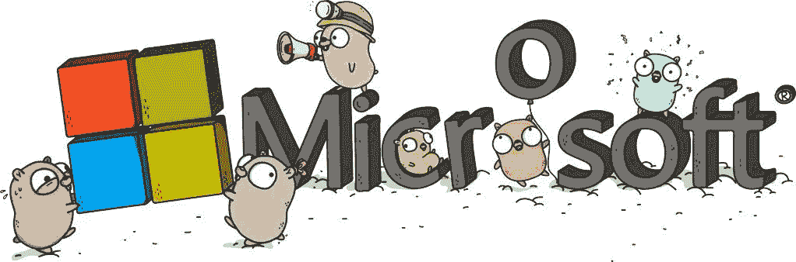

# 我为什么加入微软

> 原文：<https://medium.com/hackernoon/the-best-career-advice-ive-received-so-far-is-never-turn-down-an-interview-7586ca5b7ef8>

迄今为止，我收到的最好的职业建议是，“永远不要拒绝面试。”我通常会遵循这个建议，因为你一生中能产生影响的时间有限。最近，我意识到接受你自己的建议比我想象的要困难得多……这就是我如何**差点** 拒绝了我职业生涯中最大的[机会之一](https://hackernoon.com/tagged/opportunities)。

你将要读到的是第一世界的问题。

在我开始在 [Pivotal](https://pivotal.io) 工作之前，我有机会采访了一些令人惊叹的公司，其中之一就是[微软](https://www.microsoft.com)。我面试了微软[的两个职位，都是 DevEx 的职位，但是在不同的业务部门；我拒绝了两个角色。](https://hackernoon.com/tagged/microsoft)

你看…我热爱我的工作。我喜欢开发者倡导，但大多数公司不知道这意味着什么。

如果你的开发者倡议被归入市场营销，那你就做错了。

如果你的开发者代言人不能直接联系产品经理，也不能根据开发者/客户的反馈提出修改建议，那你就做错了。

如果你的开发商代言人被用作销售资源，那你就错了。*(那叫销售工程)*。

开发人员倡导者的工作不是一对一的工作，而是一对多的工作。作为一名开发者倡导者，你在传播意识，让开发者做他们喜欢的事情；写作、编码和学习。我拒绝了微软的工作，因为它们不是开发者权益的工作，而且微软也不关心开源开发者……对吗？

快进一下:我接受了 Pivotal 的一份令人惊叹的工作，在一个了不起的团队里，有着有史以来最好的老板。我玩得很开心，虽然我每天都收到来自微软招聘人员的电子邮件，但我没有理会他们，因为我没有离开 Pivotal 的打算。

所以，当我收到布莱恩·利斯顿发来的邀请我参加在我家乡举行的 ChefConf 的推特信息时，我正在家里工作，做我自己的事。你看，布莱恩和他的老板[杰夫·桑德奎斯特](https://twitter.com/jeffsand?lang=en)一直轮流试图让我在微软担任另一个角色，但我已经面试过了，知道微软不知道如何做开发者宣传。我继续拒绝这个角色，但最终，我不会让别人工作的地方成为我和啤酒之间的障碍。我去了切夫孔，花了一天时间和布莱恩在一起，他尽力让我相信这支球队是不同的，但我知道事实并非如此，所以我继续拒绝。

那天晚些时候，布莱恩负责摊位，所以我去和一个朋友一起吃午饭。我解释了在微软的机会，并解释说我甚至为谈论它而感到内疚，我只在 Pivotal 工作了 10 周。什么样的人会在 10 周后离开？我的朋友对我说了一些话，一些我永远不会忘记的话，*“做生意是没有忠诚的，阿希礼。你是个单亲妈妈。你有一个家庭，为了他们，你应该完成这次微软面试。”*你们中的一些人可能会想，*“这只是常识，阿什利。”*我知道，但有时让你的社区或同事失望的感觉比明显的感觉更重要，我非常担心让 Pivotal 失望，我对此感到恶心。就像，真的生病了。

所以，我忍气吞声，告诉布莱恩我会继续面试，不到一周，我就到了雷德蒙。老实说，我对在微软工作一点也不兴奋。我是一个开源的书呆子，他们为什么还要我？见鬼，我甚至没有 windows 系统的机器…哦，不，他们不会让我用 Windows 系统的机器吧？

我在上午 9 点出现，参加与杰夫·桑德奎斯特的第一次预约面试。我钦佩杰夫已经很久了——杰夫从 2005 年到 2013 年在微软负责开发人员关系*(那时微软在开发人员宣传方面做得很好)*，在离开并加入 Twitter 担任其全球开发人员平台关系总监&。现在，他以微软云计算和企业集团总经理的身份回来了，他非常专注于重建微软的开发者权益。他甚至创建了一个新的工程团队，这是他希望我加入的团队。杰夫和我谈了一个小时关于他的计划和他认为成功的样子，我意识到我对微软的看法是错误的，但不是没有原因的。回到比尔·盖茨和早期史蒂夫·鲍尔默的时代，开源是一个肮脏的字眼。事实上，鲍尔默将 Linux 和 GNU 通用公共许可证比作“[癌症](http://www.theregister.co.uk/2001/06/02/ballmer_linux_is_a_cancer/)”，后来他[又收回了这个观点](http://www.zdnet.com/article/ballmer-i-may-have-called-linux-a-cancer-but-now-i-love-it/)，但当时微软觉得开源是一个主要威胁。从某种程度上来说，微软仍然在与挥之不去的观念作斗争，即他们不是开源的忠实粉丝。

现在是上午 11 点，我要去参加第二轮面试了，我对这个角色感觉更好了，但我仍然不相信。我的第二次面试是与 [Azure Cosmos DB](https://azure.microsoft.com/en-us/services/cosmos-db/) 和开源分析的架构师 [Rimma Nehme](https://twitter.com/rimmanehme?ref_src=twsrc%5Egoogle%7Ctwcamp%5Eserp%7Ctwgr%5Eauthor) 进行的。我对这次采访感到非常兴奋，因为 Rimma 是一位从事高技术工作的女性，我很好奇她在微软的经历。Rimma 和我坐在一起聊了很多事情，从孩子到科技领域的女性，然后我问她最近在忙些什么。她的眼睛睁大了，她告诉我关于宇宙数据库。在接下来的 30 分钟里，我坐在那里，下巴贴在地板上，她在白板上写了 30 分钟——对于那些不知道 Cosmos DB 是什么的人来说，它是第一个用于构建行星级应用程序的全球分布式多模型数据库服务。作为一个[全球分布式数据库系统](https://docs.microsoft.com/en-us/azure/documentdb/documentdb-distribute-data-globally)，Cosmos DB 自动将您的所有数据复制到*您选择的任意*个区域，它支持透明的多宿主并保证 99.99%的高可用性。听起来很神奇，对吧？那次采访让我深受启发。微软正在发生很酷的事情，这是一个新的微软，我想成为它的一部分，但首先我想做一些研究。

微软真的是一个新的微软吗？以下是我学到的…

事实证明，在任何一个实体中，微软拥有最多的 500 强开源项目。微软有 24 个项目，远远领先于谷歌和 Pivotal *(各有 7 个)*以及拥有 6 个项目的红帽。

更不用说他们自己的[之类的开源项目了。Net Core](https://www.microsoft.com/net/core#windowsvs2017) 、 [Visual Studio Code](https://thenewstack.io/tag/Visual-Studio-Code) 和 [TypeScript](https://thenewstack.io/tag/TypeScript) ，微软从开源社区获得了大量帮助。CoreFX 中超过 60%的贡献。Net 核心库和 [CoreCLR](https://github.com/dotnet/CoreCLR) 。Net 核心运行时来自微软之外，它们对外部开源项目做出了重大贡献，比如 Linux Docker 和 Kubernetes。

开源是关于社区和生态系统的。没有健康的生态系统，任何公司都无法生存，微软对此非常清楚，这也是他们再次投资开发者权益的另一个原因。

微软在 GitHub 上有超过 15，000 名贡献者，超过 6，000 名员工为开源项目做出贡献，并发布了超过 3，000 个开源项目。微软的开源程序办公室跟踪近 10，000 个开源组件，从 NPM 软件包到微软团队使用的 Linux 发行版。

是的，微软正在它自己的基础设施中使用 Linux。该公司最近还将 Windows 开发转移到 Git。

正如我们所说，微软内部的文化正在发生变化。Linux 的专业知识正在整个公司传播，开源在微软不再是一个肮脏的词语。

根据那天的采访和我从自己的研究中获得的所有新知识，我现在确信微软正在变得更好，但这足以让我在加入 Pivotal 仅 12 周后离开吗？

我列出了利弊，微软轻而易举地赢了。我对像微软这样的公司的影响可能是巨大的，最终，这就是我想要的，对吗？剩下的只是 Windows 或 Mac 的问题。我很高兴地告诉大家，事实上，微软确实给员工发了苹果电脑。看到了吗？一个新的微软。

我觉得我刚刚对统计数据之类的东西说了很多废话，你可能会想，*“这些都很好，但说真的，我只是想知道 Pivotal 发生了什么？谁委屈你了？”*答案是什么都没有，没有人。Pivotal 是一个很好的工作场所，我很幸运能在那里工作，即使只是短暂的时间。我会非常想念我的团队，任何读到这篇文章的人都应该庆幸 Pivotal 是他们朝九晚五的家。

也就是说，我很高兴作为一名主要开发人员倡导者开始我在微软的新篇章，作为奖励，我将继续与我的 Pivotal 朋友合作，因为 Pivotal 刚刚宣布与微软在[合作！](https://pivotal.io/partners/microsoft)

所以，这里有两个教训:

1)永远不要拒绝面试。

2)公司是可以改变的。

[MSFT 已经取得了巨大进步，但仍有许多工作要做]

> [黑客中午](http://bit.ly/Hackernoon)是黑客如何开始他们的下午。我们是 [@AMI](http://bit.ly/atAMIatAMI) 家庭的一员。我们现在[接受投稿](http://bit.ly/hackernoonsubmission)并乐意[讨论广告&赞助](mailto:partners@amipublications.com)机会。
> 
> 如果你喜欢这个故事，我们推荐你阅读我们的[最新科技故事](http://bit.ly/hackernoonlatestt)和[趋势科技故事](https://hackernoon.com/trending)。直到下一次，不要把世界的现实想当然！

