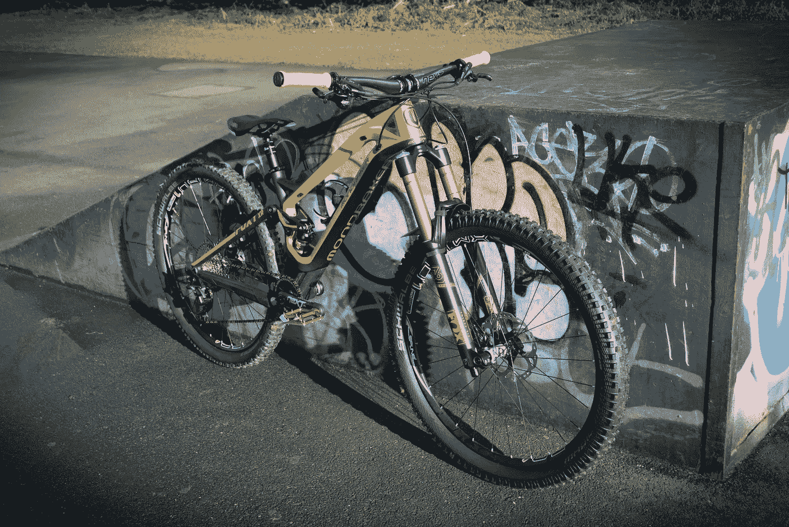
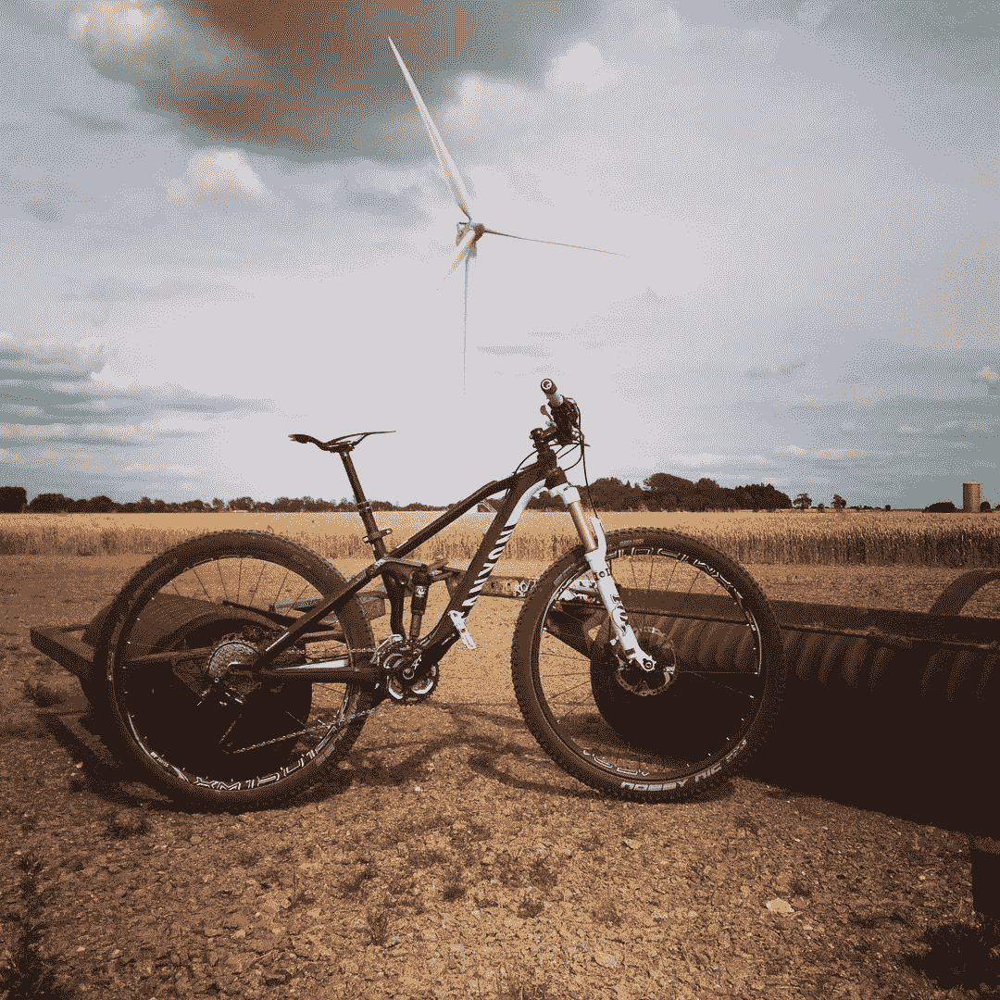
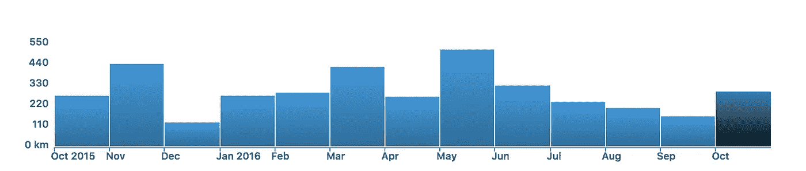
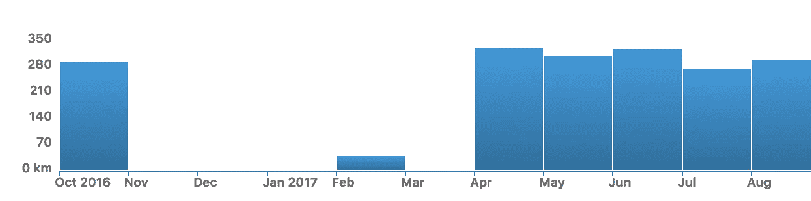
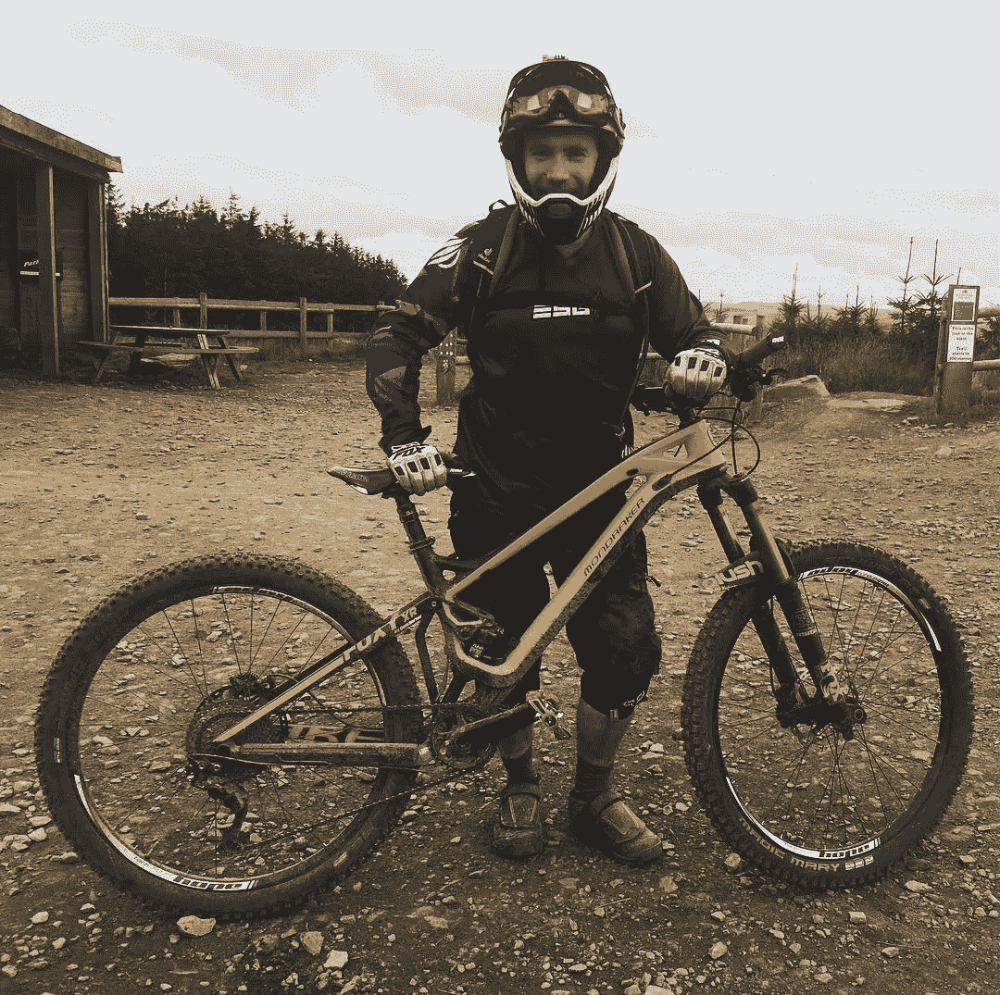

# 我做过的最好的职业决定

> 原文：<https://medium.com/hackernoon/the-best-career-decision-i-made-f5825683004>

正在买自行车。

我没有兴趣重复所有对“锻炼是一种健康活动”的热情支持。我们以前都听过了，我没有什么特别的见解。只是这对我来说是真的，我想找个借口炫耀我自行车的照片。这不是一个好的，但是它将会做。

简单地说，我的旧自行车在我开始擅长我的工作的时候被偷了。我没有替换它，部分是因为当时我有其他财务问题(operation get on the housing ladder)，但我无论如何都不会骑它，因为我太沉迷于编写代码了。

我的工作占据了我的生活，几乎把其他事情都排除在外，时间在隆隆作响。我传奇般的新陈代谢在我 25 岁生日后不久消失了，几年后，我发现自己精疲力尽，精神疲惫，不健康，不快乐。

所以，我买了一辆自行车。

Mountain biking in East Anglia

而且成功了。我骑上自行车，我的健康状况改善了，我的情绪、精力和工作热情也提高了。一年后，我觉得精神焕发，可以再次尝试创业了。

pedal pedal pedal!

然后我把一切都搞砸了。

实际上，这听起来比它需要的更激烈，但我太忙于我的创业，以至于没有时间骑自行车。到了 4 月份，我又一次筋疲力尽，疲惫不堪，身体不适，郁郁寡欢。这很遗憾，因为我真的很努力，却没有真正感受到它的好处。

Guess when we started Fluidly…

所以我腾出时间去骑自行车。我每周有一个下午在家工作，午饭时间离开办公室。我总是打算早点离开，以便及时回家参加周日的俱乐部骑行，但总是有“多一件事”或有人需要什么。午餐时间失踪解决了这个问题。无论如何，周日是骑行日。

它又一次成功了。

是那种奇怪的圆形东西。如果你想做好你的工作，你也需要做好不做你的工作。忽视你的生活而专注于你的工作也是忽视你的事业。

oh okay, you can have one more