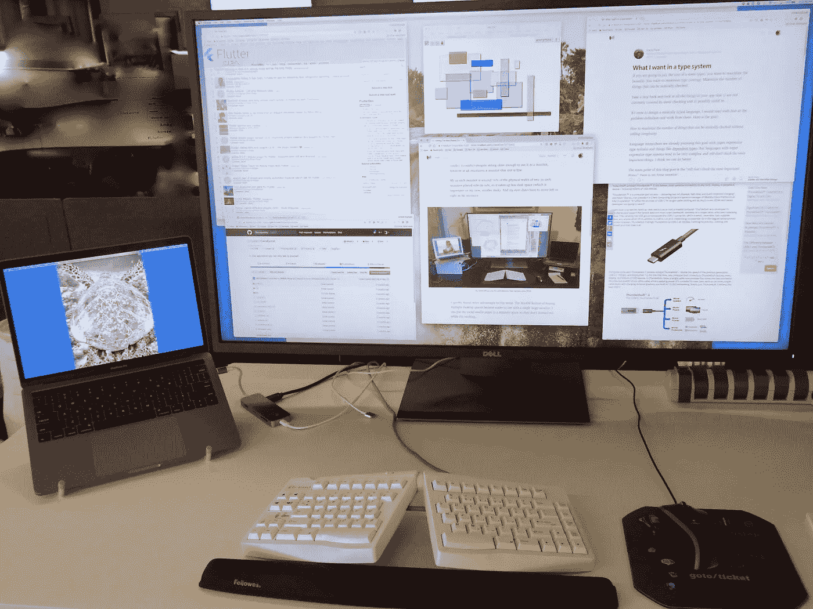
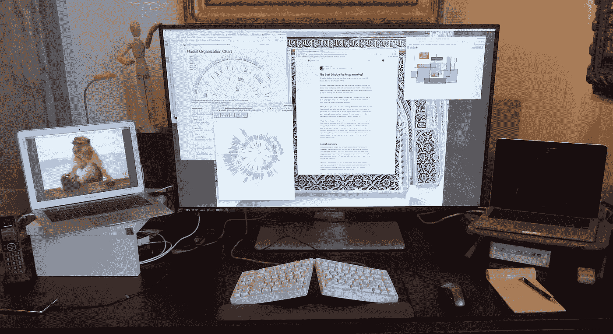

# 编程的最佳显示器？

> 原文：<https://medium.com/hackernoon/the-best-display-for-programming-8aad0be4227d>

**My new work monitor.**

如果你是那种喜欢在小巧的笔记本电脑上编程的人，你现在可以停止阅读了。]

如果你是一名软件开发人员，并且你像我一样，你可能会发现当你有足够的不动产时，你会更有效率。我说的不是隔间空间，我说的是*屏幕*不动产:大型显示器，通常不止一个(至少到目前为止)。

我拥有三个 30 英寸的苹果影院显示器，但我通常只在一台电脑上使用其中的两个(大多数笔记本电脑一次只能驱动两个；有些只能驱动单个显示器)。

当 4K 显示器问世时，我很感兴趣。当他们降价时，我很兴奋。当我和妻子搬进市中心的一个单间公寓，意识到我们必须大幅缩小规模时，我有了一个想法:买一台 4K 显示器，用它代替多台显示器(还可以用来看电影，这样我们就不需要单独的电视了)。

我喜欢 30 英寸显示器的分辨率，它是 2560×1600 像素。也就是每英寸 100.63 像素(PPI)。对于编程，我并不关心高像素密度(就像[视网膜显示器](https://en.wikipedia.org/wiki/Retina_Display)一样，它的设备像素比率大于 1)。我想要*更多的*文本字符，而不是看起来稍微平滑的。4K 显示器的分辨率为 3840×2160，超过了两台 30 英寸显示器的像素数量。我的问题是，为了确保像素具有相同的 PPI，我应该购买多大尺寸的 4K 显示器？

# 43 英寸显示器

**30 vs 43 inches — more than twice as many pixels**

我计算出 4K 显示器的合适尺寸大约是 43 英寸(对角线)。我很快就找到了一台戴尔 P4317Q，价格合理，好评如潮。它有一个 TFT 有源矩阵面板，看起来非常清晰，颜色很好。尽管被称为 43 英寸显示器，但它实际上是 42.5 英寸，因此它有 103.7 PPI，但这一差异可以忽略不计(我认为我实际上更喜欢稍微小一点的物理尺寸)。

我一直担心 43 英寸的显示器会显得太大。我曾经拥有一台 42 英寸的 1080p 高清电视机(在搬进公寓前，我们把它送给了别人)。我无法想象坐得足够近来使用它作为显示器，但是在 4K 分辨率下，这种尺寸的显示器是不错的。

我的 43 英寸显示器大约是两个并排放置的 30 英寸显示器物理宽度的 70%，所以它占用的桌面空间更小(这对我的新的更小的桌子很重要)。我的眼睛不再需要向左或向右移动。

**My home setup: one 43-inch monitor, two laptops, and a KVM.**

我很快发现了这种设置的其他优点。MacOS 具有多个桌面空间的特性变得更易于在单个大型显示器上使用。我可以把我的社交媒体页面放在一个单独的空间，这样它们就不会在我工作的时候分散我的注意力。

我唯一不喜欢戴尔显示器的是，它的 HDMI 输入是 1.4 版，在全分辨率下只能达到 30Hz 的刷新率。但它也有 DisplayPort 输入，可以做到 60Hz，所以我使用 DisplayPort(或迷你 DisplayPort)连接到我的电脑。Apple、Windows 和 Linux 电脑都很好地支持 DisplayPort 和 mini-DisplayPort。

下一个问题是，我太喜欢它了，所以我想在工作中使用相同的设置(我仍然使用两台 30 英寸的显示器)。就在那个时候，优派推出了一款非常相似的显示器，VX4380(事实上，非常相似，我相信它使用了相同的面板)。所以我也买了一个。

这两款显示器对比如何？

*   优派的优势在于它有 HDMI 2.0 输入，而不是 1.4 输入，因此它可以使用 60Hz 的 HDMI 输入。它也更便宜，我更喜欢它的菜单系统，尽管它的控制按钮不方便地位于显示器的后面，而不是前面。
*   戴尔更贵，但感觉更好，有一个更好的支架，有更多的调整和一些电缆布线。

两者都有四个输入:两个显示端口和两个 HDMI。两者都是优秀的显示器。事实上，两者都非常完美！

我已经用了几个月了，比起使用两台 30 英寸的显示器，我更喜欢使用一台 43 英寸的 4K 显示器。作为一名程序员，我可以拥有一个大的 IDE 窗口、程序输出、调试窗口、github、gitter、终端、日志、多个文档窗口和各种其他窗口，并且在任何时候都可以打开和使用。如果我需要编辑一个大的图表或照片，我真的可以放大它，而不必在多个显示器上拉伸它。

通过消费者 4K 电视市场的大规模生产奇迹，你购买一台 4K 显示器的费用可能比你购买一台分辨率为 2560×1600 的*单个* 30 英寸显示器要低(更不用说两台了)。

当你读到这篇文章的时候，可能已经有其他 43 英寸的 4K 显示器上市了。你也应该去看看。我刚刚注意到 LG 43UD79-B，它甚至有一个 USB-C 视频输入(USB-C 上的雷电 3 或显示端口)，但我没有尝试过。它似乎也使用了与戴尔和优派显示器相同的面板。

如果你在看其他显示器，请注意，我会避免购买主要用于家庭观看电视和电影的显示器。他们通常没有你想要的输入，并且通常不太尖锐，因为你通常不会坐在离他们两英尺远的地方。你可能会多花一点钱买一台真正的电脑显示器，但这是值得的。作为奖励，大型电脑显示器将非常适合观看电影(尽管根据显示器的不同，您可能需要一些好的自供电扬声器)。如果你想看电视，你需要把它插入有线电视盒或某种流媒体盒(HDMI 输入会很方便)。

# 设置

您的计算机必须能够驱动所需的分辨率和扫描速率(3840 x 2160，60Hz)。事实上，我不得不升级我的一台工作电脑(一台 2014 年的 MacBook Air 我的雇主把它换成了一辆 2015 年的二手汽车。您电脑的视频接口应该是:

*   显示端口(迷你或普通，至少版本 1.2)，
*   HDMI(至少 2.0 版)，或
*   新的 USB-C 视频(USB-C 上的雷电 3 或显示端口)，提供显示端口 1.2 信号。

我在互联网上看到过几个案例，人们无法让 4K 显示器工作，尽管计算机应该能够驱动它。据他们说，问题原来是旧的或坏的电缆。遗憾的是，大多数显示器电缆都没有标签，因此很难知道它们是正确的 DisplayPort 1.2 还是 HDMI 2.0(或更高)。如果您遇到问题，请尝试购买正确版本的新电缆。我读到的一个人甚至发现他们的显示器附带的电缆是错误的版本，不能在 60Hz 下工作。而且别想着用 DVI 或者 VGA。

最后，尽量减少计算机和显示器之间的适配器数量:如果可能的话，一根不带适配器的电缆。我的工作电脑有带 USB-C 视频连接器的雷电 3(新的苹果标准)，所以我买了一根 USB-C 到 DisplayPort 的电缆。我的家用电脑是 mini-DisplayPort(旧的苹果标准)，所以我使用 mini-DisplayPort 到 DisplayPort 的电缆。两者都工作得很好，这应该不足为奇，因为雷电 3 视频信号与 DisplayPort 相同，而 mini-DisplayPort 只是 DisplayPort 的一个较小的连接器。

我还买了一个 DisplayPort KVM，这样我就可以在两台不同的电脑上使用一个键盘、显示器和鼠标。它在两台具有 mini-DisplayPort 输出的电脑上运行良好，但当我试图将它与我的具有雷电 3 (USB-C)输出的电脑一起使用时，它无法工作。显然，有一个雷电 3 到迷你显示端口适配器，然后是 KVM 是太多了。我的解决方法是使用 USB-C 到 DisplayPort 电缆，跳过 KVM，直接将其插入显示器上的独立输入。如果有人知道如何使用雷电 3 KVM，请在评论中告诉我。

**TL；对于喜欢大屏幕显示器的人来说，43 英寸的 4K 电脑显示器应该是 T2 的新热点。只要你使用合适的电缆，它们应该可以与近几年生产的几乎所有电脑兼容。**