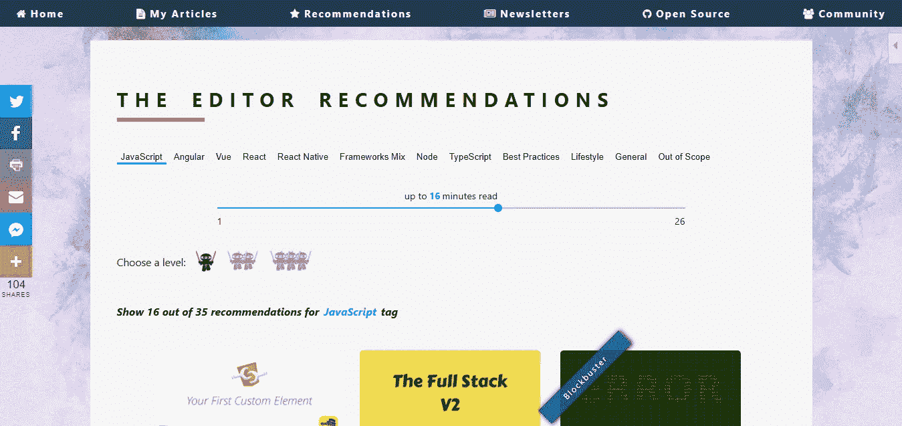
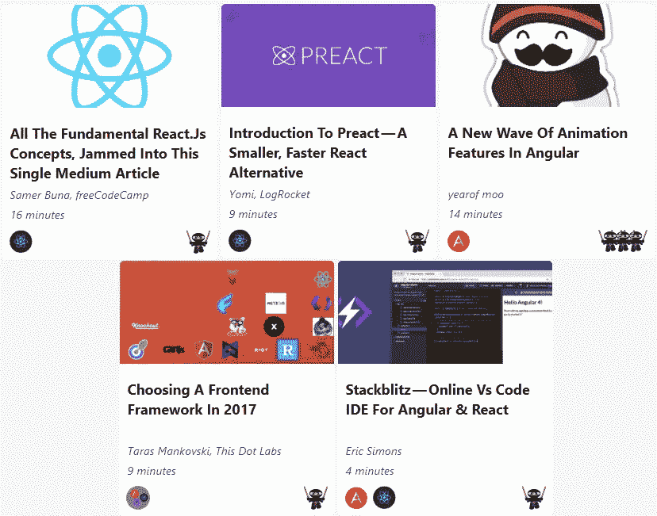
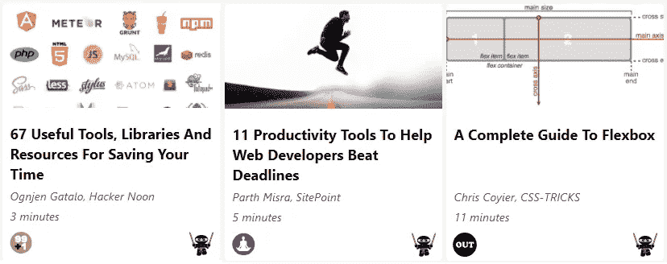
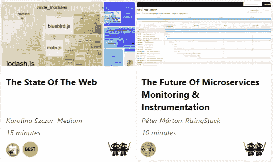

# dormoshe.io 上的 2017 年最佳

> 原文：<https://medium.com/hackernoon/the-best-of-2017-on-dormoshe-io-5a36ed68720d>

## 最受推荐文章的年终总结

The Editor Recommendations on dormoshe.io

***本*条** ***原本出现在***[***dormoshe . io***](https://dormoshe.io/articles/the-best-of-2017-on-dormoshe-io-23)

2017 年太神奇了！新的一年是回顾和总结我们所学的最好时间。新工具，新编辑，新博客，新内容，新时代。web zone 继续征服世界，每天都有大量的文章和资源出现。

在这一年，我的文章有了一个新家。在这个博客中，你可以找到我的文章，[Angular TypeScript weekly newsletter 副本](https://dormoshe.io/newsletters)以及我发现对理解网络世界中的许多主题有帮助的许多资源的推荐。在这篇文章中，**我们会得到一个关于去年最好的文章的提醒**，并有机会再读一遍。

# 文章

## ES8 发布了，以下是它的主要新特性🔥

ECMAScript 2017 由 TC39 于 6 月底正式发布。似乎我们在去年谈论了很多关于 ECMAScript 的内容。不是白来的。ES6 是 JavaScript 世界中最新鲜的事物之一。到处都是。

JavaScript 正在生产中，但它总是在更新。采用规范的新特性的过程是非常有序的。在最后阶段，这些特性由 TC39 委员会确认并由核心开发者实现。它们中的大多数已经是 TypeScript 语言、浏览器或其他 polyfills 的一部分，所以我们现在就可以去尝试它们。

***这篇文章由*Jason Cheng****[**日文由 Postd**](http://postd.cc/es8-was-released-and-here-are-its-main-new-features)**[**俄文由 habrahabr**](https://habrahabr.ru/post/332900) **和** [**韩文由 Han jayeab**](https://jaeyeophan.github.io/2017/07/16/ES8-Standard-Release-Overview/)**翻译。******

**** [## ES8 发布了，以下是它的主要新特性🔥-多尔·摩西的博客

### ECMAScript 8 或 ECMAScript 2017 由 TC39 于 6 月底正式发布。看起来我们谈了很多…

dormoshe.io](https://dormoshe.io/articles/es8-was-released-and-here-are-its-main-new-features-15)**** 

## ****脸书的 Prepack——JavaScript 领域的下一个黑仔****

****2017 年 5 月，社交网络掀起了关于 ***预包装*** 的风暴。Prepack 是一个优化 JavaScript 源代码的开源工具。可以在**编译期**而不是运行期完成的计算，将**去掉**。Prepack **用简单赋值序列的等价代码替换 JavaScript 包**的全局代码。这消除了大多数中间计算和对象分配。****

****预包装已开发的脸书和它正在积极发展。这是实验性的，仍然处于非常早期的阶段，但它是令人敬畏的😱。脸书的愿景是**利用预包装作为平台**。本文介绍预包装，涵盖脸书想要解决的问题，看到一些很酷的例子，并了解预包装的现状。****

**** [## 脸书的 Prepack——JavaScript 领域的下一个黑仔——Dor Moshe 的博客

### 在过去的日子里，社交网络是关于预包装的风暴。大概你还没听说吧。那是…

dormoshe.io](https://dormoshe.io/articles/facebooks-prepack-the-next-killer-in-the-javascript-zone-7)**** 

## ******探索 React 纤维的顶级资源******

****2014 年，脸书提到其团队正在开发 React 的新版本。在过去的三年里，脸书的一个开发团队一直致力于此，为我们带来前端开发的全新事物。Fiber 不仅仅是 React 的新版本。**纤程是对核心算法**的改写。****

****与 Angular 的[重写不同，Fiber 向后兼容“旧”的 React，有一些小的突破性变化，但它可以很容易地取代旧的 React。本文回顾了一些顶级资源，以获得关于新 React 的更新，探索 Fiber 的亮点，介绍其架构，并深入研究这些变化的代码基础。](https://dormoshe.io/articles/top-8-resources-to-explore-angular-v4-1)****

**** [## 探索 React 纤维的顶级资源——Dor Moshe 的博客

### 2014 年，脸书提到其团队正在开发 React 的新版本。在过去的三年里，一个…

dormoshe.io](https://dormoshe.io/articles/top-resources-to-explore-react-fiber-18)**** 

## ****角 v5 出来了！这里是如何探索它****

****Angular 的第五版集中在**渐进式网络应用**和更多其他新的品牌特性和能力。根据语义版本化策略，v4 中的许多不推荐使用的 API，如`OpaqueToken,` `NgProbToken`，以及 v5 中移除/更改的模板标签。像往常一样，这个版本包括突破性的变化，如 Angular 的新要求，编译器使用 TypeScript 2.4.x 和内置管道的变化。****

****这篇文章重点介绍了探索新版本的顶级资源，以便**保持更新并享受新的改进**。你可以从不同的深度层次找到不同的资源。****

**** [## 角 v5 出来了！以下是如何探索它的方法——Dor Moshe 的博客

### 在九月中旬，离 v5 的到期日很近的时候，我们通知 Angular 团队需要额外一个月的时间…

dormoshe.io](https://dormoshe.io/articles/angular-v5-is-out-here-is-how-to-explore-it-22)**** 

# ****推荐****

****博客上的编辑推荐区是你学习新事物的地方。有很多层面的外部资源。你可以根据主题、级别和阅读时间来筛选它们。部分主题是 JavaScript、Angular、Vue、React、框架组合、节点、类型脚本、最佳实践、开发人员生活方式。以下是 2017 年的热门推荐。****

## ****结构****

********

****Frameworks Recommedations****

*   ****[所有基本的 React.js 概念，由](https://medium.freecodecamp.org/all-the-fundamental-react-js-concepts-jammed-into-this-single-medium-article-c83f9b53eac2)[萨梅尔·布纳](https://medium.com/u/c64c4b529a5d?source=post_page-----5a36ed68720d--------------------------------)在[自由代码营](https://medium.com/u/8b318225c16a?source=post_page-----5a36ed68720d--------------------------------)发表在这篇单一媒体文章中****
*   ****[由](https://www.yearofmoo.com/2017/06/new-wave-of-animation-features.html) [yearofmoo](https://www.yearofmoo.com) 推出的新一波动画功能角****
*   ****[StackBlitz —在线 VS 角度代码 ide&反应⚡](/@ericsimons/stackblitz-online-vs-code-ide-for-angular-react-7d09348497f4) 由 [Eric Simons](https://medium.com/u/d63fefe55e24?source=post_page-----5a36ed68720d--------------------------------) 在[媒体](https://medium.com/u/504c7870fdb6?source=post_page-----5a36ed68720d--------------------------------)****
*   ****[Preact 简介-由](https://blog.logrocket.com/introduction-to-preact-a-smaller-faster-react-alternative-ad5532eb6d79)[金尤美](https://medium.com/u/cbbba08957d0?source=post_page-----5a36ed68720d--------------------------------)在 [LogRocket](https://blog.logrocket.com/) 开发的一种更小、反应更快的替代产品****
*   ****[2017 年由](/this-dot-labs/building-modern-web-applications-in-2017-791d2ef2e341) [Taras Mankovski 在](https://medium.com/u/eccf3ca48bae?source=post_page-----5a36ed68720d--------------------------------) [This Dot Labs](https://medium.com/u/6d806196203?source=post_page-----5a36ed68720d--------------------------------) 选择前端框架****

## ****工具****

********

****Tools Recommedations****

*   ****[11 种生产力工具，帮助 Web 开发人员在](https://www.sitepoint.com/11-productivity-tools-help-web-developers-beat-deadlines)[站点](https://medium.com/u/f211fb76f1fd?source=post_page-----5a36ed68720d--------------------------------)比截止日期晚[部分 Misra](https://medium.com/u/98002887b216?source=post_page-----5a36ed68720d--------------------------------)****
*   ****[67 个有用的工具、库和资源，通过](https://hackernoon.com/67-useful-tools-libraries-and-resources-for-saving-your-time-as-a-web-developer-7d3fb8667030)[ogn Jin Gatalo](https://medium.com/u/3444c8826a74?source=post_page-----5a36ed68720d--------------------------------)在 [Hackernoon](https://medium.com/u/4a8a924edf41?source=post_page-----5a36ed68720d--------------------------------) 节省您作为网络开发人员的时间****
*   ****[由](https://css-tricks.com/snippets/css/a-guide-to-flexbox) [Chris Coyier](https://medium.com/u/a789923b5cad?source=post_page-----5a36ed68720d--------------------------------) 在[CSS-ticks](https://css-tricks.com)编写的 Flexbox 完整指南****

## ****未来****

********

****The future Recommedations****

*   ****[网络状态](/@fox/talk-the-state-of-the-web-3e12f8e413b3)由[卡罗琳娜·什苏尔](https://medium.com/u/bc520a818a58?source=post_page-----5a36ed68720d--------------------------------)在[媒体](https://medium.com/u/504c7870fdb6?source=post_page-----5a36ed68720d--------------------------------)****
*   ****[微服务监控&仪器仪表](https://blog.risingstack.com/the-future-of-microservices-monitoring-and-instrumentation)的未来作者 [Peter Marton](https://medium.com/u/aed19be32660?source=post_page-----5a36ed68720d--------------------------------) 在 [RisingStack](https://medium.com/u/558809ba0720?source=post_page-----5a36ed68720d--------------------------------)****

****更多推荐请点击下面的链接👇****

 ****[## 编辑推荐—多尔·莫舍的博客

### 编辑推荐是一个丰富的有用的参考集，我发现它有助于理解周围的许多主题…

dormoshe.io](https://dormoshe.io/recommendations)**** 

# ****结论****

****JavaScript 无处不在！今年对网络来说非常重要。框架、工具和资源的竞争对我们来说是好事。筹码越来越多，越来越富有。有很多选择。这是一个很好的氛围，但是我们作为开发者需要更加专注。我希望新的一年将继续这条积极的道路，并使我们的网站像去年一样有趣。****

********

*******您可以关注我的***[***dormo she . io***](https://www.dormoshe.io)***或***[***Twitter***](https://twitter.com/DorMoshe)***阅读更多关于 Angular、JavaScript 和 web 开发的内容。*******