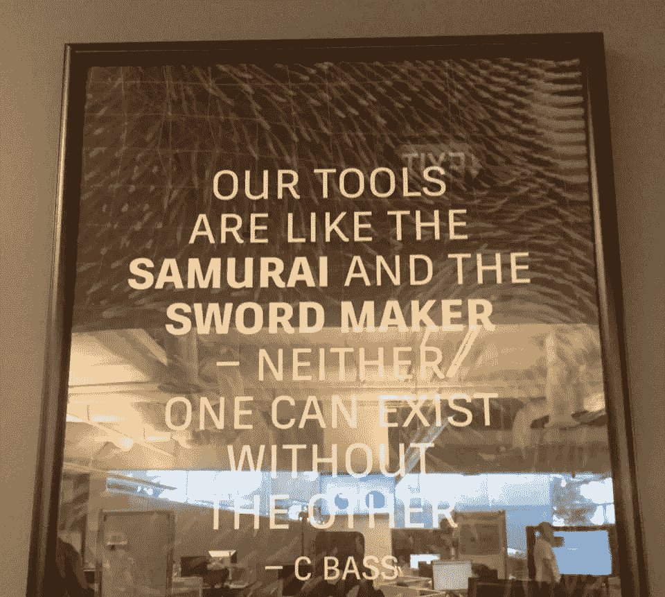
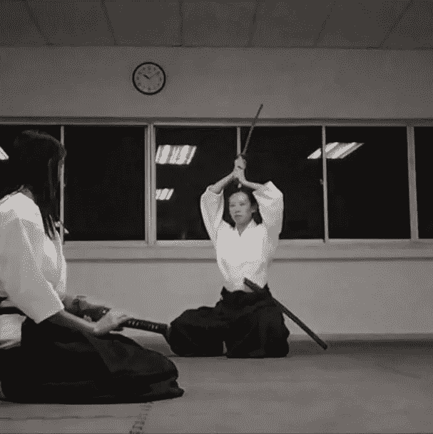

# 尊重工具。尊重技术，尊重工作。

> 原文：<https://medium.com/hackernoon/the-best-successful-people-and-mentors-to-be-around-with-are-those-who-do-work-that-change-the-270b8c41d87>

最好的成功人士和导师是那些做改变世界的工作的人(人们可能不知道)，他们低调，不炫耀他们的财富和权力，并且非常注重隐私。他们认为没有必要抢尽风头。但他们得到的是对自己工作的深深敬意。我一直对此深信不疑。

他们知道他们所做的工作比他/她自己更重要，是生活的一部分，是一个更高的目标。

就像武士尊重剑和铸剑人一样，尊重工具。我将进一步阐述这一点:

> “尊重工具、技术和工作。
> 
> 尊重艺术，尊重过程。"

在各种行业的交汇点和艺术+技术光谱上，我继续观察、综合并将其带入我在#AR 和#VR 中所做的工作。

感谢我的行业导师，合作伙伴，前老板们。你知道你是谁。

#合气道#武术# [领导力](https://hackernoon.com/tagged/leadership)#导师#AR #VR

*Vanessa Radd 是全球排名前三的增强现实影响者，也是 XR 联盟的创始成员。Vanessa 还是全球 VR AR 协会新加坡分会的主席。*推特 [@vanradd](http://www.twitter.com/vanradd)