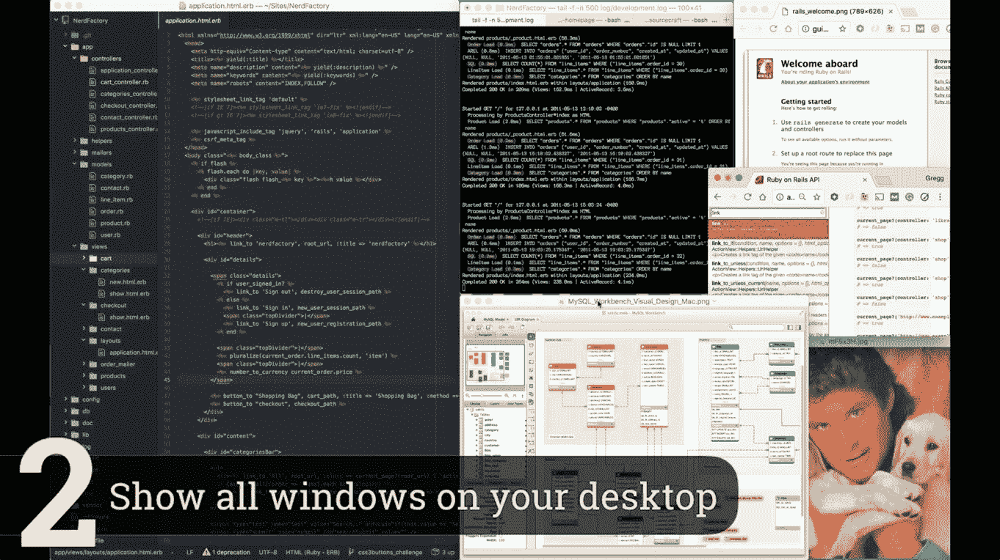
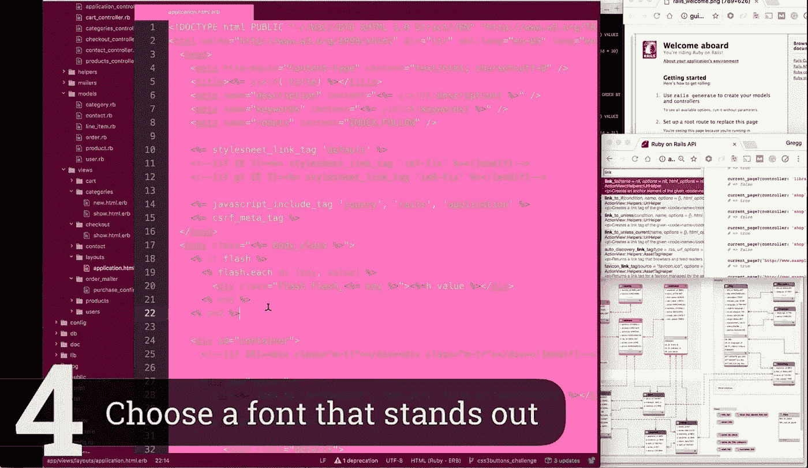
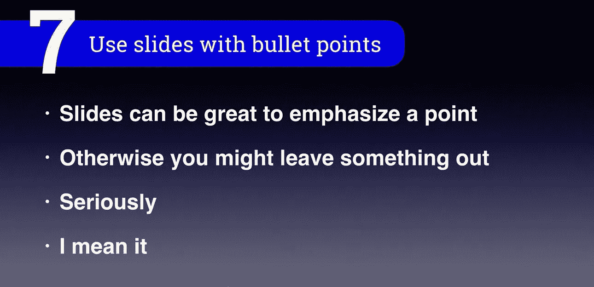

# 最佳最差编程教程

> 原文：<https://medium.com/hackernoon/the-best-worst-programming-tutorial-516da34ce5d6>

我看过一些非常糟糕的编程教程。作为一名开发者，有一天我们可能会不可避免地努力创造一个我们自己的。为了让它变得简单，我收集了 **10 个技巧来创建最好的最差编程教程**。

你可以观看上面的视频，看看这些技巧在起作用，但我也会在这里总结一下。

# 1.选择一个有趣的地点

大多数开发人员就在他们的办公桌前，但是当你走出盒子，你可以在你的房子周围找到许多地方进行拍摄。浴室有很好的音响效果，壁橱里有很多背景填充物。当我在[代码学校](https://hackernoon.com/tagged/code-school)工作的时候，我们确实有人提交了她在浴室里拍摄的电影片段。她当时很前卫。

# 2.显示桌面上的所有窗口

例如，当您开发 web 应用程序时，您将需要一个控制台、数据库可视化、API 文档和 web 浏览器来进行真实世界的开发。因此，你要确保为你桌面上的每一个都腾出空间。让你的用户了解全貌。

# 3.确保显示整个应用程序

随着 4k 技术的出现，如果它允许你在屏幕上显示整个应用程序，就没有理由切换到 6 点字体。当你可以将所有 5 个核心模块放入一个视频镜头中时，为什么只向用户显示应用程序的一部分。

# 4.选择醒目的字体

如果你真的想引起开发者的注意，确保你的字体颜色不能被忽视。特别是粉红色已经被证明可以增加大脑中识别字体、u 和中心标签元素的部分的脑细胞活动。

# 5.使用自然光或根本不使用

反正没人真的想见到你，所以录音的时候最好是在黑暗中。不露脸或者至少躲在暗处是尊重的表现，就像一个真正的代码忍者。

# 6.用你亲密柔和的声音

录制音频时，重要的是想象自己就在观众身边，对着他们的耳朵轻声说着 JavaScript 语法。温柔地和他们说话，就好像你在按摩他们的脑垂体。

# 7.使用带项目符号的幻灯片

项目符号对开发者来说就像氧气，没有它们他们就不能真正发挥作用。所有的东西都必须被组织成漂亮的盒子，或者项目符号。其他的都是简单的混乱。

# 8.使用漫画

你可能在生活中的某个时候觉得漫画字体不好。这使得它成为完美的字体来表明你在乎不同的思维和打破现状。史蒂夫·乔布斯最喜欢的字体是漫画字体。

*很可能不是真的。

有一个警告，那就是如果你使用 Ruby 语言，在这种情况下你应该总是使用 Papyrus*。

*红宝石人是优雅的 AF。

# 9.使用图表看起来很聪明

如上图所示，云服务可以自动部署区块链。如果以前不清楚，现在清楚了，因为我用了图表。对吗？

这就是全部了！我知道我答应给你 10 个建议，但视频都是关于运送它。波兰被高估了。

不过说真的，我正在制作一个视频，介绍创建最佳编程教程的最佳实践。如果你想在发布时得到通知，要么订阅 [Open SourceCraft YouTube 频道](https://www.youtube.com/c/OpenSourceCraft)或者[给我发邮件](http://notify.codepop.com/best-programming-tutorials)。