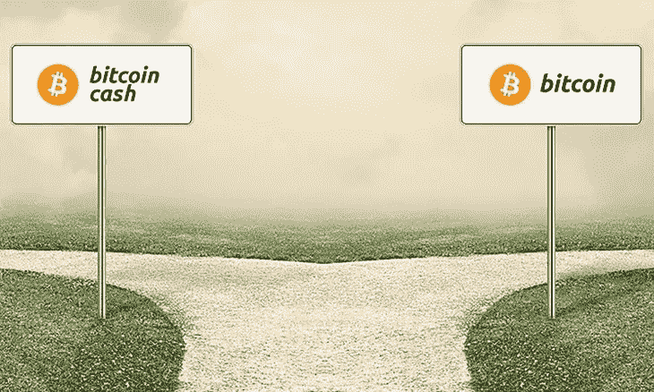
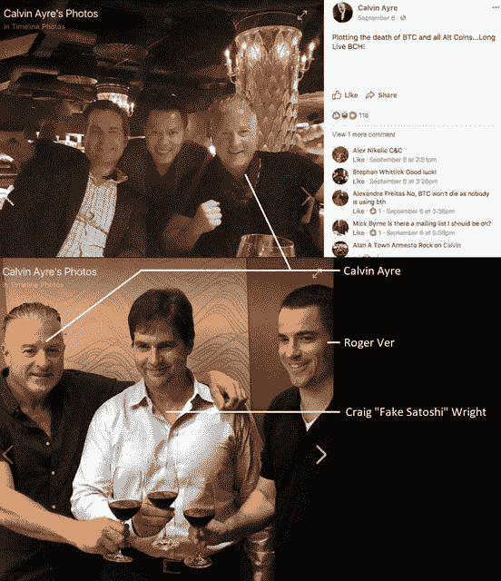
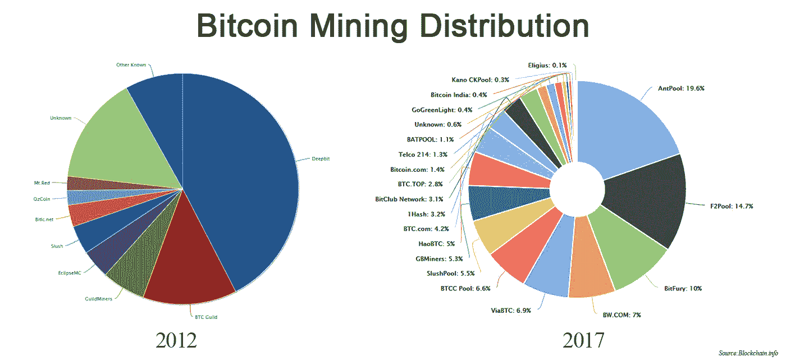
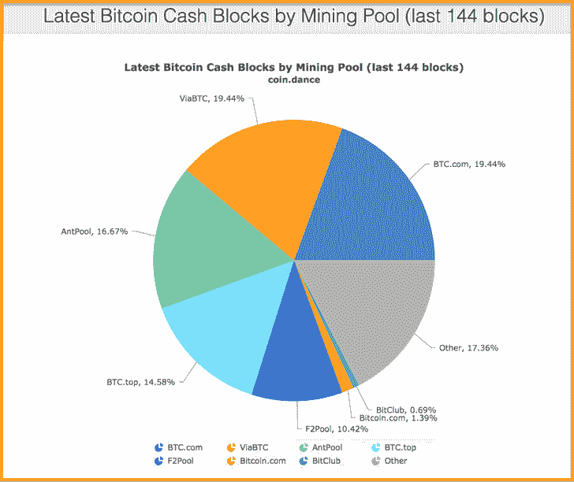

# 比特币大战:我对比特币和现金的发现

> 原文：<https://medium.com/hackernoon/the-big-bitcoin-battle-what-i-found-out-about-bitcoin-vs-bcash-d9ebca8d370e>

Image Source: [Leaprate.com](https://www.leaprate.com/experts/jens-chrzanowski/bitcoin-vs-bitcoin-cash/)

更新:自从我几天前发表这篇文章以来，Segwit2X fork 出现了一个致命错误，导致其实现失败。如果比特币采用了它，那将是一场损失数百亿美元的灾难性失败。这正是我在这篇文章中关注开发团队和工程师的能力的原因。

对于比特币和加密货币持有者来说，过去几天可谓是过山车。如果你是新手，整理一下你的头发，喝一口水，散散步，然后坐下来。如果你是一个头发花白的老手，你可能会对自由落体有点兴奋(在几个月的上涨、上涨、上涨之后)，你的心率可能会有点高，但没有什么可以失眠的——你知道比特币在尘埃落定后会没事的。

在过去 8 年左右的时间里，有一件事已经被反复证明了:比特币没有弹性，也无法抵御攻击。比特币远不止这些——比特币是 [***抗脆弱的。***](https://en.wikipedia.org/wiki/Antifragility)

抗脆弱性是系统的一种属性，它会因压力、冲击、波动、噪音、错误、故障、攻击或失败而增加能力、[弹性](https://en.wikipedia.org/wiki/Resilience_(materials_science))或[稳健性](https://en.wikipedia.org/wiki/Structural_robustness)。每次系统受到攻击后，比特币都变得更加强大，这与过去的攻击没有什么不同，也不会是比特币网络的最后一次攻击。

你可能会问，发生了什么？简单来说，运行比特币现金的人通过对比特币网络发动协同攻击，正在“密谋比特币的死亡”。为什么他们想要这样做，而不是仅仅制作一个人们实际上想要使用的更好的版本，并在市场上公平合理地击败比特币？比特币核心团队是被迫做出如此绝望的事情的吗？双方都认为自己是对的，所以很难对此事做出客观的评价。

所以我深入调查了一下。这是我想到的:

**比特币和 BCash 一言以蔽之:**

*   [比特币(BTC)](http://bitcoin.org) 是第一种加密货币，而[比特币现金或 Bcash (BCH)](https://www.bitcoincash.org/) 是 2017 年 8 月 1 日激活的比特币的[硬叉](http://bitcoinexchangeguide.com/uasf-vs-uahf-explained/)。
*   BTC 的主要价值主张是它的去中心化、作为价值储存手段的可靠性、审查阻力、网络效应，以及作为互联网时代的“数字黄金”。他们希望世界财富转移到比特币网络中。
*   BCH 的主要价值主张是，它声称要保留中本聪对比特币的“最初愿景”，让它成为一个收费极低的支付系统，就像 VISA 或 Paypal 一样，成为互联网时代的“数字现金”。他们希望全世界所有人都能使用比特币进行日常交易。

我也对这两种实现的优缺点进行了大量的研究，比如[块大小辩论](https://www.coindesk.com/2016-bitcoin-protocol-block-size-debate/)、缩放、[交易费用上涨](https://bitcoinfees.info/)、[网络拥塞](https://news.bitcoin.com/as-bitcoin-reaches-new-price-highs-network-congestion-and-fees-spike/)等等，但是我担心这会占用太多时间，使这篇文章变成一场无聊的技术讨论。相反，我将把重点放在两者背后的开发团队，每一方的主要公开支持者，并触及网络的矿工和节点。

**BTC 和 BCH 背后的开发团队:**

我相信这大概是比特币项目中最被忽视和低估的部分。比特币是软件，正如最近冻结了 3 亿美元用户资金的[以太平价钱包黑客](https://blog.zeppelin.solutions/on-the-parity-wallet-multisig-hack-405a8c12e8f7)所见，不应允许数百亿美元运行在未经世界上最好的工程师广泛测试的代码上。如果你要建造一座巨大的桥梁来运送数百万人穿越海洋，你会雇佣低级工程师来建造并不断维护和升级它吗？你会想要最好的来处理这样一个项目。有了比特币，潜在的数万亿美元将在网络中流动——我们不能让业余爱好者修补代码。

*   [比特币核心开发有一些世界上最好的密码开发人员在从事这个项目。它有一个很大的开源开发者社区，有许多对代码库的临时贡献者，以及研究、同行评审、测试、文档和翻译。他们在发布经过充分测试和彻底审查的代码方面有着无与伦比的记录。仅在上周，Github 上就有超过 100 个提交——这是过去五年来持续的发展，也是任何开源项目的最高水平](https://bitcoincore.org/en/team/)[。信心需要很高，因为](https://cointelegraph.com/news/bitcoin-core-is-most-talented-dev-team-says-vc)[这个项目现在价值 1000 多亿美元。](http://coinmarketcap.com)我想说，你可以确信他们每次都在发布顶级代码。
*   在撰写本文时，比特币现金在过去的 13 天里有[一次 Github 提交](https://github.com/Bitcoin-ABC/bitcoin-abc)。他们的开发团队由[一到两名全职开发人员](https://www.bitcoincash.org)和少数不知名的其他人组成。如果你想知道他们是谁，你甚至无法在[比特币现金网站](https://www.bitcoincash.org)上找到他们(如果我错了，请纠正我)。项目的开发水平在很大程度上是未经测试的，没有关于如何解决开发人员之间的争议或什么时候产品准备好的跟踪记录，也没有不同的开发人员测试集。对于一个一夜之间 200 亿美元的项目来说，这并不能激发人们的信心。

**比特币的主要支持者&比特币现金:两者背后的人是谁？**

这就是事情变得有点有趣的地方。

*   比特币有一个比特币核心开发团队，这是一个由软件工程师组成的团队，过去几年一直致力于比特币的开发，大部分是自愿的。已知的名人有[亚当·巴克博士](https://en.wikipedia.org/wiki/Adam_Back)、 [hashcash](https://en.wikipedia.org/wiki/Hashcash) 、被多个反垃圾邮件系统使用的[工作证明系统](https://en.wikipedia.org/wiki/Proof-of-work_system)的发明者，也是中本聪自己引用的作为比特币 POW 系统基础的工作。他也是 [Blockstream](https://blockstream.com/) 的 CEO。然后是首席开发者[Pieter Wuille](https://www.linkedin.com/in/pieterwuille)博士，他在 2010 年发现了比特币，自 2011 年 5 月以来一直是比特币核心开发者。2012 年，Wuille 发布了 [BIP 32](https://github.com/bitcoin/bips/blob/master/bip-0032.mediawiki) ，为比特币添加了等级确定性钱包。SegWit 是他的发明，现在已经在网络中激活。然后是首席维护人员[弗拉基米尔·范德兰](https://www.weusecoins.com/wladimir-van-der-laan/)，他的工资由[麻省理工学院数字货币倡议](http://dci.mit.edu/)支付。

毫无疑问，这些人是最高级的软件开发人员。他们在比特币变得很酷之前就已经在研究它了，仅仅因为他们工作的价值和他们过去辉煌的声誉，他们自然得到了社区中最大玩家的支持。

*   比特币现金最知名的支持者是罗杰·弗、·吴、卡尔文·艾尔和等人，他们公开支持他们的比特币版本是“真正的”比特币，并“策划比特币的死亡”。这些人中，只有莱特博士是程序员。 ***这些是比特币现金的所有者——他们控制着它的代码、它的挖掘、它的节点、它的营销，一切。*** 他们不仅声称 BCash 应该被称为唯一的[比特币](https://hackernoon.com/tagged/bitcoin)，他们还声称它是“唯一能够做到这一切的[区块链](https://hackernoon.com/tagged/blockchain)”。对这些人背景的一些快速研究揭示了一些事情:

[Roger Ver](https://rogerver.com/) 是最初的比特币“布道者”之一，早期为比特币做了很多帮助，投资了 Blockchain.info 和 Localbitcoins 等几家大公司，被称为“比特币耶稣”，但现在更多的人称之为“比特币犹大”。他还是 Bitcoin.com 的首席执行官，该公司与比特币无关，实际上是一个 BCash 网站。[他因在 Ebay 上出售爆炸物在联邦监狱服刑 10 个月后，在美国也是一名被定罪的重罪犯。他是比特币现金的主要支持者。](https://www.justice.gov/archive/criminal/cybercrime/press-releases/2002/verPlea.htm)

亿万富翁【Calving Ayre 在 2013 年因非法在线赌博和洗钱而被列入美国国土安全部十大通缉逃犯名单，但随后在 2017 年初被无罪释放。他拥有 Bodog，最大的在线赌博平台之一。[他还坚持认为 BCash 应该被称为比特币](https://news.bitcoin.com/calvin-ayre-declares-bitcoin-cash-the-only-bitcoin/)，尽管他过去从未对比特币的实际发展做出任何贡献。

[克雷格·赖特博士](https://en.wikipedia.org/wiki/Craig_Steven_Wright) [自称是中本聪却未能证明，被称为“假聪”](https://www.forbes.com/sites/thomasbrewster/2016/05/02/craig-wright-satoshi-nakamoto-doubt/#73237f69217a)。他是一名电脑程序员和商人。他试图在大庭广众之下假冒一个欺诈性的签名，但失败了。他证明自己是 S.N .的“证据”被证明是假的，是企图欺骗人们相信他的说法。

[吴](https://twitter.com/JihanWu?ref_src=twsrc%5Egoogle%7Ctwcamp%5Eserp%7Ctwgr%5Eauthor)是[的所有者，](https://www.bitmain.com)一家来自中国的大型矿业运营商和采矿设备销售商，控制着几乎所有比特币现金的交易。[以获得专利的 ASICBOOST 而闻名，](https://pbs.twimg.com/media/DOhVulMWAAAR3Ok.jpg)一个被社区发现的隐藏采矿软件，让他们比其他矿工拥有不公平的优势。比特币核心的升级版 Segwit 取消了这一点，因此产生了对比特币核心的仇恨。

是的，这些是比特币现金背后最值得注意的人。

Just going to leave this here…

**比特币 VS Bcash 挖矿和节点:了解你的网络**

比特币挖矿在最近五年变得更加分散，也更加强大。有趣的是，比特币现金的最大支持者(Antpool，其他人)仍然在挖掘比特币，因为它简直更有利可图。[比特币核心还有超过 7800 个活跃满节点](https://coin.dance/nodes)在运行，这是成为真正去中心化货币的最重要因素之一。这些是真正的节点，不是运行在 AWS 上，由一家公司支付费用。

比特币现金开采高度集中。看看上面的图片。如果我们将 Antpool、ViaBTC 和(Roger Ver 和 Wu 的矿池)的哈希能力结合起来，则哈希能力超过 50%。这两个人可以在任何他们想要的时候做[51%的攻击](https://learncryptography.com/cryptocurrency/51-attack)。比特币现金也只有 1200 个节点，其中许多运行在 AWS 上，并被比特币现金的主要支持者购买。

好了，我们现在对协议的两个版本有了一些非常基本的了解，对开发团队有了更深入的了解，这无疑是任何软件项目中最重要的部分，对支持每一方的主要人物有了一个概述，并从哈希速率和节点数方面客观地了解了网络的健康状况。如果你想深入这个兔子洞，我祝你好运。写这个有点累。

支持比特币网络应该是关于软件的优点和项目的开放和去中心化性质。这是一项世界前所未见的大工程——它旨在取代旧的使用和转移资金的方式。不可避免的是，当人们抵制这种改变时，攻击就会发生。谢天谢地，比特币是抗碎的。我相信*会比*更强大。

我个人的观点是，所有这些发生在密码世界的事情都将是货币进化史中一个更大故事的一部分。多年以后，我们回过头来看，可能会对此一笑置之，因为我们发现所有这些内讧都是浪费时间，并将之归因于成长的烦恼。

真正的使命仍然是:一个价值像信息一样自由流动的世界，货币本身的进化在社会有史以来最具颠覆性的技术——[比特币、加密货币和区块链技术之后迅速加速。](http://bitcoin.org)

无论这场灾难结束后会发生什么，只有一件事是确定的——技术将会继续存在并打破现状。

*   本文中的所有观点和意见都是我自己的。*