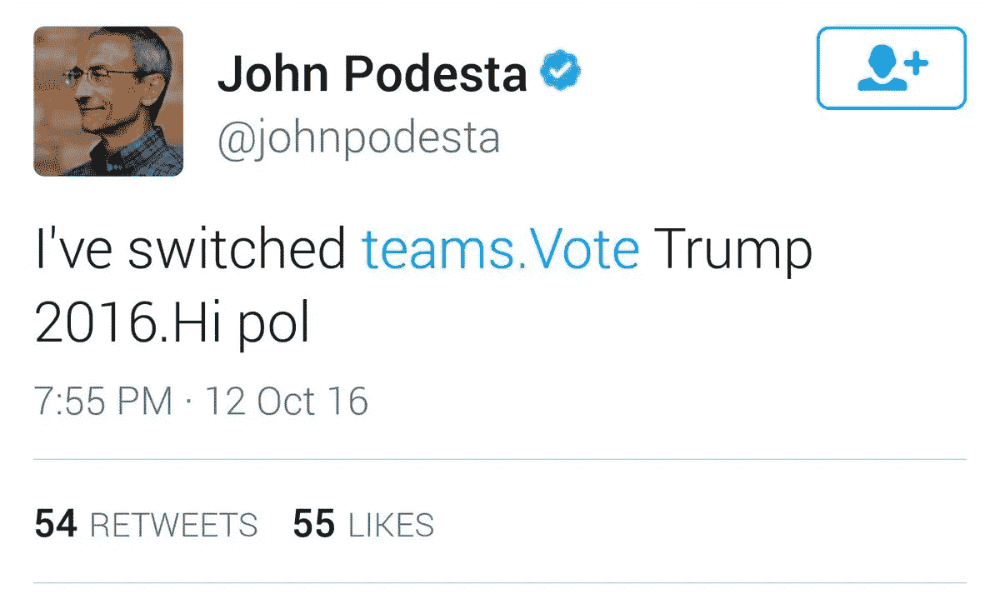
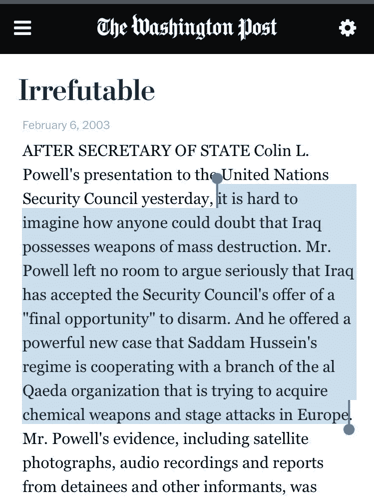
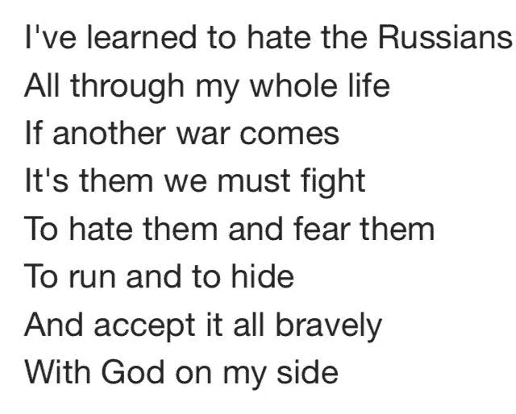

# 《俄罗斯解体的大脂肪汇编》

> 原文：<https://medium.com/hackernoon/the-big-fat-compendium-of-russiagate-debunkery-4278a753a3af>

*装载故障？查看* [*俄罗斯揭丑指数*](/@caityjohnstone/the-index-of-russiagate-debunkery-f5b6f4101dd0) *，本文分为* [*一*](/@caityjohnstone/debunking-russiagate-part-1-7cca3eb88ffa) *、* [*两*](/@caityjohnstone/debunking-russiagate-part-2-9e4b1dd895e9) 和三个部分，T21 和*三个部分，以便于阅读。*

[Russiagate](https://hackernoon.com/tagged/russiagate) 就像是海市蜃楼:从远处看，它看起来像是什么东西，但是一旦你走近去看，什么都没有。没什么。没有任何坚实的东西，没有任何实质性的东西，没有任何东西你可以指着它说:“在这里。这些确凿的证据证明，强迫性的 24/7 报道、与核超级大国不断升级的紧张关系、停滞不前的美国政治话语以及煽动歇斯底里、仇外心理的麦卡锡主义者的疯狂行为是合理的。

让我在这篇文章的序言中申明，我不是一个俄罗斯宣传员或骗子，我从未从俄罗斯政府那里收到过任何钱，也没有为任何类型的俄罗斯出版物写过文章，这与目前由[当权派忠诚分子](https://thedailybanter.com/2017/06/the-alt-left-is-losing-its-mind-and-people-are-noticing/)散布的明目张胆的谎言[相反。由于前面提到的麦卡锡主义者的政治迫害，这种令人讨厌的指控不可避免地会被更多的人提出，作为我传播这些论点的结果，但是任何这样做的人都是错误的。依此顺序，我的忠诚是，也一直是对真理与和平的忠诚。](https://rantt.com/dear-readers-of-this-article-ca65f18b45c2)

前几天，我向我的社交媒体圈询问他们最好的链接、想法和论点，以对抗反俄罗斯情绪，这种情绪一直受到当权派政客和企业大众媒体的无情打击，反应非常热烈。我不可能使用我被给予的一切，但现在这里有 27 个坚实的理由来拒绝美国权力机构颁布的关于俄罗斯的叙事。

[ *本文已于 2017 年 6 月 7 日下午 2 点 GMT 更新，以包含更多支持链接并添加*[*Debunkery*](https://hackernoon.com/tagged/debunkery)*# 27*]

# 1.没有证据。

到目前为止，这是我在众包新闻实践中看到的人们强调的最普遍的观点，也是这篇文章的来源。质疑当权派俄罗斯叙事的人敏锐地意识到，美国人民没有看到任何坚实、切实的证据来证明所谓的俄罗斯黑客行为或特朗普与俄罗斯政府勾结以赢得 2016 年大选。我们在官方发布的[和现在的](https://www.dni.gov/files/documents/ICA_2017_01.pdf)[非官方发布的](/@caityjohnstone/nsa-leak-answers-no-questions-about-russia-asks-many-about-election-integrity-22063ab493d9)中都看到了[分析报告](https://www.us-cert.gov/sites/default/files/publications/JAR_16-20296A_GRIZZLY%20STEPPE-2016-1229.pdf)，但它们都没有包含一丝一毫的确凿证据、原始情报或可测试的数据。

事实上，当权派自由主义者对俄罗斯干预美国选举和特朗普与俄罗斯选举勾结的确定性完全建立在看起来像官方的人用官方的声音说这些事情已经发生，并重复这种自信的断言，直到他们的观众认为一定有一些确凿的证据支持它。[没有](https://consortiumnews.com/2017/05/26/believing-the-russian-hacking-claim/)。只有看起来像官方的人用自信的语气指出未经证实的说法，并试图将它们与无害的因素联系起来，比如商人在 90 年代与一个新兴资本主义国家做生意。

我们没有得到任何证据。他们拒绝向我们出示任何证据。这非常可疑，本身就足以成为强烈怀疑俄罗斯门叙事的理由。

“嗯，你可以从证据开始，”Eoghan O. [在脸书](https://www.facebook.com/CaitlinAJohnstone/posts/10154012496267824?comment_id=10154012501587824&comment_tracking=%7B%22tn%22%3A%22R9%22%7D)上指出。“一个也没有。我曾多次悬赏 1000 美元给第一个向我提供俄罗斯黑客干预美国大选的实际直接证据的人。或者英国退出欧盟，法国或者德国的选举。沉默。证据。”

“‘因为我这么说’不是证据，”[丽兹 B](https://www.facebook.com/CaitlinAJohnstone/posts/10154012496267824?comment_id=10154012524412824&comment_tracking=%7B%22tn%22%3A%22R9%22%7D) 理所当然地指出。
“或者如果雷切尔·玛多和乔伊·里德说了一百万遍，”[格雷格·G](https://www.facebook.com/CaitlinAJohnstone/posts/10154012496267824?comment_id=10154012524412824&reply_comment_id=10154012656832824&comment_tracking=%7B%22tn%22%3A%22R9%22%7D)补充道。

“作为一名律师，当你指控某人违法时，你有责任提供证据。他们没有提供任何证据来支持这种说法，”Esha Krishnaswami 说。

# 2.美国国家安全局可以在任何时候提供俄罗斯黑客攻击的公开证据，而不损害任何情报来源，但他们没有。

美国国家安全局泄密者爱德华·斯诺登证实，美国国家安全局“肯定”有证据证明俄罗斯黑客入侵了民主党全国委员会，但美国国家安全局拒绝与公众分享这一信息，尽管俄罗斯黑客指控对美国人民、美国外交政策以及两个核超级大国之间的关系产生了巨大影响。这整个争端可以在不暴露任何美国间谍的身份和不透露任何来源或方法的情况下得到解决，但相反，美国人民不得不满足于一个组织的“相信我们，我们不会对你撒谎”，该组织故意将其国内监控项目作为公众的秘密，詹姆斯·克拉珀公然向美国参议院撒谎。

国家安全局要么有证据，但出于愚蠢的原因拒绝分享，要么没有证据，因此他们无法提供。说到国家安全局…

# 3.这一切都来自同一批人，他们错误地告诉我们，俄罗斯入侵了法国大选。

美国国家安全局局长迈克·罗杰斯(Mike Rogers)断言，他的机构“目睹”俄罗斯入侵法国选举基础设施。在过去的一个月里，权势集团的媒体机构和权势集团的忠诚者[一直在重复这一指控，认为这是不容置疑的事实](/@caityjohnstone/so-remember-all-those-times-democrats-said-russia-hacked-the-french-election-about-that-78fa4802d95)，就像他们重复俄罗斯黑客对 2016 年美国大选的叙述是不容置疑的事实一样。然而他们都大错特错了。法国网络安全机构负责人 Guillaume pou pard[告诉*美联社*](http://archive.is/oR5RT) 说，没有俄罗斯干预的“痕迹”，马克龙竞选活动的黑客“如此普通和简单，几乎可能是任何人。”

事实上，罗杰斯与法国自己的发现相去甚远，以至于 Poupard 完全不知道他到底在说什么。

"为什么罗杰斯上将在那个时候那样说呢？"Poupard 问道。“这真让我吃惊。真的让我的欧洲盟友大吃一惊。坦率地说，当我把这件事告诉我的国家安全局同事，问他为什么这么说时，他们也不知道如何回答。”

说到迈克·罗杰斯，猜猜谁是少数公开暗示俄罗斯入侵民主党全国委员会的情报官员之一？

# 4.“17 个情报机构”的说法是一个谎言。

自 10 月以来，希拉里·克林顿一直在宣扬“17 个情报机构”同意俄罗斯政府对黑客入侵民主党文件并将其交给维基解密负责的谎言。这一论断在成千上万的文章和无数的专家那里被当作事实重复了一遍，任何经常讨论这一问题的人都已经听到它被当权派当作事实重复了一遍，令人作呕。这从一开始就是一个看起来非常滑稽的断言，因为正如维基解密上面提到的，为了成为真实的，它需要包括与此类案件无关的机构的意见。而现在已经被彻底揭穿了。

*财团新闻* [的调查记者 Robert Parry 报道](https://consortiumnews.com/2017/05/23/new-cracks-in-russia-gate-assessment/)5 月 23 日，前中央情报局局长 John Brennan 作证说，参与黑客报告的机构只有美国国家安全局(见本列表中的第二和第三个揭秘者)、联邦调查局和中央情报局，以及监督国家情报总监办公室的詹姆斯·克拉珀(见第二个揭秘者)。克拉珀本人在 5 月 8 日的另一次听证会上也说过同样的话，他说，只有几十名从这三个机构“精心挑选”的专家参与了编写克林顿错误引用的报告。

自 5 月 8 日以来，这已经是一个众所周知的既定事实，并在 5 月 23 日得到加强，然而希拉里在 5 月 31 日的 Recode 会议上接受采访时重复了同样的谎言，[说](https://consortiumnews.com/2017/06/01/hillary-clintons-deceptive-blame-shifting/)，“17 个机构都同意，这是我作为参议员和国务卿的经验告诉我的，很难得到。他们非常自信地得出结论，俄罗斯人对我的竞选团队发动了广泛的信息战，以影响选举中的选民。”

现在我们知道了一个事实，她不仅仅是出于无知而说谎。她在撒谎，她知道她在撒谎，直到今天，像梅根·凯利这样的权威人士还在重复着同样的谎言:

这些人故意撒谎，让证据看起来比实际情况更有说服力。不是“17 个情报机构”，而是 24 个精心挑选的当权派中坚分子。在这一点上，帕里正确地指出，“任何情报专家都会告诉你，如果你‘挑选’分析师，你实际上是在挑选结论。例如，如果众所周知这些分析师是对俄罗斯的强硬派或希拉里·克林顿的支持者，他们可能会给出片面的报告，他们确实是这样做的。”

# 5.关于所谓的 DNC 黑客攻击的 CrowdStrike 报告非常可疑。

因为民主党全国委员会[拒绝联邦调查局进入他们的服务器](http://www.cbsnews.com/news/fbi-director-comey-agency-requested-access-to-dnc-servers/)调查所谓的黑客事件，第三方网络安全技术公司 CrowdStrike 独自承担了这项调查的责任，这意味着来自 CrowdStrike 的安全报告，正如 [*进步军*所说的](http://progressivearmy.com/2017/06/02/new-evidence-suggests-russian-hack-theory-could-be-false-flag-operation/)，“字面上的[唯一存在的指向俄国的链接](https://www.crowdstrike.com/blog/bears-midst-intrusion-democratic-national-committee/)”

问题在于，除了是 DNC 资助了这份重要报告这一事实之外，CrowdStrike 本身也严重缺乏可信度。首席技术官 Dmitri Alperovich 是沙特资助的华盛顿智库好战的新保守主义大西洋理事会的高级研究员。保罗·克雷格·罗伯茨[称之为](http://www.paulcraigroberts.org/2016/07/25/the-atlantic-council-the-marketing-arm-of-the-militarysecurity-complex-paul-craig-roberts/)“军事-安全综合体的营销部门”的大西洋理事会，一直在推出诸如[分散注意力、欺骗、摧毁:普京在叙利亚的战争](http://publications.atlanticcouncil.org/distract-deceive-destroy/)和[阻止普京侵略的六个直接步骤](http://www.atlanticcouncil.org/blogs/ukrainealert/six-immediate-steps-to-stop-putin-s-aggression)等尖酸刻薄的反克里姆林宫标题，并且[得到了乌克兰亿万富翁](http://www.counterpunch.org/2017/03/23/cybersecurity-firm-that-attributed-dnc-hacks-to-russia-may-have-fabricated-russia-hacking-in-ukraine/)的资助。

如果这还不够的话，*财团新闻* [报道](https://consortiumnews.com/2017/05/11/the-scandal-hidden-behind-russia-gate/)这个新保守主义智囊团也是希拉里·罗德姆·克林顿的长期支持者。事实上，2013 年，大西洋理事会[授予希拉里](https://hillaryspeeches.com/tag/atlantic-council/)杰出国际领袖奖。Mike Sainato [报道](http://www.counterpunch.org/2017/03/23/cybersecurity-firm-that-attributed-dnc-hacks-to-russia-may-have-fabricated-russia-hacking-in-ukraine/)上述乌克兰亿万富翁 Victor Pinchuk 向克林顿基金会捐赠了至少 1000 万美元。

CrowdStrike 的可信度受到了更大的打击，因为他们在报告中引用的将黑客与俄罗斯人联系起来的数据被两个相关方——乌克兰军方和国际战略研究所(IISS)——指责为错误。该报告声称，俄罗斯人此前曾侵入乌克兰的一个炮兵应用程序，导致乌克兰在与俄罗斯支持的分裂分子的战争中损失惨重，在 DNC 的黑客攻击中也发现了同样的指纹。然而，根据 VOA 的一篇报道，乌克兰国防部声称这些战斗损失和黑客攻击从未发生，IISS 称 CrowdStrike 是通过误读 IISS 数据得出结论的。

Jeffrey H. [写了下面的](https://www.facebook.com/CaitlinAJohnstone/posts/10154012496267824?comment_id=10154012943242824&comment_tracking=%7B%22tn%22%3A%22R9%22%7D):

> 有多少人真正读过 Crowdstrike 和联合情报机构的报告，这些报告是公开的，而且考虑到指控的严重性非常简短。一些亮点:
> - Crowdstrike 有偏见地将 APT28 和 APT29 恶意软件重新命名为现在臭名昭著的“花式熊”、“舒适熊”和“灰熊草原”。除了宣传之外，没有任何理由这样做。在缺乏具体证据的情况下，Crowdstrike 使用了“可能”和“暗示”这两个词。
> ——联合情报报告以《众筹》报告为出发点，大量引用了该报告，并补充了他们的官僚语言:“我们评估”具有“高度(就美国国家安全局而言，中度)信心”。William Binney 指出，当你看到这样的话，这意味着没有证据——否则他们会说“我们有直接证据表明……”
> ——联合情报报告花了 2 -3 页重复 Crowdstrike 的材料，没有添加新的证据，然后在 12-13 页中抨击 RT 行使第一修正案的权利，并对如何检测恶意软件进行了大量解释。
> ——这当然导致了伯灵顿电气公司在一台未联网的笔记本电脑上发现恶意软件的“丑闻”。)而媒体也爆出了关于试图入侵电网的荒诞说法。
> - APT28 和 APT29 无处不在，散漫在野外。

因此，俄罗斯入侵民主党全国委员会的证据非常薄弱，而且非常可疑。哦，对了，你猜怎么着？

# 6.也没有充分的理由相信俄罗斯人(或任何人)侵入了波德斯塔的电子邮件。

当塞思·里奇谋杀案的调查最近引起公众兴趣时，由中央情报局资助的《华盛顿邮报》急忙告诉其读者，塞思·里奇是 DNC 泄密的源头不会使俄罗斯门无效，因为俄罗斯仍然肯定入侵了波德斯塔的电子邮件。以下内容彻底揭穿了这一论断。

人们普遍认为克林顿竞选经理约翰·波德斯塔使用“p@ssw0rd”作为密码，但这只是 2015 年初他不小心把手机落在出租车上后给他的临时密码。一份不为人所知的[维基解密文件](https://wikileaks.org/podesta-emails/emailid/6589)披露，波德斯塔的密码实际上是“Runner4567”，从电子邮件的上下文来看，他的办公室助理们似乎都知道这个密码。有人看到他问助手 Eryn Sepp 是否知道他的密码，她告诉他“万一米利亚没有给你，就让[*原文如此*]”指的是波德斯塔的助手米利亚·费舍尔。这是他几个月来的密码，在维基解密开始公布他的电子邮件后仍然没有改变，这几乎可以肯定是 4chan 上的一个淘气男孩如何能够访问 Podesta 的 Twitter 帐户并发布这条推文:

克林顿竞选团队证实了推特被黑一事，此后波德斯塔的账户没有任何问题。那个恶作剧的/pol/ anon 之所以能进得去，是因为波德斯塔几个月来不仅使用了这个非常脆弱、容易记住的密码，而且显然是在所有事情上使用它，而不仅仅是他的 Apple ID。

所以我们真的要相信，这个连自己办公室里谁知道他的弱密码都不知道，谁用那个弱密码做任何事的家伙，需要被俄罗斯特工黑掉或钓鱼，才能让那些邮件进入维基解密？在那样的环境下，任何在办公室呆过的人都有可能接触到那些电子邮件；[阅读关于波德斯塔的出租车经历的戏剧](http://theduran.com/exposed-john-podesta-leaked-the-podesta-emails-to-wikileaks/)，清楚地了解他的助手是如何参与他的密码和技术访问的。任何有内部权限的人都可能将波德斯塔的电子邮件泄露给维基解密，维基解密的盟友克雷格·默里坚持认为这正是所发生的事情。波德斯塔的电子邮件安全像筛子一样密不透风，所以没有理由将他们通过维基解密的泄露特别归因于俄罗斯。

# 7.许多专家非常怀疑黑客攻击的说法。

# 8.同样值得注意的是:众所周知，中情局积极培养伪造俄罗斯网络入侵迹象的能力。

“中情局的[远程设备部门](https://wikileaks.org/ciav7p1/cms/space_753668.html)的[阴影小组](https://wikileaks.org/ciav7p1/cms/page_2621751.html)收集并维护[一个庞大的攻击技术库](https://wikileaks.org/ciav7p1/cms/page_2621753.html)，这些攻击技术是从包括俄罗斯联邦在内的其他国家生产的恶意软件中‘窃取’的，”[维基解密在他们的第一份 Vault 7 CIA leaks 发布后写道](https://wikileaks.org/ciav7p1/#EXAMPLES)。

# 9.民主党人说维基解密的电子邮件没有包含任何罪证，这是彻头彻尾的谎言。

因此，正如我们所讨论的，民主党全国委员会的泄密和波德斯塔的电子邮件在官方机构关于它们是如何被发布的叙述中有着巨大的、巨大的情节漏洞。这些黑客指控引发了我们今天经历的反俄罗斯指责游戏，但民主党人知道他们永远不会简单地说“俄罗斯人告诉美国人民真相，让我们输掉了选举！”他们需要一种新的叙事，这就是所有关于“假新闻”和“俄罗斯宣传”的说法的来源。

如果你觉得有点自虐，看看希拉里·克林顿最近在 Recode 会议上的亮相，从马嘴那里得到一张关于这种精心制作的叙事应该是什么样子的纯粹图片。她说，Podesta 电子邮件中的信息只不过是无伤大雅的普通商店谈话，[称它们为](https://www.recode.net/2017/5/31/15722218/hillary-clinton-code-conference-transcript-donald-trump-2016-russia-walt-mossberg-kara-swisher)“无聊的止痛药”，然后继续讲述这些 100%无聊、无伤大雅的电子邮件是如何被 Infowars 等网站断章取义，并编织成“你能想象的最令人愤慨、古怪、荒谬的谎言”在整个采访过程中，她谈到了像这样的“武器化信息”是如何被编为“假新闻”，然后由俄罗斯特工在目标地区传播的。

所以，我要重申:按照希拉里·罗德姆·克林顿本人的说法，当权派的说法是，维基解密的电子邮件中绝对没有任何指控，但它们被编成假新闻故事，并通过一个复杂的俄罗斯宣传网络在美国各地传播，克林顿声称特朗普阵营很可能知情。

这个故事的问题是什么？这些电子邮件本身就非常具有罪恶感；他们不要求任何假新闻或俄罗斯的宣传被任何阅读它们的人视为有罪。

事实上，民主党全国委员会官员在他们泄露的电子邮件中的阴谋和“我们对他们”的语言毫无疑问地揭示了对民主党全国委员会章程第 4 节第[第 5 条的公然违反，该章程向美国人民承诺，民主党全国委员会主席(包括并参与了许多这些电子邮件)“应负责确保民主党全国委员会的国家官员和工作人员在民主党总统候选人提名过程中保持公正和公平。”这显然没有发生，看一眼](https://www.documentcloud.org/documents/2989759-Impartiality-Clause-DNC-Charter-Bylaws-Art-5-Sec-4.html)[一些最糟糕的电子邮件](http://heavy.com/news/2016/07/wikileaks-emails-clinton-bernie-list-directory-photos-most-damaging-worst-rhode-island-delegate-fec-jvf/)就知道了。民主党全国委员会章程[经过修订](http://www.npr.org/templates/story/story.php?storyId=93937947)，承诺防止 1968 年芝加哥[惨败](https://www.c-span.org/video/?74510-1/1968-democratic-convention)后的退欧，2016 年他们不可否认地打破了这一承诺。

尽管民主党全国委员会的泄密事件很糟糕，但后来的泄密事件更能说明问题。从唐娜·巴西勒[充当反对桑德斯竞选活动的内奸](https://twitter.com/wikileaks/status/785573145700892673)并将[多个辩论问题](http://www.zerohedge.com/news/2016-10-31/donna-brazile-shared-more-debate-questions-hillary)提前传递给希拉里，到花旗集团高管的一封[电子邮件，告知奥巴马他在 2008 年当选前可以选择哪些内阁成员(在华尔街骗子引发 2008 年全球金融危机后，谁将继续执行应对华尔街骗子的政策), 克林顿夫妇从](https://newrepublic.com/article/137798/important-wikileaks-revelation-isnt-hillary-clinton)[卡塔尔](http://www.washingtontimes.com/news/2016/oct/13/wikileaks-emails-reveal-bill-clintons-1m-birthday-/)和[摩洛哥](https://www.theatlantic.com/politics/archive/2016/10/hillary-clinton-foundation-morocco-wikileaks/505043/)和[接受来自武装 ISIS 的政治团体的资金](http://21stcenturywire.com/2016/11/04/wikileaks-hillary-clinton-knew-saudi-qatar-were-funding-isis-but-still-took-their-money-for-foundation/)，到[证据](http://observer.com/2016/11/wikileaks-clinton-camp-rigging-primaries-as-early-as-2014/)表明民主党全国委员会早在 2014 年就在为克林顿铺路，到暗示克林顿竞选团队对伯尼·桑德斯有某种[影响力](https://wikileaks.org/podesta-emails/emailid/47397)， 克林顿向一群高盛(Goldman Sachs)高管承诺，为了他们的利益，她会向美国人民撒谎，向他们保证，她理解在经济问题上同时拥有一个“[公共职位和一个私人职位](https://wikileaks.org/podesta-emails/emailid/927)的重要性。

因此，这种认为需要假新闻和俄罗斯的宣传才能让维基解密发布的内容伤害克林顿竞选团队的观点显然是骗人的。克林顿没有被假新闻和俄罗斯的宣传伤害，而是被真相伤害了。

# 10.这个搞笑的三分钟视频，完全由主流媒体剪辑而成。

# 11.即使俄罗斯真的黑了民主党，那也不能证明今天席卷美国的歇斯底里和麦卡锡主义是正当的。

我认为，在这一点上，我们可以很舒服地说，俄罗斯入侵民主文件并将其交给维基解密的说法，其可信度与普通街头精神分裂症患者的胡言乱语差不多，事实上，公众尚未看到这一煽动性指控的任何证据，这意味着它应该受到普遍的鄙视。

但这些最终都不重要。从技术上来说，民主党的电子邮件可能碰巧被克林顿在整个竞选活动中威胁恐吓的那个国家黑客攻击，但没有留下任何公众能够看到的痕迹，但即使他们看到了，那又怎么样呢？美国政府[自己的数据显示](http://www.mintpressnews.com/governments-own-data-shows-us-interfered-in-81-foreign-elections/226143/)它在 1946 年到 2000 年间故意干预了 81 个外国政府的选举([包括俄国](http://content.time.com/time/subscriber/printout/0,8816,984833,00.html))，这还不算它促成的政变和政权更迭。如果俄罗斯通过向美国人民展示他们政府的真相来干预选举，那将只是美国尝到了它几十年来无耻抛出的一点味道。

只有那些看起来像官方的人在不间断的媒体报道中自信满满的断言，才会让任何人相信 DNC 泄密和波德斯塔电子邮件背后的来源有什么关系。真正重要的是那些泄露的令人震惊和有罪的内容，以及由此带来的对[的揭露](/@caityjohnstone/dnc-shatters-the-illusion-of-american-democracy-in-order-to-keep-peoples-27-bucks-eaccc01ad3bd)，在一个[严格执行](http://www.huffingtonpost.com/pete-tucker/what-the-hell-how-third-p_b_11277474.html) [两党制](https://spectator.org/66071_americas-two-party-system-too-ingrained-change/) [的国家中，其中一个政党觉得有权](/@caityjohnstone/the-media-blackout-on-the-dnc-lawsuit-proves-that-it-is-nuclear-32305f574f6e)操纵其初选和破坏进步的候选人。与民主在美国并不存在的事实相比，世界另一端的某个冰冷的土豆地可能部分地指责美国干涉了华盛顿傀儡鲍里斯·叶利钦的连任竞选，这种想法是微不足道的。

# 12.早在俄罗斯故事公之于众之前，早在特朗普-俄罗斯选举勾结指控浮出水面之前，克林顿阵营就已经在构建这一故事了。

# 13.希拉里·克林顿在整个竞选活动中一直在推动与俄罗斯的关系升级，远在任何泄密或黑客指控之前。

俄罗斯俄罗斯俄罗斯。不到一年前，这个普通美国人几乎从未想过的国家，出现问题的可能性有多大？这是希拉里·克林顿多年来一直推动恐怖升级的同一个国家的可能性有多大？

[这里有一篇 2015 年初的文章](http://www.politico.com/story/2015/01/hillary-clinton-ukraine-aid-military-financial-114462)，其中克林顿呼吁增加美国在乌克兰的军事支持。[这里有一篇 2015 年 9 月的文章](http://www.npr.org/sections/thetwo-way/2015/09/30/444679327/russia-begins-conducting-airstrikes-in-syria-at-assads-request)，关于俄罗斯应阿萨德的要求开始空袭叙利亚。[这里有一篇 2015 年 10 月的文章](http://thehill.com/policy/defense/257406-mccain-backs-clintons-call-for-a-no-fly-zone-in-syria)，关于嗜血的新保守主义者约翰·麦凯恩对希拉里·克林顿提议的叙利亚禁飞区的支持，这无疑是一种战争行为，到那时，这将涉及与俄罗斯空军的直接对抗。以下是《纽约时报》2013 年的一篇文章 [*披露，在美国能够控制叙利亚领空之前，这个禁飞区需要 7 万名地面部队入侵并摧毁阿萨德的防空能力。*](http://www.nytimes.com/2013/10/23/world/middleeast/obamas-uncertain-path-amid-syria-bloodshed.html?referrer=&_r=2)

[这里有一篇 2015 年 6 月的文章](http://www.washingtontimes.com/news/2015/jun/9/hillary-clintons-hawkish-position-on-russia-troubl/)，题为“希拉里·克林顿对俄罗斯的鹰派立场困扰过道两边”，其中明确表示，“民主党总统竞选人希拉里·罗德姆·克林顿在国内问题上向左转，但在外交政策上比她的一些共和党对手更加鹰派，甚至引发了人们对她准备让美国与俄罗斯开战的担忧。”

在黑客指控之前，她与俄罗斯的关系正在升温，在黑客指控之后，她甚至进一步升温，在黑客指控之后很久，她和她的亲信们还在继续寻找借口与俄罗斯的关系升温。这个国家现在正受到制裁，并在其边境上进行挑衅性的军队集结，这是即将离任的奥巴马政府为回应这一所谓的干预选举而升级的。

几率有多大？被指控“黑选”并与特朗普勾结的国家与长期以来一直是希拉里·克林顿鹰派外交政策中心的国家是同一国家的可能性有多大？非常有趣的是，早在当权派媒体将普京变成今天这样的国家恶魔之前，美国权力机构的高层就有反对普京的鹰派议程。

这就引出了我们的下一个观点:

# 14.美国权力机构通过在俄罗斯问题上向美国人民撒谎来获取一切利益。

美国未经选举的权力机构长期以来一直试图控制叙利亚，而俄罗斯对这个战略上至关重要的国家的直接军事介入严重破坏了这些计划。普京采取如此大胆的行动，以及[从美国在乌克兰的](https://en.wikipedia.org/wiki/Annexation_of_Crimea_by_the_Russian_Federation#Crimean_public_opinion)[傀儡政权](http://readersupportednews.org/opinion2/277-75/22758-meet-the-americans-who-put-together-the-coup-in-kiev)手中吞并具有战略价值的[克里米亚半岛](https://en.wikipedia.org/wiki/Crimea#Strategic_value)并与中国合作[削弱美元在东方的霸权](https://needtoknow.news/2017/04/china-russia-replace-us-dollar-reserve-currency/)这一事实意味着，美国权力机构不仅必须推动大马士革的政权更迭，还必须推动莫斯科的政权更迭。而且它公开承认它想这么做；众议员 Eric Swalwell [在三月份告诉福克斯的塔克·卡尔森](http://insider.foxnews.com/2017/03/20/tucker-carlson-eric-swalwell-says-russia-did-act-war-interfering-trump-clinton-election)俄罗斯的计划是用“更严厉的制裁”来“挤压他们的经济”，以至于它“切断俄罗斯与世界其他地区的联系”，从而“伤害[普京]的声望”。

为了升级与一个核超级大国的紧张关系，美国的权力机构需要制造被统治者的同意。没有这种同意，他们将面对 3.2 亿愤怒的全副武装的美国人，他们对政府冒着生命危险与北约在俄罗斯边境集结军队和在叙利亚不必要的军事存在玩核边缘政策的方式感到不满。

如果你根据希拉里·克林顿(Hillary Clinton)和华盛顿机构在黑客指控浮出水面前后的言论和行为来看待这些事情，你只会看到一个预先存在的议程正在被证明是合理和先进的。你看到“萨达姆拥有大规模杀伤性武器”。

这就引出了我们的下一点:

# 15.这就是那个在大规模杀伤性武器问题上对我们撒谎的权力机构。

> “因此，在这一点上，美国人民自己需要承担一些责任，理解我们已经有了这样一段维持现状的历史，这是美国为战争辩护和发动战争的方式。我们的前提应该是——他们会对我们撒谎。而我们真正的举证责任应该高得离谱。”黛比·吕西尼昂

在美国和联军是否应该入侵伊拉克并推翻萨达姆的问题上，辩论有正确的一面，也有错误的一面。这些俄罗斯人会因为我们对“大规模杀伤性武器”的叙述和伊拉克政权更迭的价值表示怀疑而把我们妖魔化为颠覆性的、叛国的怪物。在这场辩论中，我们本应站在正确的一边，而这些轻信大众媒体官方叙述的新保守主义建制派忠诚者(T2)本应站在错误的一边。

每当有人试图告诉我，我是一个偏执的阴谋论者，因为我说整个政治机构及其企业媒体喉舌都可能被带上船，以谎言向美国人民兜售，我告诉他们，这就是字面上的[确切地说](http://www.thedailybeast.com/michael-moore-on-the-iraq-war-the-liberals-backed-it)T2【发生的事情】 [对伊](http://www.counterpunch.org/2016/07/08/how-the-iraq-war-was-sold/)。当你有一个[社团主义体系](https://www.youtube.com/watch?v=5tu32CCA_Ig)时，在这个体系中，只有极少数极有权势的财阀[拥有美国几乎所有的媒体](http://www.pbs.org/independentlens/democracyondeadline/mediaownership.html)，这并不难做到。从现状中获益的拥有媒体的财阀们雇佣那些将推动现状的人。如果任何一个正直的人碰巧通过了他们的筛选系统，就像菲尔·多纳休那样，他们就会被解雇，由一个顺从体制的人取代。

多纳休在 2003 年拥有 MSNBC 收视率最高的节目，然而在入侵伊拉克的准备阶段他却被解雇了。一份泄露的 MSNBC 内部备忘录透露，他被解雇是因为他将成为“战争时期 NBC 难以面对的公众人物……。他似乎乐于介绍反战、反布什和怀疑政府动机的客人。备忘录警告说，多纳休展览可能会成为“自由派反战议程的大本营，而与此同时，我们的竞争对手却在利用一切机会挥舞旗帜。”

因此，认为这些媒体在有机会的时候不会宣传鹰派议程实际上是非常不合理的，而且两党对入侵伊拉克的广泛支持表明，对这些议程的支持在华盛顿也有肥沃的土壤。这些人会对我们撒谎。这些人对我们撒谎。这些人在对我们撒谎，为莫斯科和大马士革的地缘政治夺权和政权更迭制造支持。

# 16.美国权力机构对普京构成的威胁撒谎。

对俄罗斯采取“强硬”立场的一个主要理由是普京对周边国家构成了威胁，他将 2014 年俄罗斯“入侵”克里米亚作为他可能“入侵”其他国家的证据。斯蒂芬·f·科恩(Stephen F. Cohen)可以说是美国在美俄关系方面的最高权威，[他说](https://youtu.be/mCMyHJJrdDw)没有“证据”表明俄罗斯有侵略任何人的意图。

更重要的是，俄罗斯“入侵”克里米亚的说法是当今美国权力机构散布的最荒谬、最容易被揭穿的谎言之一。俄罗斯没有“入侵”克里米亚，就像我的朋友在我邀请她过来喝茶时“入侵”了我的家一样；克里米亚人举行了公投，询问他们是否希望成为乌克兰或俄罗斯的一部分，他们以压倒性多数选择了俄罗斯。顺便说一下，这是一个不争的事实:[美国民调](https://www.bbg.gov/wp-content/media/2014/06/Ukraine-slide-deck.pdf)发现，绝大多数克里米亚居民支持俄罗斯吞并，并认为乌克兰应该尊重这一事实，一年后，德国民调公司[发现这一点没有改变](http://www.forbes.com/sites/kenrapoza/2015/03/20/one-year-after-russia-annexed-crimea-locals-prefer-moscow-to-kiev/#a8ec615951b7)。

就是这样。这就是那些希望你渴望与俄罗斯发生冲突的人所宣扬的巨大而可怕的“俄罗斯扩张主义”的全部内容。克里米亚发现自己与 2014 年 2 月乌克兰罢黜总统维克托·亚努科维奇(Viktor Yanukovych)意见相左，克里米亚人民希望加入俄罗斯，俄罗斯促成了这一点。克里米亚是一个具有战略和文化意义的地方，其人民认为自己是苏联/俄罗斯人，而不是乌克兰人，但在该地区不断变化的边界的洗牌中迷失了，因此这对克里米亚和俄罗斯来说都是互利的安排。然而，企业媒体经常试图将吞并与希特勒入侵波兰相提并论。那是愚蠢的。

你认为不管德克萨斯人民想要什么，德克萨斯应该归还给墨西哥吗？因为德州发生了完全相同的事情。[绝大多数](https://en.wikipedia.org/wiki/Texas_annexation#Jackson_and_Van_Buren_administrations)德克萨斯人希望成为美国的一部分，尽管墨西哥愤怒反对并拒绝承认德克萨斯的主权，美国还是实现了这一愿望。不管克里米亚人想要什么，强迫他们回到乌克兰的统治之下，就像不管德克萨斯人想要什么，强迫他们回到墨西哥的统治之下一样疯狂，直到他们甚至不会说同样的语言；正如大多数德克萨斯人说英语而不是西班牙语一样，[大多数克里米亚人说俄语而不是乌克兰语](http://america.aljazeera.com/multimedia/2014/3/map-russian-the-dominantlanguageincrimea.html)。

反俄尖酸刻薄的推动者大多连克里米亚(Russiagate queen Maxine Waters [二月称其为“Korea”](http://www.mediaite.com/tv/dem-congresswoman-maxine-waters-declares-that-putin-invaded-korea-instead-of-crimea/))怎么发音都不知道，更别说了解这些基本动态了。如果你反对吞并克里米亚，那你就大错特错了。认为克里米亚人民不应该被允许决定自己的国籍的观点，就像认为美国可以通过军事力量废黜一个主权国家的领导人一样，是一种堕落的美国至上主义和新保守主义立场。俄罗斯尊重克里米亚人民的意愿是正确的，没有理由认为这意味着他们将“入侵”任何东西。

罗布·斯奈德[写道](https://www.facebook.com/CaitlinAJohnstone/posts/10154012496267824?comment_id=10154012675842824&comment_tracking=%7B%22tn%22%3A%22R9%22%7D):

> 美国是乌克兰、整个中东和非洲的侵略者，而俄罗斯最终反对了这场在克里米亚和叙利亚的侵略。所以美国的政策(霸权)就是和俄罗斯开战(没有任何力量可以存在限制美国的力量)。俄罗斯门媒体项目是对俄罗斯战争的一部分，美国将使这场战争升级，特别是如果媒体/宣传战被允许不受挑战地继续下去。因此，这些链接是相关的:
> 
> [(1) Seumas Milne，将乌克兰推向战争边缘的不是俄罗斯，卫报，2014 年 4 月 30 日](https://www.theguardian.com/commentisfree/2014/apr/30/russia-ukraine-war-kiev-conflict)
> 
> [(2) Seumas Milne，在乌克兰，法西斯、寡头和西方扩张是危机的核心，《卫报》，2014 年 1 月 29 日](https://www.theguardian.com/commentisfree/2014/jan/29/ukraine-fascists-oligarchs-eu-nato-expansion)
> 
> [(3)罗伯特·帕里，新保守主义者想从乌克兰危机中得到什么，财团新闻，2014 年 3 月 2 日](https://consortiumnews.com/2014/03/02/what-neocons-want-from-ukraine-crisis/)
> 
> [(4)克里斯托弗·布克，西方如何引诱乌克兰进入其轨道的新证据，《每日电讯报》，2014 年 8 月 9 日](http://www.telegraph.co.uk/news/worldnews/vladimir-putin/11023577/Fresh-evidence-of-how-the-West-lured-Ukraine-into-its-orbit.html)
> 
> [(5)2014 年 1 月 24 日，第 4 频道，乌克兰:处于“民主”抗议核心的极右极端分子](https://www.channel4.com/news/kiev-svoboda-far-right-protests-right-sector-riot-police)
> 
> [(6)2013 年 12 月 13 日在美国国务院美国-乌克兰基金会会议上的讲话](https://www.state.gov/p/eur/rls/rm/2013/dec/218804.htm)
> 
> [(7)乌克兰危机:泄露的纽兰-皮亚特通话记录，英国广播公司新闻，2014 年 2 月 7 日](http://www.bbc.com/news/world-europe-26079957)
> 
> [(8)众议院就美国与乌克兰新纳粹分子合作一事质问纽兰，NSNBC 国际，2014 年 5 月 9 日](https://nsnbc.me/2014/05/09/house-grilled-nuland-us-cooperation-neo-nazis-ukraine/)
> 
> [(9)乌克兰政变:2015 年 2 月 2 日，庞蒂亚克论坛报，奥巴马承认在基辅“斡旋权力过渡”](http://pontiactribune.com/2015/02/ukraine-coup-obama-admits-brokering-power-transition-kiev/)
> 
> [(10)托尼·卡塔卢奇，西方访问基辅新成立的政权，新东方展望，2014 年 4 月 23 日](http://journal-neo.org/2014/04/23/west-visits-newly-installed-regime-in-kiev/)
> 
> [(11)美国副总统乔·拜登在基辅会见乌克兰代总理阿尔谢尼·亚采纽克，美国广播公司新闻，2014 年 4 月 23 日](http://www.abc.net.au/news/2014-04-22/joe-biden-meets-arseny-yatseniuk-in-kiev/5405220)
> 
> [(12)托尼·卡塔卢奇，乌克兰与南溪之战，新东方展望，2014 年 6 月 27 日](http://journal-neo.org/2014/06/27/ukraine-and-the-battle-for-south-stream/)

# 17.美国权力机构在叙利亚问题上撒谎。

另一件事是，忠于体制的人引用“俄罗斯扩张主义”的证据来证明他们的仇外心理和麦卡锡主义是正确的，那就是俄罗斯参与了叙利亚冲突。如果你仔细观察，他们的叙述可以归结为一个奇怪的想法，即弗拉基米尔·普京和巴沙尔·阿萨德都对无端杀害平民有一种奇怪的迷恋，但巴沙尔不想独吞所有的屠杀，所以他邀请了他的好友弗拉德加入这场大屠杀。不管出于什么原因，普京不想向离家更近的平民扔炸弹，所以他答应了。这是他们的根本前提。他们中的许多人都没有仔细研究过它——他们只是拥护它，而没有认真思考过它——但这确实是他们“普京和阿萨德是邪恶的杀手，他们联手屠杀平民”的叙述有任何意义的唯一方式。

实际上，俄罗斯和叙利亚是[的长期盟友](http://www.latimes.com/world/middleeast/la-fg-syria-russia-20170406-story.html)，俄罗斯军队应叙利亚政府的邀请驻扎在叙利亚。下面是[获奖的](https://youtu.be/dgdr2Bm5P-c?t=5m22s)调查记者 Seymour Hersh 告诉 *Democracy NOW* 的一段视频剪辑，他的消息来源告诉他，叙利亚的任何温和派反叛分子都已被“占领”，这是“今年年初”就知道的。这次采访是在 2013 年。

由于与亲阿萨德联盟作战的唯一力量是极端圣战组织，普京认为俄罗斯在叙利亚是为了防止叙利亚成为另一个利比亚——另一个被恐怖和混乱统治的崩溃国家。那是他*陈述的*议程；当然，普京也想阻止美国通过政权更迭干预控制另一个关键的战略位置，但这不是美国人被告知的，因为美国人民永远不会同意另一场关于化石燃料和资源的战争。

所以他们撒谎。他们告诉你这是为了保护孩子。

CNN 与 Bana Alabed psy-op 的合作足以彻底摧毁主流媒体在叙利亚问题上讲真话的任何观念。事实上，这样一个主流新闻机构故意上演了一场假采访，一个不会说英语的七岁女孩向 CNN 毫无防备的观众朗读了照本宣科的战争宣传，这必然意味着没有任何有效的理由让任何人再相信这些可怕的人。事实上，美国有线电视新闻网故意参与这样一个深刻的欺骗，操纵，和道德上邪恶的事情意味着没有什么你可以把过去他们。

看这个视频。这个女孩肯定不是在用一个孩子说话的方式说话，或者使用一个孩子会使用的词语和概念。你知道这是真的。看她的眼睛；她显然是在读提词器，一个音节一个音节地读出单词。为什么一个七岁的小女孩会用提词器？或者，即使你不相信她在通过提词器朗读，只是在来回移动眼睛的同时凭记忆背诵，是谁给了她这些话要说？谁给了她那个剧本，还有*为什么 CNN 的 Alisyn Camerota 有它的另一半*？为什么 CNN 假装在采访一个小女孩，而他们却在遵循一个由成年人创作的剧本？为什么主持人假装她正在进行一场真正的来回对话，而她却像小女孩一样滔滔不绝地说着照本宣科的台词？

当我说 Bana 不理解她被要求发出的声音时，我的意思是她甚至不理解最简单的英语句子，更不用说她为 CNN 一个音节一个音节背诵的复杂的脚本了。看看这个视频，是她几个月前到达伊斯坦布尔后拍摄的，在那里她不明白一个关于她喜欢吃什么食物的简单问题，所以她开始背诵她早些时候听到的关于拯救叙利亚儿童的一句话:

他们在对你撒谎。他们利用小孩子操纵你支持军事干涉主义，为少数财阀谋利。当你有时间的时候，请观看对 Vanessa Beeley 的采访，她解释了精心制作的谎言和宣传网络，西方正在被灌输以制造对干预叙利亚的支持。它并没有像企业媒体骗子们坚称的那样发生。[他们在撒谎。我们知道他们在叙利亚问题上对我们撒谎，所以在俄罗斯问题上也没有理由相信他们。](/@caityjohnstone/you-only-hate-assad-because-your-tv-told-you-to-5e3c9a9d17f9)

# 18.美国权力机构长期以来一直利用谎言、宣传和虚假旗帜来制造对不道德的军事侵略行为的支持。

从越南战争到海湾战争，再到入侵伊拉克，执掌美国政府的社团主义权力结构一直在欺骗美国人民，让他们同意对不存在的威胁做出军事回应。对越南来说，是假的东京湾事件。海湾战争中，是虚假的[纳伊拉证词](https://en.wikipedia.org/wiki/Nayirah_(testimony))让美国人相信伊拉克士兵在科威特医院杀害了数百名早产儿，将他们从保育箱中取出。随着入侵伊拉克，企业媒体通过[大规模杀伤性武器谎言](http://www.motherjones.com/politics/2011/12/leadup-iraq-war-timeline)和[蓄意心理战](http://www.newslogue.com/debate/277/CaitlinJohnstone)将“萨达姆·侯赛因”和“9/11”的概念融合在观众的脑海中，这是如此成功，以至于在入侵伊拉克 6 个月后，70%的美国人仍然认为萨达姆应对 9/11 袭击负责。

你现在真的相信同样的权力机构不会为了制造对俄罗斯和中东夺权的支持而对你撒谎，或者迫使现任总统配合夺权，或者转移对维基解密发布的指控电子邮件的注意力？你真的相信他们不会做这种事吗？

# 19.这个有着准确用户名的家伙在 Twitter 上的长篇大论值得一提。

# 20.甚至坚定的建制派民主党人也公开承认，没有特朗普与俄罗斯勾结的证据。

你好。还和我在一起吗？Medium 的阅读时间估算器表示，如果你一直在通读，并且没有停下来欣赏我所包含的任何精彩视频，那么你现在可能已经咀嚼这篇文章大约 25 分钟了。你可能已经注意到，在这 25 分钟里，你几乎没有读到关于特朗普-俄罗斯勾结指控本身的一个词，这是一个所谓的丑闻，让俄罗斯门以“-gate”为后缀。我首先涵盖了所有其他要点，因为它们涉及特朗普-俄罗斯勾结指控所基于的一切基础。

这对你来说意味着，为了让 Russiagate 是真的，我必须完全弄错你在过去 25 分钟里读到的所有东西。如果俄罗斯没有入侵民主党并将这些电子邮件传递给维基解密，那么特朗普和俄罗斯之间就没有勾结来赢得 2016 年大选，因为黑客攻击就是据称俄罗斯那一半的交易。如果专家和政治家在普京问题上撒谎，那么没有理由相信他们关于俄罗斯门的说法。如果这一切都是为了少数美国寡头的利益而制造对俄罗斯和叙利亚升级的支持的策略，俄罗斯门应该被坚决拒绝。

在过去的 6413 个单词中，我写的所有东西都有可能是错的。但你能至少在内心深处承认，有合理的理由对官方说法持保留态度吗？你 100%确定与一个超级核大国合作应对危险的紧张局势升级是值得的吗？你百分之百确定民主党在这个问题上的[单一执着是值得的吗？你百分之百确定所有的压力、紧张、麦卡锡主义和仇外心理都是值得的吗？](http://www.politico.com/magazine/story/2017/06/04/a-noun-a-verb-and-vladimir-putin-215224)

你不应该这样。你没有理由相信那些众所周知的骗子和操纵者。你应该不相信他们告诉你的事情，直到你看到一座大山坚如磐石的证据，到目前为止，你所看到的[几乎是完全相反的](https://theintercept.com/2017/03/16/key-democratic-officials-now-warning-base-not-to-expect-evidence-of-trumprussia-collusion/)。

这些人公开声明没有勾结的证据，然后[以缺乏证据为理由去挖掘证据](https://www.youtube.com/watch?v=_xe4DSHniME)希望他们能找到一些东西。刑事调查不是这样的。你应该找到一具里面有子弹的尸体，然后收集证据找出是谁把子弹放进尸体的。在俄罗斯门，没有尸体，也没有子弹，只有一群人看着总统说“你看起来有点奇怪，我打赌你做错了什么。我们需要调查你，看看我们是否能找到你犯下某种罪行的证据。”

如果这发生在其他人身上，这是绝对不能容忍的。一个警察部门挑出一个平民，并积极挖掘他们犯了某种罪行的证据，这将被视为违宪，并将引起公众的强烈抗议。但因为当权派民主党人非常讨厌特朗普，而且他赢了他们也非常不安，所以他们愿意采取法西斯主义的方式进行调查，就这一次。

# 21.特朗普-俄罗斯勾结的说法毫无道理。

我把特朗普勾结的事情留到最后的另一个原因是，我只是不喜欢这个人，让我恼火的是，我对真相的渴望让我陷入了需要为他辩护的境地。所以我很乐意推迟这一部分，但真的，尽管他很恶心，但如果你仔细想想，特朗普与普京勾结赢得 2016 年大选的想法毫无意义。

这个论点很难解决，因为很少有人愿意表达一个清晰的模型来说明这种所谓的共谋应该是如何发生的(见《揭穿谎言》第 27 页)。希拉里·克林顿提出了一个具体的理论，正如我们在这篇文章的揭穿#9 中看到的那样，但正如我们讨论的那样，它是基于一个绝对荒谬的概念，即泄露的电子邮件本质上并不有罪，因此需要一个复杂的假新闻和机器人系统来使它们看起来足够具有煽动性，以至于可以传播开来。

今年 3 月，我们看到了一个流传很广的故事，匿名官员告诉 CNN 共谋包括特朗普竞选团队在该向维基解密发布据称被黑客攻击的文件时向俄罗斯人“竖起大拇指”,这毫无意义，因为俄罗斯黑客不需要美国政治候选人的许可就可以为了动摇选民的目标分享他们的文件，他们只是这样做了。

然后是臭名昭著的克里斯托弗·斯蒂尔档案，其中声称勾结采取了勒索的形式，即俄罗斯人拍摄了特朗普与一群水乳交融的妓女进行报复性色情活动的视频，并利用该视频勒索他对俄罗斯的立场与奥巴马的立场相同。档案是个笑话；它的指控听起来是编造的，它是充满重大错误的，由于它的[未经证实和高度可疑的性质](http://insider.foxnews.com/2017/01/11/you-cant-unring-bell-outnumbered-takes-buzzfeeds-release-trump-russia-report)，唯一愿意发表它的渠道是“你是哪个方向的成员？”网站 Buzzfeed。哦，对了，斯蒂尔已经承认他的部分档案未经核实，也从未打算公开。

我在关于这件事的谈话中听到的其他推测性理论是，勾结更像是一种“如果你抓我的，我就抓你的背”的性质，但很难说这看起来会是什么样子。有人猜测，这涉及到“软化”共和党对乌克兰的立场，但正如最初的草案最终曝光时所显示的那样，修订后的共和党政纲可以说比最初的草案更加鹰派。

特朗普在上任前多年一直倡导不干涉主义外交政策。克林顿的民主党人，因为他们[实际上是新保守派](/@caityjohnstone/clinton-democrats-are-literally-neocons-a200dd02a6e9)，无法想象有人会认为与俄罗斯保持友好关系或希望远离叙利亚可能是一件好事的现实，但特朗普的基础很大程度上是因为这个平台才选了他，这就是为什么[两个月前特朗普对叙利亚空军基地发动导弹袭击时，他们中的许多人都感到愤怒](http://www.smh.com.au/world/im-officially-off-the-trump-train-trump-supporters-furious-about-syria-strikes-20170407-gvglsh.html)。

想想看，这似乎推翻了共谋理论，不是吗？如果普京让他的黑客窃取民主党的电子邮件，以换取特朗普支持比他已经有的立场更亲俄罗斯的立场，人们会认为他会变得更亲俄罗斯，而不是更亲俄罗斯。当然不是袭击叙利亚空军基地，[批准](https://apnews.com/d4ea9fbaf2ad439bb657ecdf07e31ebe)逮捕因“[俄罗斯维基解密](https://www.infosecurity-magazine.com/news/clinton-fbi-letter-and-russian/)”而出名的朱利安·阿桑奇，[在叙利亚集结军队](http://www.pbs.org/newshour/bb/trump-administration-sending-troops-syria/)，[反复攻击亲阿萨德的力量](/@caityjohnstone/their-plan-becomes-clear-us-bombs-pro-government-forces-in-syria-yet-again-f17e521a7963)，或者说与俄罗斯的关系处于[历史最低点](https://www.democracynow.org/2017/4/13/stephen_cohen_this_is_most_dangerous)，同时继续在俄罗斯边境进行所有危险的挑衅。

罗伯特·帕里在一篇名为“俄罗斯门缺失的逻辑”的文章中提出了一些更令人信服的论点，指出了当权派在迈克尔·弗林叙事中的一些主要情节漏洞，对 rt 节目的异乎寻常的重视，以及关于它的荒谬论点。帕里还指出了勾结叙事的荒谬性，这种叙事断言普京能够神奇地预言特朗普可能会在其他人嘲笑这种可能性的时候重新成为总统，这使他能够提前几年开始将特朗普培养成克里姆林宫的傀儡，但普京也没有能力预测俄罗斯门会给他带来的所有麻烦。

帕里还指出，普京想要通过发布关于希拉里·克林顿的令人尴尬的电子邮件来扰乱希拉里·克林顿的竞选，这是毫无道理的。

> 这些“评估”还假设，普京的动机是伤害希拉里·克林顿的竞选，推动特朗普，以及——正如联邦调查局局长科米周一补充的那样——让美国人反对他们的民主。
> 
> 但这种想法有一个相反的论点:假设普京像其他人一样阅读民意调查，他会冒着激怒可能成为美国下一任总统的希拉里·克林顿的风险，用一封相当于针刺的电子邮件泄露来让她难堪吗？克林顿本人将自己的意外失败归咎于联邦调查局局长科米决定短暂重启对她在担任国务卿期间使用私人电子邮件服务器是否危及国家安全的调查。
> 
> 除非人们假设普京的占卜板也预测了科米的行动，或者科米可能是另一个俄罗斯间谍，否则普京在不确保克林顿失败的情况下激怒她不是一个巨大的风险吗？俗话说“如果你打一个国王，你必须杀死他”，这似乎同样适用于女王。但是逻辑思维不再适用于华盛顿官方正在发生的事情。

但对我来说，共谋理论(只有当黑客指控是真的，并且这不是美国非民选权力机构的地缘政治权力攫取时，这一理论才会是真的)最大的情节漏洞是缺乏证据。任何调查都不可能发现美国情报界庞大、杂乱的监控网络不会发现什么，如果它存在并被发现的话，也不会在 11 月泄露给《华盛顿邮报》。任何调查小组都不会发现中情局和国安局联合努力都无法发现的东西。就这么简单。

# 22.Russiagate 可以用来迫使特朗普采取符合当权派利益的行动。

特朗普现在无法做出任何看起来甚至有点亲俄甚至不够反俄的举动，不管这一举动有多理智，都不会产生严重的政治影响。每当他看起来可能有点过于抵制寡头政治议程时，大众媒体就会让美国的建制派陷入疯狂(这就是为什么每当他们完全处于危言耸听的状态时，我就会偷偷放松一点)，但当[像一个好孩子一样攻击叙利亚时，他就会受到两党的赞扬](https://theintercept.com/2017/04/07/the-spoils-of-war-trump-lavished-with-media-and-bipartisan-praise-for-bombing-syria/)。

然而…

# 23.俄罗斯门会害死我们所有人。

在《揭穿真相》第 22 期提到的这种胡萝卜加大棒的游戏可以用来迫使特朗普做出相对亲建制的行为，直到他们可以让他下台，但这也是极其危险的。俄国是(我永远不会厌倦重复)一个核超级大国，正如斯蒂芬·科恩[最近所说的](https://www.youtube.com/watch?v=5R-SRa-AN4M)，

> “你知道这很容易开玩笑，除了我们正处在我一生中美俄关系最危险的时刻，也许是有史以来最危险的时刻。原因是我们正处于一场新的冷战中，不管以什么名义。我们有三个充满热战可能性的冷战前线，在波罗的海地区，北约正在俄罗斯边境进行前所未有的军事集结，在乌克兰，俄罗斯和西方之间正在进行内战和代理战争，当然还有叙利亚，俄罗斯飞机和美国战机在同一领土上飞行。任何事情都可能发生。”

事实证明，俄罗斯的歇斯底里正被用来迫使特朗普在波罗的海地区、乌克兰和叙利亚保持这些灭绝性的紧张局势，这些紧张局势随时可能爆发，并导致一系列事件，其中任何一方都可能意外地、故意地或在武装冲突的混乱中混合部署核弹头，一旦其中一个爆炸，它们都会爆炸。正如科恩在上个月接受*今日民主*采访时正确指出的那样，想象一下，如果肯尼迪不得不处理这种情况，同时还要应付疯狂的压力，不得不在任何领域从自己的政府让步，古巴导弹危机会有多危险？

一份发表在《地球的未来》杂志上的 [2014 年报告](http://onlinelibrary.wiley.com/doi/10.1002/2013EF000205/full)发现，只需引爆 100 枚核弹头，就可以在几十年内将 5 太克的黑色烟尘抛入地球的平流层，阻挡阳光，使植物无法进行光合作用，饿死所有没有先死于辐射或气候混乱的陆地生物。据我们所知，美国和俄罗斯目前各有大约 7000 枚核弹头。

# 24.仇外心理越来越可怕。

# 25.麦卡锡主义令人厌恶。

我在这篇文章前面声明我不是俄罗斯骗子或宣传者的原因是因为我每天都会因为指出俄罗斯叙事中的情节漏洞而被指责多次。一种疯狂抓住了美国的政治话语，人们不能像正常人争论正常的政治观点那样不同意和争论这个问题；如果你在公共论坛上质疑 Russiagate，你将被指控为一名受薪克里姆林宫特工，试图利用欺骗来伤害美国人民和破坏美国政府。通常不仅仅是一个人，而是一大群人互相认同，互相验证。

这是麦卡锡主义。这太疯狂了。以代表敌对政府进行心理操作为由，解雇与你争论的人，不是一个人应该做的合法事情。我可能不是美国人，但这并不意味着我是克里姆林宫特工，席卷美国的可怕的政治迫害环境让我很高兴我和我的美国丈夫在澳大利亚，而不是在那里。

我不是骗子。我不是一个宣传者。我批评俄罗斯门，因为它愚蠢、疯狂、危险，而且缺乏任何证据。停止攻击记者和任何敢于直言的人。别再用你恶心的麦卡锡主义策略来胁迫人们闭嘴了。这是卑鄙的。

# 26.希拉里自己有很多俄罗斯关系。

几乎所有对特朗普的疯狂指控都可以被视为有很多先例的正常事情。贾里德·库什纳寻求一条通往莫斯科的“秘密渠道”?基辛格为尼克松做了那件事。弗林在过渡期与俄罗斯官员交谈？前驻俄大使杰克·马特洛克称这是 T2 的标准做法。

人们打领带。有权势的人有强大的关系。特朗普可能腐败，但华盛顿的几乎所有人都是如此，腐败与叛国勾结相去甚远。除非我们看到确凿、可检验的证据，证明俄罗斯入侵了民主党，将文件交给维基解密，意图操纵选举，*和*与川普竞选团队勾结，赢得 2016 年大选，否则我们没有理由对俄罗斯的关系耿耿于怀，因为他与俄罗斯的关系实际上看起来比希拉里更无害。

# 27.这段视频展示了俄罗斯人用自己的话证明了他们的技巧不是来自事实或逻辑，而是来自一种基于宗教信仰的信仰体系。

这是任何对俄罗斯有兴趣的人都需要看的。迈克尔·特雷西采访了一些俄罗斯人，他们无法清楚地表达自己的立场，并承认他们是从路易斯·门施和帕尔默报告等已知的骗子那里获得信息的，特雷西展示了他们的论点是如何以一种纯粹的、宗教般的信仰为前提的，这种信仰尚未被确立为事实。这些人不会因为事实或证据而相信他们所相信的，他们相信他们所相信的是因为他们真的想相信。

那就是*它*，兄弟姐妹们！我认为我在封装读者给我的大部分论点的精神方面做得很好，但是我可能会定期更新这个宝贝，并在任何时候分享它。感谢你们的阅读，感谢每一个为此贡献脑力的人，感谢我的赞助人，感谢人类心中燃烧的对真理的渴望。

和平。

— — —

如果你喜欢这个，请考虑通过分享来帮助我，在 [*【脸书】*](https://www.facebook.com/CaitlinAJohnstone/) *上喜欢我，在*[*Twitter*](https://twitter.com/caitoz)*上关注我，或者甚至在*[*Patreon*](https://www.patreon.com/user?u=4445783)*上扔给我一些钱，这样我就可以继续这个工作。*

> 黑客中午是黑客如何开始他们的下午。我们是这个家庭的一员。我们现在[接受投稿](http://bit.ly/hackernoonsubmission)并乐意[讨论广告&赞助](mailto:partners@amipublications.com)机会。
> 
> 如果你喜欢这个故事，我们推荐你阅读我们的[最新科技故事](http://bit.ly/hackernoonlatestt)和[趋势科技故事](https://hackernoon.com/trending)。直到下一次，不要把世界的现实想当然！

