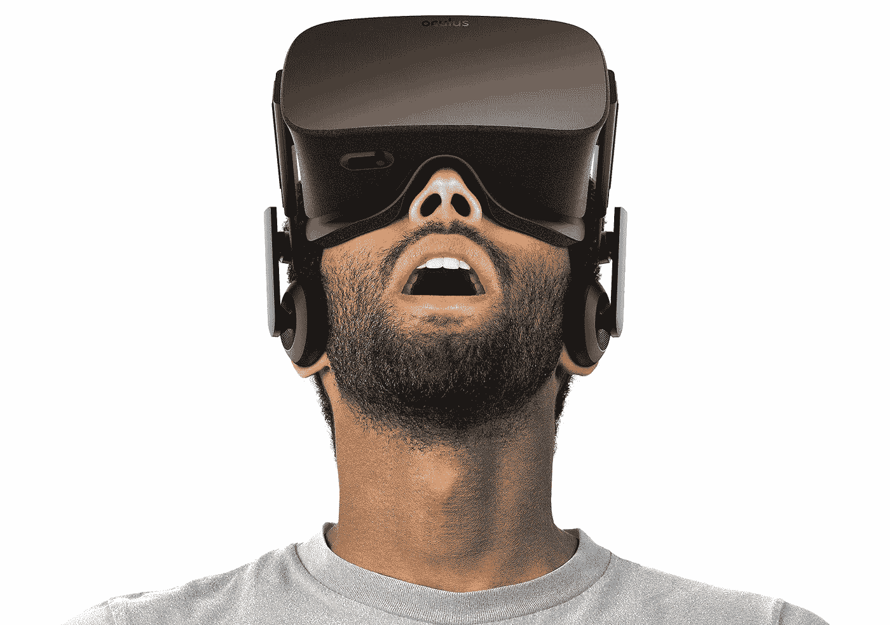
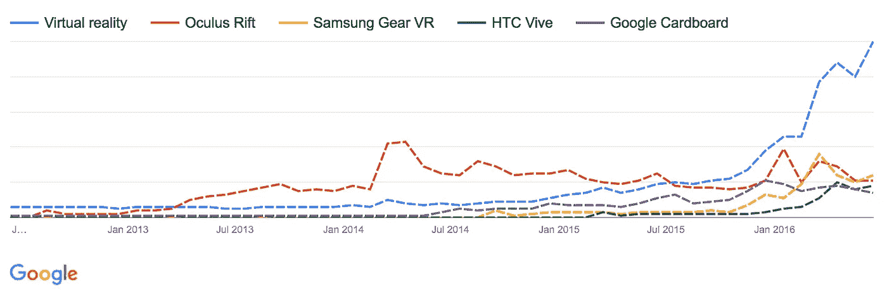

# 虚拟现实的大问题

> 原文：<https://medium.com/hackernoon/the-big-question-for-vr-65f339e0c956>

## 虚拟现实能找到令人信服的客户需求吗？还是昙花一现，被煽动起来让科技记者沉浸在含羞草中？

Source: Oculus Rift

昨晚读了约翰·布兰登的优秀的“[既然 3d 打印正在消亡，你可以学到的 4 个重要教训](http://www.inc.com/john-brandon/the-slow-sad-and-ultimately-predictable-decline-of-3d-printing.html?cid=cp01002quartz)”让我再次想起了我们的老朋友，虚拟现实。

如果我们忽略 30 年前[对这项技术的短暂玩弄](http://uk.pcmag.com/consumer-electronics-reviews-ratings/76433/gallery/the-wacky-world-of-vr-in-the-80s-and-90s)，我们已经在大约 4 年的时间里攀登了虚拟现实的[过高期望的顶峰](https://en.wikipedia.org/wiki/Hype_cycle)。2012 年 8 月，Oculus Rift 在 Kickstarter 上实现了融资目标，尽管后来被脸书以近 20 亿美元的价格收购，但它仍然没有实际发货，这或许是一个结果。

在 Oculus 之后，市场上出现了一系列新设备，从三星的 Gear VR 到 HTC Vive 和谷歌的 build-your-own Cardboard viewer——每一款都带来了 VR 绝对将成为下一个大事件的承诺。

Google Trends graph, showing search interest in various VR viewers over the last 4 years

# 问我们自己的问题

在布兰登的文章中，他讨论了任何追随新趋势的人都应该学到的四课；所以让我们在 VR 的背景下来看这些。

1.  一定要亲自尝试
2.  问尖锐的问题
3.  与外人交谈
4.  算算吧

## **1。一定要亲自尝试一下**

如果你真的戴上了虚拟现实耳机，在虚拟世界中漫游，那么我想你会同意我的看法，这非常令人印象深刻。这是身临其境的，可信的，*几乎*真实的；我在 2013 年第一次使用 Rift 开发者工具包的经历完全让我震惊。

从这一点来看，虚拟现实与 3D 打印非常不同——3D 打印可能是一个漫长而乏味的过程，之后你最终会得到一些在易贝可以买到的更便宜的东西。

## **2。问难题**

*   为什么我需要连接到我的电脑上？
*   我需要*在房间里放置所有的传感器吗？*
*   没有最新的三星手机怎么办？
*   我的电脑够强大吗？
*   我看起来很蠢吗？

所有这些问题的答案目前都不是好兆头。

大多数用户不会喜欢被束缚在个人电脑上；在房间周围放置传感器既乏味又不切实际；三星可能是这个星球上占主导地位的智能手机制造商，但凭借 24.5%的市场份额，仍然有很多人不太可能仅仅为了享受虚拟现实配件而购买手机；计算变得越来越移动，首先牺牲的是图形能力。

最后一个问题*‘我看起来很蠢吗？’*听起来可能很无聊，但是在这个时代，尤其是游戏正在[成为一项观赏性运动](http://www.wsj.com/articles/videogames-the-ultimate-spectator-sport-1423855724)，它可能比你想象的更重要。

当然，这项技术现在还处于萌芽阶段，我们正看到第一代设备(几乎)进入市场，但要让它走出幻灭的低谷，需要一些重大变革，以避免它再持续 30 年。

## **3。跟外人说话**

不是早期采用者或从事科技/游戏工作的人会关心 VR 吗？

[没有](/@wmorein/why-i-don-t-care-about-virtual-reality-b7ec2d5f6f6e#.70k60emmk)。

## **4。做数学运算**

虚拟现实现在的一个大问题是:它值得吗？它确实很酷，偶尔也很有趣，但它是否比常规的视频游戏或内容格式足够酷，值得花数百美元/英镑购买？

以 3D 电影或电视为例:消费者愿意为 3D 电影放映或 3D 电视频道多付一点钱吗？一年前，即 2015 年 6 月，天空电视台取消了 3D 电视频道，三星 2016 年的电视阵容中没有一个支持 3D，电影院对 3D 电影的需求正在快速下降。

为什么 3D 会在它的死亡床上？因为在电影制作方面，它没有提供任何比 2D 更吸引人或更有趣的东西。希区柯克、库布里克和科波拉中最好的——甚至最差的——都无法通过 3D 技术得到改善。皮克斯的 *Up* 以其不明智的 3D 格式呈现时，并没有更感人或更精彩。

3D 制作得当会给人留下深刻印象，它有令人惊叹的因素；与 VR 不在一个级别上，但具有可比性，只是——正如 J.J. Abrams 在 SXSW 2016 上所说——没有人的元素，创新就什么都不是；目前，3D 和 VR 都没有让故事更人性化，它们没有增加深度或角色。如果说有什么不同的话，那就是他们分散了注意力。

人们常说游戏将成为虚拟现实的先锋，虽然这可能是真的，但我担心它会像 3D 一样萎靡不振。

虽然偶尔会变得更加身临其境，但游戏不太可能通过在 VR 中播放而得到很大改善——用户体验实际上更差，更令人沮丧，因为随着我们更接近地复制现实生活，我们会更尖锐地展示我们复制中的缺陷。这是用户体验的[恐怖谷](https://en.wikipedia.org/wiki/Uncanny_valley)。

虚拟现实可能会有一些有趣和更持久的工业用途——就像快速 3D 工业原型在 MakerBot 之前是一件事情，当它消失时将继续是一件事情——但作为一种大众消费产品？我不相信。

> [黑客中午](http://bit.ly/Hackernoon)是黑客如何开始他们的下午。我们是 [@AMI](http://bit.ly/atAMIatAMI) 家庭的一员。我们现在[接受投稿](http://bit.ly/hackernoonsubmission)并乐意[讨论广告&赞助](mailto:partners@amipublications.com)机会。
> 
> 如果你喜欢这个故事，我们推荐你阅读我们的[最新科技故事](http://bit.ly/hackernoonlatestt)和[趋势科技故事](https://hackernoon.com/trending)。直到下一次，不要把世界的现实想当然！

