# 成为一名伟大的网络开发者的大道

> 原文：<https://medium.com/hackernoon/the-big-road-to-become-a-great-web-developer-96297d561210>

你好！我还做了一个 [*西班牙文版的这篇文章*](/@germancutraro/el-gran-camino-para-convertirse-en-un-web-developer-30de360d6423) 。

你可以关注我的 [**Github 账号。**](https://github.com/germancutraro)

当你进入网络的奇妙世界时，你会意识到开发不仅仅是一种技术，事实上，在我们的开发中每天都有大量的语言、框架和库可以使用。

现在，我将按照推荐的顺序向你介绍学习呈现在我们面前的大量技术。

在开始之前，我们将简短地定义两个基本点和关键点，以便理解，当然，在未来，我将撰写一篇新的文章来更多地讨论每种技术。

因此，我们将解释发展中的两个主要角色。

> **前端开发人员:**负责网站的视觉部分。这并不意味着它只是一个设计者，而是前端负责加入信息流，以便它最终对用户可见。
> 
> **后端开发者:**负责设置与前端的通信。他处理所有输入的信息，把一个网站转换成一个功能性的应用程序。

虽然还有很多角色，比如，*全栈开发者，忍者开发者*等等，但是我们不会在这篇文章中解释所有的角色。

现在我们可以开始了！

HTML

[**html 5**](https://www.w3schools.com/html/html5_intro.asp)**:**我们用他构建所有的站点结构，这意味着，通过使用标签我们制作所有的布局和模板。不是编程语言，是标记语言。

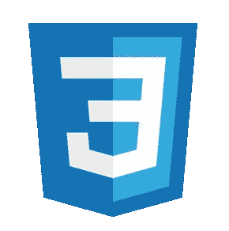

CSS

[**CSS3**](https://www.w3schools.com/css/css3_intro.asp)**:**通过他我们可以设定网站的设计或风格。与 Html 一样，Css 不是一种编程语言，而是一种样式表语言。

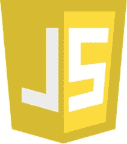

JavaScript

[**Javascript**](https://www.javascript.com/)**:**很难解释你可以用他做什么，因为用 Javascript，你可以做所有的事情。然而，我们将为实际创造的东西下定义:为网站增加互动，这意味着行动-效果的关系。

现在我们很好，这三种语言是我们的基础，他的运用是必不可少的。

*我们继续……*

也许这个推荐不是最纯粹的，但是，还是比较常用的。

JQuery

[**Jquery**](https://jquery.com/) **:** 很长一段时间是使用最多的 web 库。库是用于特定目的的一组函数。Jquery 是用 JavaScript 编写的库，用于在 DOM 中进行动态和简单的修改，然后在另一篇文章中，我们可以讨论*文档对象模型*。

如果你知道很多，现在你可以创建静态网站，这意味着网站的信息不会一直改变。最重要的是你知道如何编程，所以，现在，我们可以去更好的实践。

Smacss

[**SMACSS**](https://smacss.com/)**:**SMACSS 不是一种语言或预处理程序，是我们组织 CSS 代码的风格指南。我将写一篇全新的文章来讨论这项技术。

**其他组织 Css 的方法:**

**[*OOCSS*](http://oocss.org/)*等等……***

****使用预处理程序:****

> **Css 预处理器是一种工具，**允许我们编写伪代码 Css，然后通过使用工具或程序将其转换为原生 Css** 。**

**我个人推荐**，但也存在其他类似 [**手写笔**](http://stylus-lang.com/)[**少**](http://lesscss.org/)[**PostCss**](http://postcss.org/)等等…****

******工具:******

> ****这些技术试图简化各种任务，从缩小代码到压缩图像。****

****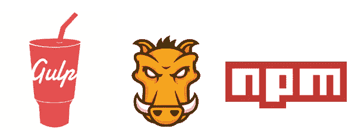****

****Gulp | Grunt | Npm****

********:**是一个用 JavaScript 编写的工具，方便您在应用程序开发中自动完成常见任务。类似于大口存在的 [**咕哝**](https://gruntjs.com/)y[**NPM**](https://www.npmjs.com/)**脚本。********

************

******Live Reload******

******[**Live Reload**](http://livereload.com/)**:**是一个工具/扩展，可以检测你的网站变化，并允许你实时可视化。******

******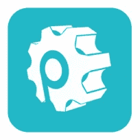******

******Prepros******

******[**Prepros**](https://prepros.io/)**:**是一个程序，它允许你在不需要编程的情况下自动完成许多动作，例如编译 Sass、精简你的代码等等。在 Prepros 存在其他程序，我个人用了很多程序叫做 [**考拉**](http://koala-app.com/) 。******

******所以现在我们可以选择一个框架来获得更快的开发速度。******

> ******框架是一组库，我们必须尊重正确使用它们的上下文。******

********Css 框架:********

******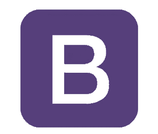******

******Bootstrap******

******[**Bootstrap**](http://getbootstrap.com/)**:**是最流行和使用最多的 Css 框架。这是一个在开发时关注移动角色的框架，优先考虑并促进实现完全响应网站的可能性，即适应不同的屏幕分辨率，这不仅仅是一个细节。******

************

******Foundation******

******[**基础**](http://foundation.zurb.com/) **:** 和 Bootstrap 一样，存在一个叫做基础的框架。非常推荐，但不像 Bootstrap 那样使用。我的建议是你两个都测试，选择更喜欢你的框架。******

******我用 Bootstrap。现在我正在尝试另一种叫做 [**的骨骼**](http://getskeleton.com/) 。******

************

******Skeleton******

******存在另一个像*语义 UI，Kube，Sussy，blueprint，purecss* 等等…******

********JavaScript 框架:********

******在选择 Js 框架之前，我建议你对类似 JavaScript 的语言有一个很好的了解，我不是说你必须是一个专家或超级忍者，不，但是建议你在框架中有非常好的语言基础。******

******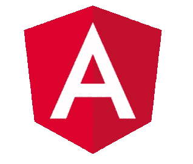******

******Angular******

**********:**是一个非常流行的前端开发框架。是由 *Google* 创建的，并且允许你创建*简单的页面应用。*********

******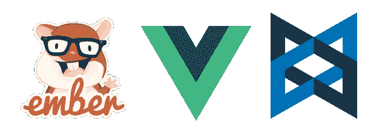******

******Ember.Js, Vue.Js, Backbone.Js******

******像 Angular，存在非常流行的框架像 [**Ember。Js**](https://www.emberjs.com/) **，** [**Vue。Js**](https://vuejs.org/) **，** [**高分子**](https://www.polymer-project.org/) 等...******

******和我之前说一样，测试每个框架并选择你最喜欢的。******

********JavaScript 库:********

******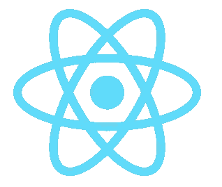******

******React.Js******

******[**做出反应。我强烈建议你把时间花在学习它上。React 不是一个框架，它是一个为*脸书*创建和维护的库，用于组件创建，专注于创建用户界面(UI)。**](https://facebook.github.io/react/)******

******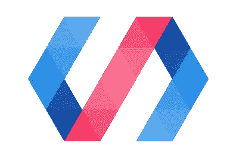******

******Polymer.Js******

******[**Polymer**](https://www.polymer-project.org/)**:**是一个用于前端开发的函数库，使用 Html、Css 和 Javascript 可以创建 web 组件。******

******而要学的东西更多，比如**[*web pack*](https://webpack.js.org/)*、Flux、*[*Redux*](http://redux.js.org/)*，或者要重点学习新版本的 JavaScript* ，我们就讲到这里。了解一个库或框架已经很不错了。例如，你可以使用 Angular，但不能使用 React，反之亦然。********

********现在我们可以进入后端:**在这种情况下，没有必要了解我将向您展示的所有语言或框架，您可以测试每项技术，并选择您更感兴趣的技术。******

******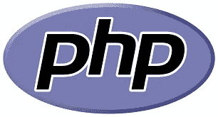******

******php******

******[**PHP**](http://php.net/) **:** 是一种解释型编程语言，工作在服务器端，用于创建动态网站。现在它在 7 版本上，所以是一个很好的语言。当你有了足够的知识后，你可以尝试去一个框架，比如*[*CodeIgniter*](https://codeigniter.com/)*[*Phalcon*](https://phalconphp.com/en/)*，*[*Yii*](http://www.yiiframework.com/)*，* [*Symfony*](https://symfony.com/) 或者最值得推荐的: [**Laravel**](https://laravel.com/)********

******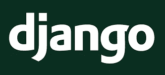******

******Django******

******[**Python**](https://www.python.org/)**:**Python 不是面向 web 的语言，而是存在非常酷的框架来开发我们的后端。当你有了很好的知识你可以尝试去做一个框架像[*烧瓶*](http://flask.pocoo.org/)*[*金字塔*](https://trypyramid.com/)*[web 2py](http://www.web2py.com/)或者最推荐: [**Django**](https://www.djangoproject.com/) 。********

**************

*******Ruby on Rails*******

*******[**Ruby**](https://www.ruby-lang.org/en/)**:**发生在 Python 身上的事情同样发生在 Ruby 身上。当你有了很好的知识可以尝试去做一个类似*[*Sinatra*](http://www.sinatrarb.com/)或者最推荐:[**Ruby on Rails**](http://rubyonrails.org/)**(ROR)**的框架。********

******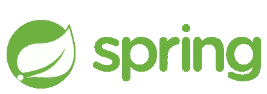******

******Spring******

******[**Java**](https://www.java.com/en/) **:** 被很多人讨厌，被别人喜欢，当然是一种非常强大和常用的语言。当你有了很好的知识可以尝试去做一个类似*[*Grails*](https://grails.org/)*[*Play*](https://www.playframework.com/)或者最推荐:[**Spring MVC**](https://spring.io/)**的框架。**********

******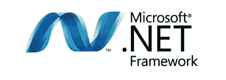******

******.NET******

******[**C#/。NET**](https://www.microsoft.com/net) **:** C#它是一种面向对象的编程语言，并且。NET 是一个框架。可以用**在服务器端编程。********

********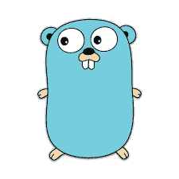********

********Go********

********[**Go**](https://golang.org/)**:**它是由 *Google* 创造的一种相对较新的语言。这是一种似乎有前途的语言。********

******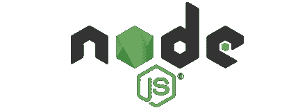******

******Node.Js******

******[**节点。Js**](https://nodejs.org/en/) **:** 它不是框架，也不是库，更不是编程语言。*是基于 Chrome 的 V8 JavaScript 引擎构建的 JavaScript 运行时。*
异步，速度极快。个人是我最喜欢的技术，及时建立我的后端。当你对 JavaScript 有了很好的了解后，你可以尝试使用一个框架，比如[*【哈比神】*](https://hapijs.com/)*[*Koa*](http://koajs.com/)*[*Sails。Js*](http://sailsjs.com/) 还是最推荐: [**快递。js**](https://expressjs.com/)********

********数据库:**说到 web 应用，尤其是后端，你要考虑数据库的使用。******

******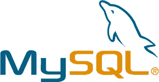******

******MySQL******

******[**MySQL**](https://www.mysql.com/)**:**它是一个常用的关系数据库管理系统。******

******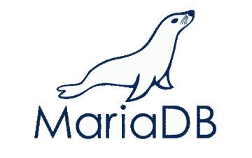******

******MariaDB******

******[**MariaDB**](https://mariadb.org/) **:** 它是由 MySQL 衍生而来的数据库管理系统。******

************

******PostgreSQL******

******[**PostgreSQL**](https://www.postgresql.org/)**:**它是一个面向对象的、免费的关系数据库管理系统。******

************

******MongoDB******

******[**MongoDB**](https://www.mongodb.com/)**:**它是领先的 NoSQL 数据库，允许站点更加敏捷和可伸缩。******

******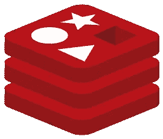******

******Redis******

******[**Redis**](https://redis.io/)**:**它是一个内存数据库引擎，基于哈希表存储。******

************

******Firebase******

******[**Firebase**](https://firebase.google.com/)**:**它是由 *Google* 开发的移动平台，可以让你开发出高质量、高速度的 app。******

******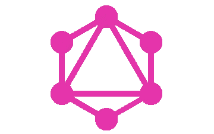******

******GraphQL******

******[**graph QL**](http://graphql.org/)**:**是服务器建立通信的查询语言。******

******学会使用 Api，花时间学习编程范例，例如:面向对象、函数式、反应式、MVC 等技术或方法。******

*******还有一长串等等。*******

******如果你全部读完，你可能现在是这样的:******

************

> ******然而，不要急于学习一切，在学习中你不能跳过阶段。慢慢来，每天练习，选择你喜欢的技术。每天都在进步，致力于你喜欢的技术，帮助你开发你的网站。你不必试图学习一切，这很难，很少有人，不用说，拥抱一切。******

******就我而言，我将尝试以简单的方式解释这些技术中的几种，以便您理解它们！******

******在这里，我给你留下了一个 GitHub 知识库，里面有很多关于这个主题的资料！******

******【https://github.com/moklick/frontend-stuff ******

******请分享！******

************