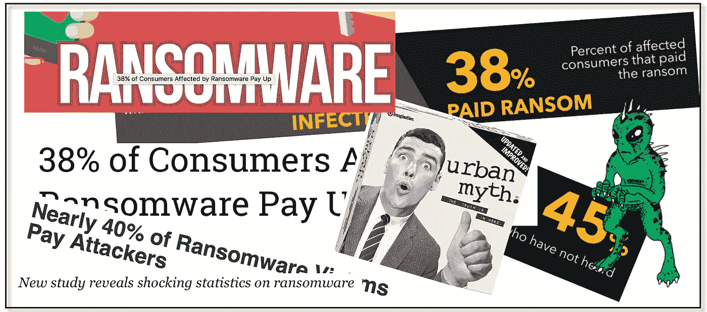
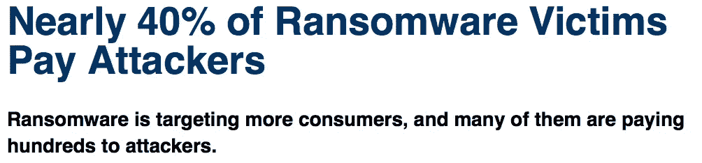
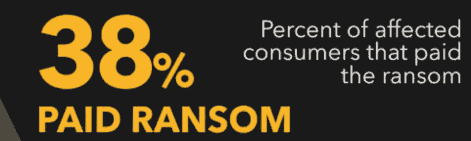
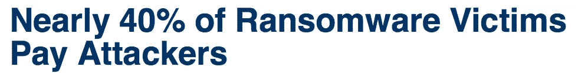
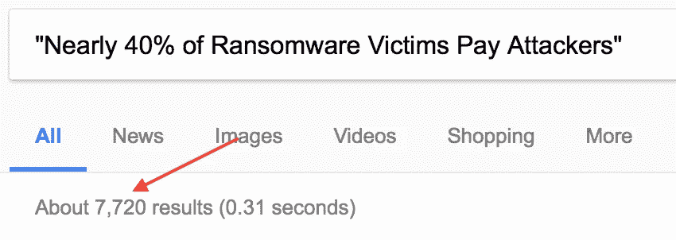

# 一个勒索软件城市神话的诞生

> 原文：<https://medium.com/hackernoon/the-birth-of-a-ransomware-urban-myth-cf9950addb80>

根据 [DarkReading](http://www.darkreading.com) 最近发表的一篇[文章](http://www.darkreading.com/attacks-breaches/nearly-40--of-ransomware-victims-pay-attackers/d/d-id/1328634)，你会惊讶地发现“[近 40%的勒索软件受害者向攻击者](http://www.darkreading.com/attacks-breaches/nearly-40--of-ransomware-victims-pay-attackers/d/d-id/1328634)付费吗？我确实是。支付勒索软件的受害者人数和支付的金额多年来一直是一个难以捉摸的数字。迄今为止，执法部门尚未像其他形式的犯罪活动那样收集和发布勒索软件犯罪统计数据。

安全厂商发布的垃圾研究总是让我感到厌烦，因为他们使用和滥用统计数据来传播恐惧和销售产品。安全威胁被夸大，解决方案被过度简化，导致了一系列问题，从创造[信息安全城市神话](https://taosecurity.blogspot.com/2009/05/insider-threat-myth-documentation.html)到基于错误假设的糟糕企业决策。

可悲的是，《黑暗阅读》的文章和潜在研究也不例外。这是一个很好的例子，说明供应商赞助的研究有什么问题，以及我们其他人如何在没有给予它一分钟批判性思考的情况下，引用、传播和转发。这很容易发现——只要抓住一个统计数据，然后跟着它进入兔子洞。我们来解剖一下勒索病毒支付率，看看到底是怎么回事。

DarkReading 于 2017 年 4 月 14 日发布了[这篇文章](http://www.darkreading.com/attacks-breaches/nearly-40--of-ransomware-victims-pay-attackers/d/d-id/1328634)，标题为:

Source: [http://www.darkreading.com/attacks-breaches/nearly-40--of-ransomware-victims-pay-attackers/d/d-id/1328634](http://www.darkreading.com/attacks-breaches/nearly-40--of-ransomware-victims-pay-attackers/d/d-id/1328634)

如果您一直关注这篇文章，那么会引用研究链接[以及执行该研究的安全供应商的名称(Trustlook)。他们有一篇很好的博客文章和一张可爱有趣的信息图——很好的阅读材料，明天早上可以送到 CISO。下一步是检查研究的有效性，看看 Trustlook 到底声称什么。](https://blog.trustlook.com/2017/04/13/38-of-consumers-affected-by-ransomware-pay-up/)

*   Trustlook 是一家安全供应商，销售一套保护最终用户免受恶意软件(包括勒索软件)和其他形式攻击的产品。
*   这项研究是基于一项调查。调查是民意测验；你问一群人一个问题并记录下答案。
*   Trustlook 调查了 210 名移动安全产品客户。移动安全是一款基于 Android 的防病毒应用程序。
*   Trustlook 没有透露误差幅度，这表明该调查在统计上不具有显著性。这意味着这些结果只适用于调查者本身，而不能推断出适用于更大的群体或一般人群。

这足以让任何上过一学期大学统计课的人翻个白眼，继续前进。然而，信息图中的断言确实是小菜一碟。当统计中使用百分比时，读者往往会忘记或看不到潜在的数字。进一步细分百分比:

*   我们知道有 210 名客户接受了调查(Trustlook 披露了这一点)。
*   在这 210 人中，有 45%的人从未听说过勒索软件。换句话说，210 个客户中有 94 个回答了关于勒索软件的调查，但从未听说过勒索软件。 **Trustlook 开展了一项关于勒索软件的调查，其中近一半的受访者不知道勒索软件是什么。**

*   116 名受访者有能力理解他们正在填写的调查主题。
*   在这 116 人中，有 20 人在某个时候感染了勒索软件。
*   在被感染的 20 人中，有 8 人付了赎金。

让我再说一遍，以防你没听到。

**Trustlook 发现他们的 8 个客户说他们付了赎金，并把它变成了这个**:

Source: [https://newblogtrustlook.files.wordpress.com/2017/04/2017-trustlook-ransomware-survey.png](https://newblogtrustlook.files.wordpress.com/2017/04/2017-trustlook-ransomware-survey.png)

DarkReading 扩大了声明范围，将所有勒索软件受害者都包括在内:

Source: [http://www.darkreading.com/attacks-breaches/nearly-40--of-ransomware-victims-pay-attackers/d/d-id/1328634](http://www.darkreading.com/attacks-breaches/nearly-40--of-ransomware-victims-pay-attackers/d/d-id/1328634)

两天后，到处都是:

Source: Google.com search

一个新的勒索病毒城市神话诞生了。

> [黑客中午](http://bit.ly/Hackernoon)是黑客如何开始他们的下午。我们是 [@AMI](http://bit.ly/atAMIatAMI) 家庭的一员。我们现在[接受投稿](http://bit.ly/hackernoonsubmission)并乐意[讨论广告&赞助](mailto:partners@amipublications.com)机会。
> 
> 如果你喜欢这个故事，我们推荐你阅读我们的[最新科技故事](http://bit.ly/hackernoonlatestt)和[趋势科技故事](https://hackernoon.com/trending)。直到下一次，不要把世界的现实想当然！

