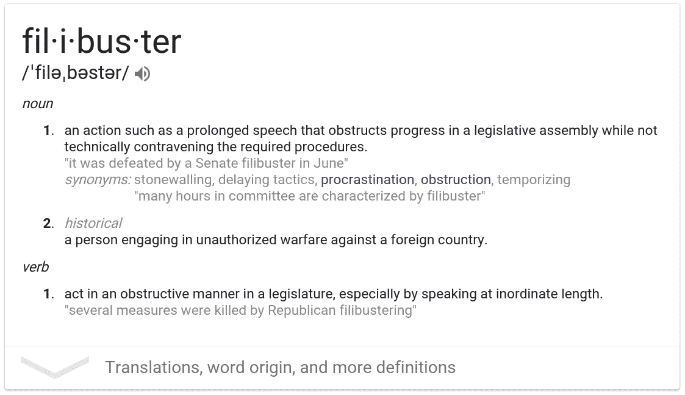
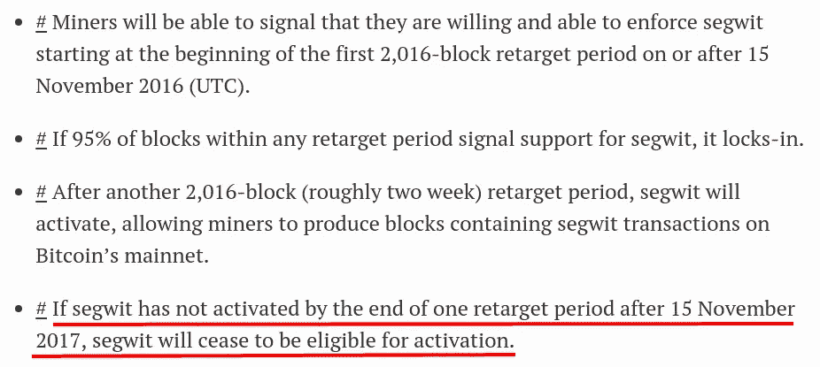

# 比特币阻挠议事

> 原文：<https://medium.com/hackernoon/the-bitcoin-filibuster-c12231f6feb3>

PURPLE FOREBODING

在关于激活隔离见证的争论中，很明显，许多人不理解反对隔离见证的演员正在做他们正在做的事情的真正原因。

他们在阻挠议事。

例如，在美国参议院,*阻挠议事*被用来阻止反对派通过一项动议。这意味着在一个即席演讲中站上几个小时，利用众议院的规则阻止其他议员进行合法的事务。

参议员兰德·保罗最近的阻挠议事就是一个很好的例子。他连续讲了将近 13 个小时。

 [## 兰德·保罗结束了近 13 个小时的冗长演说

### 肯塔基州参议员兰德·保罗从周三到年初上演了最近参议院记忆中最长的冗长演说

www.politico.com](http://www.politico.com/story/2013/03/rand-paul-filibuster-john-brennan-cia-nominee-088507) 

我在 Twitter 上进行了一次投票，探索比特币核心向参考客户端添加新功能的必然结果是什么，因为隔离见证(SegWit)将包含在他们客户端的所有未来版本中。我推断，如果 SegWit 在所有未来的参考客户端中，并且它被设置为通过您运行它来发出信号，最终，由于 Core 拥有最好的开发人员，并且正在进行所有的改进和扩展，并且大多数用户都在运行它，SegWit 将默认激活。

从逻辑上讲，如果这是正确的，那么我们所要做的就是等到每个人都有了参考客户端的几个版本，SegWit 就会激活。不管需要多长时间，事实上，如果需要更长时间会更好，因为它给了公司更多的时间来推出软件，为比特币协议添加这一奇妙的、改变游戏规则的天才产品。

这个结论有个小问题。**这是错误的。**无论有多少人在运行参考客户端，SegWit 激活都不会有任何影响。

看完这个，我去[文档](https://bitcoincore.org/en/2016/10/27/segwit-upgrade-guide/)。然后，我浏览了我们的 bitcoin.conf，找到了可以打开或关闭 SegWit 信号的行。你可以在那里找到它，就像控制引用客户机的其他东西一样。这里没有参数。等等，什么？！

而且越来越糟。这让我们想到了这首曲子的标题。

如果 SegWit 在 2017 年 11 月 15 日**[之前未被](https://bitcoincore.org/en/2016/10/27/release-0.13.1/) [**激活，它将成为【无资格】激活**](https://www.youtube.com/watch?v=gV9MIQGgTEo)。我认为这意味着它死了。当然，我也可能是错的，就像我错误地认为塞格维特不可避免地会被磨损激活一样。**

****

**From the Bitcoin Core Site on the latest Reference Client**

**显然，不希望 SegWit 激活的人知道这个漏洞，并且明白如果他们拖延激活足够长的时间，SegWit 将会简单地死亡。然后，他们可以争辩说，SegWit 没有社区支持，因此，应该立即强制实施 8 兆字节的块大小，因为 SegWit 已经被拒绝。**

**任何希望比特币保持去中心化的人都明白，提高区块大小参数是个坏主意**

** [## 比特币的挑战

### 事实

medium.com](/bitcoin-think/the-bitcoin-gauntlet-e9e721297aca) 

推动块大小增加的人这样做有几个原因:

1.  他们想要一个集中的、驯服的比特币
2.  他们不想重写他们的软件
3.  他们想通过取代核心来控制未来的发展
4.  他们希望比特币“失败”,这样他们自己的比特币就能取代它

所有这些都是合理的假设。他们可能错了。你怎么想呢?

我们可以肯定的是。比特币核心极其专业，而且绝对合乎道德。如果我有这个权利，那么 SegWit 可能会过期，他们故意创建了一个激活系统，扼杀了他们的非凡进步，很少有人真正理解，因为其他技术不如他们、动机与比特币不一致的人不想要它。他们迁就所有人，对自己不利。他们所做的是非常努力的工作，没有报酬，免费提供这项创新，虽然他们可以强制实施并随着时间的推移慢慢激活，但他们选择了完全尊重每个人，甚至是比特币的敌人，通过使用这种有时间限制的信号系统。

这些人不自私，非常有耐心，显然他们最关心比特币，也最关心比特币的精神。他们也不想排斥任何人的想法或需求。他们提出自己的解决方案，让选民按照自己的意愿拒绝或接受，没有任何压力。他们显然不是独裁者，也不是坏人。

至于想要 SegWit 的用户，这是[难以置信的好处](https://youtu.be/-0kRLvpDBSY?t=9m8s)

他们受到人们的支配，人们可以通过在他们的软件中设置一个特殊的位来决定是否给 SegWit 发信号。如果所有比特币用户的动机一致，SegWit 早就被激活了，但他们没有，因为有些人出于政治原因、商业原因、琐碎幼稚的个人原因、惰性原因以及一些计算机盲而不喜欢比特币。

协议层的这项业务非常复杂，正如你必须相信 Linux 内核开发人员不会作恶一样，没有资格的人不应该试图去花括号怪物所在的地方。在技术问题上的影响只能由同龄人来施加。一个二手车推销员不会去找奔驰，要求他们做出工程上的改变。无论如何你可以问，如果你的方法是正确的，但是*你必须准备好被告知你是错误的*，而不是加倍下注，但是*接受它*并且感激你有一个善良的老师。

我不知道赛格维特是否会启动。根据我对大纲的理解，这是一部绝对不需要动脑筋的**。比特币核心已经竭尽全力容纳所有人，没有人会因为它的激活而受到伤害。SegWit 吞吐量的惊人增长将改变一切。这是一个保守的说法。**

所有对 SegWit 信令服务进行编号的倒计时站点都应包含 11 月 15 日的截止日期，因为在此之后，SegWit 将失去激活资格。

如果你有指甲，跟它们说再见。** 

**丁字骨，中，薯条，房红 **↴****

****

**14 rtdb 46 nqjkuqfjuhqzg 3 o 6 uawwgbv 58 z**

************

> **[黑客中午](http://bit.ly/Hackernoon)是黑客如何开始他们的下午。我们是 AMI 家庭的一员。我们现在[接受投稿](http://bit.ly/hackernoonsubmission)并乐意[讨论广告&赞助](mailto:partners@amipublications.com)机会。**
> 
> **如果你喜欢这个故事，我们推荐你阅读我们的[最新科技故事](http://bit.ly/hackernoonlatestt)和[趋势科技故事](https://hackernoon.com/trending)。直到下一次，不要把世界的现实想当然！**

****