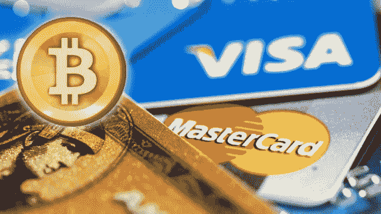
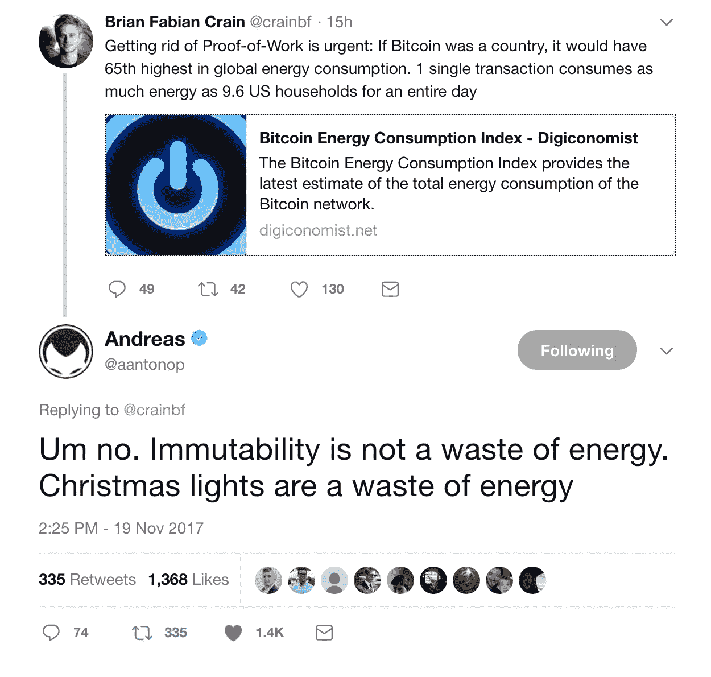

# 比特币 vs Visa 电力消耗谬论

> 原文：<https://medium.com/hackernoon/the-bitcoin-vs-visa-electricity-consumption-fallacy-8cf194987a50>

上周，我在 Twitter 上收到了一条警告，内容是 Andreas M. Antonopoulos 对另一条抱怨 T2 比特币 T3 网络能耗的推文的有趣回复。

最近，随着我们看到的主要加密集会，关于这个话题的文章变得非常常见，似乎它们之间的唯一区别是与哪个国家的[比特币](https://hackernoon.com/tagged/bitcoin)能源消耗进行比较，是[尼日利亚](https://thehustle.co/bitcoin-mining-electricity)、[冰岛](https://www.digitaltrends.com/computing/bitcoin-ethereum-mining-use-significant-electrical-power/)、[丹麦](https://motherboard.vice.com/en_us/article/aek3za/bitcoin-could-consume-as-much-electricity-as-denmark-by-2020)还是[厄瓜多尔](https://www.newscientist.com/article/mg23631504-500-bitcoin-mining-uses-more-energy-than-ecuador-but-theres-a-fix/)。

鉴于你需要一直运行一个由数百台或数千台非常强大的计算机组成的网络，没有人可以争辩比特币(和其他替代硬币)开采消耗大量电力(绝对数字)，但看待这个问题的正确方式不是关于总消耗，而是比较比特币相对于我们今天主要使用的、有朝一日可能被加密取代的替代传统中央系统的效率。

然而，唯一似乎总是到处出现的比较是针对签证交易成本的，这包括在引发上述推文的文章和[其他文章](https://motherboard.vice.com/en_us/article/ae3p7e/bitcoin-is-unsustainable)中的[。正如预期的那样，VISA 看起来更有效率，这增加了比特币是一个非常低效的系统的言论，这只是一个污染世界的庞氏骗局。在我看来，这种比较是有缺陷的，它不是苹果与苹果的比较。除了比特币不仅仅是 VISA 这样的支付网络的一部分，而是一个完整的货币系统，VISA 本身需要银行系统才能让其支付系统工作，所以你需要实际包括一些成本，才能进行有意义的比较。所以我们先来看看 VISA 是怎么工作的。](https://digiconomist.net/bitcoin-energy-consumption)

# VISA 实际上是如何工作的，还有谁参与其中

让我们仔细看看当你的收银员刷你的卡时(或者这几天，你用 Apple Pay 挥舞你的 iPhone)，VISA 交易是如何进行的。首先，你的磁条或手机中的数据被发送到一个叫做字体端处理器的东西，它代表你用来支付的商家和商家销售收据的存款银行处理支付信息。世界上有数百个前端处理器。存放商户销售收据的银行被称为收单银行。前端处理器将信用卡中的信息转发给相关的卡协会(主要是 VISA 或其他如 MasterCard 或 American Express ),然后该协会计算出您的卡来自哪家银行，即所谓的发卡银行。现在，您的支付信息将被发送到代表发卡银行的支付处理器，以验证信息是否正确以及您是否有信用或余额。最后，是交易从银行流回处理器、信用卡协会、前端处理器、商家和收单银行的时候了，交易才真正发生。到目前为止，你的信用卡信息已经跨越了几个数据库和服务器，而 VISA 只是整个交易链中的一环。

因此，正如我们在上面看到的，仅仅比较 VISA 交易成本和比特币成本是不公平的比较，我们需要包括整个银行系统的电力消耗，因为 VISA 工作的基础是参与交易的收单银行和发卡行。世界上几乎每一家银行要么是发行银行，要么是收单银行，或者事实上大多数银行都是发行银行和收单银行。VISA 只是交易的一部分，而比特币是运行一种货币和支付系统所需的整个基础设施。

# 估算银行用电量

所以现在让我们来估算一下传统银行系统消耗了多少电力。这不是一件容易的事情，因此下面的计算只是一个粗略的估计，试图通过仅使用少数银行电力来源和使用尽可能保守的数字来提供一个下限。

首先让我们看看有多少家银行。做了一点研究后，似乎没有人确切知道世界上有多少家银行，你可以得到不同的估计，从大约 14，600 家[这里](https://www.quora.com/How-many-banks-are-there-in-the-world-1)到 25，000 家[这里](https://www.linkedin.com/pulse/how-many-banks-globally-david-gyori/)，甚至超过 60，000 家准银行协会，它们几乎与银行一样受到严格的监管。因此，为了计算的目的，我们只取 30，000 这个数字。

现在我们需要估算银行消耗了多少电力。为了便于比较，我将只包括三个值:服务器成本、分支机构成本和 ATM 成本。当然，银行(及其员工)消耗更多来自其他来源的电力，但在这里说明我的观点，这就足够了。

我们需要添加到组合中的下一个数字是每家银行使用多少台服务器来运行其银行基础架构。选择一个非常保守的数字，平均每家银行 100 台服务器(请记住，银行不仅需要用于银行基础设施的服务器，还需要用于银行内部运营的服务器，如 ERP、CRM、会计系统、网站等。).如果一台服务器平均消耗 400 瓦时，因为它总是开着，这意味着银行总共消耗 800 兆瓦时。

让我们把分支机构的电力消耗也算进去。根据[世界银行](https://data.worldbank.org/indicator/FB.CBK.BRCH.P5)的数据，全球每 100，000 名成年人有 12.5 个分支机构，因此如果全球人口为 76 亿，而我们有大约 70%的成年人，这意味着总共有 665，000 个分支机构。只有在美国，他们似乎接近 100，000 个分支机构，假设美国占全球整个银行系统的 15%或更少，你会得到大约相同的数字。

计算分支机构的耗电量更加棘手，因为需要考虑很多因素，如分支机构的规模或员工数量，以及照明、冷却、计算机、显示器等耗电因素。它们不是 24 x 365 全天候开放的，所以在看了几篇文章后，我决定满足于保守的数字:假设一个普通的分支机构有 10 个灯泡、两个空调设备，它们只在 20%的时间内使用，12 台台式计算机全年每月 20 天，平均每天运行 12 小时。

最后，我们需要包括所有银行使用的自动取款机网络(如果比特币或其他加密货币成为主导货币和支付机制，也不需要)。根据 [ATM 行业协会](http://www.cutimes.com/2014/07/28/3-million-atms-worldwide-by-2015-atm-association)的说法，我们有望在 2015 年前达到 300 万台 ATM，因此鉴于我们已经到了 2017 年，我将把这个数字作为总数的下限。对于小型银行 ATM 机，平均每天的耗电量在 5Wh 左右。

因此，银行一年中仅在这三个指标上的总消耗约为(我是四舍五入)服务器上 26 瓦时，分行上 58 瓦时，自动取款机上 13 瓦时，一年总计接近 100 瓦时。

根据引发这场讨论的文章，比特币的年消费为 28.67 Twh，因此目前比全球银行系统成本的非常保守的计算高出 3 倍以上。当然，你会辩称，银行体系不仅仅是处理一种货币，这是事实，但两者之间的差异太大了，我认为这没什么关系。即使只有 30%的银行电力消耗是比特币的可比部分，这仍然会使比特币更有效率。

作为最后的评论，我认为比特币在电力消耗方面将变得更加有效(尽管它可能会继续增加其电力消耗的绝对值，但全球能源消耗也在增加)。原因有两个。

首先，随着大多数矿商转向最新的 ASIC 硬件，如比特大陆的 Antminer S9，单位成本将变得更加有效。S9 的能耗效率是其前代产品 S7 的 2.5 倍，仅用 1400 瓦特的能量就可以运行 14/s 的机器。在写这篇文章的时候，比特币网络上的计算机每秒可以处理 550，000 万亿次。因此，如果所有计算都是用最高效的硬件完成的，你将需要大约 4 万台计算机，每台消耗 1400 瓦特。考虑到采矿硬件一直在运行，你需要将这个数字乘以 24 小时 365 天，一年总共大约 500 千兆瓦，或者与[目前估计的 10，23 太瓦时的](http://blog.zorinaq.com/bitcoin-electricity-consumption/)相比，接近 30 太瓦时的年消耗量，因此效率提高了 60 倍。(注意:这一计算仅考虑了运行硬件的电力成本，不包括冷却成本，但考虑到 S9 等新型号在散热方面也更高效，并且还减少了所需的服务器数量，添加这一点只会加强我的观点)。

第二，比特币协议本身也在升级，提高效率。我们最近看到了 SegWit 的激活，在接下来的几个月内，我们将看到 Lightning 网络的采用，它有效地将小额支付从[区块链](https://hackernoon.com/tagged/blockchain)移走。一旦做到这一点，比特币将开始更像一个费用降低的清算网络，每笔交易的电力消耗将减少几个数量级。

所以不要抱怨比特币了，开始抱怨圣诞灯吧。